# STEP 1 : 시계열 데이터 준비

- 칼럼 종류: Date, Open, High, Low, Close, Adj Close, Volume

- 날짜별로 시작가(Open), 최고가(High), 최저가(Low), 종가(Close),수정종가(Adj Close), 거래량(Volume)이 저장되어 있는 것을 확인할 수 있습니다.

- 우리는 종가(Close)만 사용. (주식 시장은 정해진 시간 동안만 거래가 가능하며 종가란 하루의 장이 마감하였을 때의 가격입니다.)


```python
import numpy as np
import pandas as pd
import matplotlib.pyplot as plt
import os

import warnings
warnings.filterwarnings('ignore')

dataset_filepath = os.getenv('HOME')+'/aiffel/stock_prediction/data/005930.KS.csv' 
df = pd.read_csv(dataset_filepath) 
print(type(df))
df.head()
```

    <class 'pandas.core.frame.DataFrame'>


<div>
<style scoped>
    .dataframe tbody tr th:only-of-type {
        vertical-align: middle;
    }

    .dataframe tbody tr th {
        vertical-align: top;
    }

    .dataframe thead th {
        text-align: right;
    }
</style>
<table border="1" class="dataframe">
  <thead>
    <tr style="text-align: right;">
      <th></th>
      <th>Date</th>
      <th>Open</th>
      <th>High</th>
      <th>Low</th>
      <th>Close</th>
      <th>Adj Close</th>
      <th>Volume</th>
    </tr>
  </thead>
  <tbody>
    <tr>
      <th>0</th>
      <td>2020-05-18</td>
      <td>47950.0</td>
      <td>49100.0</td>
      <td>47600.0</td>
      <td>48800.0</td>
      <td>46788.835938</td>
      <td>20481981</td>
    </tr>
    <tr>
      <th>1</th>
      <td>2020-05-19</td>
      <td>50100.0</td>
      <td>50500.0</td>
      <td>49700.0</td>
      <td>50300.0</td>
      <td>48227.015625</td>
      <td>25168295</td>
    </tr>
    <tr>
      <th>2</th>
      <td>2020-05-20</td>
      <td>50000.0</td>
      <td>50200.0</td>
      <td>49800.0</td>
      <td>50000.0</td>
      <td>47939.382813</td>
      <td>14896899</td>
    </tr>
    <tr>
      <th>3</th>
      <td>2020-05-21</td>
      <td>50300.0</td>
      <td>50400.0</td>
      <td>49850.0</td>
      <td>49950.0</td>
      <td>47891.437500</td>
      <td>14949266</td>
    </tr>
    <tr>
      <th>4</th>
      <td>2020-05-22</td>
      <td>49600.0</td>
      <td>49800.0</td>
      <td>48600.0</td>
      <td>48750.0</td>
      <td>46740.894531</td>
      <td>19706284</td>
    </tr>
  </tbody>
</table>
</div>


```python
dataset_filepath = os.getenv('HOME') + '/aiffel/stock_prediction/data/005930.KS.csv'
df = pd.read_csv(dataset_filepath, index_col='Date', parse_dates=True)
print(type(df))
df.head()
```

    <class 'pandas.core.frame.DataFrame'>


<div>
<style scoped>
    .dataframe tbody tr th:only-of-type {
        vertical-align: middle;
    }

    .dataframe tbody tr th {
        vertical-align: top;
    }

    .dataframe thead th {
        text-align: right;
    }
</style>
<table border="1" class="dataframe">
  <thead>
    <tr style="text-align: right;">
      <th></th>
      <th>Open</th>
      <th>High</th>
      <th>Low</th>
      <th>Close</th>
      <th>Adj Close</th>
      <th>Volume</th>
    </tr>
    <tr>
      <th>Date</th>
      <th></th>
      <th></th>
      <th></th>
      <th></th>
      <th></th>
      <th></th>
    </tr>
  </thead>
  <tbody>
    <tr>
      <th>2020-05-18</th>
      <td>47950.0</td>
      <td>49100.0</td>
      <td>47600.0</td>
      <td>48800.0</td>
      <td>46788.835938</td>
      <td>20481981</td>
    </tr>
    <tr>
      <th>2020-05-19</th>
      <td>50100.0</td>
      <td>50500.0</td>
      <td>49700.0</td>
      <td>50300.0</td>
      <td>48227.015625</td>
      <td>25168295</td>
    </tr>
    <tr>
      <th>2020-05-20</th>
      <td>50000.0</td>
      <td>50200.0</td>
      <td>49800.0</td>
      <td>50000.0</td>
      <td>47939.382813</td>
      <td>14896899</td>
    </tr>
    <tr>
      <th>2020-05-21</th>
      <td>50300.0</td>
      <td>50400.0</td>
      <td>49850.0</td>
      <td>49950.0</td>
      <td>47891.437500</td>
      <td>14949266</td>
    </tr>
    <tr>
      <th>2020-05-22</th>
      <td>49600.0</td>
      <td>49800.0</td>
      <td>48600.0</td>
      <td>48750.0</td>
      <td>46740.894531</td>
      <td>19706284</td>
    </tr>
  </tbody>
</table>
</div>


```python
ts = df['Close']
print(type(ts))
ts.head()
```

    <class 'pandas.core.series.Series'>


    Date
    2020-05-18    48800.0
    2020-05-19    50300.0
    2020-05-20    50000.0
    2020-05-21    49950.0
    2020-05-22    48750.0
    Name: Close, dtype: float64


# STEP 2 : 각종 전처리 수행

- 결측치 처리
- 로그 변환

## 2-1) 결측치 처리


```python
from matplotlib.pylab import rcParams
rcParams['figure.figsize'] = 13, 6    # matlab 차트의 기본 크기를 13, 6으로 지정해 줍니다.

# 시계열(time series) 데이터를 차트로 그려 봅시다. 특별히 더 가공하지 않아도 잘 그려집니다.
plt.plot(ts)
```


    [<matplotlib.lines.Line2D at 0x7f110ca0cd50>]


    
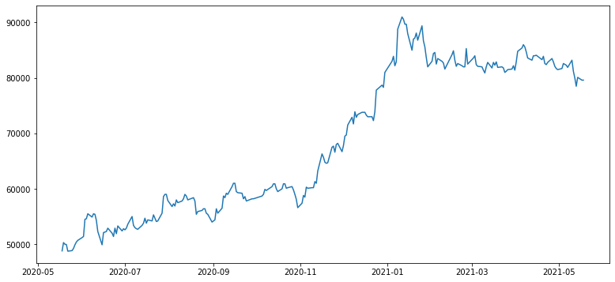
    


```python
# 시계열(Time Series)에서 결측치가 있는 부분만 Series로 출력합니다.
ts[ts.isna()]
```


    Series([], Name: Close, dtype: float64)


이 데이터에 결측치는 없다.

하지만 만약 결측치가 있다면 조치가 필요하다.

1. 결측치가 있는 데이터를 모두 삭제(drop)

2. 결측치 양옆의 값들을 이용해서 적절히 보간(interpolate)하여 대입 ex) 2와 4 사이 데이터가 NaN이라면 이 값을 3으로 채우는 방식

이번 경우라면 시간을 index로 가지는 시계열 데이터이므로 삭제하는 것보다는 보간하는 방법을 선택해보겠다.


```python
# 결측치가 있다면 이를 보간합니다. 보간 기준은 time을 선택합니다. 
ts=ts.interpolate(method='time')

# 보간 이후 결측치(NaN) 유무를 다시 확인합니다.
print(ts[ts.isna()])

# 다시 그래프를 확인해봅시다!
plt.plot(ts)
```

    Series([], Name: Close, dtype: float64)


    [<matplotlib.lines.Line2D at 0x7f11049a2190>]


    

    


## 2-2) 로그 변환

- 우선, Augmented Dickey-Fuller Test(ADF Test) 라는 시계열 데이터의 안정성(stationary)을 테스트하는 통계적 방법을 통해 데이터가 stationary한지 체크해보자.


```python
from statsmodels.tsa.stattools import adfuller

def augmented_dickey_fuller_test(timeseries):
    # statsmodels 패키지에서 제공하는 adfuller 메소드를 호출합니다.
    dftest = adfuller(timeseries, autolag='AIC')  
    
    # adfuller 메소드가 리턴한 결과를 정리하여 출력합니다.
    print('Results of Dickey-Fuller Test:')
    dfoutput = pd.Series(dftest[0:4], index=['Test Statistic','p-value','#Lags Used','Number of Observations Used'])
    for key,value in dftest[4].items():
        dfoutput['Critical Value (%s)' % key] = value
    print(dfoutput)
```


```python
augmented_dickey_fuller_test(ts)
```

    Results of Dickey-Fuller Test:
    Test Statistic                  -1.222649
    p-value                          0.663778
    #Lags Used                       0.000000
    Number of Observations Used    249.000000
    Critical Value (1%)             -3.456888
    Critical Value (5%)             -2.873219
    Critical Value (10%)            -2.572994
    dtype: float64


ts(주식 데이터)시계열이 안정적이지 않다는 귀무가설은 p-value > 0.05이므로
이 귀무가설은 기각되지 못한다.

따라서, 이 시계열은 안정적 시계열이라는 대립가설이 채택되지 못한다.

#### 즉, ts시계열은 stationary하다고 말할 수 없다

---


- 그렇다면 Stationary하게 만들어주는 방법은?

1. 정성적인 분석을 통해 보다 안정적(starionary)인 특성을 가지도록 기존의 시계열 데이터를 가공/변형하는 시도
2. 시계열 분해(Time series decomposition) 기법을 적용

1번 방법 중의 하나가 로그 변환 (Log Transformation)이다.

로그 변환을 시도해보자


```python
ts_log = np.log(ts)
plt.plot(ts_log)
```


    [<matplotlib.lines.Line2D at 0x7f11046db8d0>]


    
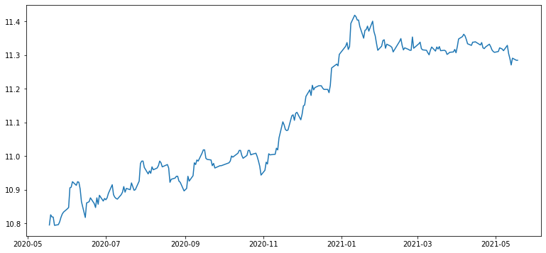
    


그 효과는?

p-value가 0.663778 -> 0.590149로 줄긴 했지만 효과가 미미하다.


```python
augmented_dickey_fuller_test(ts_log)
```

    Results of Dickey-Fuller Test:
    Test Statistic                  -1.383525
    p-value                          0.590149
    #Lags Used                       0.000000
    Number of Observations Used    249.000000
    Critical Value (1%)             -3.456888
    Critical Value (5%)             -2.873219
    Critical Value (10%)            -2.572994
    dtype: float64


# STEP 3 : 시계열 안정성 분석

- 정성적 그래프 분석
- 정량적 Augmented Dicky-Fuller Test
- 시계열 분해(Time Series Decomposition)
- Residual 안정성 확인


```python
# 일정 시간 내 구간 통계치(Rolling Statistics)를 시각화하는 함수

def plot_rolling_statistics(timeseries, window=12):
    
    rolmean = timeseries.rolling(window=window).mean()  # 이동평균 시계열
    rolstd = timeseries.rolling(window=window).std()    # 이동표준편차 시계열

     # 원본시계열, 이동평균, 이동표준편차를 plot으로 시각화해 본다.
    orig = plt.plot(timeseries, color='blue',label='Original')    
    mean = plt.plot(rolmean, color='red', label='Rolling Mean')
    std = plt.plot(rolstd, color='black', label = 'Rolling Std')
    plt.legend(loc='best')
    plt.title('Rolling Mean & Standard Deviation')
    plt.show(block=False)
```


```python
# 정성적 그래프 분석
plot_rolling_statistics(ts_log, window=12)
```


    

    


```python
# 정량적 Augmented Dicky-Fuller Test
augmented_dickey_fuller_test(ts_log)
```

    Results of Dickey-Fuller Test:
    Test Statistic                  -1.383525
    p-value                          0.590149
    #Lags Used                       0.000000
    Number of Observations Used    249.000000
    Critical Value (1%)             -3.456888
    Critical Value (5%)             -2.873219
    Critical Value (10%)            -2.572994
    dtype: float64


```python
# 시계열 분해 (Time Series Decomposition)
from statsmodels.tsa.seasonal import seasonal_decompose
decomposition = seasonal_decompose(ts_log, model='multiplicative', period = 30) 

trend = decomposition.trend # 추세(시간 추이에 따라 나타나는 평균값 변화 )
seasonal = decomposition.seasonal # 계절성(패턴이 파악되지 않은 주기적 변화)
residual = decomposition.resid # 원본(로그변환한) - 추세 - 계절성

plt.subplot(411)
plt.plot(ts_log, label='Original')
plt.legend(loc='best')
plt.subplot(412)
plt.plot(trend, label='Trend')
plt.legend(loc='best')
plt.subplot(413)
plt.plot(seasonal,label='Seasonality')
plt.legend(loc='best')
plt.subplot(414)
plt.plot(residual, label='Residuals')
plt.legend(loc='best')
plt.tight_layout()
```


    
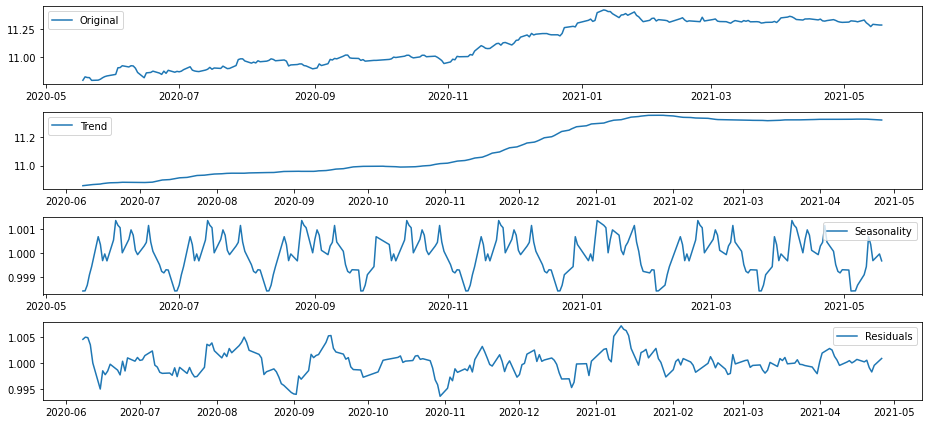
    


Original 시계열에서 Trend와 Seasonality를 제거하고 난 나머지를 Residual

Trend+Seasonality+Residual=Original

이러한 Decomposing은 시계열 데이터를 이해하는 중요한 관점을 제시한다.


```python
plt.rcParams["figure.figsize"] = (13,6)
plot_rolling_statistics(residual)
```


    
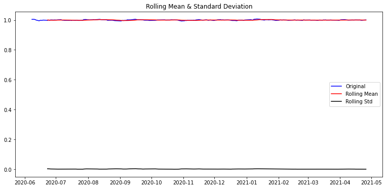
    


```python
# Residual 안정성 확인
residual.dropna(inplace=True)
augmented_dickey_fuller_test(residual)
```

    Results of Dickey-Fuller Test:
    Test Statistic                -6.187586e+00
    p-value                        6.234854e-08
    #Lags Used                     9.000000e+00
    Number of Observations Used    2.100000e+02
    Critical Value (1%)           -3.461879e+00
    Critical Value (5%)           -2.875404e+00
    Critical Value (10%)          -2.574159e+00
    dtype: float64


Decomposing을 통해 얻어진 Residual은 압도적으로 낮은 p-value를 보여 준다. 이 정도면 확실히 예측 가능한 수준의 안정적인 시계열이 얻어졌다고 볼 수 있겠다. 

# STEP 4 : 학습, 테스트 데이터셋 생성
- 학습, 테스트 데이터셋 분리


```python
train_data, test_data = ts_log[:int(len(ts_log)*0.9)], ts_log[int(len(ts_log)*0.9):]
plt.figure(figsize=(10,6))
plt.grid(True)
plt.plot(ts_log, c='r', label='training dataset')  # train_data를 적용하면 그래프가 끊어져 보이므로 자연스러운 연출을 위해 ts_log를 선택
plt.plot(test_data, c='b', label='test dataset')
plt.legend()
```


    <matplotlib.legend.Legend at 0x7f10d4448590>


    
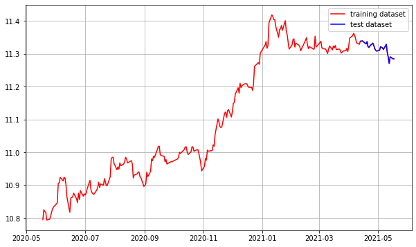
    


# STEP 5 : 적정 ARIMA 모수 찾기

- ACF, PACF 그려보기 -> p,q 구하기
- 차분 안정성 확인 -> d 구하기


```python
# ACF, PACF 그려보기 -> p,q 구하기

from statsmodels.graphics.tsaplots import plot_acf, plot_pacf

plot_acf(ts_log)   # ACF : Autocorrelation 그래프 그리기
plot_pacf(ts_log)  # PACF : Partial Autocorrelation 그래프 그리기
plt.show()
```


    
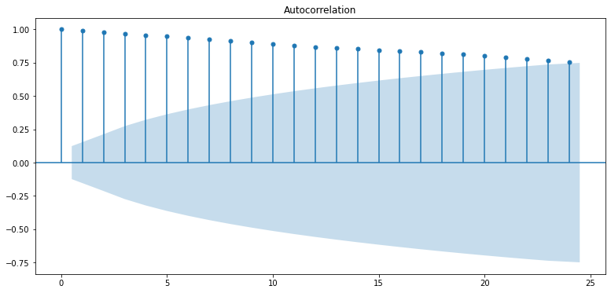
    


    
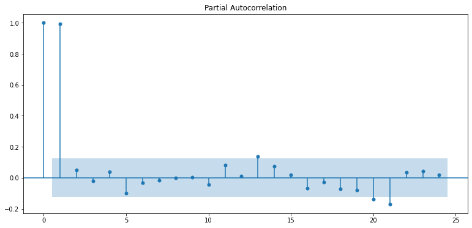
    


```python
# 차분 안정성 확인 -> d 구하기

# 1차 차분 구하기
diff_1 = ts_log.diff(periods=1).iloc[1:]
diff_1.plot(title='Difference 1st')

augmented_dickey_fuller_test(diff_1)
```

    Results of Dickey-Fuller Test:
    Test Statistic                -1.553699e+01
    p-value                        2.183738e-28
    #Lags Used                     0.000000e+00
    Number of Observations Used    2.480000e+02
    Critical Value (1%)           -3.456996e+00
    Critical Value (5%)           -2.873266e+00
    Critical Value (10%)          -2.573019e+00
    dtype: float64


    

    


```python
# 혹시 필요한 경우 2차 차분 구하기
diff_2 = diff_1.diff(periods=1).iloc[1:]
diff_2.plot(title='Difference 2nd')

augmented_dickey_fuller_test(diff_2)
```

    Results of Dickey-Fuller Test:
    Test Statistic                -1.029320e+01
    p-value                        3.525823e-18
    #Lags Used                     7.000000e+00
    Number of Observations Used    2.400000e+02
    Critical Value (1%)           -3.457894e+00
    Critical Value (5%)           -2.873659e+00
    Critical Value (10%)          -2.573229e+00
    dtype: float64


    

    


# STEP 6 : ARIMA 모델 훈련과 테스트

- ARIMA 모델 빌드와 훈련
- 모델 테스트 및 플로팅
- 최종 예측 모델 정확도 측정(MAPE)


```python
from statsmodels.tsa.arima_model import ARIMA

# Build Model
model = ARIMA(train_data, order=(1, 1, 0))  
fitted_m = model.fit(disp=-1)  
print(fitted_m.summary())
```

                                 ARIMA Model Results                              
    ==============================================================================
    Dep. Variable:                D.Close   No. Observations:                  224
    Model:                 ARIMA(1, 1, 0)   Log Likelihood                 585.396
    Method:                       css-mle   S.D. of innovations              0.018
    Date:                Tue, 07 Sep 2021   AIC                          -1164.792
    Time:                        01:21:12   BIC                          -1154.557
    Sample:                             1   HQIC                         -1160.661
                                                                                  
    =================================================================================
                        coef    std err          z      P>|z|      [0.025      0.975]
    ---------------------------------------------------------------------------------
    const             0.0024      0.001      1.978      0.048    2.17e-05       0.005
    ar.L1.D.Close     0.0168      0.067      0.250      0.803      -0.115       0.148
                                        Roots                                    
    =============================================================================
                      Real          Imaginary           Modulus         Frequency
    -----------------------------------------------------------------------------
    AR.1           59.6876           +0.0000j           59.6876            0.0000
    -----------------------------------------------------------------------------


    /opt/conda/lib/python3.7/site-packages/statsmodels/tsa/base/tsa_model.py:583: ValueWarning: A date index has been provided, but it has no associated frequency information and so will be ignored when e.g. forecasting.
      ' ignored when e.g. forecasting.', ValueWarning)
    /opt/conda/lib/python3.7/site-packages/statsmodels/tsa/base/tsa_model.py:583: ValueWarning: A date index has been provided, but it has no associated frequency information and so will be ignored when e.g. forecasting.
      ' ignored when e.g. forecasting.', ValueWarning)


```python
# Forecast : 결과가 fc에 담깁니다. 
fc, se, conf = fitted_m.forecast(len(test_data), alpha=0.05)  # 95% conf

# Make as pandas series
fc_series = pd.Series(fc, index=test_data.index)   # 예측결과
lower_series = pd.Series(conf[:, 0], index=test_data.index)  # 예측결과의 하한 바운드
upper_series = pd.Series(conf[:, 1], index=test_data.index)  # 예측결과의 상한 바운드

# Plot
plt.figure(figsize=(10,5), dpi=100)
plt.plot(train_data, label='training')
plt.plot(test_data, c='b', label='actual price')
plt.plot(fc_series, c='r',label='predicted price')
plt.fill_between(lower_series.index, lower_series, upper_series, color='k', alpha=.10)
plt.legend()
plt.show()
```


    
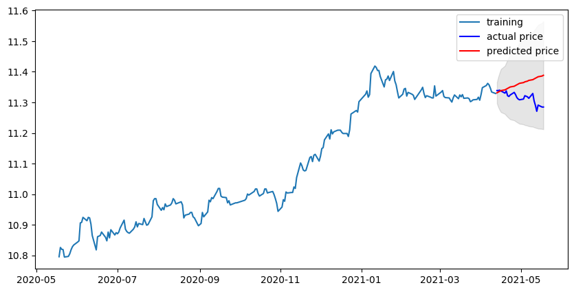
    


```python
from sklearn.metrics import mean_squared_error, mean_absolute_error
import math

mse = mean_squared_error(np.exp(test_data), np.exp(fc))
print('MSE: ', mse)

mae = mean_absolute_error(np.exp(test_data), np.exp(fc))
print('MAE: ', mae)

rmse = math.sqrt(mean_squared_error(np.exp(test_data), np.exp(fc)))
print('RMSE: ', rmse)

mape = np.mean(np.abs(np.exp(fc) - np.exp(test_data))/np.abs(np.exp(test_data)))
print('MAPE: {:.2f}%'.format(mape*100))
# mean absolute percentage error (MAPE)
```

    MSE:  22087366.126154922
    MAE:  3791.3511527213127
    RMSE:  4699.719792301976
    MAPE: 4.68%


MAPE 기준으로 4.68% 정도의 오차율을 보인다.

# STEP 7 : 다른 주식 종목 예측해 보기

- 관심 종목을 골라 위 STEP 1~6의 과정을 반복해 보기


```python
def get_time_series_log(filename):
    # Time Series 생성
    dataset_dirpath = os.getenv('HOME') + '/aiffel/Exploration/14. 어제 오른 내 주식, 과연 내일은?'
    dataset_filepath = os.path.join(dataset_dirpath, filename)
    df = pd.read_csv(dataset_filepath, index_col='Date', parse_dates=True)
    ts = df['Close']
    # 결측치 처리
    if len(ts[ts.isna()]) > 0:
        ts = ts.interpolate(method='time')
    # 로그 변환
    return np.log(ts)
```


```python
def check_stationary(ts_log):
    # 정성적 그래프 분석
    plot_rolling_statistics(ts_log, window=12)
    # 정량적 Augmented Dicky-Fuller Test
    augmented_dickey_fuller_test(ts_log)
```


```python
def time_series_decomposition(ts_log):
    # 시계열 분해 (Time Series Decomposition)
    decomposition = seasonal_decompose(ts_log, model='multiplicative', period = 30) 

    trend = decomposition.trend
    seasonal = decomposition.seasonal
    residual = decomposition.resid

    plt.rcParams["figure.figsize"] = (12,6)
    plt.subplot(411)
    plt.plot(ts_log, label='Original')
    plt.legend(loc='best')
    plt.subplot(412)
    plt.plot(trend, label='Trend')
    plt.legend(loc='best')
    plt.subplot(413)
    plt.plot(seasonal,label='Seasonality')
    plt.legend(loc='best')
    plt.subplot(414)
    plt.plot(residual, label='Residuals')
    plt.legend(loc='best')
    plt.tight_layout()
    
    # Residual 안정성 확인
    residual.dropna(inplace=True)
    augmented_dickey_fuller_test(residual)
```


```python
# 학습, 테스트 데이터셋 분리
def split_train_test_data(ts_log):
    train_data, test_data = ts_log[:int(len(ts_log)*0.9)], ts_log[int(len(ts_log)*0.9):]
    plt.figure(figsize=(10,6))
    plt.grid(True)
    plt.plot(ts_log, c='r', label='training dataset')  # train_data를 적용하면 그래프가 끊어져 보이므로 자연스러운 연출을 위해 ts_log를 선택
    plt.plot(test_data, c='b', label='test dataset')
    plt.legend()
    return train_data, test_data
```


```python
# ACF, PACF 그려보기 -> p,q 구하기
def plot_acf_pacf(ts_log):
    plot_acf(ts_log)   # ACF : Autocorrelation 그래프 그리기
    plot_pacf(ts_log)  # PACF : Partial Autocorrelation 그래프 그리기
    plt.show()
```


```python
# 차분 안정성 확인 -> d 구하기
def get_difference(ts_log):
    # 1차 차분 구하기
    plt.subplot(211)
    diff_1 = ts_log.diff(periods=1).iloc[1:]
    diff_1.plot(title='Difference 1st')
    # 혹시 필요한 경우 2차 차분 구하기
    plt.subplot(212)
    diff_2 = diff_1.diff(periods=1).iloc[1:]
    diff_2.plot(title='Difference 2nd')

    print('Difference 1st:')
    augmented_dickey_fuller_test(diff_1)
    print('\nDifference 2nd:')
    augmented_dickey_fuller_test(diff_2)
```


```python
def arima_train_test(order):
    # Build and Train  Model
    model = ARIMA(train_data, order=order)
    fitted_m = model.fit(disp=-1)
    print(fitted_m.summary())

    # Forecast : 결과가 fc에 담깁니다. 
    fc, se, conf = fitted_m.forecast(len(test_data), alpha=0.05)  # 95% conf

    # Make as pandas series
    fc_series = pd.Series(fc, index=test_data.index)   # 예측결과
    lower_series = pd.Series(conf[:, 0], index=test_data.index)  # 예측결과의 하한 바운드
    upper_series = pd.Series(conf[:, 1], index=test_data.index)  # 예측결과의 상한 바운드

    # Plot
    plt.figure(figsize=(10,6), dpi=100)
    plt.plot(train_data, label='training')
    plt.plot(test_data, c='b', label='actual price')
    plt.plot(fc_series, c='r',label='predicted price')
    plt.fill_between(lower_series.index, lower_series, upper_series, color='k', alpha=.10)
    plt.legend()
    plt.show()

    # Score
    mse = mean_squared_error(np.exp(test_data), np.exp(fc))
    print('MSE: ', mse)
    mae = mean_absolute_error(np.exp(test_data), np.exp(fc))
    print('MAE: ', mae)
    rmse = math.sqrt(mean_squared_error(np.exp(test_data), np.exp(fc)))
    print('RMSE: ', rmse)
    mape = np.mean(np.abs(np.exp(fc) - np.exp(test_data))/np.abs(np.exp(test_data)))
    print('MAPE: {:.2f}%'.format(mape*100))
```

## 7-1) Amazon


```python
# 데이터 불러와 Time Series 생성하기
ts_log = get_time_series_log('Amazon.csv')

# 정성적, 정량적 시계열 안정성 분석
check_stationary(ts_log)
```


    

    


    Results of Dickey-Fuller Test:
    Test Statistic                  -2.791304
    p-value                          0.059527
    #Lags Used                       0.000000
    Number of Observations Used    250.000000
    Critical Value (1%)             -3.456781
    Critical Value (5%)             -2.873172
    Critical Value (10%)            -2.572969
    dtype: float64


```python
# 기간 조정
ts_log = ts_log['2010-01-01':]
check_stationary(ts_log)
```


    
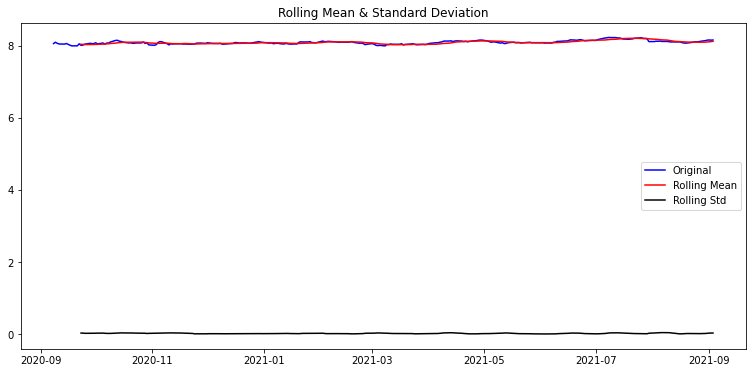
    


    Results of Dickey-Fuller Test:
    Test Statistic                  -2.791304
    p-value                          0.059527
    #Lags Used                       0.000000
    Number of Observations Used    250.000000
    Critical Value (1%)             -3.456781
    Critical Value (5%)             -2.873172
    Critical Value (10%)            -2.572969
    dtype: float64


```python
# 시계열 분해
time_series_decomposition(ts_log)
```

    Results of Dickey-Fuller Test:
    Test Statistic                -5.666111e+00
    p-value                        9.143839e-07
    #Lags Used                     1.000000e+00
    Number of Observations Used    2.190000e+02
    Critical Value (1%)           -3.460567e+00
    Critical Value (5%)           -2.874830e+00
    Critical Value (10%)          -2.573853e+00
    dtype: float64


    
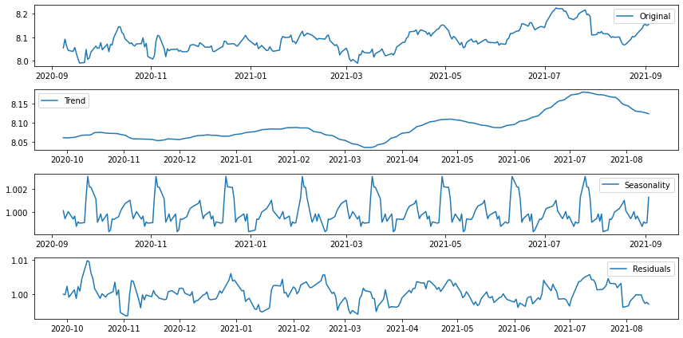
    


```python
# 학습, 테스트 데이터셋 분리
train_data, test_data = split_train_test_data(ts_log)
```


    
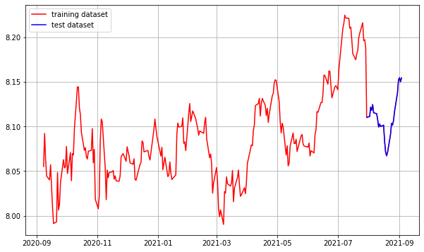
    


```python
# ACF, PACF 그려보기 -> p,q 구하기
plot_acf_pacf(ts_log)
```


    
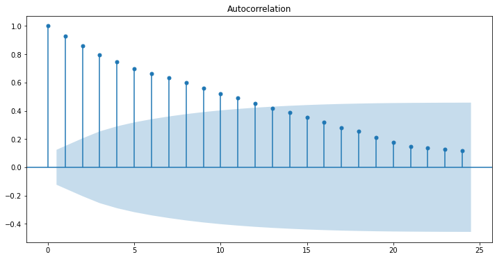
    


    
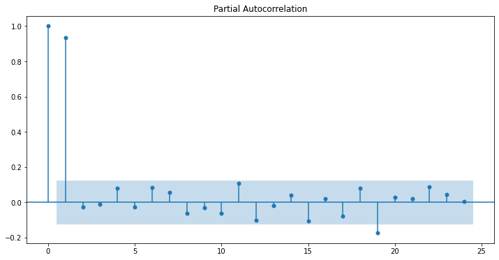
    


```python
# 차분 안정성 확인 -> d 구하기
get_difference(ts_log)
```

    Difference 1st:
    Results of Dickey-Fuller Test:
    Test Statistic                -1.043676e+01
    p-value                        1.559170e-18
    #Lags Used                     2.000000e+00
    Number of Observations Used    2.470000e+02
    Critical Value (1%)           -3.457105e+00
    Critical Value (5%)           -2.873314e+00
    Critical Value (10%)          -2.573044e+00
    dtype: float64
    
    Difference 2nd:
    Results of Dickey-Fuller Test:
    Test Statistic                -6.823242e+00
    p-value                        1.977304e-09
    #Lags Used                     1.600000e+01
    Number of Observations Used    2.320000e+02
    Critical Value (1%)           -3.458855e+00
    Critical Value (5%)           -2.874080e+00
    Critical Value (10%)          -2.573453e+00
    dtype: float64


    
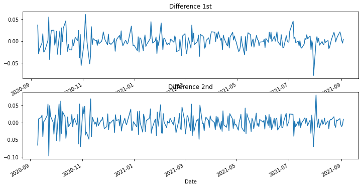
    


```python
# ARIMA 모델 훈련 및 테스트
arima_train_test((1, 2, 3))
```

    /opt/conda/lib/python3.7/site-packages/statsmodels/tsa/base/tsa_model.py:583: ValueWarning: A date index has been provided, but it has no associated frequency information and so will be ignored when e.g. forecasting.
      ' ignored when e.g. forecasting.', ValueWarning)
    /opt/conda/lib/python3.7/site-packages/statsmodels/tsa/base/tsa_model.py:583: ValueWarning: A date index has been provided, but it has no associated frequency information and so will be ignored when e.g. forecasting.
      ' ignored when e.g. forecasting.', ValueWarning)


                                 ARIMA Model Results                              
    ==============================================================================
    Dep. Variable:               D2.Close   No. Observations:                  223
    Model:                 ARIMA(1, 2, 3)   Log Likelihood                 580.913
    Method:                       css-mle   S.D. of innovations              0.018
    Date:                Tue, 07 Sep 2021   AIC                          -1149.826
    Time:                        01:24:43   BIC                          -1129.383
    Sample:                             2   HQIC                         -1141.574
                                                                                  
    ==================================================================================
                         coef    std err          z      P>|z|      [0.025      0.975]
    ----------------------------------------------------------------------------------
    const           8.376e-06   1.97e-05      0.424      0.671   -3.03e-05    4.71e-05
    ar.L1.D2.Close    -0.6854      0.220     -3.120      0.002      -1.116      -0.255
    ma.L1.D2.Close    -0.3007      0.234     -1.286      0.198      -0.759       0.158
    ma.L2.D2.Close    -0.6200      0.222     -2.788      0.005      -1.056      -0.184
    ma.L3.D2.Close    -0.0730      0.084     -0.869      0.385      -0.238       0.092
                                        Roots                                    
    =============================================================================
                      Real          Imaginary           Modulus         Frequency
    -----------------------------------------------------------------------------
    AR.1           -1.4591           +0.0000j            1.4591            0.5000
    MA.1            1.0036           +0.0000j            1.0036            0.0000
    MA.2           -1.7656           +0.0000j            1.7656            0.5000
    MA.3           -7.7289           +0.0000j            7.7289            0.5000
    -----------------------------------------------------------------------------


    
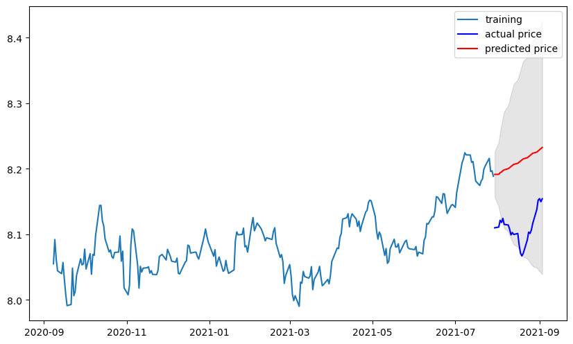
    


    MSE:  128547.35319504152
    MAE:  350.23371418090267
    RMSE:  358.5350097201688
    MAPE: 10.56%


# 회고

- ARIMA라는 개념이 생소해서 노드 진행이 쉽지 않았다
- 수십 년 전의 데이터를 다 사용하지 않고 2010년 이후의 데이터만 사용했다
- 막히는 부분은 고은채 퍼실님의 자료를 참고했다
