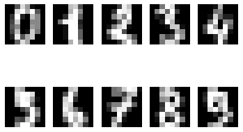

## 손글씨 이미지를 0~9의 열 가지 카테고리로 분류

### (1) 필요한 모듈 import하기


```python
from sklearn.datasets import load_digits
from sklearn.model_selection import train_test_split
from sklearn.metrics import classification_report
import matplotlib.pyplot as plt
from sklearn.metrics import accuracy_score
from sklearn.tree import DecisionTreeClassifier
from sklearn.ensemble import RandomForestClassifier
```

### (2) 데이터 준비


```python
digits = load_digits()
```

### (3) 데이터 이해하기


```python
digits.keys()
```


    dict_keys(['data', 'target', 'frame', 'feature_names', 'target_names', 'images', 'DESCR'])


```python
digits_data=digits.data
digits_data.shape

# data에는 1797개의 데이터가 있고, 각각 64개의 정보를 담고 있다. (feature는 64개의 픽셀값, 8x8)
```


    (1797, 64)


#### 한 번 확인해보자


```python
digits_data[0]

# 길이 64의 숫자 배열은 (8 x 8) 크기의 이미지를 일렬로 쭉 펴놓은 것이다
```


    array([ 0.,  0.,  5., 13.,  9.,  1.,  0.,  0.,  0.,  0., 13., 15., 10.,
           15.,  5.,  0.,  0.,  3., 15.,  2.,  0., 11.,  8.,  0.,  0.,  4.,
           12.,  0.,  0.,  8.,  8.,  0.,  0.,  5.,  8.,  0.,  0.,  9.,  8.,
            0.,  0.,  4., 11.,  0.,  1., 12.,  7.,  0.,  0.,  2., 14.,  5.,
           10., 12.,  0.,  0.,  0.,  0.,  6., 13., 10.,  0.,  0.,  0.])


#### 이미지를 한 번 확인해보자


```python
for i in range(10):
    plt.subplot(2, 5, i+1)
    plt.imshow(digits.data[i].reshape(8, 8), cmap='gray')
    plt.axis('off')
plt.show()
```


    

    


#### Feature Data 지정하기


```python
digits_data=digits.data
digits_data
```


    array([[ 0.,  0.,  5., ...,  0.,  0.,  0.],
           [ 0.,  0.,  0., ..., 10.,  0.,  0.],
           [ 0.,  0.,  0., ..., 16.,  9.,  0.],
           ...,
           [ 0.,  0.,  1., ...,  6.,  0.,  0.],
           [ 0.,  0.,  2., ..., 12.,  0.,  0.],
           [ 0.,  0., 10., ..., 12.,  1.,  0.]])


#### Label Data 지정하기


```python
digits_label = digits.target
print(digits_label.shape)
digits_label[:300]

# 라벨에는 총 1797개의 데이터가 있고, 0부터 9까지의 숫자로 나타난다.
# 각 이미지 데이터가 어떤 숫자를 나타내는지를 담고 있는 데이터이다.
```

    (1797,)


    array([0, 1, 2, 3, 4, 5, 6, 7, 8, 9, 0, 1, 2, 3, 4, 5, 6, 7, 8, 9, 0, 1,
           2, 3, 4, 5, 6, 7, 8, 9, 0, 9, 5, 5, 6, 5, 0, 9, 8, 9, 8, 4, 1, 7,
           7, 3, 5, 1, 0, 0, 2, 2, 7, 8, 2, 0, 1, 2, 6, 3, 3, 7, 3, 3, 4, 6,
           6, 6, 4, 9, 1, 5, 0, 9, 5, 2, 8, 2, 0, 0, 1, 7, 6, 3, 2, 1, 7, 4,
           6, 3, 1, 3, 9, 1, 7, 6, 8, 4, 3, 1, 4, 0, 5, 3, 6, 9, 6, 1, 7, 5,
           4, 4, 7, 2, 8, 2, 2, 5, 7, 9, 5, 4, 8, 8, 4, 9, 0, 8, 9, 8, 0, 1,
           2, 3, 4, 5, 6, 7, 8, 9, 0, 1, 2, 3, 4, 5, 6, 7, 8, 9, 0, 1, 2, 3,
           4, 5, 6, 7, 8, 9, 0, 9, 5, 5, 6, 5, 0, 9, 8, 9, 8, 4, 1, 7, 7, 3,
           5, 1, 0, 0, 2, 2, 7, 8, 2, 0, 1, 2, 6, 3, 3, 7, 3, 3, 4, 6, 6, 6,
           4, 9, 1, 5, 0, 9, 5, 2, 8, 2, 0, 0, 1, 7, 6, 3, 2, 1, 7, 3, 1, 3,
           9, 1, 7, 6, 8, 4, 3, 1, 4, 0, 5, 3, 6, 9, 6, 1, 7, 5, 4, 4, 7, 2,
           8, 2, 2, 5, 5, 4, 8, 8, 4, 9, 0, 8, 9, 8, 0, 1, 2, 3, 4, 5, 6, 7,
           8, 9, 0, 1, 2, 3, 4, 5, 6, 7, 8, 9, 0, 1, 2, 3, 4, 5, 6, 7, 8, 9,
           0, 9, 5, 5, 6, 5, 0, 9, 8, 9, 8, 4, 1, 7])


#### Target Names 출력


```python
digits.target_names
```


    array([0, 1, 2, 3, 4, 5, 6, 7, 8, 9])


#### 데이터 Describe


```python
print(digits.DESCR)
```

    .. _digits_dataset:
    
    Optical recognition of handwritten digits dataset
    --------------------------------------------------
    
    **Data Set Characteristics:**
    
        :Number of Instances: 5620
        :Number of Attributes: 64
        :Attribute Information: 8x8 image of integer pixels in the range 0..16.
        :Missing Attribute Values: None
        :Creator: E. Alpaydin (alpaydin '@' boun.edu.tr)
        :Date: July; 1998
    
    This is a copy of the test set of the UCI ML hand-written digits datasets
    https://archive.ics.uci.edu/ml/datasets/Optical+Recognition+of+Handwritten+Digits
    
    The data set contains images of hand-written digits: 10 classes where
    each class refers to a digit.
    
    Preprocessing programs made available by NIST were used to extract
    normalized bitmaps of handwritten digits from a preprinted form. From a
    total of 43 people, 30 contributed to the training set and different 13
    to the test set. 32x32 bitmaps are divided into nonoverlapping blocks of
    4x4 and the number of on pixels are counted in each block. This generates
    an input matrix of 8x8 where each element is an integer in the range
    0..16. This reduces dimensionality and gives invariance to small
    distortions.
    
    For info on NIST preprocessing routines, see M. D. Garris, J. L. Blue, G.
    T. Candela, D. L. Dimmick, J. Geist, P. J. Grother, S. A. Janet, and C.
    L. Wilson, NIST Form-Based Handprint Recognition System, NISTIR 5469,
    1994.
    
    .. topic:: References
    
      - C. Kaynak (1995) Methods of Combining Multiple Classifiers and Their
        Applications to Handwritten Digit Recognition, MSc Thesis, Institute of
        Graduate Studies in Science and Engineering, Bogazici University.
      - E. Alpaydin, C. Kaynak (1998) Cascading Classifiers, Kybernetika.
      - Ken Tang and Ponnuthurai N. Suganthan and Xi Yao and A. Kai Qin.
        Linear dimensionalityreduction using relevance weighted LDA. School of
        Electrical and Electronic Engineering Nanyang Technological University.
        2005.
      - Claudio Gentile. A New Approximate Maximal Margin Classification
        Algorithm. NIPS. 2000.


### (4) train, test 데이터 분리


```python
X_train, X_test, y_train, y_test = train_test_split(digits_data,
                                                    digits_label,
                                                    test_size=0.2,
                                                    random_state=10)

print('X_train 개수: ', len(X_train), ', X_test 개수: ', len(X_test))
```

    X_train 개수:  1437 , X_test 개수:  360


### (5) 다양한 데이터로 학습시켜보기

#### 0. 그 전에, 라벨에 편향이 있는지 확인해보자


```python
import numpy
unique, counts = numpy.unique(digits_label, return_counts=True)
dict(zip(unique, counts))

# 확인해보니 라벨 당 이터 개수는 유의미하게 차이나지 않는다.
# accuracy로 판단해도 괜찮겠다.
```


    {0: 178,
     1: 182,
     2: 177,
     3: 183,
     4: 181,
     5: 182,
     6: 181,
     7: 179,
     8: 174,
     9: 180}


#### 1. Decision Tree


```python
from sklearn.tree import DecisionTreeClassifier

decision_tree = DecisionTreeClassifier(random_state=10)
decision_tree.fit(X_train, y_train)
y_pred = decision_tree.predict(X_test)

print(classification_report(y_test, y_pred))
```

                  precision    recall  f1-score   support
    
               0       0.94      0.92      0.93        37
               1       0.91      0.91      0.91        34
               2       0.81      0.88      0.85        34
               3       0.79      0.85      0.82        40
               4       0.73      0.79      0.76        34
               5       0.91      0.91      0.91        32
               6       0.94      0.92      0.93        37
               7       0.95      0.88      0.91        40
               8       0.74      0.70      0.72        33
               9       0.81      0.77      0.79        39
    
        accuracy                           0.85       360
       macro avg       0.85      0.85      0.85       360
    weighted avg       0.86      0.85      0.85       360
    


#### 2. Random Forest


```python
from sklearn.ensemble import RandomForestClassifier

random_forest = RandomForestClassifier(random_state=32)
random_forest.fit(X_train, y_train)
y_pred = random_forest.predict(X_test)

print(classification_report(y_test, y_pred))
```

                  precision    recall  f1-score   support
    
               0       1.00      0.97      0.99        37
               1       0.97      0.94      0.96        34
               2       0.92      1.00      0.96        34
               3       0.95      0.97      0.96        40
               4       0.94      0.94      0.94        34
               5       0.94      0.97      0.95        32
               6       1.00      1.00      1.00        37
               7       0.93      0.97      0.95        40
               8       0.97      0.88      0.92        33
               9       0.97      0.92      0.95        39
    
        accuracy                           0.96       360
       macro avg       0.96      0.96      0.96       360
    weighted avg       0.96      0.96      0.96       360
    


#### 3. Support Vector Machine


```python
from sklearn import svm
svm_model = svm.SVC()

print(svm_model._estimator_type)

svm_model.fit(X_train, y_train)
y_pred = svm_model.predict(X_test)

print(classification_report(y_test, y_pred))
```

    classifier
                  precision    recall  f1-score   support
    
               0       1.00      1.00      1.00        37
               1       0.97      1.00      0.99        34
               2       0.97      1.00      0.99        34
               3       1.00      0.97      0.99        40
               4       1.00      0.94      0.97        34
               5       0.97      1.00      0.98        32
               6       1.00      1.00      1.00        37
               7       1.00      1.00      1.00        40
               8       0.91      0.97      0.94        33
               9       1.00      0.95      0.97        39
    
        accuracy                           0.98       360
       macro avg       0.98      0.98      0.98       360
    weighted avg       0.98      0.98      0.98       360
    


#### 4. Stochastic Gradient Descent Classifier (SGDClassifier)


```python
from sklearn.linear_model import SGDClassifier
sgd_model = SGDClassifier()

print(sgd_model._estimator_type)

sgd_model.fit(X_train, y_train)
y_pred = sgd_model.predict(X_test)

print(classification_report(y_test, y_pred))
```

    classifier
                  precision    recall  f1-score   support
    
               0       1.00      1.00      1.00        37
               1       0.97      0.82      0.89        34
               2       0.94      1.00      0.97        34
               3       0.97      0.97      0.97        40
               4       0.91      0.94      0.93        34
               5       0.97      1.00      0.98        32
               6       1.00      1.00      1.00        37
               7       0.97      0.95      0.96        40
               8       0.78      0.94      0.85        33
               9       1.00      0.87      0.93        39
    
        accuracy                           0.95       360
       macro avg       0.95      0.95      0.95       360
    weighted avg       0.95      0.95      0.95       360
    


#### 5. 로지스틱회귀(Logistic Regression)


```python
from sklearn.linear_model import LogisticRegression
logistic_model = LogisticRegression()

print(logistic_model._estimator_type)

logistic_model.fit(X_train, y_train)
y_pred = logistic_model.predict(X_test)

print(classification_report(y_test, y_pred))
```

    classifier
                  precision    recall  f1-score   support
    
               0       0.97      1.00      0.99        37
               1       0.91      0.91      0.91        34
               2       0.92      1.00      0.96        34
               3       1.00      0.95      0.97        40
               4       0.94      0.91      0.93        34
               5       0.94      0.94      0.94        32
               6       0.97      0.97      0.97        37
               7       0.97      0.95      0.96        40
               8       0.89      0.94      0.91        33
               9       0.97      0.92      0.95        39
    
        accuracy                           0.95       360
       macro avg       0.95      0.95      0.95       360
    weighted avg       0.95      0.95      0.95       360
    


    /opt/conda/lib/python3.7/site-packages/sklearn/linear_model/_logistic.py:762: ConvergenceWarning: lbfgs failed to converge (status=1):
    STOP: TOTAL NO. of ITERATIONS REACHED LIMIT.
    
    Increase the number of iterations (max_iter) or scale the data as shown in:
        https://scikit-learn.org/stable/modules/preprocessing.html
    Please also refer to the documentation for alternative solver options:
        https://scikit-learn.org/stable/modules/linear_model.html#logistic-regression
      extra_warning_msg=_LOGISTIC_SOLVER_CONVERGENCE_MSG)


### (6) 결론

#### 1. 라벨당 데이터 수가 비슷하니 모델의 성능을 평가하는 지표로 accuracy'만'을 사용해도 괜찮다.

#### 2. Support Vector Machine의 성능이 가장 좋다.
- Accuracy : 0.98
