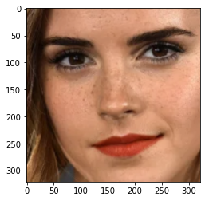

## 나와 닮은 연예인
- 셀카로 하기 조금 민망하여 EmmaWatson과 닮은 연예인을 찾아보았습니다 :0

### 1. 사진 모으기


```python
import os

dir_path = os.getenv('HOME')+'/aiffel/Exploration/5. 나와 닮은 연예인/Celebrity/'
file_list = os.listdir(dir_path)

print(len(file_list))   # 이미지 파일이 몇 개 있나
```

    67


### 2. 얼굴 영역 자르기

- face_recognition.face_locations를 사용해 얼굴을 찾자
- 박스를 찾으면 임베딩 추출을 할 이미지를 만들기 위해서 잘라주자


```python
# 이미지 파일을 파라미터로 넣으면 얼굴 영역을 출력하는 함수

import face_recognition

def get_cropped_face(image_file):
    image = face_recognition.load_image_file(image_file)
    face_locations = face_recognition.face_locations(image)
        
    a, b, c, d = face_locations[0]
    cropped_face = image[a:c, d:b, :]
    
    return cropped_face
```


```python
# 잘 되는지 체크해보자
import matplotlib.pyplot as plt

image_path = os.getenv('HOME')+'/aiffel/Exploration/5. 나와 닮은 연예인/Celebrity/EmmaWatson.png'
cropped_face = get_cropped_face(image_path)
plt.imshow(cropped_face)
```


    <matplotlib.image.AxesImage at 0x7f3d279e2f10>


    

    


### 3. 얼굴 영역의 임베딩 추출하기

- get_cropped_face로 얼굴 영역을 가져오고 face_recognition.face_encodings()로 얼굴 임베딩 벡터를 구하자
- images 디렉토리 안에 있는 모든 이미지 파일의 임베딩을 구해서 dict 구조에 담아 리턴하는 함수를 만들자. 각 엘리먼트는 사람 이름 : 임베딩벡터


```python
# 얼굴 영역을 가지고 얼굴 임베딩 벡터를 구하는 함수
def get_face_embedding(face):
    return face_recognition.face_encodings(face)
```


```python
# 작동 되는지 확인
image_file = os.path.join(dir_path, 'EmmaWatson2.png')
face = get_cropped_face(image_file)

embedding = get_face_embedding(face)  
embedding
```


    [array([-0.13914895,  0.0745416 ,  0.02331324, -0.09811392, -0.12064417,
            -0.00907244, -0.04399135, -0.10853667,  0.17237909, -0.19883148,
             0.18745504, -0.09677096, -0.32080123,  0.06911819, -0.06749871,
             0.20188981, -0.24501911, -0.2117153 , -0.0323343 , -0.09699245,
             0.05588422,  0.0440561 , -0.03322978,  0.10091179, -0.17653745,
            -0.26820317, -0.12511873, -0.10902159, -0.10645401, -0.07877489,
             0.02763025,  0.05297102, -0.14435606,  0.06088036,  0.04102473,
             0.12409124, -0.04247046, -0.14666717,  0.20524518,  0.06366701,
            -0.21289422, -0.04404192,  0.18477422,  0.27639139,  0.19666238,
            -0.02260194, -0.00694871, -0.06388348,  0.18028711, -0.38898546,
             0.03653502,  0.17308502,  0.13973466,  0.13445383,  0.14949496,
            -0.15233666,  0.07682896,  0.17181589, -0.14682952,  0.04400772,
             0.12809697, -0.03517038,  0.04588072, -0.05329342,  0.26865551,
             0.10478117, -0.14802508, -0.09143408,  0.18723384, -0.18922429,
            -0.14052787,  0.16103731, -0.12414044, -0.26967674, -0.24634573,
             0.048388  ,  0.38997859,  0.26672894, -0.05096073,  0.07179275,
            -0.0266655 , -0.00586572,  0.0212732 ,  0.1038581 , -0.05965634,
             0.02938194, -0.11686184,  0.04679419,  0.29568651, -0.01314011,
             0.00432733,  0.31158191,  0.02842278, -0.01536227,  0.03837708,
             0.03005574, -0.06229487, -0.09488533, -0.16709514, -0.03580017,
            -0.0413129 , -0.055955  , -0.06042681,  0.07408392, -0.20637318,
             0.07766956, -0.0873408 , -0.10027583, -0.16851813, -0.02736038,
            -0.0855761 ,  0.07352781,  0.13506888, -0.32306367,  0.07059369,
             0.14286928,  0.03734712,  0.13708833,  0.05168753,  0.03474572,
            -0.01388467, -0.15440539, -0.14102581, -0.12025239,  0.08746769,
             0.00914912,  0.0363644 ,  0.01411585])]


```python
# 모든 이미지 파일의 임베딩을 구해서 dict 구조에 담아 리턴하는 함수
from PIL import Image

def get_face_embedding_dict(dir_path):
    file_list = os.listdir(dir_path)
    embedding_dict = {}
    
    for file in file_list:
        image_path = os.path.join(dir_path, file)
        face = get_cropped_face(image_path)
        
        # 자른 이미지를 PIL의 Image.fromarray를 통해서 PIL Image로 변환한 뒤에
        # 저장해두자 -> 나중에 시각화 할 때 써먹자.
        pillow_image = Image.fromarray(face)
        save_path = os.getenv('HOME')+'/aiffel/Exploration/5. 나와 닮은 연예인/Celebrity_CroppedFace'
        path_to_save = os.path.join(save_path, file)
        pillow_image.save(path_to_save)
        
        embedding = get_face_embedding(face)
        
        if len(embedding) > 0 :
        # 얼굴영역 face가 제대로 detect되지 않으면 
        # len(embedding)==0인 경우가 발생하므로 
            embedding_dict[os.path.splitext(file)[0]] = embedding[0]
        # os.path.splitext(file)[0]에는 이미지파일명에서 확장자를 제거한 이름이 담긴다.
    return embedding_dict
```


```python
# 작동이 잘 되는지 확인해보자
dir_path = os.getenv('HOME')+'/aiffel/Exploration/5. 나와 닮은 연예인/Celebrity'
embedding_dict = get_face_embedding_dict(dir_path)
embedding_dict['kiernan shipka']
```


    array([-0.08572108,  0.00573408,  0.04935712, -0.06334831, -0.1184288 ,
            0.03145583, -0.0674611 ,  0.03248599,  0.18833882, -0.1368801 ,
            0.13882203, -0.05328388, -0.28948092,  0.09723967, -0.09133858,
            0.18395507, -0.20015357, -0.12666529, -0.00594641, -0.06790984,
            0.01713003,  0.05767341,  0.01334616,  0.08881031, -0.15452634,
           -0.31034765, -0.08444517, -0.05637326, -0.09334213, -0.12259112,
            0.03823109,  0.08409657, -0.20416118,  0.05974475,  0.01866953,
            0.15497404, -0.02853716, -0.16857979,  0.19585258,  0.14298238,
           -0.15076871, -0.09171618,  0.07713763,  0.27312598,  0.15732314,
            0.03303718, -0.0026679 , -0.01076995,  0.11870046, -0.39372405,
            0.02933574,  0.18880242,  0.06304018,  0.10383739,  0.05711841,
           -0.12055272,  0.07920947,  0.16212781, -0.1743823 ,  0.06778664,
           -0.0061149 , -0.00744055,  0.05961619, -0.03313746,  0.26888648,
            0.08553163, -0.12965859, -0.081237  ,  0.21276218, -0.17767653,
           -0.0944631 ,  0.13100164, -0.0905933 , -0.28296864, -0.22317839,
            0.02651164,  0.34537065,  0.19816607, -0.08023254,  0.0542517 ,
           -0.07622054, -0.09417447, -0.03056496,  0.13474275,  0.02645412,
            0.01038707, -0.07973254,  0.037764  ,  0.33883101, -0.01997234,
           -0.02527838,  0.29570541,  0.02522747, -0.05846975, -0.00149134,
            0.03668955, -0.02565993, -0.03521025, -0.14406519, -0.04260452,
           -0.01246087, -0.07482661, -0.10796781,  0.06315807, -0.27036089,
            0.10129598, -0.03863335, -0.16842814, -0.08081369, -0.04735165,
           -0.16959585,  0.0287762 ,  0.2117503 , -0.35303563,  0.14196163,
            0.21871899,  0.06530128,  0.17098796,  0.01647002,  0.06398948,
            0.06122801, -0.15617093, -0.10263592, -0.15775226,  0.01663102,
           -0.00089059, -0.02698522,  0.03321304])


### 4. 연예인과 얼굴 임베딩 사이의 거리 측정
- 연예인 사진들과 자신의 얼굴 사진에서 추출한 임베딩 벡터들 간의 거리를 비교해 보고 가장 작은 연예인이 누구인지 찾아보자


```python
import numpy as np

# 두 사람의 얼굴 임베딩 사이의 거리(L2 distance)를 구하는 함수
def get_distance(name1, name2):
    return np.linalg.norm(embedding_dict[name1]-embedding_dict[name2], ord=2)

print(get_distance('EmmaWatson', 'EmmaWatson2'))
print(get_distance('EmmaWatson', 'YShan'))

# 동일인물간의 거리가 더 가깝다는 것을 알 수 있다.
```

    0.4596456670677185
    0.8334342440924881


### 가장 닮은꼴 얼굴 찾아보기


```python
# name 인자에 특정 사람 이름을 주면 그 사람과 가장 닮은 다른 이미지와 거리 정보를
# 가장 가까운 순으로 정렬해서 표시해 주는 함수

def get_sort_key_func(name1):
    def get_distance_from_name1(name2):
        return get_distance(name1, name2)
    return get_distance_from_name1

sort_key_func = get_sort_key_func('EmmaWatson')  
```


```python
def get_nearest_face(name, top=5):
    sort_key_func = get_sort_key_func(name)
    sorted_faces = sorted(embedding_dict.items(), key=lambda x:sort_key_func(x[0]))
    # 딕셔너리를 name과의 임베딩 벡터 거리 함수를 기준으로 오름차순 정렬
    
    for i in range(top+1):
        if i == 0 :   # 첫번째로 나오는 이름은 자기 자신일 것이므로 제외
            continue
        if sorted_faces[i]:
            print('순위 {} : 이름({}), 거리({})'.format(i, sorted_faces[i][0], sort_key_func(sorted_faces[i][0])))
```


```python
get_nearest_face('EmmaWatson')
```

    순위 1 : 이름(EmmaWatson2), 거리(0.4596456670677185)
    순위 2 : 이름(kiernan shipka), 거리(0.5782549807739201)
    순위 3 : 이름(kristine stewart2), 거리(0.6407851237073037)
    순위 4 : 이름(kristine stewart), 거리(0.6658315568936577)
    순위 5 : 이름(NYLee), 거리(0.7290934939035629)


### 5. 재미있는 시각화
- 닮은 꼴 순서대로 얼굴이 나오게 시각화를 시도해보았다.
- 실패했다.


```python
def get_nearest_image(name):
    
    df = get_nearest_face(name)
    
    # 이미지 출력
    fig = plt.figure(figsize=(10, 5))
    rows, cols = 1, 6
    i = 1
    
    name_list = [name] + list(df['Name'])
    
    for name in name_list:
        save_path = os.getenv('HOME')+'/aiffel/Exploration/5. 나와 닮은 연예인/Celebrity_CroppedFace'
        img_path = os.path.join(save_path, name + '.png')
        img = mpimg.imread(img_path)
        ax = fig.add_subplot(rows, cols, i)
        plt.imshow(img)
        plt.axis("off")
        ax.set_title(score_list[i-1])
        i += 1

    plt.show()
```


```python
get_nearest_image('EmmaWatson')
```

    순위 1 : 이름(EmmaWatson2), 거리(0.4596456670677185)
    순위 2 : 이름(kiernan shipka), 거리(0.5782549807739201)
    순위 3 : 이름(kristine stewart2), 거리(0.6407851237073037)
    순위 4 : 이름(kristine stewart), 거리(0.6658315568936577)
    순위 5 : 이름(NYLee), 거리(0.7290934939035629)


    ---------------------------------------------------------------------------

    TypeError                                 Traceback (most recent call last)

    <ipython-input-33-dd281281196b> in <module>
    ----> 1 get_nearest_image('EmmaWatson')
    

    <ipython-input-32-d800f1a9aa38> in get_nearest_image(name)
         11     i = 1
         12 
    ---> 13     name_list = [name] + list(df['Name'])
         14 
         15     for name in name_list:


    TypeError: 'NoneType' object is not subscriptable


    <Figure size 720x360 with 0 Axes>


### 정리
1. dict생성한 이후 작동이 잘 되는지 확인해보려고

dir_path = os.getenv('HOME')+'/aiffel/Exploration/5. 나와 닮은 연예인/celebrity'

embedding_dict = get_face_embedding_dict(dir_path)

실행 결과
[Errno 21] Is a directory: '/aiffel/aiffel/Exploration/5. 나와 닮은 연예인/celebrity/.ipynb_checkpoints'
오류가 났다.

그래서 이미지를 새로운 폴더에 넣고 dir_path를 재설정하니 해결되었다.
폴더 속 파일을 삭제,추가했을 때마다 발생하는 현상인 것 같다

2. 많은 이미지를 찾아봤지만 엠마왓슨과 임베딩 거리 0.5 이내로 닮은 연예인을 찾아내지 못했다.
그나마 kiernan shipka와 가장 닮았다고 할 수 있다. 거리(0.5782549807739201)

3. 시각화를 시도해보았지만 실패했다. 우수 작품을 찾아보아야겠다.
