# Portrait Mode 프로젝트

## 1. 인물모드 구현하기

- 1 - 1) 셀카
- 1 - 2) 고양이
- 1 - 3) 크로마키 배경 합성 (배경을 blur가 아니라 다른 이미지로 교체)

### 1 - 1) 셀카
- 민망해서 여자 사진으로 대체함


```python
import cv2
import numpy as np
import os
import tarfile
import urllib

from matplotlib import pyplot as plt
import tensorflow as tf
import os
```

#### 사용할 이미지 확인


```python
girl_img_path = os.getenv('HOME')+'/aiffel/human_segmentation/images/girl.jpg'
girl_img_orig = cv2.imread(girl_img_path) 
plt.imshow(cv2.cvtColor(girl_img_orig, cv2.COLOR_BGR2RGB))
```


    <matplotlib.image.AxesImage at 0x7f0f4fdd1f10>


    
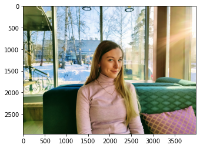
    


#### DeepLab 모델을 사용하자


```python
class DeepLabModel(object):
    INPUT_TENSOR_NAME = 'ImageTensor:0'
    OUTPUT_TENSOR_NAME = 'SemanticPredictions:0'
    INPUT_SIZE = 513
    FROZEN_GRAPH_NAME = 'frozen_inference_graph'

    # __init__()에서 모델 구조를 직접 구현하는 대신,
    # tar file에서 읽어들인 그래프구조 graph_def를 
    # tf.compat.v1.import_graph_def를 통해 불러들여 활용하게 됩니다. 
    def __init__(self, tarball_path):
        self.graph = tf.Graph()
        graph_def = None
        tar_file = tarfile.open(tarball_path)
        for tar_info in tar_file.getmembers():
            if self.FROZEN_GRAPH_NAME in os.path.basename(tar_info.name):
                file_handle = tar_file.extractfile(tar_info)
                graph_def = tf.compat.v1.GraphDef.FromString(file_handle.read())
                break
        tar_file.close()

        with self.graph.as_default():
            tf.compat.v1.import_graph_def(graph_def, name='')

        self.sess = tf.compat.v1.Session(graph=self.graph)

    # 이미지를 전처리 -> Tensorflow 입력으로 사용 가능한 shape의 Numpy Array로 변환
    # 모델이 받는 입력 크기가 정해져 있으므로 이에 따라 적절한 크기로 resize 하고,
    # OpenCV의 디폴트 BGR 채널 순서를 텐서플로우에 맞는 RGB로 수정합니다.
    def preprocess(self, img_orig):
        height, width = img_orig.shape[:2]
        resize_ratio = 1.0 * self.INPUT_SIZE / max(width, height)
        target_size = (int(resize_ratio * width), int(resize_ratio * height))
        resized_image = cv2.resize(img_orig, target_size)
        resized_rgb = cv2.cvtColor(resized_image, cv2.COLOR_BGR2RGB)
        img_input = resized_rgb
        return img_input
        
    # 실제로 segmentation을 하는 함수
    # 전처리된 이미지는 run() 함수에서 입력값으로 사용되는 것을 볼 수 있습니다.
    def run(self, image):
        img_input = self.preprocess(image)

        # Tensorflow V1에서는 model(input) 방식이 아니라 sess.run(feed_dict={input...}) 방식을 활용합니다.
        batch_seg_map = self.sess.run(
            self.OUTPUT_TENSOR_NAME,
            feed_dict={self.INPUT_TENSOR_NAME: [img_input]})

        seg_map = batch_seg_map[0]
        return cv2.cvtColor(img_input, cv2.COLOR_RGB2BGR), seg_map
```

#### 사전에 학습된 가중치(pretrained weight)를 불러오자


```python
# define model and download & load pretrained weight
# 구글이 제공하는 deeplabv3_mnv2_pascal_train_aug_2018_01_29 weight을
# 다운로드하고 DeepLabModel 을 초기화합니다.
# 이 모델은 PASCAL VOC 2012라는 대형 데이터셋으로 학습된 v3 버전입니다.

_DOWNLOAD_URL_PREFIX = 'http://download.tensorflow.org/models/'

model_dir = os.getenv('HOME')+'/aiffel/human_segmentation/models'
tf.io.gfile.makedirs(model_dir)

print ('temp directory:', model_dir)

download_path = os.path.join(model_dir, 'deeplab_model.tar.gz')
if not os.path.exists(download_path):
    urllib.request.urlretrieve(_DOWNLOAD_URL_PREFIX + 'deeplabv3_mnv2_pascal_train_aug_2018_01_29.tar.gz',
                   download_path)

MODEL = DeepLabModel(download_path)
```

    temp directory: /aiffel/aiffel/human_segmentation/models


#### 이미지를 네트워크에 입력


```python
girl_img_resized, girl_seg_map = MODEL.run(girl_img_orig)
print (girl_img_orig.shape, girl_img_resized.shape, girl_seg_map.max())

# cv2는 이미지를 HWC(Height, Width, Channel) 순서로 표시
# 18은 sofa

# 구글이 제공한 DeepLab은 PASCAL VOC의 라벨로 학습되었습니다.
# 제공하는 라벨 종류: background제외 총 20개
LABEL_NAMES = [
    'background', 'aeroplane', 'bicycle', 'bird', 'boat', 'bottle', 'bus',
    'car', 'cat', 'chair', 'cow', 'diningtable', 'dog', 'horse', 'motorbike',
    'person', 'pottedplant', 'sheep', 'sofa', 'train', 'tv']
```

    (2961, 4000, 3) (379, 513, 3) 18


#### 사람(person) 라벨, 15를 가진 영역만 검출해 내고 싶다. 마스크를 만들고 시각화


```python
girl_img_show = girl_img_resized.copy()

girl_seg_map = np.where(girl_seg_map == 15, 15, 0) # 예측 중 사람만 추출
# 사람을 뜻하는 15 외 예측은 0으로 설정
# 그럼 예측된 세그멘테이션 이미지(map)는 최댓값이 15가 된다.

girl_img_mask = girl_seg_map * (255/girl_seg_map.max())
# 일반 이미지는 0부터 255 까지의 값을 사용해 픽셀을 표현하므로,
# 세그멘테이션 맵에 표현된 값을 원본 이미지에 그림 형태로 출력하기 위해
# 255로 정규화 합니다. 

girl_img_mask = girl_img_mask.astype(np.uint8)

girl_color_mask = cv2.applyColorMap(girl_img_mask, cv2.COLORMAP_COOL)
# applyColorMap() 함수로 색을 적용

girl_img_show = cv2.addWeighted(girl_img_show, 0.6, girl_color_mask, 0.35, 0.0)

plt.imshow(cv2.cvtColor(girl_img_show, cv2.COLOR_BGR2RGB))
plt.show()
```


    
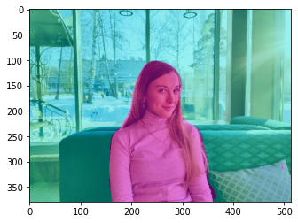
    


#### 세그멘테이션 결과(mask)를 원래 크기로 복원


```python
# DeepLab 모델을 사용하기 위해 이미지 크기를 작게 resize 해서 입력했다.
# 따라서 출력도 resize 된 입력 크기와 같게 나오게 된다. -> 복원하자

girl_img_mask_up = cv2.resize(girl_img_mask, girl_img_orig.shape[:2][::-1], interpolation=cv2.INTER_LINEAR)
_, girl_img_mask_up = cv2.threshold(girl_img_mask_up, 128, 255, cv2.THRESH_BINARY)

ax = plt.subplot(1,2,1)
plt.imshow(girl_img_mask_up, cmap=plt.cm.binary_r)
ax.set_title('Original Size Mask')

ax = plt.subplot(1,2,2)
plt.imshow(girl_img_mask, cmap=plt.cm.binary_r)
ax.set_title('DeepLab Model Mask')

plt.show()
```


    

    


#### 이미지를 전체적으로 흐리게


```python
girl_img_orig_blur = cv2.blur(girl_img_orig, (100,100))
# (,)은 blurring  kernel size
plt.imshow(cv2.cvtColor(girl_img_orig_blur, cv2.COLOR_BGR2RGB))
plt.show()
```


    

    


#### 흐려진 이미지에서 세그멘테이션 마스크를 이용해서 배경만 추출


```python
girl_img_mask_color = cv2.cvtColor(girl_img_mask_up, cv2.COLOR_GRAY2BGR)
girl_img_bg_mask = cv2.bitwise_not(girl_img_mask_color)
girl_img_bg_blur = cv2.bitwise_and(girl_img_orig_blur, girl_img_bg_mask)
plt.imshow(cv2.cvtColor(girl_img_bg_blur, cv2.COLOR_BGR2RGB))
plt.show()
```


    
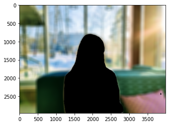
    


#### 배경과 사람을 합치기


```python
girl_img_concat = np.where(girl_img_mask_color==255, girl_img_orig, girl_img_bg_blur)
plt.imshow(cv2.cvtColor(girl_img_concat, cv2.COLOR_BGR2RGB))
plt.show()
```


    
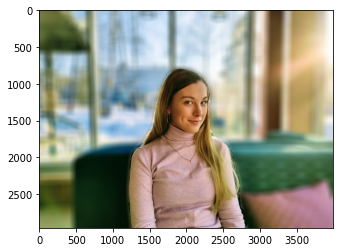
    


#### 원본과 Portrait mode를 비교해보자


```python
plt.figure(figsize=(10, 4))
ax = plt.subplot(1,2,1)
plt.imshow(cv2.cvtColor(girl_img_orig, cv2.COLOR_BGR2RGB))
ax.set_title('Original')

ax = plt.subplot(1,2,2)
plt.imshow(cv2.cvtColor(girl_img_concat, cv2.COLOR_BGR2RGB))
ax.set_title('Portrait mode')
plt.show()
```


    
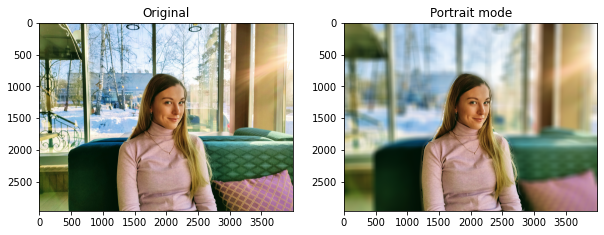
    


### 1 - 2) 고양이

#### 사용할 이미지 확인


```python
cat_img_path = os.getenv('HOME')+'/aiffel/human_segmentation/images/cat.jpg'
cat_img_orig = cv2.imread(cat_img_path) 
plt.imshow(cv2.cvtColor(cat_img_orig, cv2.COLOR_BGR2RGB))
```


    <matplotlib.image.AxesImage at 0x7f0fec826950>


    
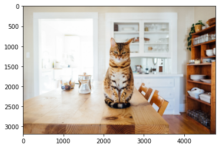
    


```python
cat_img_resized, cat_seg_map = MODEL.run(cat_img_orig)

cat_img_show = cat_img_resized.copy()

cat_seg_map = np.where(cat_seg_map == 8, 8, 0) # 예측 중 고양이만 추출
# 고양이를 뜻하는 8 외 예측은 0으로 설정
# 그럼 예측된 세그멘테이션 이미지(map)는 최댓값이 15가 된다.

cat_img_mask = cat_seg_map * (255/cat_seg_map.max())
# 일반 이미지는 0부터 255 까지의 값을 사용해 픽셀을 표현하므로,
# 세그멘테이션 맵에 표현된 값을 원본 이미지에 그림 형태로 출력하기 위해
# 255로 정규화 합니다. 

cat_img_mask = cat_img_mask.astype(np.uint8)

cat_color_mask = cv2.applyColorMap(cat_img_mask, cv2.COLORMAP_COOL)
# applyColorMap() 함수로 색을 적용

cat_img_show = cv2.addWeighted(cat_img_show, 0.6, cat_color_mask, 0.35, 0.0)

plt.imshow(cv2.cvtColor(cat_img_show, cv2.COLOR_BGR2RGB))
plt.show()
```


    
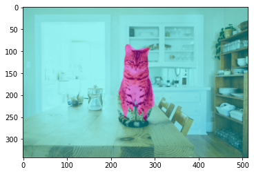
    


```python
cat_img_mask_up = cv2.resize(cat_img_mask, cat_img_orig.shape[:2][::-1], interpolation=cv2.INTER_LINEAR)
_, cat_img_mask_up = cv2.threshold(cat_img_mask_up, 128, 255, cv2.THRESH_BINARY)

ax = plt.subplot(1,2,1)
plt.imshow(cat_img_mask_up, cmap=plt.cm.binary_r)
ax.set_title('Original Size Mask')

ax = plt.subplot(1,2,2)
plt.imshow(cat_img_mask, cmap=plt.cm.binary_r)
ax.set_title('DeepLab Model Mask')

plt.show()
```


    
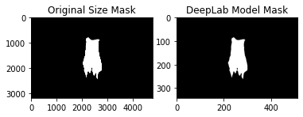
    


```python
cat_img_orig_blur = cv2.blur(cat_img_orig, (100,100))
# (,)은 blurring  kernel size

cat_img_mask_color = cv2.cvtColor(cat_img_mask_up, cv2.COLOR_GRAY2BGR)
cat_img_bg_mask = cv2.bitwise_not(cat_img_mask_color)
cat_img_bg_blur = cv2.bitwise_and(cat_img_orig_blur, cat_img_bg_mask)

cat_img_concat = np.where(cat_img_mask_color==255, cat_img_orig, cat_img_bg_blur)
```


```python
plt.figure(figsize=(10, 4))
ax = plt.subplot(1,2,1)
plt.imshow(cv2.cvtColor(cat_img_orig, cv2.COLOR_BGR2RGB))
ax.set_title('Original')

ax = plt.subplot(1,2,2)
plt.imshow(cv2.cvtColor(cat_img_concat, cv2.COLOR_BGR2RGB))
ax.set_title('Portrait mode')
plt.show()
```


    
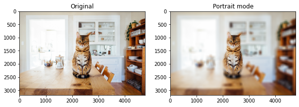
    


### 1 - 3) 크로마키 배경 합성 (배경을 blur가 아니라 다른 이미지로 교체)
- girl 이미지에 오로라를 합성해보자

#### 사용할 이미지 확인


```python
northernlights_img_path = os.getenv('HOME')+'/aiffel/human_segmentation/images/northernlights.jpg'
northernlights_img_orig = cv2.imread(northernlights_img_path) 
print(northernlights_img_orig.shape)
plt.imshow(cv2.cvtColor(northernlights_img_orig, cv2.COLOR_BGR2RGB))
```

    (3205, 5000, 3)


    <matplotlib.image.AxesImage at 0x7f0fec5a5350>


    
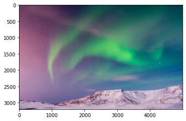
    


```python
girl_img_orig.shape
target_size = (girl_img_orig.shape[1], girl_img_orig.shape[0])
northernlights_resized = cv2.resize(northernlights_img_orig, target_size)
chromakey_img_concat = np.where(girl_img_mask_color==255, girl_img_orig, northernlights_resized)
```


```python
plt.figure(figsize=(10, 4))
ax = plt.subplot(1,2,1)
plt.imshow(cv2.cvtColor(girl_img_orig, cv2.COLOR_BGR2RGB))
ax.set_title('Original')

ax = plt.subplot(1,2,2)
plt.imshow(cv2.cvtColor(chromakey_img_concat, cv2.COLOR_BGR2RGB))
ax.set_title('Chroma Key')
plt.show()
```


    
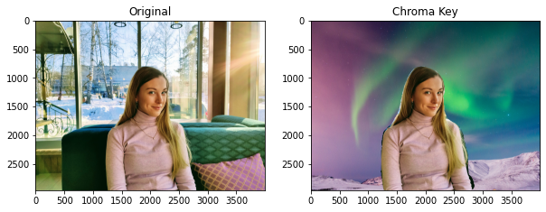
    


## 2. 문제점 찾기

#### 2 - 1) 고양이 사진에서 배꼽 아래 부분이 정확히 segmentation되지 않았다


```python
plt.figure(figsize=(10, 4))
ax = plt.subplot(1,2,1)
plt.imshow(cv2.cvtColor(cat_img_concat, cv2.COLOR_BGR2RGB))
ax.set_title('Cat Portrait mode')

ax = plt.subplot(1,2,2)
plt.imshow(cv2.cvtColor(cat_img_bg_blur, cv2.COLOR_BGR2RGB))
ax.set_title('Cat Segmentation')
plt.text(100,2700,'Incorrect Segmentation', fontsize=10, va='top', ha='left',color='red',weight='bold')
plt.annotate('',xy=(1900,2200),xytext=(1000,2600),arrowprops=dict(facecolor='red'))
plt.show()
```


    
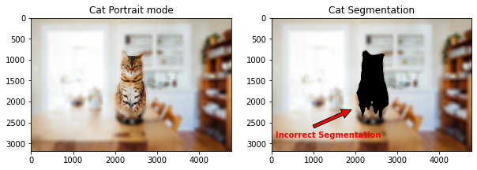
    


#### 2 - 2) 여자 사진에서 머리카락, 팔 경계선 부분을 더욱 섬세하게 구분해야 한다


```python
plt.figure(figsize=(10, 4))
ax = plt.subplot(1,2,1)
plt.imshow(cv2.cvtColor(girl_img_concat, cv2.COLOR_BGR2RGB))
ax.set_title('Girl Portrait mode')

ax = plt.subplot(1,2,2)
plt.imshow(cv2.cvtColor(chromakey_img_concat, cv2.COLOR_BGR2RGB))
ax.set_title('Girl Chroma Key')
# 경계선 부분을 확실히 볼 수 있어서 크로마키 이미지를 가져왔다
plt.text(3900,400,'Detailed Segmentation is required', fontsize=10, va='top', ha='right',color='red',weight='bold')
plt.annotate('',xy=(2800,2500),xytext=(3500,700),arrowprops=dict(facecolor='red'))
plt.show()
```


    
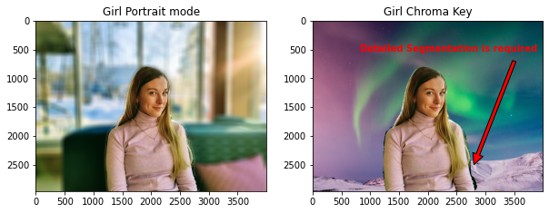
    


## 3. 해결 방법 제안
- Agit의 유상민님 게시글을 참고했습니다

### 인물모드 (배경이 blur)에서 경계선 부분을 더욱 깔끔하게 구분해보자


```python
girl_seg_map = np.where(girl_seg_map == 15, 15, 0) # 예측 중 사람만 추출
# 사람을 뜻하는 15 외 예측은 0으로 설정
# 그럼 예측된 세그멘테이션 이미지(map)는 최댓값이 15가 된다.

girl_img_mask = girl_seg_map * (255/girl_seg_map.max())
# 일반 이미지는 0부터 255 까지의 값을 사용해 픽셀을 표현하므로,
# 세그멘테이션 맵에 표현된 값을 원본 이미지에 그림 형태로 출력하기 위해
# 255로 정규화 합니다. 
```


```python
girl_img_mask_3C = np.repeat(np.expand_dims(girl_img_mask_up, axis=2), 3, axis=2).astype(np.uint8)

girl_Bmask = (cv2.blur(girl_img_mask_3C, (55, 5))/255).astype(np.float32)
# 여자만 보이는 마스크 블러 처리

plt.imshow(cv2.cvtColor(girl_Bmask, cv2.COLOR_BGR2RGB))
plt.show()
```


    

    


```python
girl_bg_Bmask = 1 - girl_Bmask
# 마스크를 리버스해서 배경만 보이는 마스크 만들기

plt.imshow(cv2.cvtColor(girl_bg_Bmask, cv2.COLOR_BGR2RGB))
plt.show()
```


    

    


```python
girl_image_Hblur = girl_Bmask * girl_img_orig.astype(np.float32)
# 경계면이 블러 처리된 여자 = 여자만 보이는 마스크 * 원본이미지

# 이제 두 텐서를 원소별 곱연산 해주면, 
# 경계는 원본의 픽셀값이 0.x 배로 감소해서 연해지고
# 여자부분은 1 이므로 원본 이미지의 픽셀값이 그대로 유지되어 흐려지지 않습니다

plt.imshow(cv2.cvtColor(girl_image_Hblur, cv2.COLOR_BGR2RGB))
plt.show()
```

    Clipping input data to the valid range for imshow with RGB data ([0..1] for floats or [0..255] for integers).


    
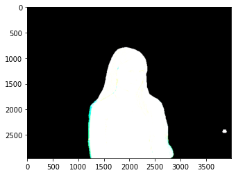
    


```python
bg_image_Hblur = girl_bg_Bmask * girl_img_orig_blur.astype(np.float32)
# 전체가 블러 처리된 배경 = 배경만 보이는 마스크 * 블러이미지

# 마스크와 섞을 배경 이미지는 미리 블러처리 되어있어야 합니다

plt.imshow(cv2.cvtColor(bg_image_Hblur, cv2.COLOR_BGR2RGB))
plt.show()
```

    Clipping input data to the valid range for imshow with RGB data ([0..1] for floats or [0..255] for integers).


    
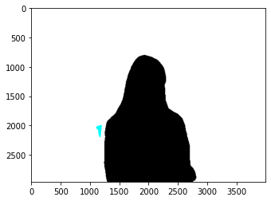
    


```python
final_image = (girl_image_Hblur + bg_image_Hblur).astype(np.uint8)
# 두 이미지를 합해서 최종 이미지 획득

plt.imshow(cv2.cvtColor(final_image, cv2.COLOR_BGR2RGB))
plt.show()
```


    

    


#### 기존의 Portrait mode와 비교해보자
- 머리카락과 오른쪽 어깨가 조금 더 자연스러워졌다


```python
plt.figure(figsize=(10, 4))
ax = plt.subplot(1,2,1)
plt.imshow(cv2.cvtColor(girl_img_concat, cv2.COLOR_BGR2RGB))
ax.set_title('Portrait mode')

ax = plt.subplot(1,2,2)
plt.imshow(cv2.cvtColor(final_image, cv2.COLOR_BGR2RGB))
ax.set_title('Modified Portrait mode')
plt.show()
```


    
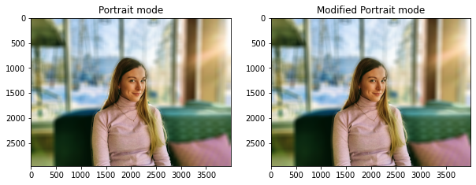
    


## 회고

- 이번에는 코드를 조금 더 자세히 뜯어보고, legend도 삽입하면서 이전보다 많은 걸 얻어간다. 그래도 모델 설계 부분은 전부 복붙이다..
- Agit에 올라온 유상민님의 글을 참고하여 경계선 부분을 조금 더 예쁘게 처리해보았다.
