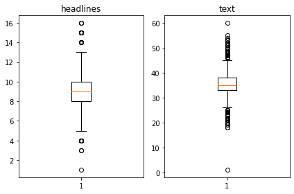
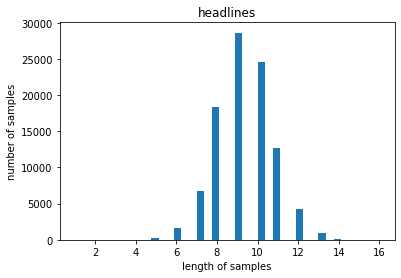
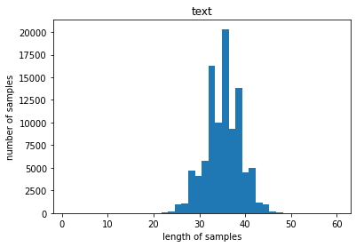
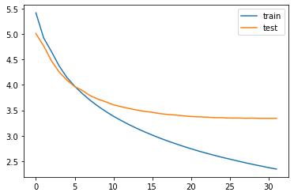

# 추상적 요약과 추출적 요약을 시도해보자

## 1. 데이터 수집하기

뉴스 기사 데이터(news_summary_more.csv

https://github.com/sunnysai12345/News_Summary


```python
# 데이터 다운로드

import pandas as pd

import urllib.request
urllib.request.urlretrieve("https://raw.githubusercontent.com/sunnysai12345/News_Summary/master/news_summary_more.csv", filename="news_summary_more.csv")
data = pd.read_csv('news_summary_more.csv', encoding='iso-8859-1')
```


```python
# 샘플을 보자
data.sample(10)
```


<div>
<style scoped>
    .dataframe tbody tr th:only-of-type {
        vertical-align: middle;
    }

    .dataframe tbody tr th {
        vertical-align: top;
    }

    .dataframe thead th {
        text-align: right;
    }
</style>
<table border="1" class="dataframe">
  <thead>
    <tr style="text-align: right;">
      <th></th>
      <th>headlines</th>
      <th>text</th>
      <th>summary</th>
    </tr>
  </thead>
  <tbody>
    <tr>
      <th>62712</th>
      <td>Google serves Android burger after CEO's burge...</td>
      <td>Google on Friday served its employees an 'Andr...</td>
      <td>The user had tweeted how Google places the che...</td>
    </tr>
    <tr>
      <th>49205</th>
      <td>4 jawans martyred in Pakistan firing along LoC...</td>
      <td>Four jawans were martyred and one was injured ...</td>
      <td>The continuous ceasefire violations by Pakista...</td>
    </tr>
    <tr>
      <th>51059</th>
      <td>Travel firm lets people get 'lost' at surprise...</td>
      <td>UK and US-based travel company Black Tomato of...</td>
      <td>The only input the travellers have to give for...</td>
    </tr>
    <tr>
      <th>72386</th>
      <td>Madhavan opts out of Aish's 'Fanney Khan' due ...</td>
      <td>Actor R Madhavan has said that he opted out of...</td>
      <td>Actor R Madhavan has said that he opted out of...</td>
    </tr>
    <tr>
      <th>33098</th>
      <td>IISc scientists discover gene mutation behind ...</td>
      <td>Researchers at the Indian Institute of Science...</td>
      <td>Researchers at the Indian Institute of Science...</td>
    </tr>
    <tr>
      <th>47988</th>
      <td>President pays tribute on Sarojini Naidu's bir...</td>
      <td>President Ram Nath Kovind on Tuesday paid trib...</td>
      <td>President Ram Nath Kovind on Tuesday paid trib...</td>
    </tr>
    <tr>
      <th>6375</th>
      <td>Apple to build new $1 billion campus in US' Texas</td>
      <td>Apple on Thursday announced that it is investi...</td>
      <td>Apple on Thursday announced that it is investi...</td>
    </tr>
    <tr>
      <th>13795</th>
      <td>Chase 2 runs short of ton as Windies score 295...</td>
      <td>Windies all-rounder Roston Chase ended the Day...</td>
      <td>Windies all-rounder Roston Chase ended the Day...</td>
    </tr>
    <tr>
      <th>14524</th>
      <td>Short sellers must be illegal: Musk replies to...</td>
      <td>Tesla CEO Elon Musk replied to his six-year-ol...</td>
      <td>Tesla CEO Elon Musk replied to his six-year-ol...</td>
    </tr>
    <tr>
      <th>85199</th>
      <td>10-year-old draws sexual assault scene, uncle ...</td>
      <td>A man was given five years imprisonment after ...</td>
      <td>The judge took it as evidence of "commission o...</td>
    </tr>
  </tbody>
</table>
</div>


기사의 본문에 해당되는 text와 headlines 두 가지 열로 구성되어있다.

추상적 요약을 하는 경우에는 text를 본문, headlines를 이미 요약된 데이터로 삼아서 모델을 학습할 수 있다. 추출적 요약을 하는 경우에는 오직 text열만을 사용하세요.

## 2. 데이터 전처리하기 (추상적 요약)

전처리 -> 텍스트를 정규화 또는 정제.

불용어 제거를 선택한다면 상대적으로 길이가 짧은 요약 데이터에 대해서도 불용어를 제거하는 것이 좋을지 고민해보자

### 2.1. 중복값, 결측치 제거


```python
print('Text 열에서 중복을 배제한 유일한 샘플의 수 :', data['text'].nunique())
print('headlines 열에서 중복을 배제한 유일한 샘플의 수 :', data['headlines'].nunique())
```

    Text 열에서 중복을 배제한 유일한 샘플의 수 : 98360
    headlines 열에서 중복을 배제한 유일한 샘플의 수 : 98280


```python
# inplace=True 를 설정하면 DataFrame 타입 값을 return 하지 않고
# data 내부를 직접적으로 바꿉니다

data.drop_duplicates(subset = ['text'], inplace=True)
print('전체 샘플수 :', (len(data)))
```

    전체 샘플수 : 98360


```python
print(data.isnull().sum())
```

    headlines    0
    text         0
    dtype: int64


### 2.2. 텍스트 정규화, 불용어 제거


```python
contractions = {"ain't": "is not", "aren't": "are not","can't": "cannot", "'cause": "because", "could've": "could have", "couldn't": "could not",
                           "didn't": "did not",  "doesn't": "does not", "don't": "do not", "hadn't": "had not", "hasn't": "has not", "haven't": "have not",
                           "he'd": "he would","he'll": "he will", "he's": "he is", "how'd": "how did", "how'd'y": "how do you", "how'll": "how will", "how's": "how is",
                           "I'd": "I would", "I'd've": "I would have", "I'll": "I will", "I'll've": "I will have","I'm": "I am", "I've": "I have", "i'd": "i would",
                           "i'd've": "i would have", "i'll": "i will",  "i'll've": "i will have","i'm": "i am", "i've": "i have", "isn't": "is not", "it'd": "it would",
                           "it'd've": "it would have", "it'll": "it will", "it'll've": "it will have","it's": "it is", "let's": "let us", "ma'am": "madam",
                           "mayn't": "may not", "might've": "might have","mightn't": "might not","mightn't've": "might not have", "must've": "must have",
                           "mustn't": "must not", "mustn't've": "must not have", "needn't": "need not", "needn't've": "need not have","o'clock": "of the clock",
                           "oughtn't": "ought not", "oughtn't've": "ought not have", "shan't": "shall not", "sha'n't": "shall not", "shan't've": "shall not have",
                           "she'd": "she would", "she'd've": "she would have", "she'll": "she will", "she'll've": "she will have", "she's": "she is",
                           "should've": "should have", "shouldn't": "should not", "shouldn't've": "should not have", "so've": "so have","so's": "so as",
                           "this's": "this is","that'd": "that would", "that'd've": "that would have", "that's": "that is", "there'd": "there would",
                           "there'd've": "there would have", "there's": "there is", "here's": "here is","they'd": "they would", "they'd've": "they would have",
                           "they'll": "they will", "they'll've": "they will have", "they're": "they are", "they've": "they have", "to've": "to have",
                           "wasn't": "was not", "we'd": "we would", "we'd've": "we would have", "we'll": "we will", "we'll've": "we will have", "we're": "we are",
                           "we've": "we have", "weren't": "were not", "what'll": "what will", "what'll've": "what will have", "what're": "what are",
                           "what's": "what is", "what've": "what have", "when's": "when is", "when've": "when have", "where'd": "where did", "where's": "where is",
                           "where've": "where have", "who'll": "who will", "who'll've": "who will have", "who's": "who is", "who've": "who have",
                           "why's": "why is", "why've": "why have", "will've": "will have", "won't": "will not", "won't've": "will not have",
                           "would've": "would have", "wouldn't": "would not", "wouldn't've": "would not have", "y'all": "you all",
                           "y'all'd": "you all would","y'all'd've": "you all would have","y'all're": "you all are","y'all've": "you all have",
                           "you'd": "you would", "you'd've": "you would have", "you'll": "you will", "you'll've": "you will have",
                           "you're": "you are", "you've": "you have"}

print("정규화 사전의 수: ", len(contractions))
```

    정규화 사전의 수:  120


```python
import nltk
nltk.download('stopwords')
from nltk.corpus import stopwords

print('불용어 개수 :', len(stopwords.words('english') ))
print(stopwords.words('english'))
```

    불용어 개수 : 179
    ['i', 'me', 'my', 'myself', 'we', 'our', 'ours', 'ourselves', 'you', "you're", "you've", "you'll", "you'd", 'your', 'yours', 'yourself', 'yourselves', 'he', 'him', 'his', 'himself', 'she', "she's", 'her', 'hers', 'herself', 'it', "it's", 'its', 'itself', 'they', 'them', 'their', 'theirs', 'themselves', 'what', 'which', 'who', 'whom', 'this', 'that', "that'll", 'these', 'those', 'am', 'is', 'are', 'was', 'were', 'be', 'been', 'being', 'have', 'has', 'had', 'having', 'do', 'does', 'did', 'doing', 'a', 'an', 'the', 'and', 'but', 'if', 'or', 'because', 'as', 'until', 'while', 'of', 'at', 'by', 'for', 'with', 'about', 'against', 'between', 'into', 'through', 'during', 'before', 'after', 'above', 'below', 'to', 'from', 'up', 'down', 'in', 'out', 'on', 'off', 'over', 'under', 'again', 'further', 'then', 'once', 'here', 'there', 'when', 'where', 'why', 'how', 'all', 'any', 'both', 'each', 'few', 'more', 'most', 'other', 'some', 'such', 'no', 'nor', 'not', 'only', 'own', 'same', 'so', 'than', 'too', 'very', 's', 't', 'can', 'will', 'just', 'don', "don't", 'should', "should've", 'now', 'd', 'll', 'm', 'o', 're', 've', 'y', 'ain', 'aren', "aren't", 'couldn', "couldn't", 'didn', "didn't", 'doesn', "doesn't", 'hadn', "hadn't", 'hasn', "hasn't", 'haven', "haven't", 'isn', "isn't", 'ma', 'mightn', "mightn't", 'mustn', "mustn't", 'needn', "needn't", 'shan', "shan't", 'shouldn', "shouldn't", 'wasn', "wasn't", 'weren', "weren't", 'won', "won't", 'wouldn', "wouldn't"]


    [nltk_data] Downloading package stopwords to /aiffel/nltk_data...
    [nltk_data]   Unzipping corpora/stopwords.zip.


```python
from bs4 import BeautifulSoup 
import re

# 데이터 전처리 함수
def preprocess_sentence(sentence, remove_stopwords=True):
    sentence = sentence.lower() # 텍스트 소문자화
    sentence = BeautifulSoup(sentence, "lxml").text # <br />, <a href = ...> 등의 html 태그 제거
    sentence = re.sub(r'\([^)]*\)', '', sentence) # 괄호로 닫힌 문자열 (...) 제거 Ex) my husband (and myself!) for => my husband for
    sentence = re.sub('"','', sentence) # 쌍따옴표 " 제거
    sentence = ' '.join([contractions[t] if t in contractions else t for t in sentence.split(" ")]) # 약어 정규화
    sentence = re.sub(r"'s\b","", sentence) # 소유격 제거. Ex) roland's -> roland
    sentence = re.sub("[^a-zA-Z]", " ", sentence) # 영어 외 문자(숫자, 특수문자 등) 공백으로 변환
    sentence = re.sub('[m]{2,}', 'mm', sentence) # m이 3개 이상이면 2개로 변경. Ex) ummmmmmm yeah -> umm yeah
    
    # 불용어 제거 (Text)
    if remove_stopwords:
        tokens = ' '.join(word for word in sentence.split() if not word in stopwords.words('english') if len(word) > 1)
    # 불용어 미제거 (headlines)
    else:
        tokens = ' '.join(word for word in sentence.split() if len(word) > 1)
    return tokens
```


```python
clean_text = []
# 전체 Text 데이터에 대한 전처리 : 10분 이상 시간이 걸릴 수 있습니다. 
for s in data['text']:
    clean_text.append(preprocess_sentence(s))

# 전처리 후 출력
print(clean_text[:5])


clean_headlines = []
# 전체 headlines 데이터에 대한 전처리 : 5분 이상 시간이 걸릴 수 있습니다. 
for s in data['headlines']:
    clean_headlines.append(preprocess_sentence(s, False))

print(clean_headlines[:5])
```

    ['saurav kant alumnus upgrad iiit pg program machine learning artificial intelligence sr systems engineer infosys almost years work experience program upgrad degree career support helped transition data scientist tech mahindra salary hike upgrad online power learning powered lakh careers', 'kunal shah credit card bill payment platform cred gave users chance win free food swiggy one year pranav kaushik delhi techie bagged reward spending cred coins users get one cred coin per rupee bill paid used avail rewards brands like ixigo bookmyshow ubereats cult fit', 'new zealand defeated india wickets fourth odi hamilton thursday win first match five match odi series india lost international match rohit sharma captaincy consecutive victories dating back march match witnessed india getting seventh lowest total odi cricket history', 'aegon life iterm insurance plan customers enjoy tax benefits premiums paid save taxes plan provides life cover age years also customers options insure critical illnesses disability accidental death benefit rider life cover age years', 'speaking sexual harassment allegations rajkumar hirani sonam kapoor said known hirani many years true metoo movement get derailed metoo movement always believe woman case need reserve judgment added hirani accused assistant worked sanju']
    ['upgrad learner switches to career in ml al with salary hike', 'delhi techie wins free food from swiggy for one year on cred', 'new zealand end rohit sharma led india match winning streak', 'aegon life iterm insurance plan helps customers save tax', 'have known hirani for yrs what if metoo claims are not true sonam']


```python
import numpy as np

data['text'] = clean_text
data['headlines'] = clean_headlines

# 빈 값을 Null 값으로 변환
data.replace('', np.nan, inplace=True)
```


```python
data.isnull().sum()
```


    headlines    0
    text         0
    dtype: int64


## 3. 훈련데이터와 테스트데이터 나누기

### 3.1. 샘플의 최대 길이 설정


```python
# 길이 분포 출력
import matplotlib.pyplot as plt

text_len = [len(s.split()) for s in data['text']]
headlines_len = [len(s.split()) for s in data['headlines']]

print('텍스트의 최소 길이 : {}'.format(np.min(text_len)))
print('텍스트의 최대 길이 : {}'.format(np.max(text_len)))
print('텍스트의 평균 길이 : {}'.format(np.mean(text_len)))
print('요약의 최소 길이 : {}'.format(np.min(headlines_len)))
print('요약의 최대 길이 : {}'.format(np.max(headlines_len)))
print('요약의 평균 길이 : {}'.format(np.mean(headlines_len)))

plt.subplot(1,2,1)
plt.boxplot(headlines_len)
plt.title('headlines')
plt.subplot(1,2,2)
plt.boxplot(text_len)
plt.title('text')
plt.tight_layout()
plt.show()

plt.title('headlines')
plt.hist(headlines_len, bins = 40)
plt.xlabel('length of samples')
plt.ylabel('number of samples')
plt.show()

plt.title('text')
plt.hist(text_len, bins = 40)
plt.xlabel('length of samples')
plt.ylabel('number of samples')
plt.show()
```

    텍스트의 최소 길이 : 1
    텍스트의 최대 길이 : 60
    텍스트의 평균 길이 : 35.09968483123221
    요약의 최소 길이 : 1
    요약의 최대 길이 : 16
    요약의 평균 길이 : 9.299532330215534


    

    


    

    


    

    


```python
text_max_len = 45
headlines_max_len = 13

def below_threshold_len(max_len, nested_list):
  cnt = 0
  for s in nested_list:
    if(len(s.split()) <= max_len):
        cnt = cnt + 1
  print('전체 샘플 중 길이가 %s 이하인 샘플의 비율: %s'%(max_len, (cnt / len(nested_list))))


below_threshold_len(text_max_len, data['text'])
below_threshold_len(headlines_max_len, data['headlines'])
```

    전체 샘플 중 길이가 45 이하인 샘플의 비율: 0.9967771451809678
    전체 샘플 중 길이가 13 이하인 샘플의 비율: 0.9981699877999186


```python
# 정해진 길이보다 길면 제외하는 방법으로 데이터를 정제

data = data[data['text'].apply(lambda x: len(x.split()) <= text_max_len)]
data = data[data['headlines'].apply(lambda x: len(x.split()) <= headlines_max_len)]
print('전체 샘플 수 :',(len(data)))
```

    전체 샘플 수 : 97863


### 3.2 시작 토큰과 종료 토큰 추가하기

- 디코더는 시작 토큰을 입력받아 문장을 생성하기 시작하고, 종료 토큰을 예측한 순간에 문장 생성을 멈춘다

- seq2seq 훈련을 위해서는 디코더의 입력과 레이블에 시작 토큰과 종료 토큰을 추가할 필요가 있다. 시작 토큰은 sostoken, 종료 토큰은 eostoken이라 명명하고 앞, 뒤로 추가하자

- 디코더의 입력에 해당하면서 시작 토큰이 맨 앞에 있는 문장의 이름을 decoder_input, 디코더의 출력 또는 레이블에 해당되면서 종료 토큰이 맨 뒤에 붙는 문장의 이름을 decoder_target. 두 개의 문장 모두 Summary 열로부터 만들 것이다


```python
# 요약 데이터에는 시작 토큰과 종료 토큰을 추가한다.
data['decoder_input'] = data['headlines'].apply(lambda x : 'sostoken '+ x)
data['decoder_target'] = data['headlines'].apply(lambda x : x + ' eostoken')
data.head()
```


<div>
<style scoped>
    .dataframe tbody tr th:only-of-type {
        vertical-align: middle;
    }

    .dataframe tbody tr th {
        vertical-align: top;
    }

    .dataframe thead th {
        text-align: right;
    }
</style>
<table border="1" class="dataframe">
  <thead>
    <tr style="text-align: right;">
      <th></th>
      <th>headlines</th>
      <th>text</th>
      <th>decoder_input</th>
      <th>decoder_target</th>
    </tr>
  </thead>
  <tbody>
    <tr>
      <th>0</th>
      <td>upgrad learner switches to career in ml al wit...</td>
      <td>saurav kant alumnus upgrad iiit pg program mac...</td>
      <td>sostoken upgrad learner switches to career in ...</td>
      <td>upgrad learner switches to career in ml al wit...</td>
    </tr>
    <tr>
      <th>1</th>
      <td>delhi techie wins free food from swiggy for on...</td>
      <td>kunal shah credit card bill payment platform c...</td>
      <td>sostoken delhi techie wins free food from swig...</td>
      <td>delhi techie wins free food from swiggy for on...</td>
    </tr>
    <tr>
      <th>2</th>
      <td>new zealand end rohit sharma led india match w...</td>
      <td>new zealand defeated india wickets fourth odi ...</td>
      <td>sostoken new zealand end rohit sharma led indi...</td>
      <td>new zealand end rohit sharma led india match w...</td>
    </tr>
    <tr>
      <th>3</th>
      <td>aegon life iterm insurance plan helps customer...</td>
      <td>aegon life iterm insurance plan customers enjo...</td>
      <td>sostoken aegon life iterm insurance plan helps...</td>
      <td>aegon life iterm insurance plan helps customer...</td>
    </tr>
    <tr>
      <th>4</th>
      <td>have known hirani for yrs what if metoo claims...</td>
      <td>speaking sexual harassment allegations rajkuma...</td>
      <td>sostoken have known hirani for yrs what if met...</td>
      <td>have known hirani for yrs what if metoo claims...</td>
    </tr>
  </tbody>
</table>
</div>


```python
# 앞뒤로 토큰이 잘 붙었지? 
# 인코더의 입력, 디코더의 입력과 레이블을 각각 다시 Numpy 타입으로 저장

encoder_input = np.array(data['text']) # 인코더의 입력
decoder_input = np.array(data['decoder_input']) # 디코더의 입력
decoder_target = np.array(data['decoder_target']) # 디코더의 레이블
```

이제 훈련 데이터와 테스트 데이터를 분리하자

훈련 데이터와 테스트 데이터를 분리하는 방법은 분리 패키지를 사용하는 방법, 또는 직접 코딩을 통해서 분리하는 방법 등 여러 가지 방법이 있을 텐데 여기서는 직접 해보자. 우선, encoder_input과 크기와 형태가 같은 순서가 섞인 정수 시퀀스를 만들자


```python
indices = np.arange(encoder_input.shape[0])
np.random.shuffle(indices)
print(indices)
```

    [40321 15604 97468 ... 73306 30851 78091]


이 정수 시퀀스를 이용해 다시 데이터의 샘플 순서를 정의해 주면 잘 섞인 샘플이 되겠지


```python
encoder_input = encoder_input[indices]
decoder_input = decoder_input[indices]
decoder_target = decoder_target[indices]
```

이제 섞인 데이터를 8:2의 비율로 훈련 데이터와 테스트 데이터로 분리. 전체 데이터의 크기에서 0.2를 곱해서 테스트 데이터의 크기를 정의해주자.


```python
n_of_val = int(len(encoder_input)*0.2)
print('테스트 데이터의 수 :', n_of_val)
```

    테스트 데이터의 수 : 19572


이렇게 정의한 테스트 데이터의 개수를 이용해 전체 데이터를 양분하자. :표시의 위치에 주의


```python
encoder_input_train = encoder_input[:-n_of_val]
decoder_input_train = decoder_input[:-n_of_val]
decoder_target_train = decoder_target[:-n_of_val]

encoder_input_test = encoder_input[-n_of_val:]
decoder_input_test = decoder_input[-n_of_val:]
decoder_target_test = decoder_target[-n_of_val:]

print('훈련 데이터의 개수 :',len(encoder_input_train))
print('훈련 레이블의 개수 :',len(decoder_input_train))
print('테스트 데이터의 개수 :',len(encoder_input_test))
print('테스트 레이블의 개수 :',len(decoder_input_test))
```

    훈련 데이터의 개수 : 78291
    훈련 레이블의 개수 : 78291
    테스트 데이터의 개수 : 19572
    테스트 레이블의 개수 : 19572


## 4. 정수 인코딩

### 4.1 단어 집합(vocabulary) 만들기 및 정수 인코딩

이제 기계가 텍스트를 숫자로 처리할 수 있도록 훈련 데이터와 테스트 데이터의 단어들을 모두 정수로 바꾸자.

이를 위해서는 각 단어에 고유한 정수를 맵핑하는 작업이 필요하다.
이 과정을 단어 집합(vocabulary) 을 만든다고 표현한다.

훈련 데이터에 대해서 단어 집합을 만들어볼게요. 우선, 원문에 해당되는 encoder_input_train에 대해서 단어 집합을 만들게요.
Keras의 토크나이저를 사용하면, 입력된 훈련 데이터로부터 단어 집합을 만들 수 있어요.


```python
from tensorflow.keras.preprocessing.text import Tokenizer 

src_tokenizer = Tokenizer() # 토크나이저 정의
src_tokenizer.fit_on_texts(encoder_input_train) # 입력된 데이터로부터 단어 집합 생성
```

이제 단어 집합이 생성되는 동시에 각 단어에 고유한 정수가 부여되었어요. 현재 생성된 단어 집합은 src_tokenizer.word_index에 저장되어 있어요. 그런데 우리는 이렇게 만든 단어 집합에 있는 모든 단어를 사용하는 것이 아니라, 빈도수가 낮은 단어들은 훈련 데이터에서 제외하고 진행하려고 해요.

등장 빈도수가 7회 미만인 단어들이 이 데이터에서 얼만큼의 비중을 차지하는지 확인해볼게요.

src_tokenizer.word_counts.items()에는 단어와 각 단어의 등장 빈도수가 저장돼 있는데, 이를 통해서 통계적인 정보를 얻을 수 있어요.


```python
threshold = 7
total_cnt = len(src_tokenizer.word_index) # 단어의 수
rare_cnt = 0 # 등장 빈도수가 threshold보다 작은 단어의 개수를 카운트
total_freq = 0 # 훈련 데이터의 전체 단어 빈도수 총 합
rare_freq = 0 # 등장 빈도수가 threshold보다 작은 단어의 등장 빈도수의 총 합

# 단어와 빈도수의 쌍(pair)을 key와 value로 받는다.
for key, value in src_tokenizer.word_counts.items():
    total_freq = total_freq + value

    # 단어의 등장 빈도수가 threshold보다 작으면
    if(value < threshold):
        rare_cnt = rare_cnt + 1
        rare_freq = rare_freq + value

print('단어 집합(vocabulary)의 크기 :',total_cnt)
print('등장 빈도가 %s번 이하인 희귀 단어의 수: %s'%(threshold - 1, rare_cnt))
print('단어 집합에서 희귀 단어를 제외시킬 경우의 단어 집합의 크기 %s'%(total_cnt - rare_cnt))
print("단어 집합에서 희귀 단어의 비율:", (rare_cnt / total_cnt)*100)
print("전체 등장 빈도에서 희귀 단어 등장 빈도 비율:", (rare_freq / total_freq)*100)
```

    단어 집합(vocabulary)의 크기 : 69335
    등장 빈도가 6번 이하인 희귀 단어의 수: 47276
    단어 집합에서 희귀 단어를 제외시킬 경우의 단어 집합의 크기 22059
    단어 집합에서 희귀 단어의 비율: 68.1848994014567
    전체 등장 빈도에서 희귀 단어 등장 빈도 비율: 3.5045721155597653


등장 빈도가 threshold 값인 7회 미만, 즉, 6회 이하인 단어들은 단어 집합에서 68%

하지만, 실제로 훈련 데이터에서 등장 빈도로 차지하는 비중은 상대적으로 적은 수치인 3.49%밖에 되지 않아요.

그래서 등장 빈도가 6회 이하인 단어들은 정수 인코딩 과정에서 빼고, 훈련 데이터에서 제거하고자 합니다. 위에서 이를 제외한 단어 집합의 크기를 8천여 개로 계산했는데, 이와 비슷한 값으로 어림잡아 단어 집합의 크기를 20,000으로 제한해볼게요. 토크나이저를 정의할 때 num_words의 값을 정해주면, 단어 집합의 크기를 제한할 수 있어요.


```python
src_vocab = 20000
src_tokenizer = Tokenizer(num_words = src_vocab) # 단어 집합의 크기 제한
src_tokenizer.fit_on_texts(encoder_input_train) # 단어 집합 재생성
```

texts_to_sequences()는 생성된 단어 집합에 기반하여 입력으로 주어진 텍스트 데이터의 단어들을 모두 정수로 변환하는 정수 인코딩을 수행해요. 현재 단어 집합의 크기를 20,000으로 제한했으니까 이제 20,000이 넘는 숫자들은 정수 인코딩 후에는 데이터에 존재하지 않아요.


```python
# 텍스트 시퀀스를 정수 시퀀스로 변환
encoder_input_train = src_tokenizer.texts_to_sequences(encoder_input_train) 
encoder_input_test = src_tokenizer.texts_to_sequences(encoder_input_test)

# 잘 진행되었는지 샘플 출력
print(encoder_input_train[:3])
```

    [[801, 95, 15909, 17, 2, 303, 987, 1734, 3533, 2344, 2, 7, 1103, 961, 987, 258, 3405, 694, 107, 2517, 214, 1719, 987, 160, 458, 214, 1072, 6705, 3644, 6174, 8244, 2135, 6376, 7733, 15909, 1490, 1645], [2543, 1440, 13334, 7232, 350, 4252, 196, 3, 13, 155, 54, 1001, 81, 184, 2543, 1, 196, 343, 14249, 2193, 160, 1061, 827, 73, 287, 96, 5582, 2006, 8, 196, 82, 1374, 2388, 776, 2504, 74, 420, 5826, 1759, 2154], [7, 26, 523, 3874, 864, 291, 1421, 60, 66, 9816, 307, 1393, 9576, 588, 1167, 1209, 273, 66, 5827, 3973, 157, 1776, 703, 378, 2240, 9816, 6, 755, 288, 5260, 860, 373]]


이제 더 이상 텍스트 데이터가 아니라 정수가 나오고 있어요.

Summary 데이터에 대해서도 동일한 작업을 수행할게요. 케라스의 토크나이저를 사용하여 decoder_input_train을 입력으로 전체 단어 집합과 각 단어에 대한 빈도수를 계산해요.


```python
tar_tokenizer = Tokenizer()
tar_tokenizer.fit_on_texts(decoder_input_train)
```


```python
threshold = 6
total_cnt = len(tar_tokenizer.word_index) # 단어의 수
rare_cnt = 0 # 등장 빈도수가 threshold보다 작은 단어의 개수를 카운트
total_freq = 0 # 훈련 데이터의 전체 단어 빈도수 총 합
rare_freq = 0 # 등장 빈도수가 threshold보다 작은 단어의 등장 빈도수의 총 합

# 단어와 빈도수의 쌍(pair)을 key와 value로 받는다.
for key, value in tar_tokenizer.word_counts.items():
    total_freq = total_freq + value

    # 단어의 등장 빈도수가 threshold보다 작으면
    if(value < threshold):
        rare_cnt = rare_cnt + 1
        rare_freq = rare_freq + value

print('단어 집합(vocabulary)의 크기 :',total_cnt)
print('등장 빈도가 %s번 이하인 희귀 단어의 수: %s'%(threshold - 1, rare_cnt))
print('단어 집합에서 희귀 단어를 제외시킬 경우의 단어 집합의 크기 %s'%(total_cnt - rare_cnt))
print("단어 집합에서 희귀 단어의 비율:", (rare_cnt / total_cnt)*100)
print("전체 등장 빈도에서 희귀 단어 등장 빈도 비율:", (rare_freq / total_freq)*100)
```

    단어 집합(vocabulary)의 크기 : 29986
    등장 빈도가 5번 이하인 희귀 단어의 수: 19590
    단어 집합에서 희귀 단어를 제외시킬 경우의 단어 집합의 크기 10396
    단어 집합에서 희귀 단어의 비율: 65.33048756086174
    전체 등장 빈도에서 희귀 단어 등장 빈도 비율: 4.649390243902439


```python
tar_vocab = 10000
tar_tokenizer = Tokenizer(num_words = tar_vocab) 
tar_tokenizer.fit_on_texts(decoder_input_train)
tar_tokenizer.fit_on_texts(decoder_target_train)

# 텍스트 시퀀스를 정수 시퀀스로 변환
decoder_input_train = tar_tokenizer.texts_to_sequences(decoder_input_train) 
decoder_target_train = tar_tokenizer.texts_to_sequences(decoder_target_train)
decoder_input_test = tar_tokenizer.texts_to_sequences(decoder_input_test)
decoder_target_test = tar_tokenizer.texts_to_sequences(decoder_target_test)

#잘 변환되었는지 확인
print('input')
print('input ',decoder_input_train[:5])
print('target')
print('decoder ',decoder_target_train[:5])
```

    input
    input  [[1, 3314, 8, 44, 596, 228, 371, 228, 918, 567], [1, 1077, 1367, 6, 188, 1040, 121, 31, 1537], [1, 2124, 814, 2859, 5, 35, 54, 16, 8763, 272, 7, 467], [1, 463, 795, 1550, 100, 35, 2125, 127, 351, 3653], [1, 307, 2747, 24, 1248, 1586, 1632, 7, 564, 48, 834]]
    target
    decoder  [[3314, 8, 44, 596, 228, 371, 228, 918, 567, 2], [1077, 1367, 6, 188, 1040, 121, 31, 1537, 2], [2124, 814, 2859, 5, 35, 54, 16, 8763, 272, 7, 467, 2], [463, 795, 1550, 100, 35, 2125, 127, 351, 3653, 2], [307, 2747, 24, 1248, 1586, 1632, 7, 564, 48, 834, 2]]


정상적으로 정수 인코딩 작업이 끝났어요. 현재 decoder_input_train과 decoder_target_train에는 더 이상 숫자 10,000이 넘는 숫자들은 존재하지 않아요. 그런데 다음 작업인 패딩 하기로 넘어가기 전에 한 가지 점검해야 할 것이 있어요.

전체 데이터에서 빈도수가 낮은 단어가 삭제되었다는 것은 빈도수가 낮은 단어만으로 구성되었던 샘플들은 이제 빈(empty) 샘플이 되었을 가능성이 있어요.

이 현상은 길이가 상대적으로 길었던 원문(Text)의 경우에는 문제가 별로 없겠지만, 애초에 평균 길이가 4밖에 되지 않았던 요약문(Summary)의 경우에는 이 현상이 굉장히 두드러졌을 가능성이 높겠죠.

요약문에서 길이가 0이 된 샘플들의 인덱스를 받아와볼게요.

여기서 주의할 점은 요약문인 decoder_input에는 sostoken 또는 decoder_target에는 eostoken이 추가된 상태이고, 이 두 토큰은 모든 샘플에서 등장하므로 빈도수가 샘플 수와 동일하게 매우 높으므로 단어 집합 제한에도 삭제되지 않아요.

그래서 이제 길이가 0이 된 요약문의 실제 길이는 1로 나올 거예요. 길이 0이 된 decoder_input에는 sostoken, decoder_target에는 eostoken만 남아 있을 테니까요.

훈련 데이터와 테스트 데이터에 대해서 요약문의 길이가 1인 경우의 인덱스를 각각 drop_train과 drop_test에 라는 변수에 저장해볼게요. 이 샘플들은 모두 삭제할 거예요.


```python
# 요약문의 길이가 1인 경우 삭제
drop_train = [index for index, sentence in enumerate(decoder_input_train) if len(sentence) == 1]
drop_test = [index for index, sentence in enumerate(decoder_input_test) if len(sentence) == 1]

print('삭제할 훈련 데이터의 개수 :',len(drop_train))
print('삭제할 테스트 데이터의 개수 :',len(drop_test))

encoder_input_train = np.delete(encoder_input_train, drop_train, axis=0)
decoder_input_train = np.delete(decoder_input_train, drop_train, axis=0)
decoder_target_train = np.delete(decoder_target_train, drop_train, axis=0)

encoder_input_test = np.delete(encoder_input_test, drop_test, axis=0)
decoder_input_test = np.delete(decoder_input_test, drop_test, axis=0)
decoder_target_test = np.delete(decoder_target_test, drop_test, axis=0)

print('훈련 데이터의 개수 :',len(encoder_input_train))
print('훈련 레이블의 개수 :',len(decoder_input_train))
print('테스트 데이터의 개수 :',len(encoder_input_test))
print('테스트 레이블의 개수 :',len(decoder_input_test))
```

    삭제할 훈련 데이터의 개수 : 1
    삭제할 테스트 데이터의 개수 : 0
    훈련 데이터의 개수 : 78290
    훈련 레이블의 개수 : 78290
    테스트 데이터의 개수 : 19572
    테스트 레이블의 개수 : 19572


    /opt/conda/lib/python3.7/site-packages/numpy/core/_asarray.py:83: VisibleDeprecationWarning: Creating an ndarray from ragged nested sequences (which is a list-or-tuple of lists-or-tuples-or ndarrays with different lengths or shapes) is deprecated. If you meant to do this, you must specify 'dtype=object' when creating the ndarray
      return array(a, dtype, copy=False, order=order)


### 4.2 패딩

- 텍스트 시퀀스를 정수 시퀀스로 변환했다면, 이제 서로 다른 길이의 샘플들을 병렬 처리하기 위해 같은 길이로 맞춰주는 패딩 작업을 해주어야 해야 해요. 아까 정해두었던 최대 길이로 패딩 해 줄 거에요. 최대 길이보다 짧은 데이터들은 뒤의 공간에 숫자 0을 넣어 최대 길이로 길이를 맞춰줄게요.


```python
from tensorflow.keras.preprocessing.sequence import pad_sequences

encoder_input_train = pad_sequences(encoder_input_train, maxlen = text_max_len, padding='post')
encoder_input_test = pad_sequences(encoder_input_test, maxlen = text_max_len, padding='post')
decoder_input_train = pad_sequences(decoder_input_train, maxlen = headlines_max_len, padding='post')
decoder_target_train = pad_sequences(decoder_target_train, maxlen = headlines_max_len, padding='post')
decoder_input_test = pad_sequences(decoder_input_test, maxlen = headlines_max_len, padding='post')
decoder_target_test = pad_sequences(decoder_target_test, maxlen = headlines_max_len, padding='post')
```

## 5. 모델 설계하기

### 5.1 seq2seq


```python
# 함수형 API를 이용해서 인코더를 설계해 볼게요.

from tensorflow.keras.layers import Input, LSTM, Embedding, Dense, Concatenate
from tensorflow.keras.models import Model
from tensorflow.keras.callbacks import EarlyStopping, ModelCheckpoint

# 인코더 설계 시작
embedding_dim = 128 # 임베딩 벡터의 차원
hidden_size = 256 #  hidden state의 크기

# 인코더
encoder_inputs = Input(shape=(text_max_len,))

# 인코더의 임베딩 층
enc_emb = Embedding(src_vocab, embedding_dim)(encoder_inputs)

# 인코더의 LSTM 1
encoder_lstm1 = LSTM(hidden_size, return_sequences=True, return_state=True, dropout = 0.4, recurrent_dropout = 0.4)
encoder_output1, state_h1, state_c1 = encoder_lstm1(enc_emb)

# 인코더의 LSTM 2
encoder_lstm2 = LSTM(hidden_size, return_sequences=True, return_state=True, dropout=0.4, recurrent_dropout=0.4)
encoder_output2, state_h2, state_c2 = encoder_lstm2(encoder_output1)

# 인코더의 LSTM 3
encoder_lstm3 = LSTM(hidden_size, return_state=True, return_sequences=True, dropout=0.4, recurrent_dropout=0.4)
encoder_outputs, state_h, state_c= encoder_lstm3(encoder_output2)
```

    WARNING:tensorflow:Layer lstm will not use cuDNN kernel since it doesn't meet the cuDNN kernel criteria. It will use generic GPU kernel as fallback when running on GPU
    WARNING:tensorflow:Layer lstm_1 will not use cuDNN kernel since it doesn't meet the cuDNN kernel criteria. It will use generic GPU kernel as fallback when running on GPU
    WARNING:tensorflow:Layer lstm_2 will not use cuDNN kernel since it doesn't meet the cuDNN kernel criteria. It will use generic GPU kernel as fallback when running on GPU


hidden state는 LSTM에서 얼만큼의 수용력(capacity)를 가질지를 정하는 파라미터에요. 이 파라미터는 LSTM의 용량의 크기나, LSTM에서의 뉴런의 개수라고 이해하면 돼요. 다른 신경망과 마찬가지로, 무조건 용량을 많이 준다고 해서 성능이 반드시 올라가는 것은 아니에요.

인코더의 LSTM은 총 3개의 층으로 구성해서 모델의 복잡도를 높였어요. hidden state의 크기를 늘리는 것이 LSTM 층 1개의 용량을 늘린다면, 3개의 층을 사용하는 것은 모델의 용량을 늘린다고 볼 수 있죠. 3개의 층을 지나서 인코더로부터 나온 출력 벡터는 디코더로 보내줘야겠죠?

디코더를 설계해볼게요!


```python
# 디코더 설계
decoder_inputs = Input(shape=(None,))

# 디코더의 임베딩 층
dec_emb_layer = Embedding(tar_vocab, embedding_dim)
dec_emb = dec_emb_layer(decoder_inputs)

# 디코더의 LSTM
decoder_lstm = LSTM(hidden_size, return_sequences = True, return_state = True, dropout = 0.4, recurrent_dropout=0.2)
decoder_outputs, _, _ = decoder_lstm(dec_emb, initial_state = [state_h, state_c])
```

    WARNING:tensorflow:Layer lstm_3 will not use cuDNN kernel since it doesn't meet the cuDNN kernel criteria. It will use generic GPU kernel as fallback when running on GPU


디코더의 임베딩 층과 LSTM을 설계하는 것은 인코더와 거의 동일해요. 하지만 LSTM의 입력을 정의할 때, initial_state의 인자값으로 인코더의 hidden state와 cell state의 값을 넣어줘야 해요.

디코더의 출력층을 설계해볼게요.


```python
# 디코더의 출력층
decoder_softmax_layer = Dense(tar_vocab, activation='softmax')
decoder_softmax_outputs = decoder_softmax_layer(decoder_outputs) 

# 모델 정의
model = Model([encoder_inputs, decoder_inputs], decoder_softmax_outputs)
model.summary()
```

    Model: "model"
    __________________________________________________________________________________________________
    Layer (type)                    Output Shape         Param #     Connected to                     
    ==================================================================================================
    input_1 (InputLayer)            [(None, 45)]         0                                            
    __________________________________________________________________________________________________
    embedding (Embedding)           (None, 45, 128)      2560000     input_1[0][0]                    
    __________________________________________________________________________________________________
    lstm (LSTM)                     [(None, 45, 256), (N 394240      embedding[0][0]                  
    __________________________________________________________________________________________________
    input_2 (InputLayer)            [(None, None)]       0                                            
    __________________________________________________________________________________________________
    lstm_1 (LSTM)                   [(None, 45, 256), (N 525312      lstm[0][0]                       
    __________________________________________________________________________________________________
    embedding_1 (Embedding)         (None, None, 128)    1280000     input_2[0][0]                    
    __________________________________________________________________________________________________
    lstm_2 (LSTM)                   [(None, 45, 256), (N 525312      lstm_1[0][0]                     
    __________________________________________________________________________________________________
    lstm_3 (LSTM)                   [(None, None, 256),  394240      embedding_1[0][0]                
                                                                     lstm_2[0][1]                     
                                                                     lstm_2[0][2]                     
    __________________________________________________________________________________________________
    dense (Dense)                   (None, None, 10000)  2570000     lstm_3[0][0]                     
    ==================================================================================================
    Total params: 8,249,104
    Trainable params: 8,249,104
    Non-trainable params: 0
    __________________________________________________________________________________________________


디코더의 출력층에서는 Summary의 단어장인 tar_vocab의 수많은 선택지 중 하나의 단어를 선택하는 다중 클래스 분류 문제를 풀어야 해요. 그렇기 때문에 Dense의 인자로 tar_vocab을 주고, 활성화 함수로 소프트맥스 함수를 사용하고 있어요.

지금까지 설계한 것은 인코더의 hidden state와 cell state를 디코더의 초기 state로 사용하는 가장 기본적인 seq2seq에요. 그런데 디코더의 출력층을 설계를 살짝 바꿔서 성능을 높일 수 있는 방법이 있어요! 바로 어텐션 메커니즘이에요.

### 5.2 어텐션 메커니즘 사용하기 (추상적 요약)
- 일반적인 seq2seq보다는 어텐션 메커니즘을 사용한 seq2seq를 사용하는 것이 더 나은 성능을 얻을 수 있어요. 실습 내용을 참고하여 어텐션 메커니즘을 사용한 seq2seq를 설계해 보세요.


```python
import urllib.request
from attention import AttentionLayer

# 어텐션 층(어텐션 함수)
attn_layer = AttentionLayer(name='attention_layer')
# 인코더와 디코더의 모든 time step의 hidden state를 어텐션 층에 전달하고 결과를 리턴
attn_out, attn_states = attn_layer([encoder_outputs, decoder_outputs])

# 어텐션의 결과와 디코더의 hidden state들을 연결
decoder_concat_input = Concatenate(axis=-1, name='concat_layer')([decoder_outputs, attn_out])

# 디코더의 출력층
decoder_softmax_layer = Dense(tar_vocab, activation='softmax')
decoder_softmax_outputs = decoder_softmax_layer(decoder_concat_input)

# 모델 정의
model = Model([encoder_inputs, decoder_inputs], decoder_softmax_outputs)
model.summary()
```

    Model: "model_1"
    __________________________________________________________________________________________________
    Layer (type)                    Output Shape         Param #     Connected to                     
    ==================================================================================================
    input_1 (InputLayer)            [(None, 45)]         0                                            
    __________________________________________________________________________________________________
    embedding (Embedding)           (None, 45, 128)      2560000     input_1[0][0]                    
    __________________________________________________________________________________________________
    lstm (LSTM)                     [(None, 45, 256), (N 394240      embedding[0][0]                  
    __________________________________________________________________________________________________
    input_2 (InputLayer)            [(None, None)]       0                                            
    __________________________________________________________________________________________________
    lstm_1 (LSTM)                   [(None, 45, 256), (N 525312      lstm[0][0]                       
    __________________________________________________________________________________________________
    embedding_1 (Embedding)         (None, None, 128)    1280000     input_2[0][0]                    
    __________________________________________________________________________________________________
    lstm_2 (LSTM)                   [(None, 45, 256), (N 525312      lstm_1[0][0]                     
    __________________________________________________________________________________________________
    lstm_3 (LSTM)                   [(None, None, 256),  394240      embedding_1[0][0]                
                                                                     lstm_2[0][1]                     
                                                                     lstm_2[0][2]                     
    __________________________________________________________________________________________________
    attention_layer (AttentionLayer ((None, None, 256),  131328      lstm_2[0][0]                     
                                                                     lstm_3[0][0]                     
    __________________________________________________________________________________________________
    concat_layer (Concatenate)      (None, None, 512)    0           lstm_3[0][0]                     
                                                                     attention_layer[0][0]            
    __________________________________________________________________________________________________
    dense_1 (Dense)                 (None, None, 10000)  5130000     concat_layer[0][0]               
    ==================================================================================================
    Total params: 10,940,432
    Trainable params: 10,940,432
    Non-trainable params: 0
    __________________________________________________________________________________________________


## 6. 모델 훈련하기


```python
model.compile(optimizer='rmsprop', loss='sparse_categorical_crossentropy')
es = EarlyStopping(monitor='val_loss', mode='min', verbose=1, patience = 2)
history = model.fit(x = [encoder_input_train, decoder_input_train], y = decoder_target_train, \
          validation_data = ([encoder_input_test, decoder_input_test], decoder_target_test),
          batch_size = 512, callbacks=[es], epochs = 50)
```

    Epoch 1/50
    153/153 [==============================] - 152s 920ms/step - loss: 5.9036 - val_loss: 5.0072
    Epoch 2/50
    153/153 [==============================] - 140s 913ms/step - loss: 4.9777 - val_loss: 4.7677
    Epoch 3/50
    153/153 [==============================] - 139s 906ms/step - loss: 4.7156 - val_loss: 4.4731
    Epoch 4/50
    153/153 [==============================] - 138s 904ms/step - loss: 4.4106 - val_loss: 4.2524
    Epoch 5/50
    153/153 [==============================] - 137s 898ms/step - loss: 4.1683 - val_loss: 4.0923
    Epoch 6/50
    153/153 [==============================] - 138s 900ms/step - loss: 3.9806 - val_loss: 3.9662
    Epoch 7/50
    153/153 [==============================] - 137s 897ms/step - loss: 3.8326 - val_loss: 3.8883
    Epoch 8/50
    153/153 [==============================] - 137s 899ms/step - loss: 3.6972 - val_loss: 3.7875
    Epoch 9/50
    153/153 [==============================] - 138s 899ms/step - loss: 3.5730 - val_loss: 3.7195
    Epoch 10/50
    153/153 [==============================] - 138s 902ms/step - loss: 3.4677 - val_loss: 3.6668
    Epoch 11/50
    153/153 [==============================] - 138s 900ms/step - loss: 3.3676 - val_loss: 3.6077
    Epoch 12/50
    153/153 [==============================] - 138s 901ms/step - loss: 3.2849 - val_loss: 3.5703
    Epoch 13/50
    153/153 [==============================] - 138s 900ms/step - loss: 3.2048 - val_loss: 3.5362
    Epoch 14/50
    153/153 [==============================] - 138s 900ms/step - loss: 3.1254 - val_loss: 3.5044
    Epoch 15/50
    153/153 [==============================] - 138s 900ms/step - loss: 3.0611 - val_loss: 3.4793
    Epoch 16/50
    153/153 [==============================] - 138s 900ms/step - loss: 2.9929 - val_loss: 3.4604
    Epoch 17/50
    153/153 [==============================] - 138s 899ms/step - loss: 2.9328 - val_loss: 3.4348
    Epoch 18/50
    153/153 [==============================] - 137s 896ms/step - loss: 2.8688 - val_loss: 3.4182
    Epoch 19/50
    153/153 [==============================] - 137s 899ms/step - loss: 2.8169 - val_loss: 3.4068
    Epoch 20/50
    153/153 [==============================] - 138s 901ms/step - loss: 2.7636 - val_loss: 3.3913
    Epoch 21/50
    153/153 [==============================] - 137s 895ms/step - loss: 2.7192 - val_loss: 3.3784
    Epoch 22/50
    153/153 [==============================] - 138s 901ms/step - loss: 2.6672 - val_loss: 3.3722
    Epoch 23/50
    153/153 [==============================] - 137s 898ms/step - loss: 2.6295 - val_loss: 3.3642
    Epoch 24/50
    153/153 [==============================] - 138s 903ms/step - loss: 2.5915 - val_loss: 3.3556
    Epoch 25/50
    153/153 [==============================] - 138s 902ms/step - loss: 2.5465 - val_loss: 3.3546
    Epoch 26/50
    153/153 [==============================] - 138s 903ms/step - loss: 2.5071 - val_loss: 3.3477
    Epoch 27/50
    153/153 [==============================] - 138s 903ms/step - loss: 2.4758 - val_loss: 3.3475
    Epoch 28/50
    153/153 [==============================] - 139s 906ms/step - loss: 2.4469 - val_loss: 3.3428
    Epoch 29/50
    153/153 [==============================] - 138s 900ms/step - loss: 2.4047 - val_loss: 3.3452
    Epoch 30/50
    153/153 [==============================] - 138s 901ms/step - loss: 2.3784 - val_loss: 3.3413
    Epoch 31/50
    153/153 [==============================] - 138s 902ms/step - loss: 2.3435 - val_loss: 3.3414
    Epoch 32/50
    153/153 [==============================] - 138s 903ms/step - loss: 2.3161 - val_loss: 3.3426
    Epoch 00032: early stopping


'조기 종료'를 뜻하는 EarlyStopping은 특정 조건이 충족되면 훈련을 멈추는 역할을 해요.

es = EarlyStopping(monitor='val_loss', patience=2, verbose=1)

위 코드에서는 val_loss(검증 데이터의 손실)을 관찰하다가, 검증 데이터의 손실이 줄어들지 않고 증가하는 현상이 2회(patience=2) 관측되면 학습을 멈추도록 설정돼 있어요. EarlyStopping이 작동한다면 epochs가 아무리 크게 설정되어 있어도 모델 훈련을 최적점에서 멈출 수 있겠네요.

이제 훈련 데이터의 손실과 검증 데이터의 손실이 줄어드는 과정을 시각화 해봐요.


```python
import matplotlib.pyplot as plt

plt.plot(history.history['loss'], label='train')
plt.plot(history.history['val_loss'], label='test')
plt.legend()
plt.show()
```


    

    


## 7. 모델 테스트하기

### 7.1 인퍼런스 모델 구현하기

테스트 단계에서는 정수 인덱스 행렬로 존재하던 텍스트 데이터를 실제 데이터로 복원해야 하므로, 필요한 3개의 사전을 아래와 같이 미리 준비해 둡니다.


```python
src_index_to_word = src_tokenizer.index_word # 원문 단어 집합에서 정수 -> 단어를 얻음
tar_word_to_index = tar_tokenizer.word_index # 요약 단어 집합에서 단어 -> 정수를 얻음
tar_index_to_word = tar_tokenizer.index_word # 요약 단어 집합에서 정수 -> 단어를 얻음
```

seq2seq는 훈련할 때와 실제 동작할 때(인퍼런스 단계)의 방식이 다르므로 그에 맞게 모델 설계를 별개로 진행해야 한다.

훈련 단계에서는 디코더의 입력부에 정답이 되는 문장 전체를 한꺼번에 넣고 디코더의 출력과 한 번에 비교할 수 있으므로, 인코더와 디코더를 엮은 통짜 모델 하나만 준비했습니다.

그러나 정답 문장이 없는 인퍼런스 단계에서는 만들어야 할 문장의 길이만큼 디코더가 반복 구조로 동작해야 하기 때문에 부득이하게 인퍼런스를 위한 모델 설계를 별도로 해주어야 합니다. 이때는 인코더 모델과 디코더 모델을 분리해서 설계합니다.


```python
# 인코더 설계
encoder_model = Model(inputs=encoder_inputs, outputs=[encoder_outputs, state_h, state_c])

# 이전 시점의 상태들을 저장하는 텐서
decoder_state_input_h = Input(shape=(hidden_size,))
decoder_state_input_c = Input(shape=(hidden_size,))

dec_emb2 = dec_emb_layer(decoder_inputs)
# 문장의 다음 단어를 예측하기 위해서 초기 상태(initial_state)를 이전 시점의 상태로 사용. 이는 뒤의 함수 decode_sequence()에 구현
# 훈련 과정에서와 달리 LSTM의 리턴하는 은닉 상태와 셀 상태인 state_h와 state_c를 버리지 않음.
decoder_outputs2, state_h2, state_c2 = decoder_lstm(dec_emb2, initial_state=[decoder_state_input_h, decoder_state_input_c])
```

어텐션 메커니즘을 사용하는 출력층을 설계해 주세요.


```python
# 어텐션 함수
decoder_hidden_state_input = Input(shape=(text_max_len, hidden_size))
attn_out_inf, attn_states_inf = attn_layer([decoder_hidden_state_input, decoder_outputs2])
decoder_inf_concat = Concatenate(axis=-1, name='concat')([decoder_outputs2, attn_out_inf])

# 디코더의 출력층
decoder_outputs2 = decoder_softmax_layer(decoder_inf_concat) 

# 최종 디코더 모델
decoder_model = Model(
    [decoder_inputs] + [decoder_hidden_state_input,decoder_state_input_h, decoder_state_input_c],
    [decoder_outputs2] + [state_h2, state_c2])
```

인퍼런스 단계에서 단어 시퀀스를 완성하는 함수를 만들어주세요.


```python
# 인퍼런스 단계에서 단어 시퀀스를 완성하는 함수
def decode_sequence(input_seq):
    # 입력으로부터 인코더의 상태를 얻음
    e_out, e_h, e_c = encoder_model.predict(input_seq)

    # <SOS>에 해당하는 토큰 생성
    target_seq = np.zeros((1,1))
    target_seq[0, 0] = tar_word_to_index['sostoken']

    stop_condition = False
    decoded_sentence = ''
    while not stop_condition: # stop_condition이 True가 될 때까지 루프 반복

        output_tokens, h, c = decoder_model.predict([target_seq] + [e_out, e_h, e_c])
        sampled_token_index = np.argmax(output_tokens[0, -1, :])
        sampled_token = tar_index_to_word[sampled_token_index]

        if (sampled_token!='eostoken'):
            decoded_sentence += ' '+sampled_token

        #  <eos>에 도달하거나 최대 길이를 넘으면 중단.
        if (sampled_token == 'eostoken' or len(decoded_sentence.split()) >= (headlines_max_len-1)):
            stop_condition = True

        # 길이가 1인 타겟 시퀀스를 업데이트
        target_seq = np.zeros((1,1))
        target_seq[0, 0] = sampled_token_index

        # 상태를 업데이트 합니다.
        e_h, e_c = h, c

    return decoded_sentence
```

### 7.2 실제 결과와 요약문 비교하기 (추상적 요약)

- 원래의 요약문(headlines)과 학습을 통해 얻은 추상적 요약의 결과를 비교해보자 

테스트 단계에서는 정수 시퀀스를 텍스트 시퀀스로 변환하여 결과를 확인하는 것이 편하겠죠. 주어진 정수 시퀀스를 텍스트 시퀀스로 변환하는 함수를 만들어볼게요. 함수를 만들 때, Text의 정수 시퀀스에서는 패딩을 위해 사용되는 숫자 0을 제외하고 Summary의 정수 시퀀스에서는 숫자 0, 시작 토큰의 인덱스, 종료 토큰의 인덱스를 출력에서 제외하도록 만들 거예요.


```python
# 원문의 정수 시퀀스를 텍스트 시퀀스로 변환
def seq2text(input_seq):
    temp=''
    for i in input_seq:
        if(i!=0):
            temp = temp + src_index_to_word[i]+' '
    return temp

# 요약문의 정수 시퀀스를 텍스트 시퀀스로 변환
def seq2summary(input_seq):
    temp=''
    for i in input_seq:
        if((i!=0 and i!=tar_word_to_index['sostoken']) and i!=tar_word_to_index['eostoken']):
            temp = temp + tar_index_to_word[i] + ' '
    return temp
```

테스트 데이터 약 10개의 샘플에 대해서 실제 요약과 예측된 요약을 비교해보세요.


```python
# 실제 요약과 예측된 요약 비교
for i in range(10):
    print("원문 :", seq2text(encoder_input_test[i]))
    print("실제 요약 :", seq2summary(decoder_input_test[i]))
    print("예측 요약 :", decode_sequence(encoder_input_test[i].reshape(1, text_max_len)))
    print("\n")
```

    원문 : apple co founder steve wozniak said sunday leaving facebook following recent data scandal users provide every detail life facebook facebook makes lot advertising money said apple makes money good products added emphasised facebook product 
    실제 요약 : apple co founder steve wozniak says he is leaving facebook 
    예측 요약 :  we have been mistake apple on fb data leak
    
    
    원문 : fugitive liquor baron vijay mallya tweeted young champions congratulating congress leaders sachin pilot victory rajasthan jyotiraditya scindia party win madhya pradesh meanwhile year old pilot year old scindia said senior party leaders ashok gehlot kamal nath chief ministerial contenders respective states 
    실제 요약 : mallya congratulates pilot scindia before selection of cm faces 
    예측 요약 :  mallya pilot sonia pilot pilot pilot pilot pilot in mp pilot
    
    
    원문 : year old woman named raised alarm saw robber trying open atm machine using chennai friday following residents locals locked robber inside atm leading arrest meanwhile woman rewarded chennai city police commissioner ak viswanathan 
    실제 요약 : chennai woman helps atm robbery rewarded by police 
    예측 요약 :  yr old driver steals wallet in bengaluru
    
    
    원문 : uttar pradesh transport department introduce vehicle registration number soon allowing owners retain vehicle numbers even sell according officials proposal approved previous akhilesh yadav led government reportedly cost number two wheeler another cars 
    실제 요약 : up to introduce vehicle registration number soon 
    예측 요약 :  up govt to provide free to ensure public
    
    
    원문 : calling ministry handling national film awards breach faith rashtrapati bhavan said president award functions maximum one hour office also said ministry knew protocol weeks still gave impression last minute decision president 
    실제 요약 : prez kovind attends award functions for hr max prez office 
    예측 요약 :  india to be st choice for president
    
    
    원문 : parents us student otto warmbier sued north korea son death following release captivity last year lawsuit claimed warmbier arrested tourist trip north korea brutally tortured murdered regime notably medical said warmbier body showed obvious signs torture 
    실제 요약 : parents of us student sue north korea over his death 
    예측 요약 :  us woman claims wife of son who tried to kill her son
    
    
    원문 : year old female student admitted dehradun col brown cambridge school boys academy school denied class promotion due attendance shortage participation singing reality show girl boys academy wear uniform boys use staff bathroom 
    실제 요약 : denied class promotion female singer joins all boys school 
    예측 요약 :  year old girl gives birth to boys in school school
    
    
    원문 : colombia carlos became first player sent fifa world cup shown straight red card japan edition th match year old sent two minutes seconds deliberate inside box second fastest red card shown world cup history 
    실제 요약 : player sent off for first time in fifa wc in th match 
    예측 요약 :  time wc winner plays world cup final with
    
    
    원문 : least four security guards killed six others wounded suicide blast near us air force base afghanistan monday reports said blast occurred shortly us defense secretary jim mattis arrived country unannounced visit comes around soldiers killed taliban attack 
    실제 요약 : killed in blast in afghanistan near us air force base 
    예측 요약 :  killed injured in suicide bombing in afghanistan
    
    
    원문 : icc ceo dave richardson said ball tampering sledging threatens cricket dna would tolerated fans wake australia ball tampering scandal richardson said public reaction incidents south africa australia series eye opener winning must obviously aim means compromising integrity added 
    실제 요약 : ball tampering sledging threaten cricket dna icc ceo 
    예측 요약 :  ball tampering is ball tampering icc ceo
    
    


## 8. Summa를 이용해서 추출적 요약 시도

앞서 seq2seq를 통해서 추상적 요약을 진행해봤어요. 그런데 텍스트 요약에는 추상적 요약 외에도 이미 본문에 존재하는 단어구, 문장을 뽑아서 요약으로 삼는 추출적 요약 방법도 있었죠.

추상적 요약은 추출적 요약과는 달리 문장의 표현력을 다양하게 가져갈 수 있지만, 추출적 요약에 비해서 난이도가 높아요. 반대로 말하면 추출적 요약은 추상적 요약에 비해 난이도가 낮고 기존 문장에서 문장을 꺼내오는 것이므로 잘못된 요약이 나올 가능성이 낮아요.

Summa의 summarize를 사용해서 추출적 요약을 해보자


```python
from summa.summarizer import summarize
import urllib.request
import requests

urllib.request.urlretrieve("https://raw.githubusercontent.com/sunnysai12345/News_Summary/master/news_summary_more.csv", filename="news_summary_more.csv")
data = pd.read_csv('news_summary_more.csv', encoding='iso-8859-1')
```


```python
data['summary'] = data['text'].apply(lambda x: summarize(x, ratio=0.5))
```


```python
data.sample(10)
```


<div>
<style scoped>
    .dataframe tbody tr th:only-of-type {
        vertical-align: middle;
    }

    .dataframe tbody tr th {
        vertical-align: top;
    }

    .dataframe thead th {
        text-align: right;
    }
</style>
<table border="1" class="dataframe">
  <thead>
    <tr style="text-align: right;">
      <th></th>
      <th>headlines</th>
      <th>text</th>
      <th>summary</th>
    </tr>
  </thead>
  <tbody>
    <tr>
      <th>19441</th>
      <td>Curran England's top scorer as India trail by ...</td>
      <td>England's 20-year-old Sam Curran was the team'...</td>
      <td>Curran and Moeen Ali put on 81 runs for the se...</td>
    </tr>
    <tr>
      <th>63995</th>
      <td>Mumbai University proposes 57 new colleges in ...</td>
      <td>The Mumbai University (MU) has proposed to set...</td>
      <td>It reportedly received 46 applications for new...</td>
    </tr>
    <tr>
      <th>85682</th>
      <td>Arjun Tendulkar spotted doing net practice at ...</td>
      <td>Former cricketer Sachin Tendulkar's son Arjun ...</td>
      <td>Arjun, who has been practising at Lord's in th...</td>
    </tr>
    <tr>
      <th>65183</th>
      <td>Tripura Governor compares Azaan to firecracker...</td>
      <td>Tripura Governor Tathagata Roy has compared Az...</td>
      <td>"Every Diwali, fights start over noise polluti...</td>
    </tr>
    <tr>
      <th>23011</th>
      <td>Cong sees vote bank in illegal Bangaldeshi nat...</td>
      <td>During his rally in Rajasthan, BJP President A...</td>
      <td>During his rally in Rajasthan, BJP President A...</td>
    </tr>
    <tr>
      <th>47171</th>
      <td>BJP leader files complaint on reports that Goa...</td>
      <td>BJP leader Sunil Desa has filed a complaint wi...</td>
      <td>Lilavati hospital in Mumbai, where Parrikar ha...</td>
    </tr>
    <tr>
      <th>79511</th>
      <td>Pro-Kannada group demands removal of Hindi sig...</td>
      <td>Pro-Kannada group Karnataka Rakshana Vedike (K...</td>
      <td>Pro-Kannada group Karnataka Rakshana Vedike (K...</td>
    </tr>
    <tr>
      <th>75403</th>
      <td>Bahrain, UAE open flight corridors for Qatar A...</td>
      <td>The UAE and Bahrain have agreed to open up fli...</td>
      <td>The countries have imposed a land, sea and air...</td>
    </tr>
    <tr>
      <th>52252</th>
      <td>Indonesia's stock exchange evacuated after flo...</td>
      <td>The Indonesia Stock Exchange building in Jakar...</td>
      <td>The Indonesia Stock Exchange building in Jakar...</td>
    </tr>
    <tr>
      <th>80022</th>
      <td>Gulf of Mexico tube worm among longest living ...</td>
      <td>Tube worms living up to 3,300 metres deep in t...</td>
      <td>An average 50-centimetre-long tube worm can li...</td>
    </tr>
  </tbody>
</table>
</div>


```python
# 실제 요약과 추출된 요약 비교
for i in range(10):
    print("원문 :", data['text'][i])
    print("실제 요약 :", data['headlines'][i])
    print("추출 요약 :", data['summary'][i])
    print("\n")
```

    원문 : Saurav Kant, an alumnus of upGrad and IIIT-B's PG Program in Machine learning and Artificial Intelligence, was a Sr Systems Engineer at Infosys with almost 5 years of work experience. The program and upGrad's 360-degree career support helped him transition to a Data Scientist at Tech Mahindra with 90% salary hike. upGrad's Online Power Learning has powered 3 lakh+ careers.
    실제 요약 : upGrad learner switches to career in ML & Al with 90% salary hike
    추출 요약 : upGrad's Online Power Learning has powered 3 lakh+ careers.
    
    
    원문 : Kunal Shah's credit card bill payment platform, CRED, gave users a chance to win free food from Swiggy for one year. Pranav Kaushik, a Delhi techie, bagged this reward after spending 2000 CRED coins. Users get one CRED coin per rupee of bill paid, which can be used to avail rewards from brands like Ixigo, BookMyShow, UberEats, Cult.Fit and more.
    실제 요약 : Delhi techie wins free food from Swiggy for one year on CRED
    추출 요약 : Users get one CRED coin per rupee of bill paid, which can be used to avail rewards from brands like Ixigo, BookMyShow, UberEats, Cult.Fit and more.
    
    
    원문 : New Zealand defeated India by 8 wickets in the fourth ODI at Hamilton on Thursday to win their first match of the five-match ODI series. India lost an international match under Rohit Sharma's captaincy after 12 consecutive victories dating back to March 2018. The match witnessed India getting all out for 92, their seventh lowest total in ODI cricket history.
    실제 요약 : New Zealand end Rohit Sharma-led India's 12-match winning streak
    추출 요약 : The match witnessed India getting all out for 92, their seventh lowest total in ODI cricket history.
    
    
    원문 : With Aegon Life iTerm Insurance plan, customers can enjoy tax benefits on your premiums paid and save up to ₹46,800^ on taxes. The plan provides life cover up to the age of 100 years. Also, customers have options to insure against Critical Illnesses, Disability and Accidental Death Benefit Rider with a life cover up to the age of 80 years.
    실제 요약 : Aegon life iTerm insurance plan helps customers save tax
    추출 요약 : Also, customers have options to insure against Critical Illnesses, Disability and Accidental Death Benefit Rider with a life cover up to the age of 80 years.
    
    
    원문 : Speaking about the sexual harassment allegations against Rajkumar Hirani, Sonam Kapoor said, "I've known Hirani for many years...What if it's not true, the [#MeToo] movement will get derailed." "In the #MeToo movement, I always believe a woman. But in this case, we need to reserve our judgment," she added. Hirani has been accused by an assistant who worked in 'Sanju'.
    실제 요약 : Have known Hirani for yrs, what if MeToo claims are not true: Sonam
    추출 요약 : Speaking about the sexual harassment allegations against Rajkumar Hirani, Sonam Kapoor said, "I've known Hirani for many years...What if it's not true, the [#MeToo] movement will get derailed." "In the #MeToo movement, I always believe a woman.
    
    
    원문 : Pakistani singer Rahat Fateh Ali Khan has denied receiving any notice from the Enforcement Directorate over allegedly smuggling foreign currency out of India. "It would have been better if the authorities would have served the notice first if any and then publicised this," reads a press release issued on behalf of Rahat. The statement further called the allegation "bizarre".
    실제 요약 : Rahat Fateh Ali Khan denies getting notice for smuggling currency
    추출 요약 : Pakistani singer Rahat Fateh Ali Khan has denied receiving any notice from the Enforcement Directorate over allegedly smuggling foreign currency out of India.
    
    
    원문 : India recorded their lowest ODI total in New Zealand after getting all out for 92 runs in 30.5 overs in the fourth ODI at Hamilton on Thursday. Seven of India's batsmen were dismissed for single-digit scores, while their number ten batsman Yuzvendra Chahal top-scored with 18*(37). India's previous lowest ODI total in New Zealand was 108.
    실제 요약 : India get all out for 92, their lowest ODI total in New Zealand
    추출 요약 : India's previous lowest ODI total in New Zealand was 108.
    
    
    원문 : Weeks after ex-CBI Director Alok Verma told the Department of Personnel and Training to consider him retired, the Home Ministry asked him to join work on the last day of his fixed tenure as Director on Thursday. The ministry directed him to immediately join as DG, Fire Services, the post he was transferred to after his removal as CBI chief.
    실제 요약 : Govt directs Alok Verma to join work 1 day before his retirement
    추출 요약 : Weeks after ex-CBI Director Alok Verma told the Department of Personnel and Training to consider him retired, the Home Ministry asked him to join work on the last day of his fixed tenure as Director on Thursday.
    
    
    원문 : Andhra Pradesh CM N Chandrababu Naidu has said, "When I met then US President Bill Clinton, I addressed him as Mr Clinton, not as 'sir'. (PM Narendra) Modi is my junior in politics...I addressed him as sir 10 times." "I did this...to satisfy his ego in the hope that he will do justice to the state," he added.
    실제 요약 : Called PM Modi 'sir' 10 times to satisfy his ego: Andhra CM
    추출 요약 : Andhra Pradesh CM N Chandrababu Naidu has said, "When I met then US President Bill Clinton, I addressed him as Mr Clinton, not as 'sir'.
    
    
    원문 : Congress candidate Shafia Zubair won the Ramgarh Assembly seat in Rajasthan, by defeating BJP's Sukhwant Singh with a margin of 12,228 votes in the bypoll. With this victory, Congress has taken its total to 100 seats in the 200-member assembly. The election to the Ramgarh seat was delayed due to the death of sitting MLA and BSP candidate Laxman Singh.
    실제 요약 : Cong wins Ramgarh bypoll in Rajasthan, takes total to 100 seats
    추출 요약 : Congress candidate Shafia Zubair won the Ramgarh Assembly seat in Rajasthan, by defeating BJP's Sukhwant Singh with a margin of 12,228 votes in the bypoll.
    
    


## 회고

- 이번 exploration은 개인적으로 이해하기 너무 어려웠다. 막히는 부분은 고은채 퍼실님의 github를 참고해서 진행했다.
