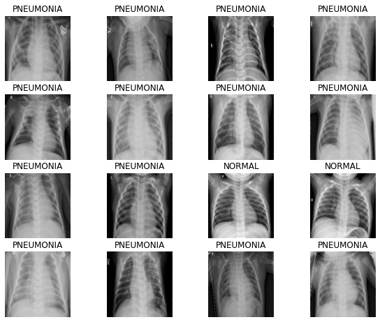
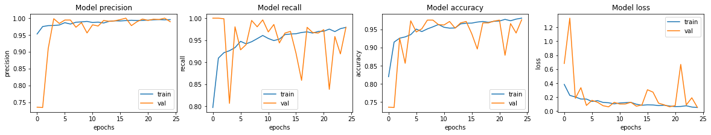

데이터 : 캐글의 Chest X-Ray Images

5,856 개의 X-Ray 이미지 (JPEG)와 2 개의 범주 (폐렴 / 정상)
전체 데이터의 크기는 총 1.2GB

해당 이미지는 중국 광저우에 있는 광저우 여성 및 어린이 병원의 1~5 세 소아 환자의 흉부 X선 영상입니다. 

## 1. 실험환경 Set-up


```python
import os, re
import random, math
import numpy as np
import tensorflow as tf
import matplotlib.pyplot as plt
```


```python
# 데이터 로드할 때 빠르게 로드할 수 있도록하는 설정 변수
AUTOTUNE = tf.data.experimental.AUTOTUNE
# X-RAY 이미지 사이즈 변수
IMAGE_SIZE = [180, 180]

# 데이터 경로 변수
ROOT_PATH = os.path.join(os.getenv('HOME'), 'aiffel')
TRAIN_PATH = ROOT_PATH + '/chest_xray/data/train/*/*'
VAL_PATH = ROOT_PATH + '/chest_xray/data/val/*/*'
TEST_PATH = ROOT_PATH + '/chest_xray/data/test/*/*'

print(ROOT_PATH)
```

    /aiffel/aiffel


```python
# 두 변수를 변경해가며 accuracy의 변화를 관찰하자
BATCH_SIZE = 16
EPOCHS = 25
```

## 2. 데이터 가져오기


```python
train_filenames = tf.io.gfile.glob(TRAIN_PATH)
test_filenames = tf.io.gfile.glob(TEST_PATH)
val_filenames = tf.io.gfile.glob(VAL_PATH)

print(len(train_filenames))
print(len(test_filenames))
print(len(val_filenames))

# 개수 비는 89%, 10.7%, 0.3%
```

    5216
    624
    16


val 개수가 너무 없기 때문에 train에서 val에 쓰일 데이터를 더 가져와보겠습니다.

train과 val에 있는 데이터를 모은 다음에 train : val를 80:20으로 분할하겠습니다.


```python
# train 데이터와 validation 데이터를 모두 filenames에 담습니다
filenames = tf.io.gfile.glob(TRAIN_PATH)
filenames.extend(tf.io.gfile.glob(VAL_PATH))

# 모아진 filenames를 8:2로 나눕니다
train_size = math.floor(len(filenames)*0.8)
random.seed(8)
random.shuffle(filenames)
train_filenames = filenames[:train_size]
val_filenames = filenames[train_size:]

print(len(train_filenames))
print(len(val_filenames))
```

    4185
    1047


이제 train은 4185개, test는 624개, val은 1047개가 되었다.


```python
# train 데이터 안에 정상 이미지와 폐렴 이미지 수를 보자
# 다행히도 파일 경로에 힌트가 있다. 예를 들어

print(f'Normal image path\n{filenames[0]}')
print(f'Pneumonia image path\n{filenames[2000]}')
print('***********************************************************')

# 이제 파일 경로에 NORMAL이 있는지 확인하면 정상 이미지를 셀 수 있습니다.
COUNT_NORMAL = len([filename for filename in train_filenames if "NORMAL" in filename])
print(f"Normal images count in training set: {COUNT_NORMAL}")

# 파일 경로에 PNEUMONIA이 있는지 확인하면 폐렴 이미지도 셀 수 있습니다.
COUNT_PNEUMONIA = len([filename for filename in train_filenames if "PNEUMONIA" in filename])
print(f"Pneumonia images count in training set: {COUNT_PNEUMONIA}")
```

    Normal image path
    /aiffel/aiffel/chest_xray/data/train/NORMAL/NORMAL2-IM-0627-0001.jpeg
    Pneumonia image path
    /aiffel/aiffel/chest_xray/data/train/PNEUMONIA/person569_bacteria_2360.jpeg
    ***********************************************************
    Normal images count in training set: 1341
    Pneumonia images count in training set: 3875


정상보다 폐렴 이미지 수가 3배 더 많이 있습니다.

CNN 모델의 경우 데이터가 클래스별 balance가 좋을수록 training을 잘 합니다. 데이터가 클래스 불균형(imbalance)한 것은 차후에 조정할 예정입니다. test와 val 데이터셋은 평가하기 위해서 사용되기 때문에 학습과 관련이 없으므로 imbalance한 데이터 셋이어도 문제없습니다.


tf.data 인스턴스를 만들어 봅시다. tf.data는 tensorflow에서 학습시킬 때, 배치처리 작업을 보다 효율적으로 할 수 있도록 해줍니다.


```python
train_list_ds = tf.data.Dataset.from_tensor_slices(train_filenames)
val_list_ds = tf.data.Dataset.from_tensor_slices(val_filenames)
```


```python
# Train 데이터셋, validation 데이터셋 개수 확인

TRAIN_IMG_COUNT = tf.data.experimental.cardinality(train_list_ds).numpy()
print(f"Training images count: {TRAIN_IMG_COUNT}")

VAL_IMG_COUNT = tf.data.experimental.cardinality(val_list_ds).numpy()
print(f"Validating images count: {VAL_IMG_COUNT}")
```

    Training images count: 4185
    Validating images count: 1047


현재 이미지에는 라벨 데이터가 따로 없습니다.
파일 경로에 'NORMAL'이나 'PNEUMONIA'가 포함되어 있기 때문에 이를 이용해서 라벨 데이터를 만들어 주는 함수를 만들어 보겠습니다.


```python
# 파일 경로의 끝에서 두번째 부분을 확인하면 양성과 음성을 구분할 수 있습니다
def get_label(file_path):
    parts = tf.strings.split(file_path, os.path.sep)
    return parts[-2] == "PNEUMONIA"   # 폐렴이면 양성(True), 노말이면 음성(False)
```


```python
# 제각각인 사이즈를 통일시키고, gpu 메모리를 효율적으로 사용하기 위해 
# 이미지 사이즈 줄이자
# 이미지를 알맞은 형식으로 바꿉니다.
def decode_img(img):
    img = tf.image.decode_jpeg(img, channels=3) # 이미지를 uint8 tensor로 수정
    img = tf.image.convert_image_dtype(img, tf.float32) # float32 타입으로 수정
    img = tf.image.resize(img, IMAGE_SIZE) # 이미지 사이즈를 IMAGE_SIZE로 수정
    return img

# 이미지 파일의 경로를 입력하면 이미지와 라벨을 읽어옵니다.
def process_path(file_path):
    label = get_label(file_path) # 라벨 가져오기
    img = tf.io.read_file(file_path) # 이미지 읽기
    img = decode_img(img) # 이미지를 알맞은 형식으로 수정
    return img, label
```

train 데이터 셋과 validation 데이터 셋을 만듭니다. num_parallel_calls 파라미터에서 set-up에서 초기화 한 AUTOTUNE을 이용하면 더욱 빠르게 데이터를 처리해 줍니다.


```python
train_ds = train_list_ds.map(process_path, num_parallel_calls=AUTOTUNE)
val_ds = val_list_ds.map(process_path, num_parallel_calls=AUTOTUNE)
```

이미지가 잘 리사이즈 되었는지, 그리고 라벨이 잘 들어가 있는지 확인해봅시다.


```python
for image, label in train_ds.take(1):
    print("Image shape: ", image.numpy().shape)
    print("Label: ", label.numpy())
    
# train_ds.take(1)은 하나의 데이터만 가져온다는 의미
```

    Image shape:  (180, 180, 3)
    Label:  False


```python
# 위에서 train과 validation 데이터셋을 만든 것처럼 test 데이터셋도 만들어 보겠습니다. 
# 그리고 데이터 개수도 확인해보겠습니다.

test_list_ds = tf.data.Dataset.list_files(TEST_PATH)
TEST_IMAGE_COUNT = tf.data.experimental.cardinality(test_list_ds).numpy()
test_ds = test_list_ds.map(process_path, num_parallel_calls=AUTOTUNE)
test_ds = test_ds.batch(BATCH_SIZE)

print(TEST_IMAGE_COUNT)
```

    624


```python
# Tensorflow에서는 tf.data 파이프라인을 사용해서
# 학습 데이터를 효율적으로 사용할 수 있도록 해줍니다.

# prepare_for_training() 함수 :
# 학습 데이터를 효율적으로 할 수 있도록 데이터를 변환 시켜줍니다.

def prepare_for_training(ds, shuffle_buffer_size=1000):
    ds = ds.shuffle(buffer_size=shuffle_buffer_size)
    # shuffle()을 사용하며 고정 크기 버퍼를 유지하고
    # 해당 버퍼에서 무작위로 균일하게 다음 요소를 선택합니다.
    
    ds = ds.repeat()
    # repeat()를 사용하면 epoch를 진행하면서 여러 번 데이터셋을 불러오게 되는데,
    # 이때 repeat()를 사용한 데이터셋의 경우 여러 번 데이터셋을 사용할 수 있게 해줍니다.
    # 예를 들어, 100개의 데이터를 10번 반복하면 1000개의 데이터가 필요하게 됩니다.
    # repeat()를 사용하면 자동으로 데이터를 맞춰줍니다.
    
    ds = ds.batch(BATCH_SIZE)
    # batch()를 사용하면 BATCH_SIZE에서 정한 만큼의 배치로 주어집니다.
    # 예를 들어, 100개의 데이터를 10개의 배치로 나누게 되면
    # 각 배치에는 10개의 데이터로 나뉘게 됩니다.
    
    ds = ds.prefetch(buffer_size=AUTOTUNE)
    # prefetch()를 사용하면 학습 데이터를 나눠서 읽어오기 때문에,
    # 첫 번째 데이터를 GPU에서 학습하는 동안
    # 두 번째 데이터를 CPU에서 준비할 수 있어 리소스의 유휴 상태를 줄일 수 있습니다.
    return ds

train_ds = prepare_for_training(train_ds)
val_ds = prepare_for_training(val_ds)
```

## 3. 데이터 시각화

데이터를 보기 위해 먼저, train에 있는 batch 중 첫 번째 배치를 추출합니다. 추출된 배치를 image와 label 데이터 셋으로 나눕니다. 이제 show_batch() 함수를 이용해서 결과 사진을 보겠습니다.


```python
# 이미지 배치를 입력하면 여러장의 이미지를 보여줍니다.
def show_batch(image_batch, label_batch):
    plt.figure(figsize=(10,10))
    for n in range(BATCH_SIZE):
        ax = plt.subplot(5,math.ceil(BATCH_SIZE/5),n+1)
        plt.imshow(image_batch[n])
        if label_batch[n]:
            plt.title("PNEUMONIA")
        else:
            plt.title("NORMAL")
        plt.axis("off")


image_batch, label_batch = next(iter(train_ds))
show_batch(image_batch.numpy(), label_batch.numpy())
```


    

    


## 4. CNN 모델링


```python
# Conv 2번 -> BatchNormalization을 통해 gradient vanishing or exploding을 해결
# -> 그리고 maxpooling

def conv_block(filters):
    block = tf.keras.Sequential([
        tf.keras.layers.SeparableConv2D(filters, 3, activation='relu', padding='same'),
        tf.keras.layers.SeparableConv2D(filters, 3, activation='relu', padding='same'),
        tf.keras.layers.BatchNormalization(),
        tf.keras.layers.MaxPool2D()
    ])
    
    return block
```


```python
def dense_block(units, dropout_rate):
    block = tf.keras.Sequential([
        tf.keras.layers.Dense(units, activation='relu'),
        tf.keras.layers.BatchNormalization(),
        tf.keras.layers.Dropout(dropout_rate)
    ])
    
    return block
```

방금 만들어진 모델에는 Batch Normalization과 Dropout이라는 두 가지 regularization 기법이 동시에 사용되고 있습니다.
일반적으로 이런 방법은 잘 사용되지 않거나, 금기시되기도 합니다.

그러나, 실용적으로는 두 방법을 같이 쓰는 것이 낫다고 보는 견해도 없는 것은 아닙니다. 예외적으로 동시에 사용하는 것이 성능 향상에 도움을 주는 경우가 실제로 있습니다. 아래 논문과 같이 두 방법을 같이 쓰는 것을 옹호하는 경우도 있습니다.


```python
def build_model():
    model = tf.keras.Sequential([
        tf.keras.Input(shape=(IMAGE_SIZE[0], IMAGE_SIZE[1], 3)),
        
        tf.keras.layers.Conv2D(16, 3, activation='relu', padding='same'),
        tf.keras.layers.Conv2D(16, 3, activation='relu', padding='same'),
        tf.keras.layers.MaxPool2D(),
        
        conv_block(32),
        conv_block(64),
        
        conv_block(128),
        tf.keras.layers.Dropout(0.2),
        
        conv_block(256),
        tf.keras.layers.Dropout(0.2),
        
        tf.keras.layers.Flatten(),
        dense_block(512, 0.7),
        dense_block(128, 0.5),
        dense_block(64, 0.3),
        
        tf.keras.layers.Dense(1, activation='sigmoid')
    ])
    
    return model
```

## 5. 데이터 imbalance 처리

'Normal'과 폐렴에서 'Pneumonia' 중에 'Pneumonia' 데이터가 많았다.

**Weight balancing**이라는 테크닉

Weight balancing 은 training set의 각 데이터에서 loss를 계산할 때 특정 클래스의 데이터에 더 큰 loss 값을 갖도록 가중치를 부여하는 방법입니다. Keras는 model.fit()을 호출할 때 파라미터로 넘기는 class_weight 에 이러한 클래스별 가중치를 세팅할 수 있도록 지원하고 있습니다. 


```python
weight_for_0 = (1 / COUNT_NORMAL)*(TRAIN_IMG_COUNT)/2.0 
# 'Normal' 이미지에 사용할 weight

weight_for_1 = (1 / COUNT_PNEUMONIA)*(TRAIN_IMG_COUNT)/2.0
# 'Pneumonia' 이미지에 사용할 weight
# 전체 데이터 건수에 반비례하도록 설정됩니다.

class_weight = {0: weight_for_0, 1: weight_for_1}

print('Weight for NORMAL: {:.2f}'.format(weight_for_0))
print('Weight for PNEUMONIA: {:.2f}'.format(weight_for_1))
```

    Weight for NORMAL: 1.95
    Weight for PNEUMONIA: 0.67


## 6. 모델 훈련


```python
# 이미지 훈련은 GPU를 사용할 것이기 때문에 먼저 GPU를 선택합니다. 
# 모델은 위에서 만들었던 모델 함수인 build_model()을 model에 선언합니다.

with tf.device('/GPU:0'):
    model = build_model()

    METRICS = [
        'accuracy',
        tf.keras.metrics.Precision(name='precision'),
        tf.keras.metrics.Recall(name='recall')
    ]
    
    model.compile(
        optimizer='adam',
        loss='binary_crossentropy', # 이미지의 라벨이 두 개밖에 없기 때문에
        metrics=METRICS # 성과에 대해서 측정하기 위한 metrics으로 'accuracy', 'precision', 'recall'을 사용합니다.
    )
```


```python
with tf.device('/GPU:0'):
    history = model.fit(
        train_ds,
        steps_per_epoch=TRAIN_IMG_COUNT // BATCH_SIZE,
        epochs=EPOCHS,
        validation_data=val_ds,
        validation_steps=VAL_IMG_COUNT // BATCH_SIZE,
        class_weight=class_weight,
    )
```

    Epoch 1/25
    261/261 [==============================] - 64s 164ms/step - loss: 0.5260 - accuracy: 0.7333 - precision: 0.9181 - recall: 0.7031 - val_loss: 0.6821 - val_accuracy: 0.7356 - val_precision: 0.7356 - val_recall: 1.0000
    Epoch 2/25
    261/261 [==============================] - 40s 153ms/step - loss: 0.2437 - accuracy: 0.9059 - precision: 0.9757 - recall: 0.8954 - val_loss: 1.3306 - val_accuracy: 0.7346 - val_precision: 0.7346 - val_recall: 1.0000
    Epoch 3/25
    261/261 [==============================] - 40s 153ms/step - loss: 0.2256 - accuracy: 0.9146 - precision: 0.9755 - recall: 0.9088 - val_loss: 0.1843 - val_accuracy: 0.9260 - val_precision: 0.9094 - val_recall: 0.9987
    Epoch 4/25
    261/261 [==============================] - 39s 150ms/step - loss: 0.1531 - accuracy: 0.9382 - precision: 0.9837 - recall: 0.9324 - val_loss: 0.3358 - val_accuracy: 0.8567 - val_precision: 0.9984 - val_recall: 0.8063
    Epoch 5/25
    261/261 [==============================] - 40s 151ms/step - loss: 0.1671 - accuracy: 0.9387 - precision: 0.9849 - recall: 0.9318 - val_loss: 0.0818 - val_accuracy: 0.9740 - val_precision: 0.9843 - val_recall: 0.9804
    Epoch 6/25
    261/261 [==============================] - 39s 151ms/step - loss: 0.1412 - accuracy: 0.9508 - precision: 0.9887 - recall: 0.9448 - val_loss: 0.1556 - val_accuracy: 0.9433 - val_precision: 0.9944 - val_recall: 0.9280
    Epoch 7/25
    261/261 [==============================] - 39s 151ms/step - loss: 0.1520 - accuracy: 0.9472 - precision: 0.9818 - recall: 0.9459 - val_loss: 0.1274 - val_accuracy: 0.9519 - val_precision: 0.9945 - val_recall: 0.9398
    Epoch 8/25
    261/261 [==============================] - 40s 152ms/step - loss: 0.1304 - accuracy: 0.9493 - precision: 0.9878 - recall: 0.9428 - val_loss: 0.0779 - val_accuracy: 0.9760 - val_precision: 0.9731 - val_recall: 0.9948
    Epoch 9/25
    261/261 [==============================] - 40s 152ms/step - loss: 0.1131 - accuracy: 0.9575 - precision: 0.9902 - recall: 0.9531 - val_loss: 0.0621 - val_accuracy: 0.9760 - val_precision: 0.9868 - val_recall: 0.9804
    Epoch 10/25
    261/261 [==============================] - 40s 152ms/step - loss: 0.1010 - accuracy: 0.9660 - precision: 0.9906 - recall: 0.9632 - val_loss: 0.1258 - val_accuracy: 0.9635 - val_precision: 0.9561 - val_recall: 0.9961
    Epoch 11/25
    261/261 [==============================] - 40s 153ms/step - loss: 0.1222 - accuracy: 0.9516 - precision: 0.9865 - recall: 0.9490 - val_loss: 0.1025 - val_accuracy: 0.9625 - val_precision: 0.9802 - val_recall: 0.9688
    Epoch 12/25
    261/261 [==============================] - 40s 152ms/step - loss: 0.1463 - accuracy: 0.9458 - precision: 0.9838 - recall: 0.9423 - val_loss: 0.1026 - val_accuracy: 0.9721 - val_precision: 0.9767 - val_recall: 0.9856
    Epoch 13/25
    261/261 [==============================] - 40s 152ms/step - loss: 0.1347 - accuracy: 0.9496 - precision: 0.9810 - recall: 0.9509 - val_loss: 0.1275 - val_accuracy: 0.9538 - val_precision: 0.9931 - val_recall: 0.9437
    Epoch 14/25
    261/261 [==============================] - 40s 153ms/step - loss: 0.1010 - accuracy: 0.9661 - precision: 0.9898 - recall: 0.9642 - val_loss: 0.0714 - val_accuracy: 0.9683 - val_precision: 0.9906 - val_recall: 0.9661
    Epoch 15/25
    261/261 [==============================] - 40s 152ms/step - loss: 0.0803 - accuracy: 0.9677 - precision: 0.9927 - recall: 0.9642 - val_loss: 0.0881 - val_accuracy: 0.9721 - val_precision: 0.9920 - val_recall: 0.9700
    Epoch 16/25
    261/261 [==============================] - 40s 152ms/step - loss: 0.0957 - accuracy: 0.9625 - precision: 0.9906 - recall: 0.9593 - val_loss: 0.3064 - val_accuracy: 0.9385 - val_precision: 0.9958 - val_recall: 0.9202
    Epoch 17/25
    261/261 [==============================] - 40s 152ms/step - loss: 0.0869 - accuracy: 0.9713 - precision: 0.9935 - recall: 0.9676 - val_loss: 0.2723 - val_accuracy: 0.8962 - val_precision: 1.0000 - val_recall: 0.8586
    Epoch 18/25
    261/261 [==============================] - 40s 152ms/step - loss: 0.0754 - accuracy: 0.9723 - precision: 0.9950 - recall: 0.9682 - val_loss: 0.1147 - val_accuracy: 0.9683 - val_precision: 0.9778 - val_recall: 0.9791
    Epoch 19/25
    261/261 [==============================] - 39s 151ms/step - loss: 0.1068 - accuracy: 0.9616 - precision: 0.9915 - recall: 0.9559 - val_loss: 0.0906 - val_accuracy: 0.9683 - val_precision: 0.9893 - val_recall: 0.9673
    Epoch 20/25
    261/261 [==============================] - 40s 153ms/step - loss: 0.0687 - accuracy: 0.9748 - precision: 0.9947 - recall: 0.9713 - val_loss: 0.0630 - val_accuracy: 0.9731 - val_precision: 0.9973 - val_recall: 0.9662
    Epoch 21/25
    261/261 [==============================] - 40s 152ms/step - loss: 0.0763 - accuracy: 0.9676 - precision: 0.9932 - recall: 0.9637 - val_loss: 0.0790 - val_accuracy: 0.9760 - val_precision: 0.9933 - val_recall: 0.9739
    Epoch 22/25
    261/261 [==============================] - 39s 151ms/step - loss: 0.0537 - accuracy: 0.9801 - precision: 0.9985 - recall: 0.9742 - val_loss: 0.6692 - val_accuracy: 0.8788 - val_precision: 0.9969 - val_recall: 0.8381
    Epoch 23/25
    261/261 [==============================] - 39s 151ms/step - loss: 0.0905 - accuracy: 0.9686 - precision: 0.9962 - recall: 0.9614 - val_loss: 0.0890 - val_accuracy: 0.9663 - val_precision: 0.9959 - val_recall: 0.9583
    Epoch 24/25
    261/261 [==============================] - 39s 151ms/step - loss: 0.0619 - accuracy: 0.9782 - precision: 0.9957 - recall: 0.9748 - val_loss: 0.1916 - val_accuracy: 0.9404 - val_precision: 1.0000 - val_recall: 0.9187
    Epoch 25/25
    261/261 [==============================] - 39s 151ms/step - loss: 0.0491 - accuracy: 0.9815 - precision: 0.9966 - recall: 0.9788 - val_loss: 0.0543 - val_accuracy: 0.9769 - val_precision: 0.9894 - val_recall: 0.9790


## 7. 결과 확인 시각화


```python
fig, ax = plt.subplots(1, 4, figsize=(20, 3))
ax = ax.ravel()

for i, met in enumerate(['precision', 'recall', 'accuracy', 'loss']):
    ax[i].plot(history.history[met])
    ax[i].plot(history.history['val_' + met])
    ax[i].set_title('Model {}'.format(met))
    ax[i].set_xlabel('epochs')
    ax[i].set_ylabel(met)
    ax[i].legend(['train', 'val'])
```


    

    


```python
# 테스트 데이터로 모델 평가를 해보겠습니다.

loss, accuracy, precision, recall = model.evaluate(test_ds)
print(f'Loss: {loss},\nAccuracy: {accuracy},\nPrecision: {precision},\nRecall: {recall}')
```

    39/39 [==============================] - 4s 92ms/step - loss: 1.2342 - accuracy: 0.7869 - precision: 0.7476 - recall: 0.9949
    Loss: 1.2341665029525757,
    Accuracy: 0.7868589758872986,
    Precision: 0.747591495513916,
    Recall: 0.9948717951774597


의료 데이터의 경우 구하기도 어렵고 구하더라도 데이터가 작은 경우가 많이 있습니다. 이런 문제를 해결하기 위해 Data augmentation 방법을 많이 시도합니다.
Data augmentation 은 각 데이터에 최적화된 방법을 찾기가 어렵고 제약사항이 많습니다. 그래서 의료분야에서는 기본적인 Data augmentation 방법들을 많이 사용합니다. 이미지 회전, 가우시안 노이즈 추가 방법 등을 많이 사용합니다. 특히 장기의 크기는 사람마다 거의 바뀌지 않습니다. 이런 특성을 이용한 방법이 노이즈 추가 방법입니다.

## 회고

1. batch size와 epoch를 늘려도 accuracy는 감소했다.
2. batch normalization을 제거했더니 accuracy가 감소했다.
3. dropout을 제거했더니 accuracy가 감소했다.
4. 노드에서 제시한 data augmentation(좌우반전)을 해보았는데 accuracy가 감소했다.
5. Convolution filter, 채널 개수, activation, 모델 구조를 조금씩 바꿔봤는데도 기존의 accuracy만한 결과를 얻지 못했다.

흐음...
