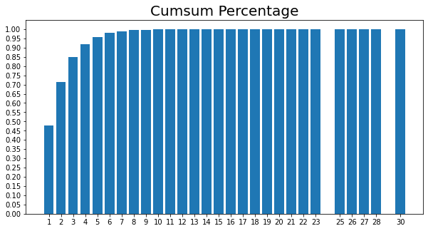
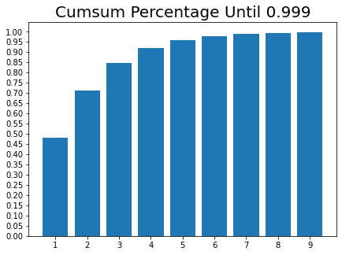

# 프로젝트 - Movielens 영화 SBR

Movielens 1M Dataset을 기반으로, Session based Recommendation 시스템 제작


```python
import datetime as dt
from pathlib import Path
import os

import numpy as np
import pandas as pd
import warnings
warnings.filterwarnings('ignore')

data_path = Path(os.getenv('HOME')+'/aiffel/yoochoose/data/') 
train_path = data_path / 'ratings.dat'

def load_data(data_path: Path, nrows=None):
    data = pd.read_csv(data_path, sep='::', header=None, usecols=[0, 1, 2, 3], dtype={0: np.int32, 1: np.int32, 2: np.int32}, nrows=nrows)
    data.columns = ['UserId', 'ItemId', 'Rating', 'Time']
    return data

data = load_data(train_path, None)
data.sort_values(['UserId', 'Time'], inplace=True)  # data를 id와 시간 순서로 정렬해줍니다.
data
```


<div>
<style scoped>
    .dataframe tbody tr th:only-of-type {
        vertical-align: middle;
    }

    .dataframe tbody tr th {
        vertical-align: top;
    }

    .dataframe thead th {
        text-align: right;
    }
</style>
<table border="1" class="dataframe">
  <thead>
    <tr style="text-align: right;">
      <th></th>
      <th>UserId</th>
      <th>ItemId</th>
      <th>Rating</th>
      <th>Time</th>
    </tr>
  </thead>
  <tbody>
    <tr>
      <th>31</th>
      <td>1</td>
      <td>3186</td>
      <td>4</td>
      <td>978300019</td>
    </tr>
    <tr>
      <th>22</th>
      <td>1</td>
      <td>1270</td>
      <td>5</td>
      <td>978300055</td>
    </tr>
    <tr>
      <th>27</th>
      <td>1</td>
      <td>1721</td>
      <td>4</td>
      <td>978300055</td>
    </tr>
    <tr>
      <th>37</th>
      <td>1</td>
      <td>1022</td>
      <td>5</td>
      <td>978300055</td>
    </tr>
    <tr>
      <th>24</th>
      <td>1</td>
      <td>2340</td>
      <td>3</td>
      <td>978300103</td>
    </tr>
    <tr>
      <th>...</th>
      <td>...</td>
      <td>...</td>
      <td>...</td>
      <td>...</td>
    </tr>
    <tr>
      <th>1000019</th>
      <td>6040</td>
      <td>2917</td>
      <td>4</td>
      <td>997454429</td>
    </tr>
    <tr>
      <th>999988</th>
      <td>6040</td>
      <td>1921</td>
      <td>4</td>
      <td>997454464</td>
    </tr>
    <tr>
      <th>1000172</th>
      <td>6040</td>
      <td>1784</td>
      <td>3</td>
      <td>997454464</td>
    </tr>
    <tr>
      <th>1000167</th>
      <td>6040</td>
      <td>161</td>
      <td>3</td>
      <td>997454486</td>
    </tr>
    <tr>
      <th>1000042</th>
      <td>6040</td>
      <td>1221</td>
      <td>4</td>
      <td>998315055</td>
    </tr>
  </tbody>
</table>
<p>1000209 rows × 4 columns</p>
</div>


```python
data['UserId'].nunique(), data['ItemId'].nunique()

# 유저의 숫자가 6,040개, 아이템 숫자는 3,760개
```


    (6040, 3706)


## 1. 데이터의 전처리

### 1-1. User ID 처리

- 이 데이터셋은 명확한 1회 세션의 session id를 포함하고 있지 않다.
- Session ID 대신 User ID 항목이 들어갔다.
- Session의 단위를 UserId로 하면 시간을 구분할 수 없고, Time으로 하면 유저를 구분할 수 없는 문제가 생긴다. 여러 유저가 여러 번 접속하여 평가를 남긴 기록이므로 UserId와 Time을 모두 고려했고, 고유한 (UserId, Time)의 쌍을 하나의 Session으로 정의했다. (고은채 퍼실님 github 참고)


```python
# UserId와 Time을 기준으로 새로운 데이터프레임 생성
df = data.groupby(['UserId', 'Time'])['ItemId'].count().reset_index()
df.reset_index(inplace=True)
df.head(20)
```


<div>
<style scoped>
    .dataframe tbody tr th:only-of-type {
        vertical-align: middle;
    }

    .dataframe tbody tr th {
        vertical-align: top;
    }

    .dataframe thead th {
        text-align: right;
    }
</style>
<table border="1" class="dataframe">
  <thead>
    <tr style="text-align: right;">
      <th></th>
      <th>index</th>
      <th>UserId</th>
      <th>Time</th>
      <th>ItemId</th>
    </tr>
  </thead>
  <tbody>
    <tr>
      <th>0</th>
      <td>0</td>
      <td>1</td>
      <td>978300019</td>
      <td>1</td>
    </tr>
    <tr>
      <th>1</th>
      <td>1</td>
      <td>1</td>
      <td>978300055</td>
      <td>3</td>
    </tr>
    <tr>
      <th>2</th>
      <td>2</td>
      <td>1</td>
      <td>978300103</td>
      <td>1</td>
    </tr>
    <tr>
      <th>3</th>
      <td>3</td>
      <td>1</td>
      <td>978300172</td>
      <td>1</td>
    </tr>
    <tr>
      <th>4</th>
      <td>4</td>
      <td>1</td>
      <td>978300275</td>
      <td>1</td>
    </tr>
    <tr>
      <th>5</th>
      <td>5</td>
      <td>1</td>
      <td>978300719</td>
      <td>2</td>
    </tr>
    <tr>
      <th>6</th>
      <td>6</td>
      <td>1</td>
      <td>978300760</td>
      <td>3</td>
    </tr>
    <tr>
      <th>7</th>
      <td>7</td>
      <td>1</td>
      <td>978301368</td>
      <td>1</td>
    </tr>
    <tr>
      <th>8</th>
      <td>8</td>
      <td>1</td>
      <td>978301398</td>
      <td>1</td>
    </tr>
    <tr>
      <th>9</th>
      <td>9</td>
      <td>1</td>
      <td>978301570</td>
      <td>1</td>
    </tr>
    <tr>
      <th>10</th>
      <td>10</td>
      <td>1</td>
      <td>978301590</td>
      <td>1</td>
    </tr>
    <tr>
      <th>11</th>
      <td>11</td>
      <td>1</td>
      <td>978301619</td>
      <td>1</td>
    </tr>
    <tr>
      <th>12</th>
      <td>12</td>
      <td>1</td>
      <td>978301713</td>
      <td>1</td>
    </tr>
    <tr>
      <th>13</th>
      <td>13</td>
      <td>1</td>
      <td>978301752</td>
      <td>1</td>
    </tr>
    <tr>
      <th>14</th>
      <td>14</td>
      <td>1</td>
      <td>978301753</td>
      <td>2</td>
    </tr>
    <tr>
      <th>15</th>
      <td>15</td>
      <td>1</td>
      <td>978301777</td>
      <td>3</td>
    </tr>
    <tr>
      <th>16</th>
      <td>16</td>
      <td>1</td>
      <td>978301953</td>
      <td>1</td>
    </tr>
    <tr>
      <th>17</th>
      <td>17</td>
      <td>1</td>
      <td>978301968</td>
      <td>1</td>
    </tr>
    <tr>
      <th>18</th>
      <td>18</td>
      <td>1</td>
      <td>978302039</td>
      <td>2</td>
    </tr>
    <tr>
      <th>19</th>
      <td>19</td>
      <td>1</td>
      <td>978302091</td>
      <td>2</td>
    </tr>
  </tbody>
</table>
</div>


```python
# SessionId 컬럼 추가
data = pd.merge(data, df, on=['UserId', 'Time'])
data.drop(columns='ItemId_y', inplace=True)
data.columns = ['UserId', 'ItemId', 'Rating', 'Time', 'SessionId']
data
```


<div>
<style scoped>
    .dataframe tbody tr th:only-of-type {
        vertical-align: middle;
    }

    .dataframe tbody tr th {
        vertical-align: top;
    }

    .dataframe thead th {
        text-align: right;
    }
</style>
<table border="1" class="dataframe">
  <thead>
    <tr style="text-align: right;">
      <th></th>
      <th>UserId</th>
      <th>ItemId</th>
      <th>Rating</th>
      <th>Time</th>
      <th>SessionId</th>
    </tr>
  </thead>
  <tbody>
    <tr>
      <th>0</th>
      <td>1</td>
      <td>3186</td>
      <td>4</td>
      <td>978300019</td>
      <td>0</td>
    </tr>
    <tr>
      <th>1</th>
      <td>1</td>
      <td>1270</td>
      <td>5</td>
      <td>978300055</td>
      <td>1</td>
    </tr>
    <tr>
      <th>2</th>
      <td>1</td>
      <td>1721</td>
      <td>4</td>
      <td>978300055</td>
      <td>1</td>
    </tr>
    <tr>
      <th>3</th>
      <td>1</td>
      <td>1022</td>
      <td>5</td>
      <td>978300055</td>
      <td>1</td>
    </tr>
    <tr>
      <th>4</th>
      <td>1</td>
      <td>2340</td>
      <td>3</td>
      <td>978300103</td>
      <td>2</td>
    </tr>
    <tr>
      <th>...</th>
      <td>...</td>
      <td>...</td>
      <td>...</td>
      <td>...</td>
      <td>...</td>
    </tr>
    <tr>
      <th>1000204</th>
      <td>6040</td>
      <td>2917</td>
      <td>4</td>
      <td>997454429</td>
      <td>471159</td>
    </tr>
    <tr>
      <th>1000205</th>
      <td>6040</td>
      <td>1921</td>
      <td>4</td>
      <td>997454464</td>
      <td>471160</td>
    </tr>
    <tr>
      <th>1000206</th>
      <td>6040</td>
      <td>1784</td>
      <td>3</td>
      <td>997454464</td>
      <td>471160</td>
    </tr>
    <tr>
      <th>1000207</th>
      <td>6040</td>
      <td>161</td>
      <td>3</td>
      <td>997454486</td>
      <td>471161</td>
    </tr>
    <tr>
      <th>1000208</th>
      <td>6040</td>
      <td>1221</td>
      <td>4</td>
      <td>998315055</td>
      <td>471162</td>
    </tr>
  </tbody>
</table>
<p>1000209 rows × 5 columns</p>
</div>


### 1-2. Session Length


```python
# 각 session id별로 대략 몇 개의 영화를 시청했는지

session_length = data.groupby('SessionId').size()
session_length
```


    SessionId
    0         1
    1         3
    2         1
    3         1
    4         1
             ..
    471158    1
    471159    1
    471160    2
    471161    1
    471162    1
    Length: 471163, dtype: int64


```python
print('median :',session_length.median(), '&', 'mean :',session_length.mean())
print('*******************************************************************')
print('min :',session_length.min(), '&', 'max :',session_length.max())
print('*******************************************************************')
print(session_length.quantile(0.999))
```

    median : 2.0 & mean : 2.1228513274599234
    *******************************************************************
    min : 1 & max : 30
    *******************************************************************
    10.0


```python
# max 30은 뭔가 이상하다. 체크해보자

long_session = session_length[session_length==30].index[0]
data[data['SessionId']==long_session]

# 데이터를 보니 동일한 시간에 다량의 영화가 rating되어있다.
# 어떻게 하면 좋을까? 일단 시각화 해보자
```


<div>
<style scoped>
    .dataframe tbody tr th:only-of-type {
        vertical-align: middle;
    }

    .dataframe tbody tr th {
        vertical-align: top;
    }

    .dataframe thead th {
        text-align: right;
    }
</style>
<table border="1" class="dataframe">
  <thead>
    <tr style="text-align: right;">
      <th></th>
      <th>UserId</th>
      <th>ItemId</th>
      <th>Rating</th>
      <th>Time</th>
      <th>SessionId</th>
    </tr>
  </thead>
  <tbody>
    <tr>
      <th>112347</th>
      <td>731</td>
      <td>3044</td>
      <td>4</td>
      <td>975528402</td>
      <td>55117</td>
    </tr>
    <tr>
      <th>112348</th>
      <td>731</td>
      <td>1455</td>
      <td>3</td>
      <td>975528402</td>
      <td>55117</td>
    </tr>
    <tr>
      <th>112349</th>
      <td>731</td>
      <td>1639</td>
      <td>5</td>
      <td>975528402</td>
      <td>55117</td>
    </tr>
    <tr>
      <th>112350</th>
      <td>731</td>
      <td>3244</td>
      <td>4</td>
      <td>975528402</td>
      <td>55117</td>
    </tr>
    <tr>
      <th>112351</th>
      <td>731</td>
      <td>1656</td>
      <td>2</td>
      <td>975528402</td>
      <td>55117</td>
    </tr>
    <tr>
      <th>112352</th>
      <td>731</td>
      <td>3426</td>
      <td>4</td>
      <td>975528402</td>
      <td>55117</td>
    </tr>
    <tr>
      <th>112353</th>
      <td>731</td>
      <td>1829</td>
      <td>2</td>
      <td>975528402</td>
      <td>55117</td>
    </tr>
    <tr>
      <th>112354</th>
      <td>731</td>
      <td>2675</td>
      <td>4</td>
      <td>975528402</td>
      <td>55117</td>
    </tr>
    <tr>
      <th>112355</th>
      <td>731</td>
      <td>802</td>
      <td>3</td>
      <td>975528402</td>
      <td>55117</td>
    </tr>
    <tr>
      <th>112356</th>
      <td>731</td>
      <td>803</td>
      <td>5</td>
      <td>975528402</td>
      <td>55117</td>
    </tr>
    <tr>
      <th>112357</th>
      <td>731</td>
      <td>1357</td>
      <td>4</td>
      <td>975528402</td>
      <td>55117</td>
    </tr>
    <tr>
      <th>112358</th>
      <td>731</td>
      <td>838</td>
      <td>5</td>
      <td>975528402</td>
      <td>55117</td>
    </tr>
    <tr>
      <th>112359</th>
      <td>731</td>
      <td>2171</td>
      <td>4</td>
      <td>975528402</td>
      <td>55117</td>
    </tr>
    <tr>
      <th>112360</th>
      <td>731</td>
      <td>852</td>
      <td>2</td>
      <td>975528402</td>
      <td>55117</td>
    </tr>
    <tr>
      <th>112361</th>
      <td>731</td>
      <td>2331</td>
      <td>4</td>
      <td>975528402</td>
      <td>55117</td>
    </tr>
    <tr>
      <th>112362</th>
      <td>731</td>
      <td>1535</td>
      <td>3</td>
      <td>975528402</td>
      <td>55117</td>
    </tr>
    <tr>
      <th>112363</th>
      <td>731</td>
      <td>1393</td>
      <td>2</td>
      <td>975528402</td>
      <td>55117</td>
    </tr>
    <tr>
      <th>112364</th>
      <td>731</td>
      <td>1564</td>
      <td>4</td>
      <td>975528402</td>
      <td>55117</td>
    </tr>
    <tr>
      <th>112365</th>
      <td>731</td>
      <td>892</td>
      <td>5</td>
      <td>975528402</td>
      <td>55117</td>
    </tr>
    <tr>
      <th>112366</th>
      <td>731</td>
      <td>151</td>
      <td>3</td>
      <td>975528402</td>
      <td>55117</td>
    </tr>
    <tr>
      <th>112367</th>
      <td>731</td>
      <td>2715</td>
      <td>2</td>
      <td>975528402</td>
      <td>55117</td>
    </tr>
    <tr>
      <th>112368</th>
      <td>731</td>
      <td>2570</td>
      <td>2</td>
      <td>975528402</td>
      <td>55117</td>
    </tr>
    <tr>
      <th>112369</th>
      <td>731</td>
      <td>39</td>
      <td>5</td>
      <td>975528402</td>
      <td>55117</td>
    </tr>
    <tr>
      <th>112370</th>
      <td>731</td>
      <td>2919</td>
      <td>4</td>
      <td>975528402</td>
      <td>55117</td>
    </tr>
    <tr>
      <th>112371</th>
      <td>731</td>
      <td>49</td>
      <td>4</td>
      <td>975528402</td>
      <td>55117</td>
    </tr>
    <tr>
      <th>112372</th>
      <td>731</td>
      <td>58</td>
      <td>4</td>
      <td>975528402</td>
      <td>55117</td>
    </tr>
    <tr>
      <th>112373</th>
      <td>731</td>
      <td>1210</td>
      <td>3</td>
      <td>975528402</td>
      <td>55117</td>
    </tr>
    <tr>
      <th>112374</th>
      <td>731</td>
      <td>85</td>
      <td>4</td>
      <td>975528402</td>
      <td>55117</td>
    </tr>
    <tr>
      <th>112375</th>
      <td>731</td>
      <td>2969</td>
      <td>4</td>
      <td>975528402</td>
      <td>55117</td>
    </tr>
    <tr>
      <th>112376</th>
      <td>731</td>
      <td>1244</td>
      <td>5</td>
      <td>975528402</td>
      <td>55117</td>
    </tr>
  </tbody>
</table>
</div>


```python
length_count = session_length.groupby(session_length).size()
length_percent_cumsum = length_count.cumsum() / length_count.sum()
length_percent_cumsum_999 = length_percent_cumsum[length_percent_cumsum < 0.999]


import matplotlib.pyplot as plt

plt.figure(figsize=(10, 5))
plt.bar(x=length_percent_cumsum.index,
        height=length_percent_cumsum)
plt.xticks(length_percent_cumsum.index)
plt.yticks(np.arange(0, 1.01, 0.05))
plt.title('Cumsum Percentage', size=20)
plt.show()
```


    

    


```python
plt.figure(figsize=(7, 5))
plt.bar(x=length_percent_cumsum_999.index,
        height=length_percent_cumsum_999)
plt.xticks(length_percent_cumsum_999.index)
plt.yticks(np.arange(0, 1.01, 0.05))
plt.title('Cumsum Percentage Until 0.999', size=20)
plt.show()
```


    

    


### 1-3. Session Time

Time 항목에는 UTC time 가 포함되어, 1970년 1월 1일부터 경과된 초단위 시간이 기재되어 있습니다.


```python
oldest, latest = data['Time'].min(), data['Time'].max()
print(oldest) 
print(latest)
```

    956703932
    1046454590


```python
print(dt.datetime.utcfromtimestamp(oldest).strftime('%Y-%m-%d %H:%M:%S'))
print(dt.datetime.utcfromtimestamp(latest).strftime('%Y-%m-%d %H:%M:%S'))
```

    2000-04-25 23:05:32
    2003-02-28 17:49:50


```python
print(len(data[data['Time'] > latest - (86400*365*3)]))  # 최근 3년 데이터 수
print(len(data[data['Time'] > latest - (86400*365*2)]))  # 최근 2년 데이터 수
print(len(data[data['Time'] > latest - (86400*365*1)]))  # 최근 1년 데이터 수
```

    1000209
    69349
    21704


```python
years_ago = latest - (86400*365*3)   # 최종 날짜로부터 3년 이전 날짜를 구한다.  
data = data[data['Time'] > years_ago]   # 방금 구한 날짜 이후의 데이터만 모은다. 
data
```


<div>
<style scoped>
    .dataframe tbody tr th:only-of-type {
        vertical-align: middle;
    }

    .dataframe tbody tr th {
        vertical-align: top;
    }

    .dataframe thead th {
        text-align: right;
    }
</style>
<table border="1" class="dataframe">
  <thead>
    <tr style="text-align: right;">
      <th></th>
      <th>UserId</th>
      <th>ItemId</th>
      <th>Rating</th>
      <th>Time</th>
      <th>SessionId</th>
    </tr>
  </thead>
  <tbody>
    <tr>
      <th>0</th>
      <td>1</td>
      <td>3186</td>
      <td>4</td>
      <td>978300019</td>
      <td>0</td>
    </tr>
    <tr>
      <th>1</th>
      <td>1</td>
      <td>1270</td>
      <td>5</td>
      <td>978300055</td>
      <td>1</td>
    </tr>
    <tr>
      <th>2</th>
      <td>1</td>
      <td>1721</td>
      <td>4</td>
      <td>978300055</td>
      <td>1</td>
    </tr>
    <tr>
      <th>3</th>
      <td>1</td>
      <td>1022</td>
      <td>5</td>
      <td>978300055</td>
      <td>1</td>
    </tr>
    <tr>
      <th>4</th>
      <td>1</td>
      <td>2340</td>
      <td>3</td>
      <td>978300103</td>
      <td>2</td>
    </tr>
    <tr>
      <th>...</th>
      <td>...</td>
      <td>...</td>
      <td>...</td>
      <td>...</td>
      <td>...</td>
    </tr>
    <tr>
      <th>1000204</th>
      <td>6040</td>
      <td>2917</td>
      <td>4</td>
      <td>997454429</td>
      <td>471159</td>
    </tr>
    <tr>
      <th>1000205</th>
      <td>6040</td>
      <td>1921</td>
      <td>4</td>
      <td>997454464</td>
      <td>471160</td>
    </tr>
    <tr>
      <th>1000206</th>
      <td>6040</td>
      <td>1784</td>
      <td>3</td>
      <td>997454464</td>
      <td>471160</td>
    </tr>
    <tr>
      <th>1000207</th>
      <td>6040</td>
      <td>161</td>
      <td>3</td>
      <td>997454486</td>
      <td>471161</td>
    </tr>
    <tr>
      <th>1000208</th>
      <td>6040</td>
      <td>1221</td>
      <td>4</td>
      <td>998315055</td>
      <td>471162</td>
    </tr>
  </tbody>
</table>
<p>1000209 rows × 5 columns</p>
</div>


### 1-4. Data Cleansing

Rating 정보가 포함되어 있습니다. 이전 실습내역에서는 이런 항목이 포함되어 있지 않았으므로, 무시하고 제외할 수 있습니다. 하지만, 직전에 봤던 영화가 맘에 들었는지 여부가 비슷한 영화를 더 고르게 하는 것과 상관이 있을 수도 있습니다. 아울러, Rating이 낮은 데이터를 어떻게 처리할지도 고민해야 합니다.


```python
print(len(data[data['Rating'] >= 1]))
print(len(data[data['Rating'] >= 2]))
print(len(data[data['Rating'] >= 3]))
```

    1000209
    944035
    836478


```python
# data = data[data['Rating'] >= 2]
data = data[['SessionId', 'UserId', 'Time', 'ItemId', 'Rating']]
data
```


<div>
<style scoped>
    .dataframe tbody tr th:only-of-type {
        vertical-align: middle;
    }

    .dataframe tbody tr th {
        vertical-align: top;
    }

    .dataframe thead th {
        text-align: right;
    }
</style>
<table border="1" class="dataframe">
  <thead>
    <tr style="text-align: right;">
      <th></th>
      <th>SessionId</th>
      <th>UserId</th>
      <th>Time</th>
      <th>ItemId</th>
      <th>Rating</th>
    </tr>
  </thead>
  <tbody>
    <tr>
      <th>0</th>
      <td>0</td>
      <td>1</td>
      <td>978300019</td>
      <td>3186</td>
      <td>4</td>
    </tr>
    <tr>
      <th>1</th>
      <td>1</td>
      <td>1</td>
      <td>978300055</td>
      <td>1270</td>
      <td>5</td>
    </tr>
    <tr>
      <th>2</th>
      <td>1</td>
      <td>1</td>
      <td>978300055</td>
      <td>1721</td>
      <td>4</td>
    </tr>
    <tr>
      <th>3</th>
      <td>1</td>
      <td>1</td>
      <td>978300055</td>
      <td>1022</td>
      <td>5</td>
    </tr>
    <tr>
      <th>4</th>
      <td>2</td>
      <td>1</td>
      <td>978300103</td>
      <td>2340</td>
      <td>3</td>
    </tr>
    <tr>
      <th>...</th>
      <td>...</td>
      <td>...</td>
      <td>...</td>
      <td>...</td>
      <td>...</td>
    </tr>
    <tr>
      <th>1000204</th>
      <td>471159</td>
      <td>6040</td>
      <td>997454429</td>
      <td>2917</td>
      <td>4</td>
    </tr>
    <tr>
      <th>1000205</th>
      <td>471160</td>
      <td>6040</td>
      <td>997454464</td>
      <td>1921</td>
      <td>4</td>
    </tr>
    <tr>
      <th>1000206</th>
      <td>471160</td>
      <td>6040</td>
      <td>997454464</td>
      <td>1784</td>
      <td>3</td>
    </tr>
    <tr>
      <th>1000207</th>
      <td>471161</td>
      <td>6040</td>
      <td>997454486</td>
      <td>161</td>
      <td>3</td>
    </tr>
    <tr>
      <th>1000208</th>
      <td>471162</td>
      <td>6040</td>
      <td>998315055</td>
      <td>1221</td>
      <td>4</td>
    </tr>
  </tbody>
</table>
<p>1000209 rows × 5 columns</p>
</div>


### 1-5. Train/ Valid/ Test split


```python
def split_by_date(data: pd.DataFrame, n_days: int):
    final_time = data['Time'].max()
    session_last_time = data.groupby('SessionId')['Time'].max()
    session_in_train = session_last_time[session_last_time < final_time - (86400*n_days)].index
    session_in_test = session_last_time[session_last_time >= final_time - (86400*n_days)].index

    before_date = data[data['SessionId'].isin(session_in_train)]
    after_date = data[data['SessionId'].isin(session_in_test)]
    after_date = after_date[after_date['ItemId'].isin(before_date['ItemId'])]
    return before_date, after_date
```


```python
tr, test = split_by_date(data, n_days=100)
tr, val = split_by_date(tr, n_days=100)
```


```python
# data에 대한 정보를 살펴봅니다.
def stats_info(data: pd.DataFrame, status: str):
    first_time = dt.datetime.utcfromtimestamp(data["Time"].min()).strftime('%Y-%m-%d %H:%M:%S')
    last_time = dt.datetime.utcfromtimestamp(data["Time"].max()).strftime('%Y-%m-%d %H:%M:%S')
    print(f'* {status} Set Stats Info\n'
          f'\t Events: {len(data)}\n'
          f'\t Sessions: {data["UserId"].nunique()}\n'
          f'\t Items: {data["ItemId"].nunique()}\n'
          f'\t First Time : {first_time}\n'
          f'\t Last Time : {last_time}\n')
```


```python
stats_info(tr, 'train')
stats_info(val, 'valid')
stats_info(test, 'test')
```

    * train Set Stats Info
    	 Events: 989923
    	 Sessions: 6039
    	 Items: 3702
    	 First Time : 2000-04-25 23:05:32
    	 Last Time : 2002-08-12 13:53:29
    
    * valid Set Stats Info
    	 Events: 5209
    	 Sessions: 245
    	 Items: 1949
    	 First Time : 2002-08-13 00:40:06
    	 Last Time : 2002-11-20 16:38:40
    
    * test Set Stats Info
    	 Events: 5073
    	 Sessions: 254
    	 Items: 1893
    	 First Time : 2002-11-20 20:30:02
    	 Last Time : 2003-02-28 17:49:50
    


```python
# train set에 없는 아이템이 val, test기간에 생길 수 있으므로 train data를 기준으로 인덱싱합니다.
id2idx = {item_id : index for index, item_id in enumerate(tr['ItemId'].unique())}

def indexing(df, id2idx):
    df['item_idx'] = df['ItemId'].map(lambda x: id2idx.get(x, -1))  # id2idx에 없는 아이템은 모르는 값(-1) 처리 해줍니다.
    return df

tr = indexing(tr, id2idx)
val = indexing(val, id2idx)
test = indexing(test, id2idx)
```


```python
# 전처리가 완료된 데이터를 저장합니다.
save_path = data_path / 'processed'
save_path.mkdir(parents=True, exist_ok=True)

tr.to_pickle(save_path / 'train.pkl')
val.to_pickle(save_path / 'valid.pkl')
test.to_pickle(save_path / 'test.pkl')
```

## 2. Data Pipeline


```python
class SessionDataset:
    """Credit to yhs-968/pyGRU4REC."""

    def __init__(self, data):
        self.df = data
        self.click_offsets = self.get_click_offsets()
        self.session_idx = np.arange(self.df['SessionId'].nunique())  # indexing to SessionId

    def get_click_offsets(self):
        """
        Return the indexes of the first click of each session IDs,
        """
        offsets = np.zeros(self.df['SessionId'].nunique() + 1, dtype=np.int32)
        offsets[1:] = self.df.groupby('SessionId').size().cumsum()
        return offsets
```


```python
tr_dataset = SessionDataset(tr)
tr_dataset.df.head(10)
```


<div>
<style scoped>
    .dataframe tbody tr th:only-of-type {
        vertical-align: middle;
    }

    .dataframe tbody tr th {
        vertical-align: top;
    }

    .dataframe thead th {
        text-align: right;
    }
</style>
<table border="1" class="dataframe">
  <thead>
    <tr style="text-align: right;">
      <th></th>
      <th>SessionId</th>
      <th>UserId</th>
      <th>Time</th>
      <th>ItemId</th>
      <th>Rating</th>
      <th>item_idx</th>
    </tr>
  </thead>
  <tbody>
    <tr>
      <th>0</th>
      <td>0</td>
      <td>1</td>
      <td>978300019</td>
      <td>3186</td>
      <td>4</td>
      <td>0</td>
    </tr>
    <tr>
      <th>1</th>
      <td>1</td>
      <td>1</td>
      <td>978300055</td>
      <td>1270</td>
      <td>5</td>
      <td>1</td>
    </tr>
    <tr>
      <th>2</th>
      <td>1</td>
      <td>1</td>
      <td>978300055</td>
      <td>1721</td>
      <td>4</td>
      <td>2</td>
    </tr>
    <tr>
      <th>3</th>
      <td>1</td>
      <td>1</td>
      <td>978300055</td>
      <td>1022</td>
      <td>5</td>
      <td>3</td>
    </tr>
    <tr>
      <th>4</th>
      <td>2</td>
      <td>1</td>
      <td>978300103</td>
      <td>2340</td>
      <td>3</td>
      <td>4</td>
    </tr>
    <tr>
      <th>5</th>
      <td>3</td>
      <td>1</td>
      <td>978300172</td>
      <td>1836</td>
      <td>5</td>
      <td>5</td>
    </tr>
    <tr>
      <th>6</th>
      <td>4</td>
      <td>1</td>
      <td>978300275</td>
      <td>3408</td>
      <td>4</td>
      <td>6</td>
    </tr>
    <tr>
      <th>7</th>
      <td>5</td>
      <td>1</td>
      <td>978300719</td>
      <td>2804</td>
      <td>5</td>
      <td>7</td>
    </tr>
    <tr>
      <th>8</th>
      <td>5</td>
      <td>1</td>
      <td>978300719</td>
      <td>1207</td>
      <td>4</td>
      <td>8</td>
    </tr>
    <tr>
      <th>9</th>
      <td>6</td>
      <td>1</td>
      <td>978300760</td>
      <td>1193</td>
      <td>5</td>
      <td>9</td>
    </tr>
  </tbody>
</table>
</div>


```python
tr_dataset.click_offsets
```


    array([     0,      1,      4, ..., 989921, 989922, 989923], dtype=int32)


```python
tr_dataset.session_idx
```


    array([     0,      1,      2, ..., 463928, 463929, 463930])


```python
class SessionDataLoader:
    """Credit to yhs-968/pyGRU4REC."""

    def __init__(self, dataset: SessionDataset, batch_size=50):
        self.dataset = dataset
        self.batch_size = batch_size

    def __iter__(self):
        """ Returns the iterator for producing session-parallel training mini-batches.
        Yields:
            input (B,):  Item indices that will be encoded as one-hot vectors later.
            target (B,): a Variable that stores the target item indices
            masks: Numpy array indicating the positions of the sessions to be terminated
        """

        start, end, mask, last_session, finished = self.initialize()  # initialize 메소드에서 확인해주세요.
        """
        start : Index Where Session Start
        end : Index Where Session End
        mask : indicator for the sessions to be terminated
        """

        while not finished:
            min_len = (end - start).min() - 1  # Shortest Length Among Sessions
            for i in range(min_len):
                # Build inputs & targets
                inp = self.dataset.df['item_idx'].values[start + i]
                target = self.dataset.df['item_idx'].values[start + i + 1]
                yield inp, target, mask

            start, end, mask, last_session, finished = self.update_status(start, end, min_len, last_session, finished)

    def initialize(self):
        first_iters = np.arange(self.batch_size)    # 첫 배치에 사용할 세션 Index를 가져옵니다.
        last_session = self.batch_size - 1    # 마지막으로 다루고 있는 세션 Index를 저장해둡니다.
        start = self.dataset.click_offsets[self.dataset.session_idx[first_iters]]       # data 상에서 session이 시작된 위치를 가져옵니다.
        end = self.dataset.click_offsets[self.dataset.session_idx[first_iters] + 1]  # session이 끝난 위치 바로 다음 위치를 가져옵니다.
        mask = np.array([])   # session의 모든 아이템을 다 돌은 경우 mask에 추가해줄 것입니다.
        finished = False         # data를 전부 돌았는지 기록하기 위한 변수입니다.
        return start, end, mask, last_session, finished

    def update_status(self, start: np.ndarray, end: np.ndarray, min_len: int, last_session: int, finished: bool):  
        # 다음 배치 데이터를 생성하기 위해 상태를 update합니다.
        
        start += min_len   # __iter__에서 min_len 만큼 for문을 돌았으므로 start를 min_len 만큼 더해줍니다.
        mask = np.arange(self.batch_size)[(end - start) == 1]  
        # end는 다음 세션이 시작되는 위치인데 start와 한 칸 차이난다는 것은 session이 끝났다는 뜻입니다. mask에 기록해줍니다.

        for i, idx in enumerate(mask, start=1):  # mask에 추가된 세션 개수만큼 새로운 세션을 돌것입니다.
            new_session = last_session + i  
            if new_session > self.dataset.session_idx[-1]:  # 만약 새로운 세션이 마지막 세션 index보다 크다면 모든 학습데이터를 돈 것입니다.
                finished = True
                break
            # update the next starting/ending point
            start[idx] = self.dataset.click_offsets[self.dataset.session_idx[new_session]]     # 종료된 세션 대신 새로운 세션의 시작점을 기록합니다.
            end[idx] = self.dataset.click_offsets[self.dataset.session_idx[new_session] + 1]

        last_session += len(mask)  # 마지막 세션의 위치를 기록해둡니다.
        return start, end, mask, last_session, finished
```


```python
tr_data_loader = SessionDataLoader(tr_dataset, batch_size=4)
tr_dataset.df.head(15)
```


<div>
<style scoped>
    .dataframe tbody tr th:only-of-type {
        vertical-align: middle;
    }

    .dataframe tbody tr th {
        vertical-align: top;
    }

    .dataframe thead th {
        text-align: right;
    }
</style>
<table border="1" class="dataframe">
  <thead>
    <tr style="text-align: right;">
      <th></th>
      <th>SessionId</th>
      <th>UserId</th>
      <th>Time</th>
      <th>ItemId</th>
      <th>Rating</th>
      <th>item_idx</th>
    </tr>
  </thead>
  <tbody>
    <tr>
      <th>0</th>
      <td>0</td>
      <td>1</td>
      <td>978300019</td>
      <td>3186</td>
      <td>4</td>
      <td>0</td>
    </tr>
    <tr>
      <th>1</th>
      <td>1</td>
      <td>1</td>
      <td>978300055</td>
      <td>1270</td>
      <td>5</td>
      <td>1</td>
    </tr>
    <tr>
      <th>2</th>
      <td>1</td>
      <td>1</td>
      <td>978300055</td>
      <td>1721</td>
      <td>4</td>
      <td>2</td>
    </tr>
    <tr>
      <th>3</th>
      <td>1</td>
      <td>1</td>
      <td>978300055</td>
      <td>1022</td>
      <td>5</td>
      <td>3</td>
    </tr>
    <tr>
      <th>4</th>
      <td>2</td>
      <td>1</td>
      <td>978300103</td>
      <td>2340</td>
      <td>3</td>
      <td>4</td>
    </tr>
    <tr>
      <th>5</th>
      <td>3</td>
      <td>1</td>
      <td>978300172</td>
      <td>1836</td>
      <td>5</td>
      <td>5</td>
    </tr>
    <tr>
      <th>6</th>
      <td>4</td>
      <td>1</td>
      <td>978300275</td>
      <td>3408</td>
      <td>4</td>
      <td>6</td>
    </tr>
    <tr>
      <th>7</th>
      <td>5</td>
      <td>1</td>
      <td>978300719</td>
      <td>2804</td>
      <td>5</td>
      <td>7</td>
    </tr>
    <tr>
      <th>8</th>
      <td>5</td>
      <td>1</td>
      <td>978300719</td>
      <td>1207</td>
      <td>4</td>
      <td>8</td>
    </tr>
    <tr>
      <th>9</th>
      <td>6</td>
      <td>1</td>
      <td>978300760</td>
      <td>1193</td>
      <td>5</td>
      <td>9</td>
    </tr>
    <tr>
      <th>10</th>
      <td>6</td>
      <td>1</td>
      <td>978300760</td>
      <td>720</td>
      <td>3</td>
      <td>10</td>
    </tr>
    <tr>
      <th>11</th>
      <td>6</td>
      <td>1</td>
      <td>978300760</td>
      <td>260</td>
      <td>4</td>
      <td>11</td>
    </tr>
    <tr>
      <th>12</th>
      <td>7</td>
      <td>1</td>
      <td>978301368</td>
      <td>919</td>
      <td>4</td>
      <td>12</td>
    </tr>
    <tr>
      <th>13</th>
      <td>8</td>
      <td>1</td>
      <td>978301398</td>
      <td>608</td>
      <td>4</td>
      <td>13</td>
    </tr>
    <tr>
      <th>14</th>
      <td>9</td>
      <td>1</td>
      <td>978301570</td>
      <td>2692</td>
      <td>4</td>
      <td>14</td>
    </tr>
  </tbody>
</table>
</div>


```python
iter_ex = iter(tr_data_loader)
```


```python
inputs, labels, mask =  next(iter_ex)
print(f'Model Input Item Idx are : {inputs}')
print(f'Label Item Idx are : {"":5} {labels}')
print(f'Previous Masked Input Idx are {mask}')
```

    Model Input Item Idx are : [19  1  7  9]
    Label Item Idx are :       [20  2  8 10]
    Previous Masked Input Idx are [0]


## 3. 모델 구성

이 부분도 실습코드 내역을 참고하여 다양하게 모델 구조를 시도해볼 수 있습니다.


```python
def mrr_k(pred, truth: int, k: int):
    indexing = np.where(pred[:k] == truth)[0]
    if len(indexing) > 0:
        return 1 / (indexing[0] + 1)
    else:
        return 0

def recall_k(pred, truth: int, k: int) -> int:
    answer = truth in pred[:k]
    return int(answer)
```


```python
import numpy as np
import tensorflow as tf
from tensorflow.keras.layers import Input, Dense, Dropout, GRU
from tensorflow.keras.losses import categorical_crossentropy
from tensorflow.keras.models import Model
from tensorflow.keras.optimizers import Adam
from tensorflow.keras.utils import to_categorical
from tqdm import tqdm
```


```python
def create_model(args):
    inputs = Input(batch_shape=(args.batch_size, 1, args.num_items))
    gru, _ = GRU(args.hsz, stateful=True, return_state=True, name='GRU')(inputs)
    dropout = Dropout(args.drop_rate)(gru)
    predictions = Dense(args.num_items, activation='softmax')(dropout)
    model = Model(inputs=inputs, outputs=[predictions])
    model.compile(loss=categorical_crossentropy, optimizer=Adam(args.lr), metrics=['accuracy'])
    model.summary()
    return model
```


```python
class Args:
    def __init__(self, tr, val, test, batch_size, hsz, drop_rate, lr, epochs, k):
        self.tr = tr
        self.val = val
        self.test = test
        self.num_items = tr['ItemId'].nunique()
        self.num_sessions = tr['SessionId'].nunique()
        self.batch_size = batch_size
        self.hsz = hsz
        self.drop_rate = drop_rate
        self.lr = lr
        self.epochs = epochs
        self.k = k

args = Args(tr, val, test, batch_size=128, hsz=50, drop_rate=0.1, lr=0.001, epochs=10, k=20)
```


```python
model = create_model(args)
```

    Model: "model"
    _________________________________________________________________
    Layer (type)                 Output Shape              Param #   
    =================================================================
    input_1 (InputLayer)         [(128, 1, 3702)]          0         
    _________________________________________________________________
    GRU (GRU)                    [(128, 50), (128, 50)]    563100    
    _________________________________________________________________
    dropout (Dropout)            (128, 50)                 0         
    _________________________________________________________________
    dense (Dense)                (128, 3702)               188802    
    =================================================================
    Total params: 751,902
    Trainable params: 751,902
    Non-trainable params: 0
    _________________________________________________________________


## 4. Model Training

- 하이퍼파라미터를 변경해 보며 검증해보자.
- 실습코드에 언급되었던 Recall, MRR 등의 개념들도 함께 관리될 수 있도록 합니다.


```python
# train 셋으로 학습하면서 valid 셋으로 검증합니다.
def train_model(model, args):
    train_dataset = SessionDataset(args.tr)
    train_loader = SessionDataLoader(train_dataset, batch_size=args.batch_size)

    for epoch in range(1, args.epochs + 1):
        total_step = len(args.tr) - args.tr['SessionId'].nunique()
        tr_loader = tqdm(train_loader, total=total_step // args.batch_size, desc='Train', mininterval=1)
        for feat, target, mask in tr_loader:
            reset_hidden_states(model, mask)  # 종료된 session은 hidden_state를 초기화합니다. 아래 메서드에서 확인해주세요.

            input_ohe = to_categorical(feat, num_classes=args.num_items)
            input_ohe = np.expand_dims(input_ohe, axis=1)
            target_ohe = to_categorical(target, num_classes=args.num_items)

            result = model.train_on_batch(input_ohe, target_ohe)
            tr_loader.set_postfix(train_loss=result[0], accuracy = result[1])

        val_recall, val_mrr = get_metrics(args.val, model, args, args.k)  # valid set에 대해 검증합니다.

        print(f"\t - Recall@{args.k} epoch {epoch}: {val_recall:3f}")
        print(f"\t - MRR@{args.k}    epoch {epoch}: {val_mrr:3f}\n")


def reset_hidden_states(model, mask):
    gru_layer = model.get_layer(name='GRU')  # model에서 gru layer를 가져옵니다.
    hidden_states = gru_layer.states[0].numpy()  # gru_layer의 parameter를 가져옵니다.
    for elt in mask:  # mask된 인덱스 즉, 종료된 세션의 인덱스를 돌면서
        hidden_states[elt, :] = 0  # parameter를 초기화 합니다.
    gru_layer.reset_states(states=hidden_states)


def get_metrics(data, model, args, k: int):  # valid셋과 test셋을 평가하는 코드입니다. 
                                             # train과 거의 같지만 mrr, recall을 구하는 라인이 있습니다.
    dataset = SessionDataset(data)
    loader = SessionDataLoader(dataset, batch_size=args.batch_size)
    recall_list, mrr_list = [], []

    total_step = len(data) - data['SessionId'].nunique()
    for inputs, label, mask in tqdm(loader, total=total_step // args.batch_size, desc='Evaluation', mininterval=1):
        reset_hidden_states(model, mask)
        input_ohe = to_categorical(inputs, num_classes=args.num_items)
        input_ohe = np.expand_dims(input_ohe, axis=1)

        pred = model.predict(input_ohe, batch_size=args.batch_size)
        pred_arg = tf.argsort(pred, direction='DESCENDING')  # softmax 값이 큰 순서대로 sorting 합니다.

        length = len(inputs)
        recall_list.extend([recall_k(pred_arg[i], label[i], k) for i in range(length)])
        mrr_list.extend([mrr_k(pred_arg[i], label[i], k) for i in range(length)])

    recall, mrr = np.mean(recall_list), np.mean(mrr_list)
    return recall, mrr
```


```python
train_model(model, args)
```

    Train: 100%|█████████▉| 4108/4109 [01:10<00:00, 58.37it/s, accuracy=0.0391, train_loss=6.59] 
    Evaluation:  92%|█████████▏| 11/12 [00:08<00:00,  1.30it/s]
    Train:   0%|          | 0/4109 [00:00<?, ?it/s, accuracy=0.0391, train_loss=6.72] 

    	 - Recall@20 epoch 1: 0.129972
    	 - MRR@20    epoch 1: 0.041915
    


    Train: 100%|█████████▉| 4108/4109 [01:08<00:00, 60.02it/s, accuracy=0.0312, train_loss=6.16] 
    Evaluation:  92%|█████████▏| 11/12 [00:08<00:00,  1.37it/s]
    Train:   0%|          | 0/4109 [00:00<?, ?it/s, accuracy=0.0703, train_loss=6.44] 

    	 - Recall@20 epoch 2: 0.178267
    	 - MRR@20    epoch 2: 0.060646
    


    Train: 100%|█████████▉| 4108/4109 [01:08<00:00, 60.02it/s, accuracy=0.0312, train_loss=5.99] 
    Evaluation:  92%|█████████▏| 11/12 [00:08<00:00,  1.37it/s]
    Train:   0%|          | 0/4109 [00:00<?, ?it/s, accuracy=0.0625, train_loss=6.28]

    	 - Recall@20 epoch 3: 0.189631
    	 - MRR@20    epoch 3: 0.068650
    


    Train: 100%|█████████▉| 4108/4109 [01:08<00:00, 59.96it/s, accuracy=0.0312, train_loss=5.9]  
    Evaluation:  92%|█████████▏| 11/12 [00:08<00:00,  1.37it/s]
    Train:   0%|          | 0/4109 [00:00<?, ?it/s, accuracy=0.0547, train_loss=6.34] 

    	 - Recall@20 epoch 4: 0.195312
    	 - MRR@20    epoch 4: 0.071884
    


    Train: 100%|█████████▉| 4108/4109 [01:08<00:00, 60.08it/s, accuracy=0.0625, train_loss=5.84] 
    Evaluation:  92%|█████████▏| 11/12 [00:08<00:00,  1.37it/s]
    Train:   0%|          | 0/4109 [00:00<?, ?it/s, accuracy=0.0625, train_loss=6.27] 

    	 - Recall@20 epoch 5: 0.195312
    	 - MRR@20    epoch 5: 0.072295
    


    Train: 100%|█████████▉| 4108/4109 [01:08<00:00, 60.05it/s, accuracy=0.0391, train_loss=5.8]  
    Evaluation:  92%|█████████▏| 11/12 [00:07<00:00,  1.38it/s]
    Train:   0%|          | 0/4109 [00:00<?, ?it/s, accuracy=0.0781, train_loss=6.24]

    	 - Recall@20 epoch 6: 0.196733
    	 - MRR@20    epoch 6: 0.073466
    


    Train: 100%|█████████▉| 4108/4109 [01:08<00:00, 60.25it/s, accuracy=0.0391, train_loss=5.82] 
    Evaluation:  92%|█████████▏| 11/12 [00:07<00:00,  1.40it/s]
    Train:   0%|          | 0/4109 [00:00<?, ?it/s, accuracy=0.0703, train_loss=6.22]

    	 - Recall@20 epoch 7: 0.201705
    	 - MRR@20    epoch 7: 0.073893
    


    Train: 100%|█████████▉| 4108/4109 [01:08<00:00, 60.26it/s, accuracy=0.0547, train_loss=5.79] 
    Evaluation:  92%|█████████▏| 11/12 [00:07<00:00,  1.39it/s]
    Train:   0%|          | 0/4109 [00:00<?, ?it/s, accuracy=0.0703, train_loss=6.17] 

    	 - Recall@20 epoch 8: 0.197443
    	 - MRR@20    epoch 8: 0.075448
    


    Train: 100%|█████████▉| 4108/4109 [01:08<00:00, 60.41it/s, accuracy=0.0547, train_loss=5.84] 
    Evaluation:  92%|█████████▏| 11/12 [00:07<00:00,  1.41it/s]
    Train:   0%|          | 0/4109 [00:00<?, ?it/s, accuracy=0.102, train_loss=6.16] 

    	 - Recall@20 epoch 9: 0.200994
    	 - MRR@20    epoch 9: 0.074198
    


    Train: 100%|█████████▉| 4108/4109 [01:07<00:00, 60.54it/s, accuracy=0.0547, train_loss=5.71] 
    Evaluation:  92%|█████████▏| 11/12 [00:07<00:00,  1.40it/s]

    	 - Recall@20 epoch 10: 0.203835
    	 - MRR@20    epoch 10: 0.075259
    


    


## 5. Model Test
- 미리 구성한 테스트셋을 바탕으로 Recall, MRR 을 확인


```python
def test_model(model, args, test):
    test_recall, test_mrr = get_metrics(test, model, args, 20)
    print(f"\t - Recall@{args.k}: {test_recall:3f}")
    print(f"\t - MRR@{args.k}: {test_mrr:3f}\n")

test_model(model, args, test)
```

    Evaluation:  91%|█████████ | 10/11 [00:06<00:00,  1.48it/s]

    	 - Recall@20: 0.270313
    	 - MRR@20: 0.107257
    


    


## 회고

1. 고은채 퍼실님의 github를 참고하여 session id를 어떻게 처리할지 결정했다
2. 하이퍼파라미터 조절
batch size: 64일때 성능이 가장 좋았다.
learning rate: 0.001일 때의 성능이 가장 좋았다.
epochs: 10~15 정도가 적당하고 그 이상에서는 overfitting이 발생했다.
