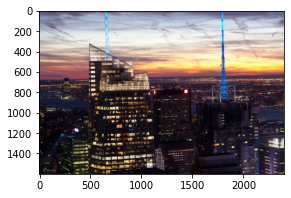
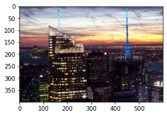
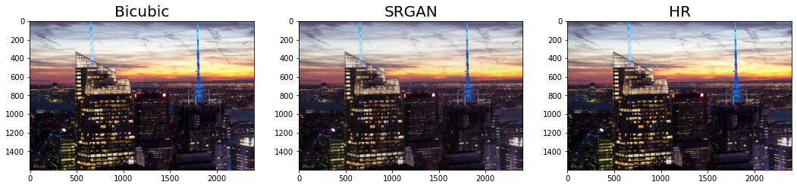
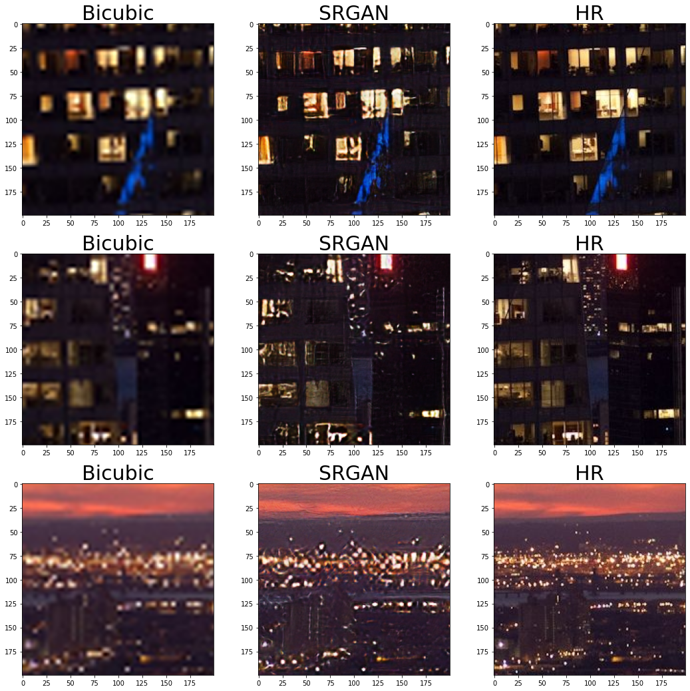
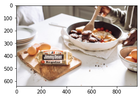

# 프로젝트 1-1.

1. (적당히) 높은 해상도를 가진 이미지를 검색해서 한 장 고른 후 저장하고 불러옵니다.
2. 불러온 이미지에 bicubic interpolation을 적용해 가로 및 세로 픽셀 수를 1/4로 줄입니다. cv2.resize()를 사용해 봅시다.
3. 줄인 저해상도 이미지를 입력으로 SRGAN을 이용해 고해상도 이미지를 생성합니다. 이전에 사용한 apply_srgan 함수를 사용하면 쉽습니다.
4. 2.의 이미지에 bicubic interpolation을 적용해 가로 및 세로 픽셀 수를 다시 4배로 늘립니다. 마찬가지로 cv2.resize()를 사용해 봅시다.
5. 3개 이미지(4.의 Bicubic의 결과, 3.의 SRGAN의 결과, 1.의 원래 고해상도 이미지)를 나란히 시각화합니다. 각 이미지의 제목에 어떤 방법에 대한 결과인지 표시해 주세요. 이전 시각화에 사용했던 코드를 참고하면 어렵지 않습니다.
6. 선택한 이미지를 DIV2K 데이터셋에서 학습된 모델로 Super Resolution했을 때 어떠한 결과가 나왔으며, 왜 이러한 결과가 출력되었는지 설명해 봅시다. (정답은 없습니다)


```python
import os
import cv2
import numpy as np
import matplotlib.pyplot as plt
import tensorflow as tf
import tensorflow_datasets as tfds
from tensorflow.keras import layers, Sequential
from tensorflow.keras import Input, Model, layers
from tensorflow.python.keras import applications
from tensorflow.keras import losses, metrics, optimizers
from skimage import data
from skimage.metrics import peak_signal_noise_ratio, structural_similarity
```


```python
# 고해상도 이미지 불러오기
hr_image = cv2.imread(os.getenv('HOME') + '/aiffel/super_resolution/c.jpg')
hr_image = cv2.cvtColor(hr_image, cv2.COLOR_BGR2RGB)

print(hr_image.shape)

plt.figure(figsize=(6,3))
plt.imshow(hr_image)
```

    (1600, 2400, 3)


    <matplotlib.image.AxesImage at 0x7f758b16ced0>


    

    


```python
# 이미지 사이즈 줄이기
lr_image = cv2.resize(
    hr_image,
    dsize=(hr_image.shape[1]//4, hr_image.shape[0]//4)
)

print(lr_image.shape)

plt.figure(figsize=(6,3))
plt.imshow(lr_image)
```

    (400, 600, 3)


    <matplotlib.image.AxesImage at 0x7f758a878650>


    

    


```python
# pre-trained 모델 로드
model_file = os.getenv('HOME')+'/aiffel/super_resolution/srgan_G.h5'
srgan = tf.keras.models.load_model(model_file)
```

    WARNING:tensorflow:No training configuration found in the save file, so the model was *not* compiled. Compile it manually.


```python
# SRGAN으로 고해상도 이미지 생성
def apply_srgan(image):
    image = tf.cast(image[np.newaxis, ...], tf.float32)
    sr = srgan.predict(image)
    sr = tf.clip_by_value(sr, 0, 255)
    sr = tf.round(sr)
    sr = tf.cast(sr, tf.uint8)
    return np.array(sr)[0]

train, valid = tfds.load(
    "div2k/bicubic_x4", 
    split=["train","validation"],
    as_supervised=True
)

for i, (lr, hr) in enumerate(valid):
    if i == 6: break

srgan_hr = apply_srgan(lr_image)
```


```python
# bicubic interpolation으로 이미지 사이즈 키우기
bicubic_hr = cv2.resize(
    lr_image, 
    dsize=(hr_image.shape[1], hr_image.shape[0]), # 고해상도 이미지 크기로 설정
    interpolation=cv2.INTER_CUBIC # bicubic 설정
)
```


```python
# 시각화
images = [bicubic_hr, srgan_hr, hr_image]
titles = ["Bicubic", "SRGAN", "HR"]

plt.figure(figsize=(18,5))
for i, (image, title) in enumerate(zip(images, titles)):
    plt.subplot(1,3,i+1)
    plt.imshow(image)
    plt.title(title, fontsize=20)
```


    

    


```python
# 특정 영역을 잘라낼 함수를 정의합니다.
def crop(image, left_top, x=50, y=100):
    return image[left_top[0]:(left_top[0]+x), left_top[1]:(left_top[1]+y), :]
```


```python
# 자세히 시각화 하기 위해 3개 영역을 잘라냅니다.
# 아래는 잘라낸 부분의 좌상단 좌표 3개 입니다.
left_tops = [(1000,800), (800,1000), (600,2000)]

images = []
for left_top in left_tops:
    img1 = crop(bicubic_hr, left_top, 200, 200)
    img2 = crop(srgan_hr , left_top, 200, 200)
    img3 = crop(hr_image, left_top, 200, 200)
    images.extend([img1, img2, img3])

labels = ["Bicubic", "SRGAN", "HR"] * 3

plt.figure(figsize=(18,18))
for i in range(9):
    plt.subplot(3,3,i+1) 
    plt.imshow(images[i])
    plt.title(labels[i], fontsize=30)
```


    

    


# 프로젝트 1-2.

1. (적당히) 낮은 해상도를 가진 이미지를 검색해서 한 장 고른 후 저장하고 불러옵니다.
2. 불러온 이미지를 입력으로 SRGAN을 이용해 고해상도 이미지를 생성합니다. 이전에 사용한 apply_srgan 함수를 사용하면 쉽습니다.
3. 1.에서 불러온 이미지에 bicubic interpolation을 적용해 가로 및 세로 픽셀 수를 다시 4배로 늘립니다. cv2.resize()를 사용해 봅시다.
4. 2개 이미지(3.의 Bicubic의 결과, 2.의 SRGAN의 결과)를 나란히 시각화합니다. 각 이미지의 제목에 어떤 방법에 대한 결과인지 표시해 주세요. 이전 시각화에 사용했던 코드를 참고하면 어렵지 않습니다.
5. 선택한 이미지를 DIV2K 데이터셋에서 학습된 모델로 Super Resolution했을 때 어떠한 결과가 나왔으며, 왜 이러한 결과가 출력되었는지 설명해 봅시다. (정답은 없습니다)


```python
# 저해상도 이미지 불러오기
image = cv2.imread(os.getenv('HOME') + '/aiffel/super_resolution/low.jpg')
image = cv2.cvtColor(image, cv2.COLOR_BGR2RGB)

print(image.shape)

plt.figure(figsize=(6,3))
plt.imshow(image)
```

    (640, 960, 3)


    <matplotlib.image.AxesImage at 0x7f7624958f90>


    

    


```python
# SRGAN으로 고해상도 이미지 생성
srgan_hr = apply_srgan(image)
```


    ---------------------------------------------------------------------------

    ResourceExhaustedError                    Traceback (most recent call last)

    <ipython-input-11-5c155bfd10cd> in <module>
          1 # SRGAN으로 고해상도 이미지 생성
    ----> 2 srgan_hr = apply_srgan(image)
    

    <ipython-input-5-d9bf536af5d9> in apply_srgan(image)
          2 def apply_srgan(image):
          3     image = tf.cast(image[np.newaxis, ...], tf.float32)
    ----> 4     sr = srgan.predict(image)
          5     sr = tf.clip_by_value(sr, 0, 255)
          6     sr = tf.round(sr)


    /opt/conda/lib/python3.7/site-packages/tensorflow/python/keras/engine/training.py in predict(self, x, batch_size, verbose, steps, callbacks, max_queue_size, workers, use_multiprocessing)
       1627           for step in data_handler.steps():
       1628             callbacks.on_predict_batch_begin(step)
    -> 1629             tmp_batch_outputs = self.predict_function(iterator)
       1630             if data_handler.should_sync:
       1631               context.async_wait()


    /opt/conda/lib/python3.7/site-packages/tensorflow/python/eager/def_function.py in __call__(self, *args, **kwds)
        826     tracing_count = self.experimental_get_tracing_count()
        827     with trace.Trace(self._name) as tm:
    --> 828       result = self._call(*args, **kwds)
        829       compiler = "xla" if self._experimental_compile else "nonXla"
        830       new_tracing_count = self.experimental_get_tracing_count()


    /opt/conda/lib/python3.7/site-packages/tensorflow/python/eager/def_function.py in _call(self, *args, **kwds)
        860       # In this case we have not created variables on the first call. So we can
        861       # run the first trace but we should fail if variables are created.
    --> 862       results = self._stateful_fn(*args, **kwds)
        863       if self._created_variables:
        864         raise ValueError("Creating variables on a non-first call to a function"


    /opt/conda/lib/python3.7/site-packages/tensorflow/python/eager/function.py in __call__(self, *args, **kwargs)
       2941        filtered_flat_args) = self._maybe_define_function(args, kwargs)
       2942     return graph_function._call_flat(
    -> 2943         filtered_flat_args, captured_inputs=graph_function.captured_inputs)  # pylint: disable=protected-access
       2944 
       2945   @property


    /opt/conda/lib/python3.7/site-packages/tensorflow/python/eager/function.py in _call_flat(self, args, captured_inputs, cancellation_manager)
       1917       # No tape is watching; skip to running the function.
       1918       return self._build_call_outputs(self._inference_function.call(
    -> 1919           ctx, args, cancellation_manager=cancellation_manager))
       1920     forward_backward = self._select_forward_and_backward_functions(
       1921         args,


    /opt/conda/lib/python3.7/site-packages/tensorflow/python/eager/function.py in call(self, ctx, args, cancellation_manager)
        558               inputs=args,
        559               attrs=attrs,
    --> 560               ctx=ctx)
        561         else:
        562           outputs = execute.execute_with_cancellation(


    /opt/conda/lib/python3.7/site-packages/tensorflow/python/eager/execute.py in quick_execute(op_name, num_outputs, inputs, attrs, ctx, name)
         58     ctx.ensure_initialized()
         59     tensors = pywrap_tfe.TFE_Py_Execute(ctx._handle, device_name, op_name,
    ---> 60                                         inputs, attrs, num_outputs)
         61   except core._NotOkStatusException as e:
         62     if name is not None:


    ResourceExhaustedError:  OOM when allocating tensor with shape[1,2560,3840,64] and type float on /job:localhost/replica:0/task:0/device:GPU:0 by allocator GPU_0_bfc
    	 [[{{node model_3/p_re_lu_26/Relu_1-0-0-TransposeNCHWToNHWC-LayoutOptimizer}}]]
    Hint: If you want to see a list of allocated tensors when OOM happens, add report_tensor_allocations_upon_oom to RunOptions for current allocation info.
     [Op:__inference_predict_function_4609]
    
    Function call stack:
    predict_function


```python
# bicubic interpolation으로 이미지 사이즈 키우기
bicubic_hr = cv2.resize(
    image, 
    dsize=(image.shape[1]*4, image.shape[0]*4), # 고해상도 이미지 크기로 설정
    interpolation=cv2.INTER_CUBIC # bicubic 설정
)
```


```python
# 시각화
images = [bicubic_hr, srgan_hr]
titles = ["Bicubic", "SRGAN"]

plt.figure(figsize=(12,5))
for i, (image, title) in enumerate(zip(images, titles)):
    plt.subplot(1,2,i+1)
    plt.imshow(image)
    plt.title(title, fontsize=20)
```


```python
# 자세히 시각화 하기 위해 3개 영역을 잘라냅니다.
# 아래는 잘라낸 부분의 좌상단 좌표 3개 입니다.
left_tops = [(700,1100), (1300,1100), (900,900)]

images = []
for left_top in left_tops:
    img1 = crop(bicubic_hr, left_top, 200, 200)
    img2 = crop(srgan_hr , left_top, 200, 200)
    images.extend([img1, img2])

labels = ["Bicubic", "SRGAN"] * 3

plt.figure(figsize=(12,18))
for i in range(6):
    plt.subplot(3,2,i+1) 
    plt.imshow(images[i])
    plt.title(labels[i], fontsize=30)
```

# 프로젝트 2 : SRGAN을 이용해 고해상도 gif 생성하기

이전 Super Resolution의 활용 사례에 대해 살펴봤을 때, 단일 이미지가 아닌 영상에 대해 Super Resolution을 적용한 사례가 있었습니다. 이번에는 이미 학습된 SRGAN을 이용해 저해상도 영상을 고해상도 영상으로 바꿔보는 프로젝트를 수행해 봅시다.

실제로 동영상의 Super Resolution은 시간 순서에 따른 다수의 프레임 정보를 고려하는 것이 더 좋지만, 처음부터 학습시키기에 많은 시간이 소요됩니다. 여기서는 이전에 사용했던 SRGAN을 이용해 한 프레임씩 고해상도 이미지로 변환 시켜 모든 프레임에 대해 적용하고, 그 프레임들을 합쳐 동영상으로 만들어 봅시다.

각 프레임들을 모아 gif 파일을 만드는데 아래 라이브러리의 설치가 필요합니다.

## 1. gif 파일 불러오기

다운받은 gif 파일을 아래와 같은 과정을 통해 각 프레임(이미지)을 불러올 수 있습니다. frames이란 리스트 안에 각각의 프레임이 들어 있습니다.


```python
import cv2
import os

gif_path = os.getenv('HOME') + '/aiffel/super_resolution/gif'
gif = cv2.VideoCapture(os.path.join(gif_path, 'fire_lr.gif'))

isTrue = True
frames = []
while isTrue:
    isTrue, frame = gif.read()
    if isTrue:
        frame = cv2.cvtColor(frame, cv2.COLOR_BGR2RGB)
        frames.append(frame)

print("frame 수 :", len(frames))
print("frame 크기 :", (frames[0].shape))
```

    frame 수 : 0


    ---------------------------------------------------------------------------

    IndexError                                Traceback (most recent call last)

    <ipython-input-12-18b8ef4dd2ce> in <module>
         14 
         15 print("frame 수 :", len(frames))
    ---> 16 print("frame 크기 :", (frames[0].shape))
    

    IndexError: list index out of range


## 2. 프레임별 Super Resolution 진행하기
Bicubic interpolation과 SRGAN을 이용해 각각의 가로, 세로 픽셀 수를 4배로 늘려봅시다. Super Resolution이 완료된 각각의 결과를 frames_sr이라는 리스트에 넣어주세요.


```python
frames_sr_bicubic = []
for frame in frames:
    frames_sr_bicubic.append(cv2.resize(
        frame, 
        dsize=(frame.shape[1]*4, frame.shape[0]*4), 
        interpolation=cv2.INTER_CUBIC
    ))
```


```python
frames_sr_srgan = []
for frame in frames:
    frames_sr_srgan.append(apply_srgan(frame))
```

## 3. 프레임을 합쳐 gif 만들기
위에서 frame_sr을 만들었다면 아래 코드와 같이 gif 파일을 생성할 수 있습니다. Bicubic 및 SRGAN의 결과를 각각 저장하여 2개 파일을 만들어 주세요.


```python
import imageio

imageio.mimsave(os.path.join(gif_path, 'fire_hr_bicubic.gif'), frames_sr_bicubic)
imageio.mimsave(os.path.join(gif_path, 'fire_hr_srgan.gif'), frames_sr_srgan)
```

## 4. Jupyter notebook에 gif 표시하기

아래와 같이 다운받은 저해상도 gif 파일과 고해상도 gif 파일을 각각 jupyter 내에 출력하여 최종 제출해 주시면 됩니다. jupyter 내에 출력이 어려운 경우, GitHub에 저해상도, 고해상도 gif파일을 업로드 후 링크를 첨부해주시기바랍니다. Super Resolution이 잘 적용되었는지 시각적으로 확인하기 위해 아래의 width 옵션을 적당히 크게 해주세요. 저해상도 및 고해상도 시각화의 width 값은 같도록 설정해주세요.


```python
from IPython.display import Image as show_gif

show_gif(os.path.join(gif_path, 'fire_lr.gif'), width=800) # width 는 적당히 큰 값으로 설정해주세요
```


```python
show_gif(os.path.join(gif_path, 'fire_hr_bicubic.gif'), width=800) # 위에서 설정한 width와 같은 값으로 설정해주세요
```


```python
show_gif(os.path.join(gif_path, 'fire_hr_srgan.gif'), width=800) # 위에서 설정한 width와 같은 값으로 설정해주세요
```

# 회고

- 오류를 해결하지 못했다.
