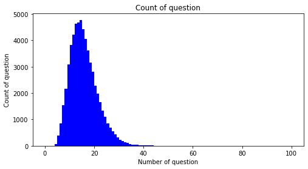
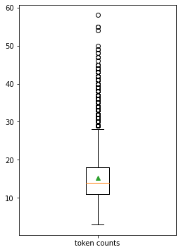
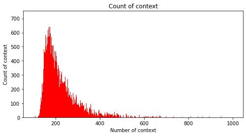
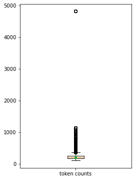
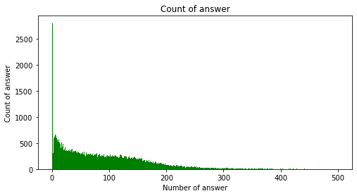
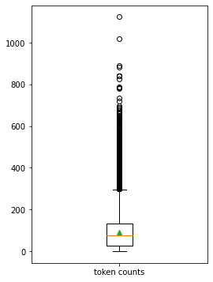
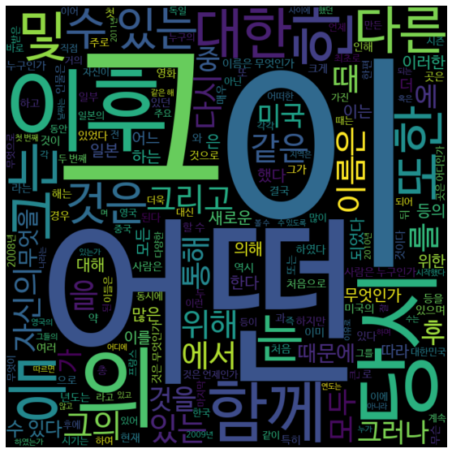
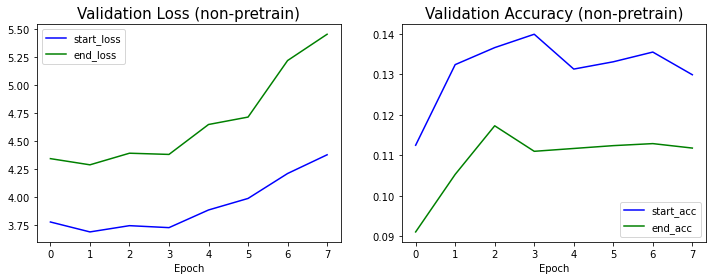
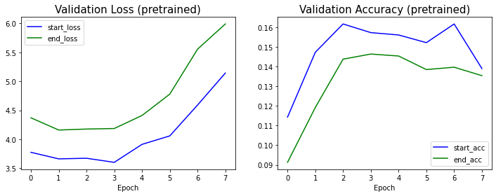
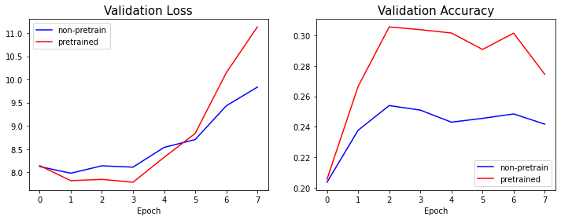

# KorQuAD 데이터셋 확인


```python
# imports
from __future__ import absolute_import, division, print_function, unicode_literals

import tensorflow as tf
import tensorflow.keras.backend as K
import tensorflow_addons as tfa

import os
import re
import numpy as np
import pandas as pd
import pickle
import random
import collections
import json
from datetime import datetime

import sentencepiece as spm
from tqdm.notebook import tqdm
import matplotlib.pyplot as plt
import seaborn as sns
from wordcloud import WordCloud

random_seed = 1234
random.seed(random_seed)
np.random.seed(random_seed)
tf.random.set_seed(random_seed)
```


```python
# json 포맷의 데이터에서 리스트의 첫번째 아이템의 실제 내용을 간단히 확인
def print_json_tree(data, indent=""):
    for key, value in data.items():
        if type(value) == list:     # list 형태의 item은 첫번째 item만 출력
            print(f'{indent}- {key}: [{len(value)}]')
            print_json_tree(value[0], indent + "  ")
        else:
            print(f'{indent}- {key}: {value}')
```


```python
data_dir = os.getenv('HOME')+'/aiffel/bert_qna/data'
model_dir = os.getenv('HOME')+'/aiffel/bert_qna/models'

# 훈련데이터 확인
train_json_path = data_dir + '/KorQuAD_v1.0_train.json'
with open(train_json_path) as f:
    train_json = json.load(f)
    print_json_tree(train_json)
```

    - version: KorQuAD_v1.0_train
    - data: [1420]
      - paragraphs: [3]
        - qas: [8]
          - answers: [1]
            - text: 교향곡
            - answer_start: 54
          - id: 6566495-0-0
          - question: 바그너는 괴테의 파우스트를 읽고 무엇을 쓰고자 했는가?
        - context: 1839년 바그너는 괴테의 파우스트을 처음 읽고 그 내용에 마음이 끌려 이를 소재로 해서 하나의 교향곡을 쓰려는 뜻을 갖는다. 이 시기 바그너는 1838년에 빛 독촉으로 산전수전을 다 걲은 상황이라 좌절과 실망에 가득했으며 메피스토펠레스를 만나는 파우스트의 심경에 공감했다고 한다. 또한 파리에서 아브네크의 지휘로 파리 음악원 관현악단이 연주하는 베토벤의 교향곡 9번을 듣고 깊은 감명을 받았는데, 이것이 이듬해 1월에 파우스트의 서곡으로 쓰여진 이 작품에 조금이라도 영향을 끼쳤으리라는 것은 의심할 여지가 없다. 여기의 라단조 조성의 경우에도 그의 전기에 적혀 있는 것처럼 단순한 정신적 피로나 실의가 반영된 것이 아니라 베토벤의 합창교향곡 조성의 영향을 받은 것을 볼 수 있다. 그렇게 교향곡 작곡을 1839년부터 40년에 걸쳐 파리에서 착수했으나 1악장을 쓴 뒤에 중단했다. 또한 작품의 완성과 동시에 그는 이 서곡(1악장)을 파리 음악원의 연주회에서 연주할 파트보까지 준비하였으나, 실제로는 이루어지지는 않았다. 결국 초연은 4년 반이 지난 후에 드레스덴에서 연주되었고 재연도 이루어졌지만, 이후에 그대로 방치되고 말았다. 그 사이에 그는 리엔치와 방황하는 네덜란드인을 완성하고 탄호이저에도 착수하는 등 분주한 시간을 보냈는데, 그런 바쁜 생활이 이 곡을 잊게 한 것이 아닌가 하는 의견도 있다.
      - title: 파우스트_서곡


```python
# 검증데이터 확인
dev_json_path = data_dir + '/KorQuAD_v1.0_dev.json'
with open(dev_json_path) as f:
    dev_json = json.load(f)
    print_json_tree(dev_json)
```

    - version: KorQuAD_v1.0_dev
    - data: [140]
      - paragraphs: [2]
        - qas: [7]
          - answers: [1]
            - text: 1989년 2월 15일
            - answer_start: 0
          - id: 6548850-0-0
          - question: 임종석이 여의도 농민 폭력 시위를 주도한 혐의로 지명수배 된 날은?
        - context: 1989년 2월 15일 여의도 농민 폭력 시위를 주도한 혐의(폭력행위등처벌에관한법률위반)으로 지명수배되었다. 1989년 3월 12일 서울지방검찰청 공안부는 임종석의 사전구속영장을 발부받았다. 같은 해 6월 30일 평양축전에 임수경을 대표로 파견하여 국가보안법위반 혐의가 추가되었다. 경찰은 12월 18일~20일 사이 서울 경희대학교에서 임종석이 성명 발표를 추진하고 있다는 첩보를 입수했고, 12월 18일 오전 7시 40분 경 가스총과 전자봉으로 무장한 특공조 및 대공과 직원 12명 등 22명의 사복 경찰을 승용차 8대에 나누어 경희대학교에 투입했다. 1989년 12월 18일 오전 8시 15분 경 서울청량리경찰서는 호위 학생 5명과 함께 경희대학교 학생회관 건물 계단을 내려오는 임종석을 발견, 검거해 구속을 집행했다. 임종석은 청량리경찰서에서 약 1시간 동안 조사를 받은 뒤 오전 9시 50분 경 서울 장안동의 서울지방경찰청 공안분실로 인계되었다.
      - title: 임종석


```python
# json 데이터의 실제 형태 확인
print(json.dumps(train_json["data"][0], indent=2, ensure_ascii=False))
```

    {
      "paragraphs": [
        {
          "qas": [
            {
              "answers": [
                {
                  "text": "교향곡",
                  "answer_start": 54
                }
              ],
              "id": "6566495-0-0",
              "question": "바그너는 괴테의 파우스트를 읽고 무엇을 쓰고자 했는가?"
            },
            {
              "answers": [
                {
                  "text": "1악장",
                  "answer_start": 421
                }
              ],
              "id": "6566495-0-1",
              "question": "바그너는 교향곡 작곡을 어디까지 쓴 뒤에 중단했는가?"
            },
            {
              "answers": [
                {
                  "text": "베토벤의 교향곡 9번",
                  "answer_start": 194
                }
              ],
              "id": "6566495-0-2",
              "question": "바그너가 파우스트 서곡을 쓸 때 어떤 곡의 영향을 받았는가?"
            },
            {
              "answers": [
                {
                  "text": "파우스트",
                  "answer_start": 15
                }
              ],
              "id": "6566518-0-0",
              "question": "1839년 바그너가 교향곡의 소재로 쓰려고 했던 책은?"
            },
            {
              "answers": [
                {
                  "text": "합창교향곡",
                  "answer_start": 354
                }
              ],
              "id": "6566518-0-1",
              "question": "파우스트 서곡의 라단조 조성이 영향을 받은 베토벤의 곡은?"
            },
            {
              "answers": [
                {
                  "text": "1839",
                  "answer_start": 0
                }
              ],
              "id": "5917067-0-0",
              "question": "바그너가 파우스트를 처음으로 읽은 년도는?"
            },
            {
              "answers": [
                {
                  "text": "파리",
                  "answer_start": 410
                }
              ],
              "id": "5917067-0-1",
              "question": "바그너가 처음 교향곡 작곡을 한 장소는?"
            },
            {
              "answers": [
                {
                  "text": "드레스덴",
                  "answer_start": 534
                }
              ],
              "id": "5917067-0-2",
              "question": "바그너의 1악장의 초연은 어디서 연주되었는가?"
            }
          ],
          "context": "1839년 바그너는 괴테의 파우스트을 처음 읽고 그 내용에 마음이 끌려 이를 소재로 해서 하나의 교향곡을 쓰려는 뜻을 갖는다. 이 시기 바그너는 1838년에 빛 독촉으로 산전수전을 다 걲은 상황이라 좌절과 실망에 가득했으며 메피스토펠레스를 만나는 파우스트의 심경에 공감했다고 한다. 또한 파리에서 아브네크의 지휘로 파리 음악원 관현악단이 연주하는 베토벤의 교향곡 9번을 듣고 깊은 감명을 받았는데, 이것이 이듬해 1월에 파우스트의 서곡으로 쓰여진 이 작품에 조금이라도 영향을 끼쳤으리라는 것은 의심할 여지가 없다. 여기의 라단조 조성의 경우에도 그의 전기에 적혀 있는 것처럼 단순한 정신적 피로나 실의가 반영된 것이 아니라 베토벤의 합창교향곡 조성의 영향을 받은 것을 볼 수 있다. 그렇게 교향곡 작곡을 1839년부터 40년에 걸쳐 파리에서 착수했으나 1악장을 쓴 뒤에 중단했다. 또한 작품의 완성과 동시에 그는 이 서곡(1악장)을 파리 음악원의 연주회에서 연주할 파트보까지 준비하였으나, 실제로는 이루어지지는 않았다. 결국 초연은 4년 반이 지난 후에 드레스덴에서 연주되었고 재연도 이루어졌지만, 이후에 그대로 방치되고 말았다. 그 사이에 그는 리엔치와 방황하는 네덜란드인을 완성하고 탄호이저에도 착수하는 등 분주한 시간을 보냈는데, 그런 바쁜 생활이 이 곡을 잊게 한 것이 아닌가 하는 의견도 있다."
        },
        {
          "qas": [
            {
              "answers": [
                {
                  "text": "한스 폰 뷜로",
                  "answer_start": 402
                }
              ],
              "id": "6566495-1-0",
              "question": "바그너의 작품을 시인의 피로 쓰여졌다고 극찬한 것은 누구인가?"
            },
            {
              "answers": [
                {
                  "text": "리스트",
                  "answer_start": 23
                }
              ],
              "id": "6566495-1-1",
              "question": "잊혀져 있는 파우스트 서곡 1악장을 부활시킨 것은 누구인가?"
            },
            {
              "answers": [
                {
                  "text": "20루이의 금",
                  "answer_start": 345
                }
              ],
              "id": "6566495-1-2",
              "question": "바그너는 다시 개정된 총보를 얼마를 받고 팔았는가?"
            },
            {
              "answers": [
                {
                  "text": "리스트",
                  "answer_start": 23
                }
              ],
              "id": "6566518-1-0",
              "question": "파우스트 교향곡을 부활시킨 사람은?"
            },
            {
              "answers": [
                {
                  "text": "한스 폰 뷜로",
                  "answer_start": 402
                }
              ],
              "id": "6566518-1-1",
              "question": "파우스트 교향곡을 피아노 독주용으로 편곡한 사람은?"
            },
            {
              "answers": [
                {
                  "text": "리스트",
                  "answer_start": 23
                }
              ],
              "id": "5917067-1-0",
              "question": "1악장을 부활시켜 연주한 사람은?"
            },
            {
              "answers": [
                {
                  "text": "한스 폰 뷜로",
                  "answer_start": 402
                }
              ],
              "id": "5917067-1-1",
              "question": "파우스트 교향곡에 감탄하여 피아노곡으로 편곡한 사람은?"
            },
            {
              "answers": [
                {
                  "text": "1840년",
                  "answer_start": 3
                }
              ],
              "id": "5917067-1-2",
              "question": "리스트가 바그너와 알게 된 연도는?"
            }
          ],
          "context": "한편 1840년부터 바그너와 알고 지내던 리스트가 잊혀져 있던 1악장을 부활시켜 1852년에 바이마르에서 연주했다. 이것을 계기로 바그너도 이 작품에 다시 관심을 갖게 되었고, 그 해 9월에는 총보의 반환을 요구하여 이를 서곡으로 간추린 다음 수정을 했고 브라이트코프흐 & 헤르텔 출판사에서 출판할 개정판도 준비했다. 1853년 5월에는 리스트가 이 작품이 수정되었다는 것을 인정했지만, 끝내 바그너의 출판 계획은 무산되고 말았다. 이후 1855년에 리스트가 자신의 작품 파우스트 교향곡을 거의 완성하여 그 사실을 바그너에게 알렸고, 바그너는 다시 개정된 총보를 리스트에게 보내고 브라이트코프흐 & 헤르텔 출판사에는 20루이의 금을 받고 팔았다. 또한 그의 작품을 “하나하나의 음표가 시인의 피로 쓰여졌다”며 극찬했던 한스 폰 뷜로가 그것을 피아노 독주용으로 편곡했는데, 리스트는 그것을 약간 변형되었을 뿐이라고 지적했다. 이 서곡의 총보 첫머리에는 파우스트 1부의 내용 중 한 구절을 인용하고 있다."
        },
        {
          "qas": [
            {
              "answers": [
                {
                  "text": "주제, 동기",
                  "answer_start": 70
                }
              ],
              "id": "6566495-2-0",
              "question": "서주에는 무엇이 암시되어 있는가?"
            },
            {
              "answers": [
                {
                  "text": "제1바이올린",
                  "answer_start": 148
                }
              ],
              "id": "6566495-2-1",
              "question": "첫부분에는 어떤 악기를 사용해 더욱 명확하게 나타내는가?"
            },
            {
              "answers": [
                {
                  "text": "소나타 형식",
                  "answer_start": 272
                }
              ],
              "id": "6566495-2-2",
              "question": "주요부는 어떤 형식으로 되어 있는가?"
            },
            {
              "answers": [
                {
                  "text": "저음 주제",
                  "answer_start": 102
                }
              ],
              "id": "6566518-2-0",
              "question": "첫 부분의 주요주제를 암시하는 주제는?"
            },
            {
              "answers": [
                {
                  "text": "D장조",
                  "answer_start": 409
                }
              ],
              "id": "6566518-2-1",
              "question": "제2주제의 축소된 재현부의 조성은?"
            },
            {
              "answers": [
                {
                  "text": "4/4박자",
                  "answer_start": 35
                }
              ],
              "id": "5917067-2-0",
              "question": "곡이 시작할때의 박자는?"
            },
            {
              "answers": [
                {
                  "text": "고뇌와 갈망 동기, 청춘의 사랑 동기",
                  "answer_start": 115
                }
              ],
              "id": "5917067-2-1",
              "question": "이 곡의 주요 주제는?"
            },
            {
              "answers": [
                {
                  "text": "D장조",
                  "answer_start": 409
                }
              ],
              "id": "5917067-2-2",
              "question": "제 2주제에선 무슨 장조로 재현되는가?"
            }
          ],
          "context": "이 작품은 라단조, Sehr gehalten(아주 신중하게), 4/4박자의 부드러운 서주로 서주로 시작되는데, 여기에는 주요 주제, 동기의 대부분이 암시, 예고되어 있다. 첫 부분의 저음 주제는 주요 주제(고뇌와 갈망 동기, 청춘의 사랑 동기)를 암시하고 있으며, 제1바이올린으로 더욱 명확하게 나타난다. 또한 그것을 이어받는 동기도 중요한 역할을 한다. 여기에 새로운 소재가 더해진 뒤에 새로운 주제도 연주된다. 주요부는 Sehr bewegt(아주 격동적으로), 2/2박자의 자유로운 소나타 형식으로 매우 드라마틱한 구상과 유기적인 구성을 하고 있다. 여기에는 지금까지의 주제나 소재 외에도 오보에에 의한 선율과 제2주제를 떠올리게 하는 부차적인 주제가 더해지는데, 중간부에서는 약보3이 중심이 되고 제2주제는 축소된 재현부에서 D장조로 재현된다. 마지막에는 주요 주제를 회상하면서 조용히 마친다."
        }
      ],
      "title": "파우스트_서곡"
    }


# KorQuAD 데이터셋 전처리
## (1) 띄어쓰기 단위 정보관리
아래 코드는 같은 코드이지만 '1839년' 다음의 공백 길이에 따라 두 문장의 영역표시 결과가 조금 달라집니다. 이와 같은 방법으로 띄어쓰기 단위로 token을 정리한 후, word token 영역별로 유니크한 숫자(어절 번호)를 부여합니다. char_to_word list 값은 현재 글자가 몇 번째 어절에 포함된 것이었는지를 말해 줍니다.


```python
def _is_whitespace(c):
    if c == " " or c == "\t" or c == "\r" or c == "\n" or ord(c) == 0x202F:
        return True
    return False
```


```python
# whitespace가 2개인 경우를 처리해야 함
string1 = '1839년 파우스트을 읽었다.'
string2 = '1839년  파우스트을 읽었다.'
string1[6:10], string2[7:11]
```


    ('파우스트', '파우스트')


```python
word_tokens = []
char_to_word = []
prev_is_whitespace = True

# 첫번째 문장(string1)에 대해 띄어쓰기 영역 정보를 표시
for c in string1:
    if _is_whitespace(c):
        prev_is_whitespace = True
    else:
        if prev_is_whitespace:
            word_tokens.append(c)
        else:
            word_tokens[-1] += c
        prev_is_whitespace = False    
    char_to_word.append(len(word_tokens) - 1)
    print(f'\'{c}\' : {word_tokens} : {char_to_word}')
```

    '1' : ['1'] : [0]
    '8' : ['18'] : [0, 0]
    '3' : ['183'] : [0, 0, 0]
    '9' : ['1839'] : [0, 0, 0, 0]
    '년' : ['1839년'] : [0, 0, 0, 0, 0]
    ' ' : ['1839년'] : [0, 0, 0, 0, 0, 0]
    '파' : ['1839년', '파'] : [0, 0, 0, 0, 0, 0, 1]
    '우' : ['1839년', '파우'] : [0, 0, 0, 0, 0, 0, 1, 1]
    '스' : ['1839년', '파우스'] : [0, 0, 0, 0, 0, 0, 1, 1, 1]
    '트' : ['1839년', '파우스트'] : [0, 0, 0, 0, 0, 0, 1, 1, 1, 1]
    '을' : ['1839년', '파우스트을'] : [0, 0, 0, 0, 0, 0, 1, 1, 1, 1, 1]
    ' ' : ['1839년', '파우스트을'] : [0, 0, 0, 0, 0, 0, 1, 1, 1, 1, 1, 1]
    '읽' : ['1839년', '파우스트을', '읽'] : [0, 0, 0, 0, 0, 0, 1, 1, 1, 1, 1, 1, 2]
    '었' : ['1839년', '파우스트을', '읽었'] : [0, 0, 0, 0, 0, 0, 1, 1, 1, 1, 1, 1, 2, 2]
    '다' : ['1839년', '파우스트을', '읽었다'] : [0, 0, 0, 0, 0, 0, 1, 1, 1, 1, 1, 1, 2, 2, 2]
    '.' : ['1839년', '파우스트을', '읽었다.'] : [0, 0, 0, 0, 0, 0, 1, 1, 1, 1, 1, 1, 2, 2, 2, 2]


```python
word_tokens = []
char_to_word = []
prev_is_whitespace = True

# 두번째 문장(string2)에 대해 띄어쓰기 영역 정보를 표시
for c in string2:
    if _is_whitespace(c):
        prev_is_whitespace = True
    else:
        if prev_is_whitespace:
            word_tokens.append(c)
        else:
            word_tokens[-1] += c
        prev_is_whitespace = False    
    char_to_word.append(len(word_tokens) - 1)
    print(f'\'{c}\' : {word_tokens} : {char_to_word}')
```

    '1' : ['1'] : [0]
    '8' : ['18'] : [0, 0]
    '3' : ['183'] : [0, 0, 0]
    '9' : ['1839'] : [0, 0, 0, 0]
    '년' : ['1839년'] : [0, 0, 0, 0, 0]
    ' ' : ['1839년'] : [0, 0, 0, 0, 0, 0]
    ' ' : ['1839년'] : [0, 0, 0, 0, 0, 0, 0]
    '파' : ['1839년', '파'] : [0, 0, 0, 0, 0, 0, 0, 1]
    '우' : ['1839년', '파우'] : [0, 0, 0, 0, 0, 0, 0, 1, 1]
    '스' : ['1839년', '파우스'] : [0, 0, 0, 0, 0, 0, 0, 1, 1, 1]
    '트' : ['1839년', '파우스트'] : [0, 0, 0, 0, 0, 0, 0, 1, 1, 1, 1]
    '을' : ['1839년', '파우스트을'] : [0, 0, 0, 0, 0, 0, 0, 1, 1, 1, 1, 1]
    ' ' : ['1839년', '파우스트을'] : [0, 0, 0, 0, 0, 0, 0, 1, 1, 1, 1, 1, 1]
    '읽' : ['1839년', '파우스트을', '읽'] : [0, 0, 0, 0, 0, 0, 0, 1, 1, 1, 1, 1, 1, 2]
    '었' : ['1839년', '파우스트을', '읽었'] : [0, 0, 0, 0, 0, 0, 0, 1, 1, 1, 1, 1, 1, 2, 2]
    '다' : ['1839년', '파우스트을', '읽었다'] : [0, 0, 0, 0, 0, 0, 0, 1, 1, 1, 1, 1, 1, 2, 2, 2]
    '.' : ['1839년', '파우스트을', '읽었다.'] : [0, 0, 0, 0, 0, 0, 0, 1, 1, 1, 1, 1, 1, 2, 2, 2, 2]


```python
# 위 기능을 함수로 구현
def _tokenize_whitespace(string):
    word_tokens = []
    char_to_word = []
    prev_is_whitespace = True

    for c in string:
        if _is_whitespace(c):
            prev_is_whitespace = True
        else:
            if prev_is_whitespace:
                word_tokens.append(c)
            else:
                word_tokens[-1] += c
            prev_is_whitespace = False    
        char_to_word.append(len(word_tokens) - 1)
    
    return word_tokens, char_to_word
```


```python
# 첫번째 문장(string1)에 대해 띄어쓰기 영역 정보를 표시
word_tokens, char_to_word = _tokenize_whitespace(string1)
for c, i in zip(list(string1), char_to_word):
    print(f'\'{c}\' : {i}')

word_tokens, char_to_word
```

    '1' : 0
    '8' : 0
    '3' : 0
    '9' : 0
    '년' : 0
    ' ' : 0
    '파' : 1
    '우' : 1
    '스' : 1
    '트' : 1
    '을' : 1
    ' ' : 1
    '읽' : 2
    '었' : 2
    '다' : 2
    '.' : 2


    (['1839년', '파우스트을', '읽었다.'], [0, 0, 0, 0, 0, 0, 1, 1, 1, 1, 1, 1, 2, 2, 2, 2])


```python
# 두번째 문장(string2)에 대해 띄어쓰기 영역 정보를 표시
word_tokens, char_to_word = _tokenize_whitespace(string2)
for c, i in zip(list(string2), char_to_word):
    print(f'\'{c}\' : {i}')

word_tokens, char_to_word
```

    '1' : 0
    '8' : 0
    '3' : 0
    '9' : 0
    '년' : 0
    ' ' : 0
    ' ' : 0
    '파' : 1
    '우' : 1
    '스' : 1
    '트' : 1
    '을' : 1
    ' ' : 1
    '읽' : 2
    '었' : 2
    '다' : 2
    '.' : 2


    (['1839년', '파우스트을', '읽었다.'],
     [0, 0, 0, 0, 0, 0, 0, 1, 1, 1, 1, 1, 1, 2, 2, 2, 2])


## (2) Tokenize by Vocab
Subword Segmentation을 위해 SentencePiece 모델을 이용해서 Subword 기반의 텍스트 전처리를 진행할 것입니다.


```python
# vocab loading
vocab = spm.SentencePieceProcessor()
vocab.load(f"{model_dir}/ko_32000.model")

# word를 subword로 변경하면서 index 저장
word_to_token = []
context_tokens = []
for (i, word) in enumerate(word_tokens):
    word_to_token.append(len(context_tokens))
    tokens = vocab.encode_as_pieces(word)  # SentencePiece를 사용해 Subword로 쪼갭니다.
    for token in tokens:
        context_tokens.append(token)

context_tokens, word_to_token
```


    (['▁1839', '년', '▁', '파우스트', '을', '▁읽', '었다', '.'], [0, 2, 5])


여기서 word_to_token의 \[0, 2, 5\]란 context_tokens에 쪼개져 담긴 0번, 2번, 5번 토큰인 '▁1839', '▁', '▁읽' 이 어절단위의 첫번째 토큰이 된다는 정보를 담아둔 것입니다.


```python
# SentencePiece를 활용하는 위 기능을 함수로 구현
def _tokenize_vocab(vocab, context_words):
    word_to_token = []
    context_tokens = []
    for (i, word) in enumerate(context_words):
        word_to_token.append(len(context_tokens))
        tokens = vocab.encode_as_pieces(word)
        for token in tokens:
            context_tokens.append(token)
    return context_tokens, word_to_token
```


```python
print(word_tokens)  # 처리해야 할 word 단위 입력

context_tokens, word_to_token = _tokenize_vocab(vocab, word_tokens)
context_tokens, word_to_token   # Subword 단위로 토큰화한 결과
```

    ['1839년', '파우스트을', '읽었다.']


    (['▁1839', '년', '▁', '파우스트', '을', '▁읽', '었다', '.'], [0, 2, 5])


## (3) Improve Span
KorQuAD 데이터셋에서 context, question, answer를 뽑아 봅니다. 정답에 해당하는 지문 영역을 정확히 찾아내는 것이 전처리의 핵심적인 작업이 됩니다.


```python
context = train_json['data'][0]['paragraphs'][0]['context']
question = train_json['data'][0]['paragraphs'][0]['qas'][0]['question']
answer_text = train_json['data'][0]['paragraphs'][0]['qas'][0]['answers'][0]['text']
answer_start = train_json['data'][0]['paragraphs'][0]['qas'][0]['answers'][0]['answer_start']
answer_end = answer_start + len(answer_text) - 1

print('[context] ', context)
print('[question] ', question)
print('[answer] ', answer_text)
print('[answer_start] index: ', answer_start, 'character: ', context[answer_start])
print('[answer_end]index: ', answer_end, 'character: ', context[answer_end])

# answer_text에 해당하는 context 영역을 정확히 찾아내야 합니다. 
assert context[answer_start:answer_end + 1] == answer_text
```

    [context]  1839년 바그너는 괴테의 파우스트을 처음 읽고 그 내용에 마음이 끌려 이를 소재로 해서 하나의 교향곡을 쓰려는 뜻을 갖는다. 이 시기 바그너는 1838년에 빛 독촉으로 산전수전을 다 걲은 상황이라 좌절과 실망에 가득했으며 메피스토펠레스를 만나는 파우스트의 심경에 공감했다고 한다. 또한 파리에서 아브네크의 지휘로 파리 음악원 관현악단이 연주하는 베토벤의 교향곡 9번을 듣고 깊은 감명을 받았는데, 이것이 이듬해 1월에 파우스트의 서곡으로 쓰여진 이 작품에 조금이라도 영향을 끼쳤으리라는 것은 의심할 여지가 없다. 여기의 라단조 조성의 경우에도 그의 전기에 적혀 있는 것처럼 단순한 정신적 피로나 실의가 반영된 것이 아니라 베토벤의 합창교향곡 조성의 영향을 받은 것을 볼 수 있다. 그렇게 교향곡 작곡을 1839년부터 40년에 걸쳐 파리에서 착수했으나 1악장을 쓴 뒤에 중단했다. 또한 작품의 완성과 동시에 그는 이 서곡(1악장)을 파리 음악원의 연주회에서 연주할 파트보까지 준비하였으나, 실제로는 이루어지지는 않았다. 결국 초연은 4년 반이 지난 후에 드레스덴에서 연주되었고 재연도 이루어졌지만, 이후에 그대로 방치되고 말았다. 그 사이에 그는 리엔치와 방황하는 네덜란드인을 완성하고 탄호이저에도 착수하는 등 분주한 시간을 보냈는데, 그런 바쁜 생활이 이 곡을 잊게 한 것이 아닌가 하는 의견도 있다.
    [question]  바그너는 괴테의 파우스트를 읽고 무엇을 쓰고자 했는가?
    [answer]  교향곡
    [answer_start] index:  54 character:  교
    [answer_end]index:  56 character:  곡


```python
# context를 띄어쓰기(word) 단위로 토큰화한 결과를 살펴봅니다. 
word_tokens, char_to_word = _tokenize_whitespace(context)

print( word_tokens[:20])

char_to_word[:20], context[:20]
```

    ['1839년', '바그너는', '괴테의', '파우스트을', '처음', '읽고', '그', '내용에', '마음이', '끌려', '이를', '소재로', '해서', '하나의', '교향곡을', '쓰려는', '뜻을', '갖는다.', '이', '시기']


    ([0, 0, 0, 0, 0, 0, 1, 1, 1, 1, 1, 2, 2, 2, 2, 3, 3, 3, 3, 3],
     '1839년 바그너는 괴테의 파우스트을')


```python
# 띄어쓰기(word) 단위로 쪼개진 context(word_tokens)를 Subword로 토큰화한 결과를 살펴봅니다. 
context_tokens, word_to_token = _tokenize_vocab(vocab, word_tokens)
for i in range(min(20, len(word_to_token) - 1)):
    print(word_to_token[i], context_tokens[word_to_token[i]:word_to_token[i + 1]])
```

    0 ['▁1839', '년']
    2 ['▁바그너', '는']
    4 ['▁괴테', '의']
    6 ['▁', '파우스트', '을']
    9 ['▁처음']
    10 ['▁읽고']
    11 ['▁그']
    12 ['▁내용에']
    13 ['▁마음이']
    14 ['▁끌려']
    15 ['▁이를']
    16 ['▁소재로']
    17 ['▁해서']
    18 ['▁하나의']
    19 ['▁교향곡', '을']
    21 ['▁쓰', '려는']
    23 ['▁뜻을']
    24 ['▁갖는다', '.']
    26 ['▁이']
    27 ['▁시기']


```python
# answer_start와 answer_end로부터 어절 단위의 word_start와 word_end를 구합니다. 
word_start = char_to_word[answer_start]
word_end = char_to_word[answer_end]
word_start, word_end, answer_text, word_tokens[word_start:word_end + 1]
```


    (14, 14, '교향곡', ['교향곡을'])


우리가 찾는 정답은 15번째 어절(index=14)에 있습니다. 하지만 우리가 원하는 정답은 '교향곡'이지, '교향곡을'은 아닙니다. 따라서 word_start로부터 word_end까지의 context를 Subword 단위로 토큰화합니다.


```python
token_start = word_to_token[word_start]
if word_end < len(word_to_token) - 1:
    token_end = word_to_token[word_end + 1] - 1
else:
    token_end = len(context_tokens) - 1
token_start, token_end, context_tokens[token_start:token_end + 1]
```


    (19, 20, ['▁교향곡', '을'])


```python
# 실제 정답인 answer_text도 Subword 기준으로 토큰화해 둡니다. 
token_answer = " ".join(vocab.encode_as_pieces(answer_text))
token_answer
```


    '▁교향곡'


KorQuAD 문제의 정답은 단답형만 있는 것이 아니므로, 좀 더 일반적인 방법으로 정답 토큰 범위를 찾는 코드를 작성해 보겠습니다.


```python
# 정답이 될수 있는 new_start와 new_end의 경우를 순회탐색합니다. 
for new_start in range(token_start, token_end + 1):
    for new_end in range(token_end, new_start - 1, -1):
        text_span = " ".join(context_tokens[new_start : (new_end + 1)])
        if text_span == token_answer:   # 정답과 일치하는 경우
            print("O >>", (new_start, new_end), text_span)
        else:
            print("X >>", (new_start, new_end), text_span)
```

    X >> (19, 20) ▁교향곡 을
    O >> (19, 19) ▁교향곡
    X >> (20, 20) 을


```python
# context_tokens에서 char_answer의 위치를 찾아 리턴하는 함수
def _improve_span(vocab, context_tokens, token_start, token_end, char_answer):
    token_answer = " ".join(vocab.encode_as_pieces(char_answer))
    for new_start in range(token_start, token_end + 1):
        for new_end in range(token_end, new_start - 1, -1):
            text_span = " ".join(context_tokens[new_start : (new_end + 1)])
            if text_span == token_answer:
                return (new_start, new_end)
    return (token_start, token_end)
```


```python
token_start, token_end = _improve_span(vocab, context_tokens, token_start, token_end, answer_text)
print('token_start:', token_start, ' token_end:', token_end)
context_tokens[token_start:token_end + 1]
```

    token_start: 19  token_end: 19


    ['▁교향곡']


## (4) 데이터셋 분리
train 데이터셋, dev 데이터셋을 분리하여, 위에서 작성한 `_improve_span()` 함수를 이용해 전처리 후 파일로 저장합니다.


```python
def dump_korquad(vocab, json_data, out_file):
    with open(out_file, "w") as f:
        for data in tqdm(json_data["data"]):
            title = data["title"]
            for paragraph in data["paragraphs"]:
                context = paragraph["context"]
                context_words, char_to_word = _tokenize_whitespace(context)

                for qa in paragraph["qas"]:
                    assert len(qa["answers"]) == 1
                    qa_id = qa["id"]
                    question = qa["question"]
                    answer_text = qa["answers"][0]["text"]
                    answer_start = qa["answers"][0]["answer_start"]
                    answer_end = answer_start + len(answer_text) - 1

                    assert answer_text == context[answer_start:answer_end + 1]

                    word_start = char_to_word[answer_start]
                    word_end = char_to_word[answer_end]

                    word_answer = " ".join(context_words[word_start:word_end + 1])
                    char_answer = " ".join(answer_text.strip().split())
                    assert char_answer in word_answer

                    context_tokens, word_to_token = _tokenize_vocab(vocab, context_words)

                    token_start = word_to_token[word_start]
                    if word_end < len(word_to_token) - 1:
                        token_end = word_to_token[word_end + 1] - 1
                    else:
                        token_end = len(context_tokens) - 1

                    token_start, token_end = _improve_span(vocab, context_tokens, token_start, token_end, char_answer)

                    data = {"qa_id": qa_id, "title": title, "question": vocab.encode_as_pieces(question), "context": context_tokens, "answer": char_answer, "token_start": token_start, "token_end":token_end}
                    f.write(json.dumps(data, ensure_ascii=False))
                    f.write("\n")
```


```python
# 전처리를 수행하여 파일로 생성합니다. 
dump_korquad(vocab, train_json, f"{data_dir}/korquad_train.json")
dump_korquad(vocab, dev_json, f"{data_dir}/korquad_dev.json")
```


      0%|          | 0/1420 [00:00<?, ?it/s]


      0%|          | 0/140 [00:00<?, ?it/s]


```python
def print_file(filename, count=10):
    """
    파일 내용 출력
    :param filename: 파일 이름
    :param count: 출력 라인 수
    """
    with open(filename) as f:
        for i, line in enumerate(f):
            if count <= i:
                break
            print(line.strip())

print_file(f"{data_dir}/korquad_train.json")
```

    {"qa_id": "6566495-0-0", "title": "파우스트_서곡", "question": ["▁바그너", "는", "▁괴테", "의", "▁", "파우스트", "를", "▁읽고", "▁무엇을", "▁쓰고", "자", "▁", "했", "는", "가", "?"], "context": ["▁1839", "년", "▁바그너", "는", "▁괴테", "의", "▁", "파우스트", "을", "▁처음", "▁읽고", "▁그", "▁내용에", "▁마음이", "▁끌려", "▁이를", "▁소재로", "▁해서", "▁하나의", "▁교향곡", "을", "▁쓰", "려는", "▁뜻을", "▁갖는다", ".", "▁이", "▁시기", "▁바그너", "는", "▁1838", "년에", "▁빛", "▁독", "촉", "으로", "▁산", "전", "수", "전을", "▁다", "▁", "걲", "은", "▁상황이", "라", "▁좌절", "과", "▁실망", "에", "▁가득", "했으며", "▁메", "피스", "토", "펠", "레스", "를", "▁만나는", "▁", "파우스트", "의", "▁심", "경에", "▁공감", "했다고", "▁한다", ".", "▁또한", "▁파리에서", "▁아브", "네", "크의", "▁지휘", "로", "▁파리", "▁음악원", "▁관현악단", "이", "▁연주하는", "▁베토벤", "의", "▁교향곡", "▁9", "번을", "▁듣고", "▁깊은", "▁감", "명을", "▁받았는데", ",", "▁이것이", "▁이듬해", "▁1", "월에", "▁", "파우스트", "의", "▁서", "곡으로", "▁쓰여진", "▁이", "▁작품에", "▁조금", "이라도", "▁영향을", "▁끼", "쳤", "으리라", "는", "▁것은", "▁의심", "할", "▁여지가", "▁없다", ".", "▁여기", "의", "▁라", "단", "조", "▁조성", "의", "▁경우에도", "▁그의", "▁전기", "에", "▁적혀", "▁있는", "▁것처럼", "▁단순한", "▁정신적", "▁피로", "나", "▁실", "의", "가", "▁반영", "된", "▁것이", "▁아니라", "▁베토벤", "의", "▁합창", "교", "향", "곡", "▁조성", "의", "▁영향을", "▁받은", "▁것을", "▁볼", "▁수", "▁있다", ".", "▁그렇게", "▁교향곡", "▁작곡", "을", "▁1839", "년부터", "▁40", "년에", "▁걸쳐", "▁파리에서", "▁착수", "했으나", "▁1", "악장", "을", "▁쓴", "▁뒤에", "▁중단", "했다", ".", "▁또한", "▁작품의", "▁완성", "과", "▁동시에", "▁그는", "▁이", "▁서", "곡", "(1", "악장", ")", "을", "▁파리", "▁음악원", "의", "▁연주회", "에서", "▁연주", "할", "▁파트", "보", "까지", "▁준비", "하였으나", ",", "▁실제로는", "▁이루어지지", "는", "▁않았다", ".", "▁결국", "▁초연", "은", "▁4", "년", "▁반", "이", "▁지난", "▁후에", "▁드레스덴", "에서", "▁연주", "되었고", "▁재", "연", "도", "▁이루어졌", "지만", ",", "▁이후에", "▁그대로", "▁방치", "되고", "▁말았다", ".", "▁그", "▁사이에", "▁그는", "▁리", "엔", "치", "와", "▁방", "황", "하는", "▁네덜란드", "인", "을", "▁완성", "하고", "▁탄", "호", "이", "저", "에도", "▁착수", "하는", "▁등", "▁분", "주", "한", "▁시간을", "▁보", "냈는데", ",", "▁그런", "▁바쁜", "▁생활", "이", "▁이", "▁곡을", "▁잊", "게", "▁한", "▁것이", "▁아닌", "가", "▁하는", "▁의견도", "▁있다", "."], "answer": "교향곡", "token_start": 19, "token_end": 19}
    {"qa_id": "6566495-0-1", "title": "파우스트_서곡", "question": ["▁바그너", "는", "▁교향곡", "▁작곡", "을", "▁어디", "까지", "▁쓴", "▁뒤에", "▁중단", "했", "는", "가", "?"], "context": ["▁1839", "년", "▁바그너", "는", "▁괴테", "의", "▁", "파우스트", "을", "▁처음", "▁읽고", "▁그", "▁내용에", "▁마음이", "▁끌려", "▁이를", "▁소재로", "▁해서", "▁하나의", "▁교향곡", "을", "▁쓰", "려는", "▁뜻을", "▁갖는다", ".", "▁이", "▁시기", "▁바그너", "는", "▁1838", "년에", "▁빛", "▁독", "촉", "으로", "▁산", "전", "수", "전을", "▁다", "▁", "걲", "은", "▁상황이", "라", "▁좌절", "과", "▁실망", "에", "▁가득", "했으며", "▁메", "피스", "토", "펠", "레스", "를", "▁만나는", "▁", "파우스트", "의", "▁심", "경에", "▁공감", "했다고", "▁한다", ".", "▁또한", "▁파리에서", "▁아브", "네", "크의", "▁지휘", "로", "▁파리", "▁음악원", "▁관현악단", "이", "▁연주하는", "▁베토벤", "의", "▁교향곡", "▁9", "번을", "▁듣고", "▁깊은", "▁감", "명을", "▁받았는데", ",", "▁이것이", "▁이듬해", "▁1", "월에", "▁", "파우스트", "의", "▁서", "곡으로", "▁쓰여진", "▁이", "▁작품에", "▁조금", "이라도", "▁영향을", "▁끼", "쳤", "으리라", "는", "▁것은", "▁의심", "할", "▁여지가", "▁없다", ".", "▁여기", "의", "▁라", "단", "조", "▁조성", "의", "▁경우에도", "▁그의", "▁전기", "에", "▁적혀", "▁있는", "▁것처럼", "▁단순한", "▁정신적", "▁피로", "나", "▁실", "의", "가", "▁반영", "된", "▁것이", "▁아니라", "▁베토벤", "의", "▁합창", "교", "향", "곡", "▁조성", "의", "▁영향을", "▁받은", "▁것을", "▁볼", "▁수", "▁있다", ".", "▁그렇게", "▁교향곡", "▁작곡", "을", "▁1839", "년부터", "▁40", "년에", "▁걸쳐", "▁파리에서", "▁착수", "했으나", "▁1", "악장", "을", "▁쓴", "▁뒤에", "▁중단", "했다", ".", "▁또한", "▁작품의", "▁완성", "과", "▁동시에", "▁그는", "▁이", "▁서", "곡", "(1", "악장", ")", "을", "▁파리", "▁음악원", "의", "▁연주회", "에서", "▁연주", "할", "▁파트", "보", "까지", "▁준비", "하였으나", ",", "▁실제로는", "▁이루어지지", "는", "▁않았다", ".", "▁결국", "▁초연", "은", "▁4", "년", "▁반", "이", "▁지난", "▁후에", "▁드레스덴", "에서", "▁연주", "되었고", "▁재", "연", "도", "▁이루어졌", "지만", ",", "▁이후에", "▁그대로", "▁방치", "되고", "▁말았다", ".", "▁그", "▁사이에", "▁그는", "▁리", "엔", "치", "와", "▁방", "황", "하는", "▁네덜란드", "인", "을", "▁완성", "하고", "▁탄", "호", "이", "저", "에도", "▁착수", "하는", "▁등", "▁분", "주", "한", "▁시간을", "▁보", "냈는데", ",", "▁그런", "▁바쁜", "▁생활", "이", "▁이", "▁곡을", "▁잊", "게", "▁한", "▁것이", "▁아닌", "가", "▁하는", "▁의견도", "▁있다", "."], "answer": "1악장", "token_start": 168, "token_end": 169}
    {"qa_id": "6566495-0-2", "title": "파우스트_서곡", "question": ["▁바그너", "가", "▁", "파우스트", "▁서", "곡을", "▁쓸", "▁때", "▁어떤", "▁곡", "의", "▁영향을", "▁받았", "는", "가", "?"], "context": ["▁1839", "년", "▁바그너", "는", "▁괴테", "의", "▁", "파우스트", "을", "▁처음", "▁읽고", "▁그", "▁내용에", "▁마음이", "▁끌려", "▁이를", "▁소재로", "▁해서", "▁하나의", "▁교향곡", "을", "▁쓰", "려는", "▁뜻을", "▁갖는다", ".", "▁이", "▁시기", "▁바그너", "는", "▁1838", "년에", "▁빛", "▁독", "촉", "으로", "▁산", "전", "수", "전을", "▁다", "▁", "걲", "은", "▁상황이", "라", "▁좌절", "과", "▁실망", "에", "▁가득", "했으며", "▁메", "피스", "토", "펠", "레스", "를", "▁만나는", "▁", "파우스트", "의", "▁심", "경에", "▁공감", "했다고", "▁한다", ".", "▁또한", "▁파리에서", "▁아브", "네", "크의", "▁지휘", "로", "▁파리", "▁음악원", "▁관현악단", "이", "▁연주하는", "▁베토벤", "의", "▁교향곡", "▁9", "번을", "▁듣고", "▁깊은", "▁감", "명을", "▁받았는데", ",", "▁이것이", "▁이듬해", "▁1", "월에", "▁", "파우스트", "의", "▁서", "곡으로", "▁쓰여진", "▁이", "▁작품에", "▁조금", "이라도", "▁영향을", "▁끼", "쳤", "으리라", "는", "▁것은", "▁의심", "할", "▁여지가", "▁없다", ".", "▁여기", "의", "▁라", "단", "조", "▁조성", "의", "▁경우에도", "▁그의", "▁전기", "에", "▁적혀", "▁있는", "▁것처럼", "▁단순한", "▁정신적", "▁피로", "나", "▁실", "의", "가", "▁반영", "된", "▁것이", "▁아니라", "▁베토벤", "의", "▁합창", "교", "향", "곡", "▁조성", "의", "▁영향을", "▁받은", "▁것을", "▁볼", "▁수", "▁있다", ".", "▁그렇게", "▁교향곡", "▁작곡", "을", "▁1839", "년부터", "▁40", "년에", "▁걸쳐", "▁파리에서", "▁착수", "했으나", "▁1", "악장", "을", "▁쓴", "▁뒤에", "▁중단", "했다", ".", "▁또한", "▁작품의", "▁완성", "과", "▁동시에", "▁그는", "▁이", "▁서", "곡", "(1", "악장", ")", "을", "▁파리", "▁음악원", "의", "▁연주회", "에서", "▁연주", "할", "▁파트", "보", "까지", "▁준비", "하였으나", ",", "▁실제로는", "▁이루어지지", "는", "▁않았다", ".", "▁결국", "▁초연", "은", "▁4", "년", "▁반", "이", "▁지난", "▁후에", "▁드레스덴", "에서", "▁연주", "되었고", "▁재", "연", "도", "▁이루어졌", "지만", ",", "▁이후에", "▁그대로", "▁방치", "되고", "▁말았다", ".", "▁그", "▁사이에", "▁그는", "▁리", "엔", "치", "와", "▁방", "황", "하는", "▁네덜란드", "인", "을", "▁완성", "하고", "▁탄", "호", "이", "저", "에도", "▁착수", "하는", "▁등", "▁분", "주", "한", "▁시간을", "▁보", "냈는데", ",", "▁그런", "▁바쁜", "▁생활", "이", "▁이", "▁곡을", "▁잊", "게", "▁한", "▁것이", "▁아닌", "가", "▁하는", "▁의견도", "▁있다", "."], "answer": "베토벤의 교향곡 9번", "token_start": 80, "token_end": 84}
    {"qa_id": "6566518-0-0", "title": "파우스트_서곡", "question": ["▁1839", "년", "▁바그너", "가", "▁교향곡", "의", "▁소재로", "▁쓰", "려고", "▁했던", "▁책은", "?"], "context": ["▁1839", "년", "▁바그너", "는", "▁괴테", "의", "▁", "파우스트", "을", "▁처음", "▁읽고", "▁그", "▁내용에", "▁마음이", "▁끌려", "▁이를", "▁소재로", "▁해서", "▁하나의", "▁교향곡", "을", "▁쓰", "려는", "▁뜻을", "▁갖는다", ".", "▁이", "▁시기", "▁바그너", "는", "▁1838", "년에", "▁빛", "▁독", "촉", "으로", "▁산", "전", "수", "전을", "▁다", "▁", "걲", "은", "▁상황이", "라", "▁좌절", "과", "▁실망", "에", "▁가득", "했으며", "▁메", "피스", "토", "펠", "레스", "를", "▁만나는", "▁", "파우스트", "의", "▁심", "경에", "▁공감", "했다고", "▁한다", ".", "▁또한", "▁파리에서", "▁아브", "네", "크의", "▁지휘", "로", "▁파리", "▁음악원", "▁관현악단", "이", "▁연주하는", "▁베토벤", "의", "▁교향곡", "▁9", "번을", "▁듣고", "▁깊은", "▁감", "명을", "▁받았는데", ",", "▁이것이", "▁이듬해", "▁1", "월에", "▁", "파우스트", "의", "▁서", "곡으로", "▁쓰여진", "▁이", "▁작품에", "▁조금", "이라도", "▁영향을", "▁끼", "쳤", "으리라", "는", "▁것은", "▁의심", "할", "▁여지가", "▁없다", ".", "▁여기", "의", "▁라", "단", "조", "▁조성", "의", "▁경우에도", "▁그의", "▁전기", "에", "▁적혀", "▁있는", "▁것처럼", "▁단순한", "▁정신적", "▁피로", "나", "▁실", "의", "가", "▁반영", "된", "▁것이", "▁아니라", "▁베토벤", "의", "▁합창", "교", "향", "곡", "▁조성", "의", "▁영향을", "▁받은", "▁것을", "▁볼", "▁수", "▁있다", ".", "▁그렇게", "▁교향곡", "▁작곡", "을", "▁1839", "년부터", "▁40", "년에", "▁걸쳐", "▁파리에서", "▁착수", "했으나", "▁1", "악장", "을", "▁쓴", "▁뒤에", "▁중단", "했다", ".", "▁또한", "▁작품의", "▁완성", "과", "▁동시에", "▁그는", "▁이", "▁서", "곡", "(1", "악장", ")", "을", "▁파리", "▁음악원", "의", "▁연주회", "에서", "▁연주", "할", "▁파트", "보", "까지", "▁준비", "하였으나", ",", "▁실제로는", "▁이루어지지", "는", "▁않았다", ".", "▁결국", "▁초연", "은", "▁4", "년", "▁반", "이", "▁지난", "▁후에", "▁드레스덴", "에서", "▁연주", "되었고", "▁재", "연", "도", "▁이루어졌", "지만", ",", "▁이후에", "▁그대로", "▁방치", "되고", "▁말았다", ".", "▁그", "▁사이에", "▁그는", "▁리", "엔", "치", "와", "▁방", "황", "하는", "▁네덜란드", "인", "을", "▁완성", "하고", "▁탄", "호", "이", "저", "에도", "▁착수", "하는", "▁등", "▁분", "주", "한", "▁시간을", "▁보", "냈는데", ",", "▁그런", "▁바쁜", "▁생활", "이", "▁이", "▁곡을", "▁잊", "게", "▁한", "▁것이", "▁아닌", "가", "▁하는", "▁의견도", "▁있다", "."], "answer": "파우스트", "token_start": 6, "token_end": 7}
    {"qa_id": "6566518-0-1", "title": "파우스트_서곡", "question": ["▁", "파우스트", "▁서", "곡", "의", "▁라", "단", "조", "▁조성", "이", "▁영향을", "▁받은", "▁베토벤", "의", "▁곡은", "?"], "context": ["▁1839", "년", "▁바그너", "는", "▁괴테", "의", "▁", "파우스트", "을", "▁처음", "▁읽고", "▁그", "▁내용에", "▁마음이", "▁끌려", "▁이를", "▁소재로", "▁해서", "▁하나의", "▁교향곡", "을", "▁쓰", "려는", "▁뜻을", "▁갖는다", ".", "▁이", "▁시기", "▁바그너", "는", "▁1838", "년에", "▁빛", "▁독", "촉", "으로", "▁산", "전", "수", "전을", "▁다", "▁", "걲", "은", "▁상황이", "라", "▁좌절", "과", "▁실망", "에", "▁가득", "했으며", "▁메", "피스", "토", "펠", "레스", "를", "▁만나는", "▁", "파우스트", "의", "▁심", "경에", "▁공감", "했다고", "▁한다", ".", "▁또한", "▁파리에서", "▁아브", "네", "크의", "▁지휘", "로", "▁파리", "▁음악원", "▁관현악단", "이", "▁연주하는", "▁베토벤", "의", "▁교향곡", "▁9", "번을", "▁듣고", "▁깊은", "▁감", "명을", "▁받았는데", ",", "▁이것이", "▁이듬해", "▁1", "월에", "▁", "파우스트", "의", "▁서", "곡으로", "▁쓰여진", "▁이", "▁작품에", "▁조금", "이라도", "▁영향을", "▁끼", "쳤", "으리라", "는", "▁것은", "▁의심", "할", "▁여지가", "▁없다", ".", "▁여기", "의", "▁라", "단", "조", "▁조성", "의", "▁경우에도", "▁그의", "▁전기", "에", "▁적혀", "▁있는", "▁것처럼", "▁단순한", "▁정신적", "▁피로", "나", "▁실", "의", "가", "▁반영", "된", "▁것이", "▁아니라", "▁베토벤", "의", "▁합창", "교", "향", "곡", "▁조성", "의", "▁영향을", "▁받은", "▁것을", "▁볼", "▁수", "▁있다", ".", "▁그렇게", "▁교향곡", "▁작곡", "을", "▁1839", "년부터", "▁40", "년에", "▁걸쳐", "▁파리에서", "▁착수", "했으나", "▁1", "악장", "을", "▁쓴", "▁뒤에", "▁중단", "했다", ".", "▁또한", "▁작품의", "▁완성", "과", "▁동시에", "▁그는", "▁이", "▁서", "곡", "(1", "악장", ")", "을", "▁파리", "▁음악원", "의", "▁연주회", "에서", "▁연주", "할", "▁파트", "보", "까지", "▁준비", "하였으나", ",", "▁실제로는", "▁이루어지지", "는", "▁않았다", ".", "▁결국", "▁초연", "은", "▁4", "년", "▁반", "이", "▁지난", "▁후에", "▁드레스덴", "에서", "▁연주", "되었고", "▁재", "연", "도", "▁이루어졌", "지만", ",", "▁이후에", "▁그대로", "▁방치", "되고", "▁말았다", ".", "▁그", "▁사이에", "▁그는", "▁리", "엔", "치", "와", "▁방", "황", "하는", "▁네덜란드", "인", "을", "▁완성", "하고", "▁탄", "호", "이", "저", "에도", "▁착수", "하는", "▁등", "▁분", "주", "한", "▁시간을", "▁보", "냈는데", ",", "▁그런", "▁바쁜", "▁생활", "이", "▁이", "▁곡을", "▁잊", "게", "▁한", "▁것이", "▁아닌", "가", "▁하는", "▁의견도", "▁있다", "."], "answer": "합창교향곡", "token_start": 143, "token_end": 146}
    {"qa_id": "5917067-0-0", "title": "파우스트_서곡", "question": ["▁바그너", "가", "▁", "파우스트", "를", "▁처음으로", "▁읽", "은", "▁", "년", "도", "는", "?"], "context": ["▁1839", "년", "▁바그너", "는", "▁괴테", "의", "▁", "파우스트", "을", "▁처음", "▁읽고", "▁그", "▁내용에", "▁마음이", "▁끌려", "▁이를", "▁소재로", "▁해서", "▁하나의", "▁교향곡", "을", "▁쓰", "려는", "▁뜻을", "▁갖는다", ".", "▁이", "▁시기", "▁바그너", "는", "▁1838", "년에", "▁빛", "▁독", "촉", "으로", "▁산", "전", "수", "전을", "▁다", "▁", "걲", "은", "▁상황이", "라", "▁좌절", "과", "▁실망", "에", "▁가득", "했으며", "▁메", "피스", "토", "펠", "레스", "를", "▁만나는", "▁", "파우스트", "의", "▁심", "경에", "▁공감", "했다고", "▁한다", ".", "▁또한", "▁파리에서", "▁아브", "네", "크의", "▁지휘", "로", "▁파리", "▁음악원", "▁관현악단", "이", "▁연주하는", "▁베토벤", "의", "▁교향곡", "▁9", "번을", "▁듣고", "▁깊은", "▁감", "명을", "▁받았는데", ",", "▁이것이", "▁이듬해", "▁1", "월에", "▁", "파우스트", "의", "▁서", "곡으로", "▁쓰여진", "▁이", "▁작품에", "▁조금", "이라도", "▁영향을", "▁끼", "쳤", "으리라", "는", "▁것은", "▁의심", "할", "▁여지가", "▁없다", ".", "▁여기", "의", "▁라", "단", "조", "▁조성", "의", "▁경우에도", "▁그의", "▁전기", "에", "▁적혀", "▁있는", "▁것처럼", "▁단순한", "▁정신적", "▁피로", "나", "▁실", "의", "가", "▁반영", "된", "▁것이", "▁아니라", "▁베토벤", "의", "▁합창", "교", "향", "곡", "▁조성", "의", "▁영향을", "▁받은", "▁것을", "▁볼", "▁수", "▁있다", ".", "▁그렇게", "▁교향곡", "▁작곡", "을", "▁1839", "년부터", "▁40", "년에", "▁걸쳐", "▁파리에서", "▁착수", "했으나", "▁1", "악장", "을", "▁쓴", "▁뒤에", "▁중단", "했다", ".", "▁또한", "▁작품의", "▁완성", "과", "▁동시에", "▁그는", "▁이", "▁서", "곡", "(1", "악장", ")", "을", "▁파리", "▁음악원", "의", "▁연주회", "에서", "▁연주", "할", "▁파트", "보", "까지", "▁준비", "하였으나", ",", "▁실제로는", "▁이루어지지", "는", "▁않았다", ".", "▁결국", "▁초연", "은", "▁4", "년", "▁반", "이", "▁지난", "▁후에", "▁드레스덴", "에서", "▁연주", "되었고", "▁재", "연", "도", "▁이루어졌", "지만", ",", "▁이후에", "▁그대로", "▁방치", "되고", "▁말았다", ".", "▁그", "▁사이에", "▁그는", "▁리", "엔", "치", "와", "▁방", "황", "하는", "▁네덜란드", "인", "을", "▁완성", "하고", "▁탄", "호", "이", "저", "에도", "▁착수", "하는", "▁등", "▁분", "주", "한", "▁시간을", "▁보", "냈는데", ",", "▁그런", "▁바쁜", "▁생활", "이", "▁이", "▁곡을", "▁잊", "게", "▁한", "▁것이", "▁아닌", "가", "▁하는", "▁의견도", "▁있다", "."], "answer": "1839", "token_start": 0, "token_end": 0}
    {"qa_id": "5917067-0-1", "title": "파우스트_서곡", "question": ["▁바그너", "가", "▁처음", "▁교향곡", "▁작곡", "을", "▁한", "▁장소", "는", "?"], "context": ["▁1839", "년", "▁바그너", "는", "▁괴테", "의", "▁", "파우스트", "을", "▁처음", "▁읽고", "▁그", "▁내용에", "▁마음이", "▁끌려", "▁이를", "▁소재로", "▁해서", "▁하나의", "▁교향곡", "을", "▁쓰", "려는", "▁뜻을", "▁갖는다", ".", "▁이", "▁시기", "▁바그너", "는", "▁1838", "년에", "▁빛", "▁독", "촉", "으로", "▁산", "전", "수", "전을", "▁다", "▁", "걲", "은", "▁상황이", "라", "▁좌절", "과", "▁실망", "에", "▁가득", "했으며", "▁메", "피스", "토", "펠", "레스", "를", "▁만나는", "▁", "파우스트", "의", "▁심", "경에", "▁공감", "했다고", "▁한다", ".", "▁또한", "▁파리에서", "▁아브", "네", "크의", "▁지휘", "로", "▁파리", "▁음악원", "▁관현악단", "이", "▁연주하는", "▁베토벤", "의", "▁교향곡", "▁9", "번을", "▁듣고", "▁깊은", "▁감", "명을", "▁받았는데", ",", "▁이것이", "▁이듬해", "▁1", "월에", "▁", "파우스트", "의", "▁서", "곡으로", "▁쓰여진", "▁이", "▁작품에", "▁조금", "이라도", "▁영향을", "▁끼", "쳤", "으리라", "는", "▁것은", "▁의심", "할", "▁여지가", "▁없다", ".", "▁여기", "의", "▁라", "단", "조", "▁조성", "의", "▁경우에도", "▁그의", "▁전기", "에", "▁적혀", "▁있는", "▁것처럼", "▁단순한", "▁정신적", "▁피로", "나", "▁실", "의", "가", "▁반영", "된", "▁것이", "▁아니라", "▁베토벤", "의", "▁합창", "교", "향", "곡", "▁조성", "의", "▁영향을", "▁받은", "▁것을", "▁볼", "▁수", "▁있다", ".", "▁그렇게", "▁교향곡", "▁작곡", "을", "▁1839", "년부터", "▁40", "년에", "▁걸쳐", "▁파리에서", "▁착수", "했으나", "▁1", "악장", "을", "▁쓴", "▁뒤에", "▁중단", "했다", ".", "▁또한", "▁작품의", "▁완성", "과", "▁동시에", "▁그는", "▁이", "▁서", "곡", "(1", "악장", ")", "을", "▁파리", "▁음악원", "의", "▁연주회", "에서", "▁연주", "할", "▁파트", "보", "까지", "▁준비", "하였으나", ",", "▁실제로는", "▁이루어지지", "는", "▁않았다", ".", "▁결국", "▁초연", "은", "▁4", "년", "▁반", "이", "▁지난", "▁후에", "▁드레스덴", "에서", "▁연주", "되었고", "▁재", "연", "도", "▁이루어졌", "지만", ",", "▁이후에", "▁그대로", "▁방치", "되고", "▁말았다", ".", "▁그", "▁사이에", "▁그는", "▁리", "엔", "치", "와", "▁방", "황", "하는", "▁네덜란드", "인", "을", "▁완성", "하고", "▁탄", "호", "이", "저", "에도", "▁착수", "하는", "▁등", "▁분", "주", "한", "▁시간을", "▁보", "냈는데", ",", "▁그런", "▁바쁜", "▁생활", "이", "▁이", "▁곡을", "▁잊", "게", "▁한", "▁것이", "▁아닌", "가", "▁하는", "▁의견도", "▁있다", "."], "answer": "파리", "token_start": 165, "token_end": 165}
    {"qa_id": "5917067-0-2", "title": "파우스트_서곡", "question": ["▁바그너", "의", "▁1", "악장", "의", "▁초연", "은", "▁어디서", "▁연주", "되었", "는", "가", "?"], "context": ["▁1839", "년", "▁바그너", "는", "▁괴테", "의", "▁", "파우스트", "을", "▁처음", "▁읽고", "▁그", "▁내용에", "▁마음이", "▁끌려", "▁이를", "▁소재로", "▁해서", "▁하나의", "▁교향곡", "을", "▁쓰", "려는", "▁뜻을", "▁갖는다", ".", "▁이", "▁시기", "▁바그너", "는", "▁1838", "년에", "▁빛", "▁독", "촉", "으로", "▁산", "전", "수", "전을", "▁다", "▁", "걲", "은", "▁상황이", "라", "▁좌절", "과", "▁실망", "에", "▁가득", "했으며", "▁메", "피스", "토", "펠", "레스", "를", "▁만나는", "▁", "파우스트", "의", "▁심", "경에", "▁공감", "했다고", "▁한다", ".", "▁또한", "▁파리에서", "▁아브", "네", "크의", "▁지휘", "로", "▁파리", "▁음악원", "▁관현악단", "이", "▁연주하는", "▁베토벤", "의", "▁교향곡", "▁9", "번을", "▁듣고", "▁깊은", "▁감", "명을", "▁받았는데", ",", "▁이것이", "▁이듬해", "▁1", "월에", "▁", "파우스트", "의", "▁서", "곡으로", "▁쓰여진", "▁이", "▁작품에", "▁조금", "이라도", "▁영향을", "▁끼", "쳤", "으리라", "는", "▁것은", "▁의심", "할", "▁여지가", "▁없다", ".", "▁여기", "의", "▁라", "단", "조", "▁조성", "의", "▁경우에도", "▁그의", "▁전기", "에", "▁적혀", "▁있는", "▁것처럼", "▁단순한", "▁정신적", "▁피로", "나", "▁실", "의", "가", "▁반영", "된", "▁것이", "▁아니라", "▁베토벤", "의", "▁합창", "교", "향", "곡", "▁조성", "의", "▁영향을", "▁받은", "▁것을", "▁볼", "▁수", "▁있다", ".", "▁그렇게", "▁교향곡", "▁작곡", "을", "▁1839", "년부터", "▁40", "년에", "▁걸쳐", "▁파리에서", "▁착수", "했으나", "▁1", "악장", "을", "▁쓴", "▁뒤에", "▁중단", "했다", ".", "▁또한", "▁작품의", "▁완성", "과", "▁동시에", "▁그는", "▁이", "▁서", "곡", "(1", "악장", ")", "을", "▁파리", "▁음악원", "의", "▁연주회", "에서", "▁연주", "할", "▁파트", "보", "까지", "▁준비", "하였으나", ",", "▁실제로는", "▁이루어지지", "는", "▁않았다", ".", "▁결국", "▁초연", "은", "▁4", "년", "▁반", "이", "▁지난", "▁후에", "▁드레스덴", "에서", "▁연주", "되었고", "▁재", "연", "도", "▁이루어졌", "지만", ",", "▁이후에", "▁그대로", "▁방치", "되고", "▁말았다", ".", "▁그", "▁사이에", "▁그는", "▁리", "엔", "치", "와", "▁방", "황", "하는", "▁네덜란드", "인", "을", "▁완성", "하고", "▁탄", "호", "이", "저", "에도", "▁착수", "하는", "▁등", "▁분", "주", "한", "▁시간을", "▁보", "냈는데", ",", "▁그런", "▁바쁜", "▁생활", "이", "▁이", "▁곡을", "▁잊", "게", "▁한", "▁것이", "▁아닌", "가", "▁하는", "▁의견도", "▁있다", "."], "answer": "드레스덴", "token_start": 216, "token_end": 216}
    {"qa_id": "6566495-1-0", "title": "파우스트_서곡", "question": ["▁바그너", "의", "▁작품을", "▁시인", "의", "▁피로", "▁쓰여", "졌다", "고", "▁극찬", "한", "▁것은", "▁누구", "인", "가", "?"], "context": ["▁한편", "▁1840", "년부터", "▁바그너", "와", "▁알고", "▁지내던", "▁리스트", "가", "▁잊", "혀", "져", "▁있던", "▁1", "악장", "을", "▁부활", "시켜", "▁1852", "년에", "▁바이마르", "에서", "▁연주", "했다", ".", "▁이것을", "▁계기로", "▁바그너", "도", "▁이", "▁작품에", "▁다시", "▁관심을", "▁갖게", "▁되었고", ",", "▁그", "▁해", "▁9", "월에는", "▁총", "보", "의", "▁반환", "을", "▁요구", "하여", "▁이를", "▁서", "곡으로", "▁간", "추", "린", "▁다음", "▁수정", "을", "▁했고", "▁브", "라이트", "코프", "흐", "▁&", "▁헤르", "텔", "▁출판사", "에서", "▁출판", "할", "▁개정", "판", "도", "▁준비", "했다", ".", "▁1853", "년", "▁5", "월에는", "▁리스트", "가", "▁이", "▁작품이", "▁수정", "되었다", "는", "▁것을", "▁인정", "했지만", ",", "▁끝내", "▁바그너", "의", "▁출판", "▁계획은", "▁무산", "되고", "▁말았다", ".", "▁이후", "▁1855", "년에", "▁리스트", "가", "▁자신의", "▁작품", "▁", "파우스트", "▁교향곡", "을", "▁거의", "▁완성", "하여", "▁그", "▁사실을", "▁바그너", "에게", "▁알", "렸고", ",", "▁바그너", "는", "▁다시", "▁개정된", "▁총", "보를", "▁리스트", "에게", "▁보내고", "▁브", "라이트", "코프", "흐", "▁&", "▁헤르", "텔", "▁출판사", "에는", "▁20", "루이", "의", "▁금", "을", "▁받고", "▁팔았다", ".", "▁또한", "▁그의", "▁작품을", "▁“", "하나", "하나", "의", "▁음", "표", "가", "▁시인", "의", "▁피로", "▁쓰여", "졌다", "”", "며", "▁극찬", "했던", "▁한스", "▁폰", "▁", "뷜", "로", "가", "▁그것을", "▁피아노", "▁독주", "용으로", "▁편곡", "했는데", ",", "▁리스트", "는", "▁그것을", "▁약간", "▁변형", "되었을", "▁뿐", "이라고", "▁지적했다", ".", "▁이", "▁서", "곡", "의", "▁총", "보", "▁첫", "머리", "에는", "▁", "파우스트", "▁1", "부의", "▁내용", "▁중", "▁한", "▁구절", "을", "▁인용", "하고", "▁있다", "."], "answer": "한스 폰 뷜로", "token_start": 164, "token_end": 168}
    {"qa_id": "6566495-1-1", "title": "파우스트_서곡", "question": ["▁잊", "혀", "져", "▁있는", "▁", "파우스트", "▁서", "곡", "▁1", "악장", "을", "▁부활", "시킨", "▁것은", "▁누구", "인", "가", "?"], "context": ["▁한편", "▁1840", "년부터", "▁바그너", "와", "▁알고", "▁지내던", "▁리스트", "가", "▁잊", "혀", "져", "▁있던", "▁1", "악장", "을", "▁부활", "시켜", "▁1852", "년에", "▁바이마르", "에서", "▁연주", "했다", ".", "▁이것을", "▁계기로", "▁바그너", "도", "▁이", "▁작품에", "▁다시", "▁관심을", "▁갖게", "▁되었고", ",", "▁그", "▁해", "▁9", "월에는", "▁총", "보", "의", "▁반환", "을", "▁요구", "하여", "▁이를", "▁서", "곡으로", "▁간", "추", "린", "▁다음", "▁수정", "을", "▁했고", "▁브", "라이트", "코프", "흐", "▁&", "▁헤르", "텔", "▁출판사", "에서", "▁출판", "할", "▁개정", "판", "도", "▁준비", "했다", ".", "▁1853", "년", "▁5", "월에는", "▁리스트", "가", "▁이", "▁작품이", "▁수정", "되었다", "는", "▁것을", "▁인정", "했지만", ",", "▁끝내", "▁바그너", "의", "▁출판", "▁계획은", "▁무산", "되고", "▁말았다", ".", "▁이후", "▁1855", "년에", "▁리스트", "가", "▁자신의", "▁작품", "▁", "파우스트", "▁교향곡", "을", "▁거의", "▁완성", "하여", "▁그", "▁사실을", "▁바그너", "에게", "▁알", "렸고", ",", "▁바그너", "는", "▁다시", "▁개정된", "▁총", "보를", "▁리스트", "에게", "▁보내고", "▁브", "라이트", "코프", "흐", "▁&", "▁헤르", "텔", "▁출판사", "에는", "▁20", "루이", "의", "▁금", "을", "▁받고", "▁팔았다", ".", "▁또한", "▁그의", "▁작품을", "▁“", "하나", "하나", "의", "▁음", "표", "가", "▁시인", "의", "▁피로", "▁쓰여", "졌다", "”", "며", "▁극찬", "했던", "▁한스", "▁폰", "▁", "뷜", "로", "가", "▁그것을", "▁피아노", "▁독주", "용으로", "▁편곡", "했는데", ",", "▁리스트", "는", "▁그것을", "▁약간", "▁변형", "되었을", "▁뿐", "이라고", "▁지적했다", ".", "▁이", "▁서", "곡", "의", "▁총", "보", "▁첫", "머리", "에는", "▁", "파우스트", "▁1", "부의", "▁내용", "▁중", "▁한", "▁구절", "을", "▁인용", "하고", "▁있다", "."], "answer": "리스트", "token_start": 7, "token_end": 7}


## (5) 데이터 분석 : Question
데이터셋을 그대로 사용할 수 있을지, 혹은 이상(abnormal) 데이터가 존재하지는 않는지 분석하는 과정이 필요합니다. 우선 전체 데이터에서 question 항목의 길이 분포를 조사해 보겠습니다.


```python
questions = []
contexts = []
token_starts = []
with open(f"{data_dir}/korquad_train.json") as f:
    for i, line in enumerate(f):
        data = json.loads(line)
        questions.append(data["question"])
        contexts.append(data["context"])
        token_starts.append(data["token_start"])
        if i < 10:
            print(data["token_start"], data["question"])
```

    19 ['▁바그너', '는', '▁괴테', '의', '▁', '파우스트', '를', '▁읽고', '▁무엇을', '▁쓰고', '자', '▁', '했', '는', '가', '?']
    168 ['▁바그너', '는', '▁교향곡', '▁작곡', '을', '▁어디', '까지', '▁쓴', '▁뒤에', '▁중단', '했', '는', '가', '?']
    80 ['▁바그너', '가', '▁', '파우스트', '▁서', '곡을', '▁쓸', '▁때', '▁어떤', '▁곡', '의', '▁영향을', '▁받았', '는', '가', '?']
    6 ['▁1839', '년', '▁바그너', '가', '▁교향곡', '의', '▁소재로', '▁쓰', '려고', '▁했던', '▁책은', '?']
    143 ['▁', '파우스트', '▁서', '곡', '의', '▁라', '단', '조', '▁조성', '이', '▁영향을', '▁받은', '▁베토벤', '의', '▁곡은', '?']
    0 ['▁바그너', '가', '▁', '파우스트', '를', '▁처음으로', '▁읽', '은', '▁', '년', '도', '는', '?']
    165 ['▁바그너', '가', '▁처음', '▁교향곡', '▁작곡', '을', '▁한', '▁장소', '는', '?']
    216 ['▁바그너', '의', '▁1', '악장', '의', '▁초연', '은', '▁어디서', '▁연주', '되었', '는', '가', '?']
    164 ['▁바그너', '의', '▁작품을', '▁시인', '의', '▁피로', '▁쓰여', '졌다', '고', '▁극찬', '한', '▁것은', '▁누구', '인', '가', '?']
    7 ['▁잊', '혀', '져', '▁있는', '▁', '파우스트', '▁서', '곡', '▁1', '악장', '을', '▁부활', '시킨', '▁것은', '▁누구', '인', '가', '?']


```python
# token count
train_question_counts = [len(question) for question in questions]
train_question_counts[:10]
```


    [16, 14, 16, 12, 16, 13, 10, 13, 16, 18]


```python
# 그래프에 대한 이미지 사이즈 선언
# figsize: (가로, 세로) 형태의 튜플로 입력
plt.figure(figsize=(8, 4))
# histogram 선언
# bins: 히스토그램 값들에 대한 버켓 범위, 
# range: x축 값의 범위
# facecolor: 그래프 색상
# label: 그래프에 대한 라벨
plt.hist(train_question_counts, bins=100, range=[0, 100], facecolor='b', label='train')
# 그래프 제목
plt.title('Count of question')
# 그래프 x 축 라벨
plt.xlabel('Number of question')
# 그래프 y 축 라벨
plt.ylabel('Count of question')
plt.show()
```


    

    


```python
# 데이터 길이
print(f"question 길이 최대:    {np.max(train_question_counts):4d}")
print(f"question 길이 최소:    {np.min(train_question_counts):4d}")
print(f"question 길이 평균:    {np.mean(train_question_counts):7.2f}")
print(f"question 길이 표준편차: {np.std(train_question_counts):7.2f}")
# https://ko.wikipedia.org/wiki/%EB%B0%B1%EB%B6%84%EC%9C%84%EC%88%98
# 백분위수(Percentile)는 크기가 있는 값들로 이뤄진 자료를 순서대로 나열했을 때 백분율로 나타낸 특정 위치의 값을 이르는 용어이다.
# 일반적으로 크기가 작은 것부터 나열하여 가장 작은 것을 0, 가장 큰 것을 100으로 한다.
# 100개의 값을 가진 어떤 자료의 20 백분위수는 그 자료의 값들 중 20번째로 작은 값을 뜻한다. 50 백분위수는 중앙값과 같다.
percentile25 = np.percentile(train_question_counts, 25)
percentile50 = np.percentile(train_question_counts, 50)
percentile75 = np.percentile(train_question_counts, 75)
percentileIQR = percentile75 - percentile25
percentileMAX = percentile75 + percentileIQR * 1.5
print(f"question 25/100분위:  {percentile25:7.2f}")
print(f"question 50/100분위:  {percentile50:7.2f}")
print(f"question 75/100분위:  {percentile75:7.2f}")
print(f"question IQR:        {percentileIQR:7.2f}")
print(f"question MAX/100분위: {percentileMAX:7.2f}")
```

    question 길이 최대:      58
    question 길이 최소:       3
    question 길이 평균:      15.25
    question 길이 표준편차:    5.50
    question 25/100분위:    11.00
    question 50/100분위:    14.00
    question 75/100분위:    18.00
    question IQR:           7.00
    question MAX/100분위:   28.50


```python
plt.figure(figsize=(4, 6))
# 박스플롯 생성
# 첫번째 파라메터: 여러 분포에 대한 데이터 리스트를
# labels: 입력한 데이터에 대한 라벨
# showmeans: 평균값을 표현
# 참고: https://leebaro.tistory.com/entry/%EB%B0%95%EC%8A%A4-%ED%94%8C%EB%A1%AFbox-plot-%EC%84%A4%EB%AA%85
plt.boxplot(train_question_counts, labels=['token counts'], showmeans=True)
plt.show()
```


    

    


## (6) 데이터 분석 : Context


```python
# token count
train_context_counts = [len(context) for context in contexts]
train_context_counts[:10]
```


    [278, 278, 278, 278, 278, 278, 278, 278, 209, 209]


```python
plt.figure(figsize=(8, 4))
plt.hist(train_context_counts, bins=900, range=[100, 1000], facecolor='r', label='train')
plt.title('Count of context')
plt.xlabel('Number of context')
plt.ylabel('Count of context')
plt.show()
```


    

    


```python
# 데이터 길이
print(f"context 길이 최대:    {np.max(train_context_counts):4d}")
print(f"context 길이 최소:    {np.min(train_context_counts):4d}")
print(f"context 길이 평균:    {np.mean(train_context_counts):7.2f}")
print(f"context 길이 표준편차: {np.std(train_context_counts):7.2f}")

percentile25 = np.percentile(train_context_counts, 25)
percentile50 = np.percentile(train_context_counts, 50)
percentile75 = np.percentile(train_context_counts, 75)
percentileIQR = percentile75 - percentile25
percentileMAX = percentile75 + percentileIQR * 1.5
print(f"context 25/100분위:  {percentile25:7.2f}")
print(f"context 50/100분위:  {percentile50:7.2f}")
print(f"context 75/100분위:  {percentile75:7.2f}")
print(f"context IQR:        {percentileIQR:7.2f}")
print(f"context MAX/100분위: {percentileMAX:7.2f}")
```

    context 길이 최대:    4816
    context 길이 최소:     108
    context 길이 평균:     222.84
    context 길이 표준편차:   97.68
    context 25/100분위:   169.00
    context 50/100분위:   199.00
    context 75/100분위:   248.00
    context IQR:          79.00
    context MAX/100분위:  366.50


```python
plt.figure(figsize=(4, 6))
plt.boxplot(train_context_counts, labels=['token counts'], showmeans=True)
plt.show()
```


    

    


## (7) 데이터 분석 : Answer


```python
# token count
train_answer_starts = token_starts
train_answer_starts[:10]
```


    [19, 168, 80, 6, 143, 0, 165, 216, 164, 7]


```python
plt.figure(figsize=(8, 4))
plt.hist(train_answer_starts, bins=500, range=[0, 500], facecolor='g', label='train')
plt.title('Count of answer')
plt.xlabel('Number of answer')
plt.ylabel('Count of answer')
plt.show()
```


    

    


```python
# 데이터 길이
print(f"answer 위치 최대:    {np.max(train_answer_starts):4d}")
print(f"answer 위치 최소:    {np.min(train_answer_starts):4d}")
print(f"answer 위치 평균:    {np.mean(train_answer_starts):7.2f}")
print(f"answer 위치 표준편차: {np.std(train_answer_starts):7.2f}")

percentile25 = np.percentile(train_answer_starts, 25)
percentile50 = np.percentile(train_answer_starts, 50)
percentile75 = np.percentile(train_answer_starts, 75)
percentileIQR = percentile75 - percentile25
percentileMAX = percentile75 + percentileIQR * 1.5
print(f"answer 25/100분위:  {percentile25:7.2f}")
print(f"answer 50/100분위:  {percentile50:7.2f}")
print(f"answer 75/100분위:  {percentile75:7.2f}")
print(f"answer IQR:        {percentileIQR:7.2f}")
print(f"answer MAX/100분위: {percentileMAX:7.2f}")
```

    answer 위치 최대:    1124
    answer 위치 최소:       0
    answer 위치 평균:      89.01
    answer 위치 표준편차:   78.21
    answer 25/100분위:    25.00
    answer 50/100분위:    74.00
    answer 75/100분위:   134.00
    answer IQR:         109.00
    answer MAX/100분위:  297.50


```python
plt.figure(figsize=(4, 6))
plt.boxplot(train_answer_starts, labels=['token counts'], showmeans=True)
plt.show()
```


    

    


## (8) 데이터 분석 : Word Cloud


```python
# train documents
documents = []

# 전체 데이터에서 title, context, question 문장을 모두 추출합니다. 
for data in tqdm(train_json["data"]):
    title = data["title"]
    documents.append(title)
    for paragraph in data["paragraphs"]:
        context = paragraph["context"]
        documents.append(context)

        for qa in paragraph["qas"]:
            assert len(qa["answers"]) == 1
            question = qa["question"]
            documents.append(question)

documents[:10]   # 그중 맨 앞 10개만 확인해 봅니다.
```


      0%|          | 0/1420 [00:00<?, ?it/s]


    ['파우스트_서곡',
     '1839년 바그너는 괴테의 파우스트을 처음 읽고 그 내용에 마음이 끌려 이를 소재로 해서 하나의 교향곡을 쓰려는 뜻을 갖는다. 이 시기 바그너는 1838년에 빛 독촉으로 산전수전을 다 걲은 상황이라 좌절과 실망에 가득했으며 메피스토펠레스를 만나는 파우스트의 심경에 공감했다고 한다. 또한 파리에서 아브네크의 지휘로 파리 음악원 관현악단이 연주하는 베토벤의 교향곡 9번을 듣고 깊은 감명을 받았는데, 이것이 이듬해 1월에 파우스트의 서곡으로 쓰여진 이 작품에 조금이라도 영향을 끼쳤으리라는 것은 의심할 여지가 없다. 여기의 라단조 조성의 경우에도 그의 전기에 적혀 있는 것처럼 단순한 정신적 피로나 실의가 반영된 것이 아니라 베토벤의 합창교향곡 조성의 영향을 받은 것을 볼 수 있다. 그렇게 교향곡 작곡을 1839년부터 40년에 걸쳐 파리에서 착수했으나 1악장을 쓴 뒤에 중단했다. 또한 작품의 완성과 동시에 그는 이 서곡(1악장)을 파리 음악원의 연주회에서 연주할 파트보까지 준비하였으나, 실제로는 이루어지지는 않았다. 결국 초연은 4년 반이 지난 후에 드레스덴에서 연주되었고 재연도 이루어졌지만, 이후에 그대로 방치되고 말았다. 그 사이에 그는 리엔치와 방황하는 네덜란드인을 완성하고 탄호이저에도 착수하는 등 분주한 시간을 보냈는데, 그런 바쁜 생활이 이 곡을 잊게 한 것이 아닌가 하는 의견도 있다.',
     '바그너는 괴테의 파우스트를 읽고 무엇을 쓰고자 했는가?',
     '바그너는 교향곡 작곡을 어디까지 쓴 뒤에 중단했는가?',
     '바그너가 파우스트 서곡을 쓸 때 어떤 곡의 영향을 받았는가?',
     '1839년 바그너가 교향곡의 소재로 쓰려고 했던 책은?',
     '파우스트 서곡의 라단조 조성이 영향을 받은 베토벤의 곡은?',
     '바그너가 파우스트를 처음으로 읽은 년도는?',
     '바그너가 처음 교향곡 작곡을 한 장소는?',
     '바그너의 1악장의 초연은 어디서 연주되었는가?']


```python
# documents를 전부 이어 하나의 문장으로 만들면 이렇게 보입니다. 
" ".join(documents[:10])
```


    '파우스트_서곡 1839년 바그너는 괴테의 파우스트을 처음 읽고 그 내용에 마음이 끌려 이를 소재로 해서 하나의 교향곡을 쓰려는 뜻을 갖는다. 이 시기 바그너는 1838년에 빛 독촉으로 산전수전을 다 걲은 상황이라 좌절과 실망에 가득했으며 메피스토펠레스를 만나는 파우스트의 심경에 공감했다고 한다. 또한 파리에서 아브네크의 지휘로 파리 음악원 관현악단이 연주하는 베토벤의 교향곡 9번을 듣고 깊은 감명을 받았는데, 이것이 이듬해 1월에 파우스트의 서곡으로 쓰여진 이 작품에 조금이라도 영향을 끼쳤으리라는 것은 의심할 여지가 없다. 여기의 라단조 조성의 경우에도 그의 전기에 적혀 있는 것처럼 단순한 정신적 피로나 실의가 반영된 것이 아니라 베토벤의 합창교향곡 조성의 영향을 받은 것을 볼 수 있다. 그렇게 교향곡 작곡을 1839년부터 40년에 걸쳐 파리에서 착수했으나 1악장을 쓴 뒤에 중단했다. 또한 작품의 완성과 동시에 그는 이 서곡(1악장)을 파리 음악원의 연주회에서 연주할 파트보까지 준비하였으나, 실제로는 이루어지지는 않았다. 결국 초연은 4년 반이 지난 후에 드레스덴에서 연주되었고 재연도 이루어졌지만, 이후에 그대로 방치되고 말았다. 그 사이에 그는 리엔치와 방황하는 네덜란드인을 완성하고 탄호이저에도 착수하는 등 분주한 시간을 보냈는데, 그런 바쁜 생활이 이 곡을 잊게 한 것이 아닌가 하는 의견도 있다. 바그너는 괴테의 파우스트를 읽고 무엇을 쓰고자 했는가? 바그너는 교향곡 작곡을 어디까지 쓴 뒤에 중단했는가? 바그너가 파우스트 서곡을 쓸 때 어떤 곡의 영향을 받았는가? 1839년 바그너가 교향곡의 소재로 쓰려고 했던 책은? 파우스트 서곡의 라단조 조성이 영향을 받은 베토벤의 곡은? 바그너가 파우스트를 처음으로 읽은 년도는? 바그너가 처음 교향곡 작곡을 한 장소는? 바그너의 1악장의 초연은 어디서 연주되었는가?'


```python
# WordCloud로 " ".join(documents)를 처리해 봅니다. 
wordcloud = WordCloud(width=800, height=800, font_path='/usr/share/fonts/truetype/nanum/NanumBarunGothic.ttf').generate(" ".join(documents))
plt.figure(figsize=(10, 10))
# https://datascienceschool.net/view-notebook/6e71dbff254542d9b0a054a7c98b34ec/
# image 출력, interpolation 이미지 시각화 옵션
plt.imshow(wordcloud, interpolation='bilinear')
plt.axis('off')
plt.show()
```


    

    


## (9) 데이터 로드


```python
train_json = os.path.join(data_dir, "korquad_train.json")
dev_json = os.path.join(data_dir, "korquad_dev.json")
```


```python
class Config(dict):
    """
    json을 config 형태로 사용하기 위한 Class
    :param dict: config dictionary
    """
    __getattr__ = dict.__getitem__
    __setattr__ = dict.__setitem__


args = Config({
    'max_seq_length': 384,
    'max_query_length': 64,
})
args
```


    {'max_seq_length': 384, 'max_query_length': 64}


```python
# 생성한 데이터셋 파일을 메모리에 로딩하는 함수
def load_data(args, filename):
    inputs, segments, labels_start, labels_end = [], [], [], []

    n_discard = 0
    with open(filename, "r") as f:
        for i, line in enumerate(tqdm(f, desc=f"Loading ...")):
            data = json.loads(line)
            token_start = data.get("token_start")
            token_end = data.get("token_end")
            question = data["question"][:args.max_query_length]
            context = data["context"]
            answer_tokens = " ".join(context[token_start:token_end + 1])
            context_len = args.max_seq_length - len(question) - 3

            if token_end >= context_len:
                # 최대 길이내에 token이 들어가지 않은 경우 처리하지 않음
                n_discard += 1
                continue
            context = context[:context_len]
            assert len(question) + len(context) <= args.max_seq_length - 3

            tokens = ['[CLS]'] + question + ['[SEP]'] + context + ['[SEP]']
            ids = [vocab.piece_to_id(token) for token in tokens]
            ids += [0] * (args.max_seq_length - len(ids))
            inputs.append(ids)
            segs = [0] * (len(question) + 2) + [1] * (len(context) + 1)
            segs += [0] * (args.max_seq_length - len(segs))
            segments.append(segs)
            token_start += (len(question) + 2)
            labels_start.append(token_start)
            token_end += (len(question) + 2)
            labels_end.append(token_end)
    print(f'n_discard: {n_discard}')

    return (np.array(inputs), np.array(segments)), (np.array(labels_start), np.array(labels_end))
```


```python
# train data load
train_inputs, train_labels = load_data(args, train_json)
print(f"train_inputs: {train_inputs[0].shape}")
print(f"train_inputs: {train_inputs[1].shape}")
print(f"train_labels: {train_labels[0].shape}")
print(f"train_labels: {train_labels[1].shape}")

# dev data load
dev_inputs, dev_labels = load_data(args, dev_json)
print(f"dev_inputs: {dev_inputs[0].shape}")
print(f"dev_inputs: {dev_inputs[1].shape}")
print(f"dev_labels: {dev_labels[0].shape}")
print(f"dev_labels: {dev_labels[1].shape}")

train_inputs[:10], train_labels[:10]
```


    Loading ...: |          | 0/? [00:00<?, ?it/s]


    n_discard: 430
    train_inputs: (59977, 384)
    train_inputs: (59977, 384)
    train_labels: (59977,)
    train_labels: (59977,)


    Loading ...: |          | 0/? [00:00<?, ?it/s]


    n_discard: 78
    dev_inputs: (5696, 384)
    dev_inputs: (5696, 384)
    dev_labels: (5696,)
    dev_labels: (5696,)


    ((array([[    5, 15798,    10, ...,     0,     0,     0],
             [    5, 15798,    10, ...,     0,     0,     0],
             [    5, 15798,    19, ...,     0,     0,     0],
             ...,
             [    5, 21666,    19, ...,     0,     0,     0],
             [    5,   964, 16865, ...,     0,     0,     0],
             [    5,   365,    15, ...,     0,     0,     0]]),
      array([[0, 0, 0, ..., 0, 0, 0],
             [0, 0, 0, ..., 0, 0, 0],
             [0, 0, 0, ..., 0, 0, 0],
             ...,
             [0, 0, 0, ..., 0, 0, 0],
             [0, 0, 0, ..., 0, 0, 0],
             [0, 0, 0, ..., 0, 0, 0]])),
     (array([ 37, 184,  98, ...,  74, 190,  35]),
      array([ 37, 185, 102, ...,  75, 191,  44])))


```python
# Question과 Context가 포함된 입력데이터 1번째
train_inputs[0][0]
```


    array([    5, 15798,    10, 28935,     9,    11, 29566,    20, 14604,
           20424,  3904,    70,    11,  4648,    10,    19,  1910,     4,
           22070,    15, 15798,    10, 28935,     9,    11, 29566,    16,
             626, 14604,    38, 14028, 11773, 13829,   384,  8376,  3021,
            1239,  6874,    16,  1687,  5958,  2694,  5061,     7,    30,
            1613, 15798,    10, 28065,    75,  4415,  1816,  4978,    27,
             347,   145,   107,  2703,   263,    11,     1,    18,  5853,
              99,  9677,    24, 11969,    13,  7595,   437,  1019,  5907,
             257,  3794,  1972,    20, 11278,    11, 29566,     9,   612,
           12631, 13214,  1732,    76,     7,   110,  8802, 17581,   354,
            9648,  2060,    21,  1682, 22110, 18164,    17, 21076, 14980,
               9,  6874,    81, 11325,  4239,  3597,  1010,  1035, 17670,
               8,  2447,  1306,    35,   443,    11, 29566,     9,   315,
           12729, 14457,    30,  7938,  3742, 10766,   634,  9971, 17590,
           19424,    10,   285,  4080,    61, 17573,   483,     7,  7588,
               9,   473,   338,   147,  1924,     9, 11016,   136,  1034,
              13, 11672,    40,  3436,  5217,  7898, 11684,    57,   830,
               9,    19,  3319,    86,   220,   464, 14980,     9, 20515,
             412,   991,   684,  1924,     9,   634,   920,   144,   430,
              34,    25,     7,  4210,  6874,  2150,    16, 22070,   298,
            1159,    75,  1098,  8802,  7490,   805,    35, 18678,    16,
            1657,  1970,  2272,    53,     7,   110,  6559,  2178,    24,
             756,    82,    30,   315,   684,  3772, 18678,    12,    16,
            1682, 22110,     9, 22469,    22,  1757,    61,  8817,   194,
             164,  1693,   749,     8,  6739, 12202,    10,   494,     7,
             502, 12181,    18,    46,    15,   374,    17,  1680,   708,
           26344,    22,  1757,   432,   465,   351,    32, 18563,   710,
               8,  2585,  1384, 16071,   265,  3360,     7,    38,   747,
              82,   383,   678,   200,    26,   590,  1281,    41,  1172,
              31,    16,  2178,    43,  3044,   156,    17,   647,   468,
            7490,    41,    84,   758,    92,    33,  3401,   369, 18319,
               8,  2582, 29798,  1102,    17,    30,  4573, 11170,   139,
              58,   220,   773,    19,   211, 23824,    25,     7,     4,
               0,     0,     0,     0,     0,     0,     0,     0,     0,
               0,     0,     0,     0,     0,     0,     0,     0,     0,
               0,     0,     0,     0,     0,     0,     0,     0,     0,
               0,     0,     0,     0,     0,     0,     0,     0,     0,
               0,     0,     0,     0,     0,     0,     0,     0,     0,
               0,     0,     0,     0,     0,     0,     0,     0,     0,
               0,     0,     0,     0,     0,     0,     0,     0,     0,
               0,     0,     0,     0,     0,     0,     0,     0,     0,
               0,     0,     0,     0,     0,     0,     0,     0,     0,
               0,     0,     0,     0,     0,     0])


```python
# Question을 0으로, Context를 1로 구분해 준 Segment 데이터 1번째
train_inputs[1][0]
```


    array([0, 0, 0, 0, 0, 0, 0, 0, 0, 0, 0, 0, 0, 0, 0, 0, 0, 0, 1, 1, 1, 1,
           1, 1, 1, 1, 1, 1, 1, 1, 1, 1, 1, 1, 1, 1, 1, 1, 1, 1, 1, 1, 1, 1,
           1, 1, 1, 1, 1, 1, 1, 1, 1, 1, 1, 1, 1, 1, 1, 1, 1, 1, 1, 1, 1, 1,
           1, 1, 1, 1, 1, 1, 1, 1, 1, 1, 1, 1, 1, 1, 1, 1, 1, 1, 1, 1, 1, 1,
           1, 1, 1, 1, 1, 1, 1, 1, 1, 1, 1, 1, 1, 1, 1, 1, 1, 1, 1, 1, 1, 1,
           1, 1, 1, 1, 1, 1, 1, 1, 1, 1, 1, 1, 1, 1, 1, 1, 1, 1, 1, 1, 1, 1,
           1, 1, 1, 1, 1, 1, 1, 1, 1, 1, 1, 1, 1, 1, 1, 1, 1, 1, 1, 1, 1, 1,
           1, 1, 1, 1, 1, 1, 1, 1, 1, 1, 1, 1, 1, 1, 1, 1, 1, 1, 1, 1, 1, 1,
           1, 1, 1, 1, 1, 1, 1, 1, 1, 1, 1, 1, 1, 1, 1, 1, 1, 1, 1, 1, 1, 1,
           1, 1, 1, 1, 1, 1, 1, 1, 1, 1, 1, 1, 1, 1, 1, 1, 1, 1, 1, 1, 1, 1,
           1, 1, 1, 1, 1, 1, 1, 1, 1, 1, 1, 1, 1, 1, 1, 1, 1, 1, 1, 1, 1, 1,
           1, 1, 1, 1, 1, 1, 1, 1, 1, 1, 1, 1, 1, 1, 1, 1, 1, 1, 1, 1, 1, 1,
           1, 1, 1, 1, 1, 1, 1, 1, 1, 1, 1, 1, 1, 1, 1, 1, 1, 1, 1, 1, 1, 1,
           1, 1, 1, 1, 1, 1, 1, 1, 1, 1, 1, 0, 0, 0, 0, 0, 0, 0, 0, 0, 0, 0,
           0, 0, 0, 0, 0, 0, 0, 0, 0, 0, 0, 0, 0, 0, 0, 0, 0, 0, 0, 0, 0, 0,
           0, 0, 0, 0, 0, 0, 0, 0, 0, 0, 0, 0, 0, 0, 0, 0, 0, 0, 0, 0, 0, 0,
           0, 0, 0, 0, 0, 0, 0, 0, 0, 0, 0, 0, 0, 0, 0, 0, 0, 0, 0, 0, 0, 0,
           0, 0, 0, 0, 0, 0, 0, 0, 0, 0])


```python
# Answer위치의 시작점과 끝점 라벨 1번째
train_labels[0][0], train_labels[1][0]
```


    (37, 37)


# BERT 모델 학습시키기
## (1) Without Pretraining
### 1. 모델 구성


```python
# 유틸리티 함수들

def get_pad_mask(tokens, i_pad=0):
    """
    pad mask 계산하는 함수
    :param tokens: tokens (bs, n_seq)
    :param i_pad: id of pad
    :return mask: pad mask (pad: 1, other: 0)
    """
    mask = tf.cast(tf.math.equal(tokens, i_pad), tf.float32)
    mask = tf.expand_dims(mask, axis=1)
    return mask


def get_ahead_mask(tokens, i_pad=0):
    """
    ahead mask 계산하는 함수
    :param tokens: tokens (bs, n_seq)
    :param i_pad: id of pad
    :return mask: ahead and pad mask (ahead or pad: 1, other: 0)
    """
    n_seq = tf.shape(tokens)[1]
    ahead_mask = 1 - tf.linalg.band_part(tf.ones((n_seq, n_seq)), -1, 0)
    ahead_mask = tf.expand_dims(ahead_mask, axis=0)
    pad_mask = get_pad_mask(tokens, i_pad)
    mask = tf.maximum(ahead_mask, pad_mask)
    return mask


@tf.function(experimental_relax_shapes=True)
def gelu(x):
    """
    gelu activation 함수
    :param x: 입력 값
    :return: gelu activation result
    """
    return 0.5 * x * (1 + K.tanh(x * 0.7978845608 * (1 + 0.044715 * x * x)))


def kernel_initializer(stddev=0.02):
    """
    parameter initializer 생성
    :param stddev: 생성할 랜덤 변수의 표준편차
    """
    return tf.keras.initializers.TruncatedNormal(stddev=stddev)


def bias_initializer():
    """
    bias initializer 생성
    """
    return tf.zeros_initializer


class Config(dict):
    """
    json을 config 형태로 사용하기 위한 Class
    :param dict: config dictionary
    """
    __getattr__ = dict.__getitem__
    __setattr__ = dict.__setitem__

    @classmethod
    def load(cls, file):
        """
        file에서 Config를 생성 함
        :param file: filename
        """
        with open(file, 'r') as f:
            config = json.loads(f.read())
            return Config(config)
```


```python
# mode == "embedding" 일 경우 Token Embedding Layer 로 사용되는 layer 클래스입니다. 

class SharedEmbedding(tf.keras.layers.Layer):
    """
    Weighed Shared Embedding Class
    """
    def __init__(self, config, name="weight_shared_embedding"):
        """
        생성자
        :param config: Config 객체
        :param name: layer name
        """
        super().__init__(name=name)

        self.n_vocab = config.n_vocab
        self.d_model = config.d_model
    
    def build(self, input_shape):
        """
        shared weight 생성
        :param input_shape: Tensor Shape (not used)
        """
        with tf.name_scope("shared_embedding_weight"):
            self.shared_weights = self.add_weight(
                "weights",
                shape=[self.n_vocab, self.d_model],
                initializer=kernel_initializer()
            )

    def call(self, inputs, mode="embedding"):
        """
        layer 실행
        :param inputs: 입력
        :param mode: 실행 모드
        :return: embedding or linear 실행 결과
        """
        # mode가 embedding일 경우 embedding lookup 실행
        if mode == "embedding":
            return self._embedding(inputs)
        # mode가 linear일 경우 linear 실행
        elif mode == "linear":
            return self._linear(inputs)
        # mode가 기타일 경우 오류 발생
        else:
            raise ValueError(f"mode {mode} is not valid.")
    
    def _embedding(self, inputs):
        """
        embedding lookup
        :param inputs: 입력
        """
        embed = tf.gather(self.shared_weights, tf.cast(inputs, tf.int32))
        return embed

    def _linear(self, inputs):  # (bs, n_seq, d_model)
        """
        linear 실행
        :param inputs: 입력
        """
        n_batch = tf.shape(inputs)[0]
        n_seq = tf.shape(inputs)[1]
        inputs = tf.reshape(inputs, [-1, self.d_model])  # (bs * n_seq, d_model)
        outputs = tf.matmul(inputs, self.shared_weights, transpose_b=True)
        outputs = tf.reshape(outputs, [n_batch, n_seq, self.n_vocab])  # (bs, n_seq, n_vocab)
        return outputs
```


```python
class PositionalEmbedding(tf.keras.layers.Layer):
    """
    Positional Embedding Class
    """
    def __init__(self, config, name="position_embedding"):
        """
        생성자
        :param config: Config 객체
        :param name: layer name
        """
        super().__init__(name=name)
        
        self.embedding = tf.keras.layers.Embedding(config.n_seq, config.d_model, embeddings_initializer=kernel_initializer())

    def call(self, inputs):
        """
        layer 실행
        :param inputs: 입력
        :return embed: positional embedding lookup 결과
        """
        position = tf.cast(tf.math.cumsum(tf.ones_like(inputs), axis=1, exclusive=True), tf.int32)
        embed = self.embedding(position)
        return embed
```


```python
class ScaleDotProductAttention(tf.keras.layers.Layer):
    """
    Scale Dot Product Attention Class
    """
    def __init__(self, name="scale_dot_product_attention"):
        """
        생성자
        :param name: layer name
        """
        super().__init__(name=name)

    def call(self, Q, K, V, attn_mask):
        """
        layer 실행
        :param Q: Q value
        :param K: K value
        :param V: V value
        :param attn_mask: 실행 모드
        :return attn_out: attention 실행 결과
        """
        attn_score = tf.matmul(Q, K, transpose_b=True)
        scale = tf.math.sqrt(tf.cast(tf.shape(K)[-1], tf.float32))
        attn_scale = tf.math.divide(attn_score, scale)
        attn_scale -= 1.e9 * attn_mask
        attn_prob = tf.nn.softmax(attn_scale, axis=-1)
        attn_out = tf.matmul(attn_prob, V)
        return attn_out
```


```python
class MultiHeadAttention(tf.keras.layers.Layer):
    """
    Multi Head Attention Class
    """
    def __init__(self, config, name="multi_head_attention"):
        """
        생성자
        :param config: Config 객체
        :param name: layer name
        """
        super().__init__(name=name)

        self.d_model = config.d_model
        self.n_head = config.n_head
        self.d_head = config.d_head

        # Q, K, V input dense layer
        self.W_Q = tf.keras.layers.Dense(config.n_head * config.d_head, kernel_initializer=kernel_initializer(), bias_initializer=bias_initializer())
        self.W_K = tf.keras.layers.Dense(config.n_head * config.d_head, kernel_initializer=kernel_initializer(), bias_initializer=bias_initializer())
        self.W_V = tf.keras.layers.Dense(config.n_head * config.d_head, kernel_initializer=kernel_initializer(), bias_initializer=bias_initializer())
        # Scale Dot Product Attention class
        self.attention = ScaleDotProductAttention(name="self_attention")
        # output dense layer
        self.W_O = tf.keras.layers.Dense(config.d_model, kernel_initializer=kernel_initializer(), bias_initializer=bias_initializer())

    def call(self, Q, K, V, attn_mask):
        """
        layer 실행
        :param Q: Q value
        :param K: K value
        :param V: V value
        :param attn_mask: 실행 모드
        :return attn_out: attention 실행 결과
        """
        # reshape Q, K, V, attn_mask
        batch_size = tf.shape(Q)[0]
        Q_m = tf.transpose(tf.reshape(self.W_Q(Q), [batch_size, -1, self.n_head, self.d_head]), [0, 2, 1, 3])  # (bs, n_head, Q_len, d_head)
        K_m = tf.transpose(tf.reshape(self.W_K(K), [batch_size, -1, self.n_head, self.d_head]), [0, 2, 1, 3])  # (bs, n_head, K_len, d_head)
        V_m = tf.transpose(tf.reshape(self.W_V(V), [batch_size, -1, self.n_head, self.d_head]), [0, 2, 1, 3])  # (bs, n_head, K_len, d_head)
        attn_mask_m = tf.expand_dims(attn_mask, axis=1)
        # Scale Dot Product Attention with multi head Q, K, V, attn_mask
        attn_out = self.attention(Q_m, K_m, V_m, attn_mask_m)  # (bs, n_head, Q_len, d_head)
        # transpose and liner
        attn_out_m = tf.transpose(attn_out, perm=[0, 2, 1, 3])  # (bs, Q_len, n_head, d_head)
        attn_out = tf.reshape(attn_out_m, [batch_size, -1, config.n_head * config.d_head])  # (bs, Q_len, d_model)
        attn_out = self.W_O(attn_out) # (bs, Q_len, d_model)

        return attn_out
```


```python
class PositionWiseFeedForward(tf.keras.layers.Layer):
    """
    Position Wise Feed Forward Class
    """
    def __init__(self, config, name="feed_forward"):
        """
        생성자
        :param config: Config 객체
        :param name: layer name
        """
        super().__init__(name=name)

        self.W_1 = tf.keras.layers.Dense(config.d_ff, activation=gelu, kernel_initializer=kernel_initializer(), bias_initializer=bias_initializer())
        self.W_2 = tf.keras.layers.Dense(config.d_model, kernel_initializer=kernel_initializer(), bias_initializer=bias_initializer())

    def call(self, inputs):
        """
        layer 실행
        :param inputs: inputs
        :return ff_val: feed forward 실행 결과
        """
        ff_val = self.W_2(self.W_1(inputs))
        return ff_val
```


```python
class EncoderLayer(tf.keras.layers.Layer):
    """
    Encoder Layer Class
    """
    def __init__(self, config, name="encoder_layer"):
        """
        생성자
        :param config: Config 객체
        :param name: layer name
        """
        super().__init__(name=name)

        self.self_attention = MultiHeadAttention(config)
        self.norm1 = tf.keras.layers.LayerNormalization(epsilon=config.layernorm_epsilon)

        self.ffn = PositionWiseFeedForward(config)
        self.norm2 = tf.keras.layers.LayerNormalization(epsilon=config.layernorm_epsilon)

        self.dropout = tf.keras.layers.Dropout(config.dropout)
 
    def call(self, enc_embed, self_mask):
        """
        layer 실행
        :param enc_embed: enc_embed 또는 이전 EncoderLayer의 출력
        :param self_mask: enc_tokens의 pad mask
        :return enc_out: EncoderLayer 실행 결과
        """
        self_attn_val = self.self_attention(enc_embed, enc_embed, enc_embed, self_mask)
        norm1_val = self.norm1(enc_embed + self.dropout(self_attn_val))

        ffn_val = self.ffn(norm1_val)
        enc_out = self.norm2(norm1_val + self.dropout(ffn_val))

        return enc_out
```


```python
class BERT(tf.keras.layers.Layer):
    """
    BERT Class
    """
    def __init__(self, config, name="bert"):
        """
        생성자
        :param config: Config 객체
        :param name: layer name
        """
        super().__init__(name=name)

        self.i_pad = config.i_pad
        self.embedding = SharedEmbedding(config)
        self.position = PositionalEmbedding(config)
        self.segment = tf.keras.layers.Embedding(2, config.d_model, embeddings_initializer=kernel_initializer())
        self.norm = tf.keras.layers.LayerNormalization(epsilon=config.layernorm_epsilon)
        
        self.encoder_layers = [EncoderLayer(config, name=f"encoder_layer_{i}") for i in range(config.n_layer)]

        self.dropout = tf.keras.layers.Dropout(config.dropout)

    def call(self, enc_tokens, segments):
        """
        layer 실행
        :param enc_tokens: encoder tokens
        :param segments: token segments
        :return logits_cls: CLS 결과 logits
        :return logits_lm: LM 결과 logits
        """
        enc_self_mask = get_pad_mask(enc_tokens, self.i_pad)

        enc_embed = self.get_embedding(enc_tokens, segments)

        enc_out = self.dropout(enc_embed)
        for encoder_layer in self.encoder_layers:
            enc_out = encoder_layer(enc_out, enc_self_mask)

        logits_cls = enc_out[:,0]
        logits_lm = enc_out
        return logits_cls, logits_lm
    
    def get_embedding(self, tokens, segments):
        """
        token embedding, position embedding lookup
        :param tokens: 입력 tokens
        :param segments: 입력 segments
        :return embed: embedding 결과
        """
        embed = self.embedding(tokens) + self.position(tokens) + self.segment(segments)
        embed = self.norm(embed)
        return embed
```

### 2. 학습
BERT 모델만 구성한 후 pretraining 없이 학습을 진행해 보겠습니다. 아래는 BERT 레이어에 Fully Connected layer를 붙여 KorQuAD용으로 finetune하기 위한 모델 클래스입니다.


```python
class BERT4KorQuAD(tf.keras.Model):
    def __init__(self, config):
        super().__init__(name='BERT4KorQuAD')

        self.bert = BERT(config)
        self.dense = tf.keras.layers.Dense(2)
    
    def call(self, enc_tokens, segments):
        logits_cls, logits_lm = self.bert(enc_tokens, segments)

        hidden = self.dense(logits_lm) # (bs, n_seq, 2)
        start_logits, end_logits = tf.split(hidden, 2, axis=-1)  # (bs, n_seq, 1), (bs, n_seq, 1)

        start_logits = tf.squeeze(start_logits, axis=-1)
        start_outputs = tf.keras.layers.Softmax(name="start")(start_logits)

        end_logits = tf.squeeze(end_logits, axis=-1)
        end_outputs = tf.keras.layers.Softmax(name="end")(end_logits)

        return start_outputs, end_outputs
```


```python
config = Config({"d_model": 256, "n_head": 4, "d_head": 64, "dropout": 0.1, "d_ff": 1024, "layernorm_epsilon": 0.001, "n_layer": 3, "n_seq": 384, "n_vocab": 0, "i_pad": 0})
config.n_vocab = len(vocab)
config.i_pad = vocab.pad_id()
config
```


    {'d_model': 256,
     'n_head': 4,
     'd_head': 64,
     'dropout': 0.1,
     'd_ff': 1024,
     'layernorm_epsilon': 0.001,
     'n_layer': 3,
     'n_seq': 384,
     'n_vocab': 32007,
     'i_pad': 0}


```python
bert_batch_size = 32 

train_dataset = tf.data.Dataset.from_tensor_slices((train_inputs, train_labels)).shuffle(10000).batch(bert_batch_size)
dev_dataset = tf.data.Dataset.from_tensor_slices((dev_inputs, dev_labels)).batch(bert_batch_size)
```


```python
model = BERT4KorQuAD(config)
```


```python
def train_epoch(model, dataset, loss_fn, acc_fn, optimizer):
    metric_start_loss = tf.keras.metrics.Mean(name='start_loss')
    metric_end_loss = tf.keras.metrics.Mean(name='end_loss')
    metric_start_acc = tf.keras.metrics.Mean(name='start_acc')
    metric_end_acc = tf.keras.metrics.Mean(name='end_acc')

    p_bar = tqdm(dataset)
    for batch, ((enc_tokens, segments), (start_labels, end_labels)) in enumerate(p_bar):
        with tf.GradientTape() as tape:
            start_outputs, end_outputs = model(enc_tokens, segments)

            start_loss = loss_fn(start_labels, start_outputs)
            end_loss = loss_fn(end_labels, end_outputs)
            loss = start_loss + end_loss

            start_acc = acc_fn(start_labels, start_outputs)
            end_acc = acc_fn(end_labels, end_outputs)
        gradients = tape.gradient(loss, model.trainable_variables)
        optimizer.apply_gradients(zip(gradients, model.trainable_variables))

        metric_start_loss(start_loss)
        metric_end_loss(end_loss)
        metric_start_acc(start_acc)
        metric_end_acc(end_acc)
        if batch % 10 == 9:
            p_bar.set_description(f'loss: {metric_start_loss.result():0.4f}, {metric_end_loss.result():0.4f}, acc: {metric_start_acc.result():0.4f}, {metric_end_acc.result():0.4f}')
    p_bar.close()

    return metric_start_loss.result(), metric_end_loss.result(), metric_start_acc.result(), metric_end_acc.result()
```


```python
def eval_epoch(model, dataset, loss_fn, acc_fn):
    metric_start_loss = tf.keras.metrics.Mean(name='start_loss')
    metric_end_loss = tf.keras.metrics.Mean(name='end_loss')
    metric_start_acc = tf.keras.metrics.Mean(name='start_acc')
    metric_end_acc = tf.keras.metrics.Mean(name='end_acc')

    for batch, ((enc_tokens, segments), (start_labels, end_labels)) in enumerate(dataset):
        start_outputs, end_outputs = model(enc_tokens, segments)

        start_loss = loss_fn(start_labels, start_outputs)
        end_loss = loss_fn(end_labels, end_outputs)

        start_acc = acc_fn(start_labels, start_outputs)
        end_acc = acc_fn(end_labels, end_outputs)

        metric_start_loss(start_loss)
        metric_end_loss(end_loss)
        metric_start_acc(start_acc)
        metric_end_acc(end_acc)

    return metric_start_loss.result(), metric_end_loss.result(), metric_start_acc.result(), metric_end_acc.result()
```


```python
loss_fn = tf.keras.losses.sparse_categorical_crossentropy
acc_fn = tf.keras.metrics.sparse_categorical_accuracy

optimizer = tf.keras.optimizers.Adam(learning_rate=5e-4)

best_acc = .0
patience = 0
start_loss_list, end_loss_list, start_acc_list, end_acc_list = [], [], [], []

for epoch in range(20):
    train_epoch(model, train_dataset, loss_fn, acc_fn, optimizer)
    start_loss, end_loss, start_acc, end_acc = eval_epoch(model, dev_dataset, loss_fn, acc_fn)
    print(f'eval {epoch} >> loss: {start_loss:0.4f}, {end_loss:0.4f}, acc: {start_acc:0.4f}, {end_acc:0.4f}')
    start_loss_list.append(float(f'{start_loss:0.4f}'))
    end_loss_list.append(float(f'{end_loss:0.4f}'))
    start_acc_list.append(float(f'{start_acc:0.4f}'))
    end_acc_list.append(float(f'{end_acc:0.4f}'))
    acc = start_acc + end_acc
    if best_acc < acc:
        patience = 0
        best_acc = acc
        model.save_weights(os.path.join(data_dir, "korquad_bert_none_pretrain.hdf5"))
        print(f'save best model')
    else:
        patience += 1
    if 5 <= patience:
        print(f'early stopping')
        break
```


    |          | 0/? [00:00<?, ?it/s]


    eval 0 >> loss: 3.7792, 4.3447, acc: 0.1125, 0.0911
    save best model


    |          | 0/? [00:00<?, ?it/s]


    eval 1 >> loss: 3.6906, 4.2895, acc: 0.1324, 0.1053
    save best model


    |          | 0/? [00:00<?, ?it/s]


    eval 2 >> loss: 3.7464, 4.3931, acc: 0.1366, 0.1173
    save best model


    |          | 0/? [00:00<?, ?it/s]


    eval 3 >> loss: 3.7288, 4.3823, acc: 0.1399, 0.1110


    |          | 0/? [00:00<?, ?it/s]


    eval 4 >> loss: 3.8864, 4.6494, acc: 0.1313, 0.1117


    |          | 0/? [00:00<?, ?it/s]


    eval 5 >> loss: 3.9894, 4.7157, acc: 0.1331, 0.1124


    |          | 0/? [00:00<?, ?it/s]


    eval 6 >> loss: 4.2119, 5.2202, acc: 0.1355, 0.1129


    |          | 0/? [00:00<?, ?it/s]


    eval 7 >> loss: 4.3790, 5.4550, acc: 0.1299, 0.1118
    early stopping


```python
df1 = pd.DataFrame({'start_loss': start_loss_list,
                    'end_loss': end_loss_list,
                    'start_acc': start_acc_list,
                    'end_acc': end_acc_list})
df1['loss'] = df1['start_loss'] + df1['end_loss']
df1['acc'] = df1['start_acc'] + df1['end_acc']
df1
```


<div>
<style scoped>
    .dataframe tbody tr th:only-of-type {
        vertical-align: middle;
    }

    .dataframe tbody tr th {
        vertical-align: top;
    }

    .dataframe thead th {
        text-align: right;
    }
</style>
<table border="1" class="dataframe">
  <thead>
    <tr style="text-align: right;">
      <th></th>
      <th>start_loss</th>
      <th>end_loss</th>
      <th>start_acc</th>
      <th>end_acc</th>
      <th>loss</th>
      <th>acc</th>
    </tr>
  </thead>
  <tbody>
    <tr>
      <th>0</th>
      <td>3.7792</td>
      <td>4.3447</td>
      <td>0.1125</td>
      <td>0.0911</td>
      <td>8.1239</td>
      <td>0.2036</td>
    </tr>
    <tr>
      <th>1</th>
      <td>3.6906</td>
      <td>4.2895</td>
      <td>0.1324</td>
      <td>0.1053</td>
      <td>7.9801</td>
      <td>0.2377</td>
    </tr>
    <tr>
      <th>2</th>
      <td>3.7464</td>
      <td>4.3931</td>
      <td>0.1366</td>
      <td>0.1173</td>
      <td>8.1395</td>
      <td>0.2539</td>
    </tr>
    <tr>
      <th>3</th>
      <td>3.7288</td>
      <td>4.3823</td>
      <td>0.1399</td>
      <td>0.1110</td>
      <td>8.1111</td>
      <td>0.2509</td>
    </tr>
    <tr>
      <th>4</th>
      <td>3.8864</td>
      <td>4.6494</td>
      <td>0.1313</td>
      <td>0.1117</td>
      <td>8.5358</td>
      <td>0.2430</td>
    </tr>
    <tr>
      <th>5</th>
      <td>3.9894</td>
      <td>4.7157</td>
      <td>0.1331</td>
      <td>0.1124</td>
      <td>8.7051</td>
      <td>0.2455</td>
    </tr>
    <tr>
      <th>6</th>
      <td>4.2119</td>
      <td>5.2202</td>
      <td>0.1355</td>
      <td>0.1129</td>
      <td>9.4321</td>
      <td>0.2484</td>
    </tr>
    <tr>
      <th>7</th>
      <td>4.3790</td>
      <td>5.4550</td>
      <td>0.1299</td>
      <td>0.1118</td>
      <td>9.8340</td>
      <td>0.2417</td>
    </tr>
  </tbody>
</table>
</div>


## (2) Pretrained Model
### 1. pretrained model 로딩하기
pretrained model을 로드하여 model을 생성하는 코드는 아래와 같습니다. model 구조는 이전 스텝과 동일합니다.


```python
checkpoint_file = os.path.join(model_dir, 'bert_pretrain_32000.hdf5')

model = BERT4KorQuAD(config)

if os.path.exists(checkpoint_file):
    #  pretrained model 을 로드하기 위해 먼저 모델이 생성되어 있어야 한다.
    enc_tokens = np.random.randint(0, len(vocab), (4, 10))
    segments = np.random.randint(0, 2, (4, 10))
    model(enc_tokens, segments)
    
    # checkpoint 파일로부터 필요한 layer를 불러온다. 
    model.load_weights(os.path.join(model_dir, "bert_pretrain_32000.hdf5"), by_name=True)

    model.summary()
else:
    print('NO Pretrained Model')
```

    Model: "BERT4KorQuAD"
    _________________________________________________________________
    Layer (type)                 Output Shape              Param #   
    =================================================================
    bert (BERT)                  multiple                  10662400  
    _________________________________________________________________
    dense_37 (Dense)             multiple                  514       
    =================================================================
    Total params: 10,662,914
    Trainable params: 10,662,914
    Non-trainable params: 0
    _________________________________________________________________


### 2. pretrained model finetune 하기
학습을 진행하는 코드도 이전 스텝과 동일합니다. 단지 학습해야 할 모델이 랜덤 초기화된 것이 아니라 pretrained model을 로드한 것일 뿐입니다.


```python
loss_fn = tf.keras.losses.sparse_categorical_crossentropy
acc_fn = tf.keras.metrics.sparse_categorical_accuracy

optimizer = tf.keras.optimizers.Adam(learning_rate=5e-4)

best_acc = .0
patience = 0
start_loss_list, end_loss_list, start_acc_list, end_acc_list = [], [], [], []

for epoch in range(20):
    train_epoch(model, train_dataset, loss_fn, acc_fn, optimizer)
    start_loss, end_loss, start_acc, end_acc = eval_epoch(model, dev_dataset, loss_fn, acc_fn)
    print(f'eval {epoch} >> loss: {start_loss:0.4f}, {end_loss:0.4f}, acc: {start_acc:0.4f}, {end_acc:0.4f}')
    start_loss_list.append(float(f'{start_loss:0.4f}'))
    end_loss_list.append(float(f'{end_loss:0.4f}'))
    start_acc_list.append(float(f'{start_acc:0.4f}'))
    end_acc_list.append(float(f'{end_acc:0.4f}'))
    acc = start_acc + end_acc
    if best_acc < acc:
        patience = 0
        best_acc = acc
        model.save_weights(os.path.join(data_dir, "korquad_bert_pretrain.hdf5"))
        print(f'save best model')
    else:
        patience += 1
    if 5 <= patience:
        print(f'early stopping')
        break
```


    |          | 0/? [00:00<?, ?it/s]


    eval 0 >> loss: 3.7744, 4.3699, acc: 0.1143, 0.0913
    save best model


    |          | 0/? [00:00<?, ?it/s]


    eval 1 >> loss: 3.6612, 4.1590, acc: 0.1473, 0.1192
    save best model


    |          | 0/? [00:00<?, ?it/s]


    eval 2 >> loss: 3.6721, 4.1757, acc: 0.1617, 0.1438
    save best model


    |          | 0/? [00:00<?, ?it/s]


    eval 3 >> loss: 3.6013, 4.1852, acc: 0.1573, 0.1464


    |          | 0/? [00:00<?, ?it/s]


    eval 4 >> loss: 3.9115, 4.4099, acc: 0.1561, 0.1454


    |          | 0/? [00:00<?, ?it/s]


    eval 5 >> loss: 4.0576, 4.7787, acc: 0.1522, 0.1385


    |          | 0/? [00:00<?, ?it/s]


    eval 6 >> loss: 4.5899, 5.5539, acc: 0.1617, 0.1397


    |          | 0/? [00:00<?, ?it/s]


    eval 7 >> loss: 5.1421, 5.9888, acc: 0.1390, 0.1354
    early stopping


```python
df2 = pd.DataFrame({'start_loss': start_loss_list,
                    'end_loss': end_loss_list,
                    'start_acc': start_acc_list,
                    'end_acc': end_acc_list})
df2['loss'] = df2['start_loss'] + df2['end_loss']
df2['acc'] = df2['start_acc'] + df2['end_acc']
df2
```


<div>
<style scoped>
    .dataframe tbody tr th:only-of-type {
        vertical-align: middle;
    }

    .dataframe tbody tr th {
        vertical-align: top;
    }

    .dataframe thead th {
        text-align: right;
    }
</style>
<table border="1" class="dataframe">
  <thead>
    <tr style="text-align: right;">
      <th></th>
      <th>start_loss</th>
      <th>end_loss</th>
      <th>start_acc</th>
      <th>end_acc</th>
      <th>loss</th>
      <th>acc</th>
    </tr>
  </thead>
  <tbody>
    <tr>
      <th>0</th>
      <td>3.7744</td>
      <td>4.3699</td>
      <td>0.1143</td>
      <td>0.0913</td>
      <td>8.1443</td>
      <td>0.2056</td>
    </tr>
    <tr>
      <th>1</th>
      <td>3.6612</td>
      <td>4.1590</td>
      <td>0.1473</td>
      <td>0.1192</td>
      <td>7.8202</td>
      <td>0.2665</td>
    </tr>
    <tr>
      <th>2</th>
      <td>3.6721</td>
      <td>4.1757</td>
      <td>0.1617</td>
      <td>0.1438</td>
      <td>7.8478</td>
      <td>0.3055</td>
    </tr>
    <tr>
      <th>3</th>
      <td>3.6013</td>
      <td>4.1852</td>
      <td>0.1573</td>
      <td>0.1464</td>
      <td>7.7865</td>
      <td>0.3037</td>
    </tr>
    <tr>
      <th>4</th>
      <td>3.9115</td>
      <td>4.4099</td>
      <td>0.1561</td>
      <td>0.1454</td>
      <td>8.3214</td>
      <td>0.3015</td>
    </tr>
    <tr>
      <th>5</th>
      <td>4.0576</td>
      <td>4.7787</td>
      <td>0.1522</td>
      <td>0.1385</td>
      <td>8.8363</td>
      <td>0.2907</td>
    </tr>
    <tr>
      <th>6</th>
      <td>4.5899</td>
      <td>5.5539</td>
      <td>0.1617</td>
      <td>0.1397</td>
      <td>10.1438</td>
      <td>0.3014</td>
    </tr>
    <tr>
      <th>7</th>
      <td>5.1421</td>
      <td>5.9888</td>
      <td>0.1390</td>
      <td>0.1354</td>
      <td>11.1309</td>
      <td>0.2744</td>
    </tr>
  </tbody>
</table>
</div>


### 3. Inference 수행하기
finetune 학습이 완료된 model을 활용하여 실제 퀴즈 풀이 결과를 확인해 봅니다.


```python
def do_predict(model, question, context):
    """
    입력에 대한 답변 생성하는 함수
    :param model: model
    :param question: 입력 문자열
    :param context: 입력 문자열
    """
    q_tokens = vocab.encode_as_pieces(question)[:args.max_query_length]
    c_tokens = vocab.encode_as_pieces(context)[:args.max_seq_length - len(q_tokens) - 3]
    tokens = ['[CLS]'] + q_tokens + ['[SEP]'] + c_tokens + ['[SEP]']
    token_ids = [vocab.piece_to_id(token) for token in tokens]
    segments = [0] * (len(q_tokens) + 2) + [1] * (len(c_tokens) + 1)

    y_start, y_end = model(np.array([token_ids]), np.array([segments]))
    # print(y_start, y_end)
    y_start_idx = K.argmax(y_start, axis=-1)[0].numpy()
    y_end_idx = K.argmax(y_end, axis=-1)[0].numpy()
    answer_tokens = tokens[y_start_idx:y_end_idx + 1]

    return vocab.decode_pieces(answer_tokens)
```


```python
dev_json = os.path.join(data_dir, "korquad_dev.json")

with open(dev_json) as f:
    for i, line in enumerate(f):
        data = json.loads(line)
        question = vocab.decode_pieces(data['question'])
        context = vocab.decode_pieces(data['context'])
        answer = data['answer']
        answer_predict = do_predict(model, question, context)
        if answer in answer_predict:
            print(i)
            print("질문 : ", question)
            print("지문 : ", context)
            print("정답 : ", answer)
            print("예측 : ", answer_predict, "\n")
        if 100 < i:
            break
```

    5
    질문 :  1989년 2월 15일 여의도 농민 폭력 시위를 주도한 혐의로 지명수배된 사람의 이름은?
    지문 :  1989년 2월 15일 여의도 농민 폭력 시위를 주도한 혐의(폭력행위등처벌에관한법률위반)으로 지명수배되었다. 1989년 3월 12일 서울지방검찰청 공안부는 임종석의 사전구속영장을 발부받았다. 같은 해 6월 30일 평양축전에 임수경을 대표로 파견하여 국가보안법위반 혐의가 추가되었다. 경찰은 12월 18일~20일 사이 서울 경희대학교에서 임종석이 성명 발표를 추진하고 있다는 첩보를 입수했고, 12월 18일 오전 7시 40분 경 가스총과 전자봉으로 무장한 특공조 및 대공과 직원 12명 등 22명의 사복 경찰을 승용차 8대에 나누어 경희대학교에 투입했다. 1989년 12월 18일 오전 8시 15분 경 서울청량리경찰서는 호위 학생 5명과 함께 경희대학교 학생회관 건물 계단을 내려오는 임종석을 발견, 검거해 구속을 집행했다. 임종석은 청량리경찰서에서 약 1시간 동안 조사를 받은 뒤 오전 9시 50분 경 서울 장안동의 서울지방경찰청 공안분실로 인계되었다.
    정답 :  임종석
    예측 :  임종석의 사전구속영 
    
    7
    질문 :  정부의 헌법개정안 준비 과정에 대해서 청와대 비서실이 아니라 국무회의 중심으로 이뤄졌어야 했다고 지적한 원로 헌법학자는?
    지문 :  "내각과 장관들이 소외되고 대통령비서실의 권한이 너무 크다", "행보가 비서 본연의 역할을 벗어난다"는 의견이 제기되었다. 대표적인 예가 10차 개헌안 발표이다. 원로 헌법학자인 허영 경희대 석좌교수는 정부의 헌법개정안 준비 과정에 대해 "청와대 비서실이 아닌 국무회의 중심으로 이뤄졌어야 했다"고 지적했다. '국무회의의 심의를 거쳐야 한다'(제89조)는 헌법 규정에 충실하지 않았다는 것이다. 그러면서 "법무부 장관을 제쳐놓고 민정수석이 개정안을 설명하는 게 이해가 안 된다"고 지적했다. 민정수석은 국회의원에 대해 책임지는 법무부 장관도 아니고, 국민에 대해 책임지는 사람도 아니기 때문에 정당성이 없고, 단지 대통령의 신임이 있을 뿐이라는 것이다. 또한 국무총리 선출 방식에 대한 기자의 질문에 "문 대통령도 취임 전에 국무총리에게 실질적 권한을 주겠다고 했지만 그러지 못하고 있다. 대통령비서실장만도 못한 권한을 행사하고 있다."고 답변했다.
    정답 :  허영
    예측 :  허영 경희대 석좌교수는 정부의 헌법개정안 준비 과정에 대해 "청와대 비서 
    
    13
    질문 :  알렉산더 헤이그는 어느 대통령의 밑에서 국무장관을 지냈는가?
    지문 :  알렉산더 메이그스 헤이그 2세(영어: Alexander Meigs Haig, Jr., 1924년 12월 2일 ~ 2010년 2월 20일)는 미국의 국무 장관을 지낸 미국의 군인, 관료 및 정치인이다. 로널드 레이건 대통령 밑에서 국무장관을 지냈으며, 리처드 닉슨과 제럴드 포드 대통령 밑에서 백악관 비서실장을 지냈다. 또한 그는 미국 군대에서 2번째로 높은 직위인 미국 육군 부참모 총장과 나토 및 미국 군대의 유럽연합군 최고사령관이었다. 한국 전쟁 시절 더글러스 맥아더 유엔군 사령관의 참모로 직접 참전하였으며, 로널드 레이건 정부 출범당시 초대 국무장관직을 맡아 1980년대 대한민국과 미국의 관계를 조율해 왔다. 저서로 회고록 《경고:현실주의, 레이건과 외교 정책》(1984년 발간)이 있다.
    정답 :  로널드 레이건 대통령
    예측 :  메이그스 헤이그 2세(영어: Alexander Meigs Haig, Jr., 1924년 12월 2일 ~ 2010년 2월 20일)는 미국의 국무 장관을 지낸 미국의 군인, 관료 및 정치인이다. 로널드 레이건 대통령 밑에서 국무장관을 지냈으며, 리처드 닉슨 
    
    16
    질문 :  알렉산더 메이그스 헤이그의 생년월일은?
    지문 :  알렉산더 메이그스 헤이그 2세(영어: Alexander Meigs Haig, Jr., 1924년 12월 2일 ~ 2010년 2월 20일)는 미국의 국무 장관을 지낸 미국의 군인, 관료 및 정치인이다. 로널드 레이건 대통령 밑에서 국무장관을 지냈으며, 리처드 닉슨과 제럴드 포드 대통령 밑에서 백악관 비서실장을 지냈다. 또한 그는 미국 군대에서 2번째로 높은 직위인 미국 육군 부참모 총장과 나토 및 미국 군대의 유럽연합군 최고사령관이었다. 한국 전쟁 시절 더글러스 맥아더 유엔군 사령관의 참모로 직접 참전하였으며, 로널드 레이건 정부 출범당시 초대 국무장관직을 맡아 1980년대 대한민국과 미국의 관계를 조율해 왔다. 저서로 회고록 《경고:현실주의, 레이건과 외교 정책》(1984년 발간)이 있다.
    정답 :  1924년 12월 2일
    예측 :  1924년 12월 2일 
    
    17
    질문 :  알렉산더 헤이그가 로널드 레이건 대통령 밑에서 맡은 직책은 무엇이었나?
    지문 :  알렉산더 메이그스 헤이그 2세(영어: Alexander Meigs Haig, Jr., 1924년 12월 2일 ~ 2010년 2월 20일)는 미국의 국무 장관을 지낸 미국의 군인, 관료 및 정치인이다. 로널드 레이건 대통령 밑에서 국무장관을 지냈으며, 리처드 닉슨과 제럴드 포드 대통령 밑에서 백악관 비서실장을 지냈다. 또한 그는 미국 군대에서 2번째로 높은 직위인 미국 육군 부참모 총장과 나토 및 미국 군대의 유럽연합군 최고사령관이었다. 한국 전쟁 시절 더글러스 맥아더 유엔군 사령관의 참모로 직접 참전하였으며, 로널드 레이건 정부 출범당시 초대 국무장관직을 맡아 1980년대 대한민국과 미국의 관계를 조율해 왔다. 저서로 회고록 《경고:현실주의, 레이건과 외교 정책》(1984년 발간)이 있다.
    정답 :  국무장관
    예측 :  국무장관 
    
    22
    질문 :  헤이그가 공부한 대학교는?
    지문 :  노터데임 대학교에서 2년간 합리적으로 심각한 공부를 한 후 헤이그는 1944년 미국 육군사관학교로 임명을 획득하여 자신의 어린 시절을 군사 경력의 야망으로 알아챘다. 그 경력은 헤이그의 학문적 경연이 암시하려고 한것보다 더욱 극적이었으며 그는 1947년 310의 동기병에서 217번째 사관으로서 졸업하였다. 22세의 소위로 헤이그는 처음에 캔자스 주 포트라일리에서 정통 제병 연합부대로, 그러고나서 켄터키 주 포트녹스에 있는 기갑 훈련소로 갔다. 그후에 그는 제1 기병 사단으로 선임되고 그러고나서 일본에서 점령군의 임무와 기력이 없는 훈련을 하였다. 그는 1950년 5월 한번 자신의 사령관 알론조 폭스 장군의 딸 퍼트리샤 앤토이넷 폭스와 결혼하여 슬하 3명의 자식을 두었다.
    정답 :  노터데임 대학교
    예측 :  노터데임 대학교에서 
    
    24
    질문 :  알렉산더 헤이그가 나온 대학교는?
    지문 :  노터데임 대학교에서 2년간 합리적으로 심각한 공부를 한 후 헤이그는 1944년 미국 육군사관학교로 임명을 획득하여 자신의 어린 시절을 군사 경력의 야망으로 알아챘다. 그 경력은 헤이그의 학문적 경연이 암시하려고 한것보다 더욱 극적이었으며 그는 1947년 310의 동기병에서 217번째 사관으로서 졸업하였다. 22세의 소위로 헤이그는 처음에 캔자스 주 포트라일리에서 정통 제병 연합부대로, 그러고나서 켄터키 주 포트녹스에 있는 기갑 훈련소로 갔다. 그후에 그는 제1 기병 사단으로 선임되고 그러고나서 일본에서 점령군의 임무와 기력이 없는 훈련을 하였다. 그는 1950년 5월 한번 자신의 사령관 알론조 폭스 장군의 딸 퍼트리샤 앤토이넷 폭스와 결혼하여 슬하 3명의 자식을 두었다.
    정답 :  노터데임 대학교
    예측 :  노터데임 대학교에서 
    
    27
    질문 :  헤이그가 군에서 퇴역한 해는 언제인가?
    지문 :  헤이그는 닉슨 대통령이 그를 사성 장군과 육군 부참모로 진급시킬 때 집중 광선과 논쟁으로 들어갔다. 헤이그를 군사의 최상으로 밀어넣은 닉슨의 행동은 대통령의 남자들을 다양한 연방 대리법에서 권한의 직우들로 놓은 노력과 함께 일치였다. 하지만 그는 곧 백악관으로 돌아가 1973년부터 1974년까지 대통령 특별 보좌관을 지냈다. 워터게이트 사건이 일어난지 한달 후, 헤이그는 포위된 닉슨 대통령을 위한 치명적 역할을 하였다. 그일은 8월 닉슨의 사임과 제럴드 포드의 대통령으로 계승으로 이끈 협상들에서 헤이그가 수단이었던 우연이 아니었다. 곧 후에 헤이그는 미국 유럽 연합군 최고사령부의 최고 사령관으로 임명되었다. 그는 나토에서 다음 5년을 보내고 1979년 군에서 퇴역하여 미국 기술 주식 회사의 우두머리가 되었다.
    정답 :  1979년
    예측 :  1974년까지 대통령 특별 보좌관을 지냈다. 워터게이트 사건이 일어난지 한달 후, 헤이그는 포위된 닉슨 대통령을 위한 치명적 역할을 하였다. 그일은 8월 닉슨의 사임과 제럴드 포드의 대통령으로 계승으로 이끈 협상들에서 헤이그가 수단이었던 우연이 아니었다. 곧 후에 헤이그는 미국 유럽 연합군 최고사령부의 최고 사령관으로 임명되었다. 그는 나토에서 다음 5년을 보내고 1979년 
    
    34
    질문 :  알렉산더 헤이그는 레이건의 조언자들을 무엇이라고 묘사하였는가?
    지문 :  그의 편에 헤이그는 지구촌의 논점들의 국내적 정치 노력들에 관해서만 근심한 레이건의 가까운 조언자들을 "외교 정책의 아마추어"로 묘사하였다. 1982년 6월 25일 결국적으로 온 그의 국무장관으로서 사임은 불가능한 상황이 된 것을 끝냈다. 헤이그는 개인적 생활로 돌아갔다가 1988년 대통령 선거를 위한 공화당 후보직을 안정시키는 시도를 하는 데 충분하게 정계로 돌아갔으나 후보직을 이기는 데 성원을 가지지 않았다. 그는 외교 정책 논쟁들에 연설자로서 활동적으로 남아있었으나 그의 전념은 정치에서 개인적 생활로 옮겨졌다. 그는 Worldwide Associates Inc.의 국제적 상담 회사에 의하여 기용되었고, 그 기구의 의장과 회장이 되었다.
    정답 :  외교 정책의 아마추어
    예측 :  정치 노력들에 관해서만 근심한 레이건의 가까운 조언자들을 "외교 정책의 아마추어"로 묘사하였다. 1982년 6월 25일 결국적으로 온 그의 국무장관으로서 사임은 불가능한 상황이 된 것을 끝냈다. 헤이그는 개인적 생활로 돌아갔다가 1988년 대통령 선거를 위한 공화당 후보직을 안정시키는 시도를 하는 데 충분하게 정계로 돌아갔으나 후보직을 이기는 데 성원을 가지지 않았다. 그는 외교 정책 논쟁들에 연설자로서 활동적으로 남아있었으나 그의 전념은 정치에서 개인적 생활로 옮겨졌다. 그는 Worldwide Associates 
    
    35
    질문 :  헤이그가 사적생활을 하다가 정계로 돌아갔던 해는 언제인가?
    지문 :  그의 편에 헤이그는 지구촌의 논점들의 국내적 정치 노력들에 관해서만 근심한 레이건의 가까운 조언자들을 "외교 정책의 아마추어"로 묘사하였다. 1982년 6월 25일 결국적으로 온 그의 국무장관으로서 사임은 불가능한 상황이 된 것을 끝냈다. 헤이그는 개인적 생활로 돌아갔다가 1988년 대통령 선거를 위한 공화당 후보직을 안정시키는 시도를 하는 데 충분하게 정계로 돌아갔으나 후보직을 이기는 데 성원을 가지지 않았다. 그는 외교 정책 논쟁들에 연설자로서 활동적으로 남아있었으나 그의 전념은 정치에서 개인적 생활로 옮겨졌다. 그는 Worldwide Associates Inc.의 국제적 상담 회사에 의하여 기용되었고, 그 기구의 의장과 회장이 되었다.
    정답 :  1988년
    예측 :  1982년 6월 25일 결국적으로 온 그의 국무장관으로서 사임은 불가능한 상황이 된 것을 끝냈다. 헤이그는 개인적 생활로 돌아갔다가 1988년 
    
    38
    질문 :  레이건 대통령의 조언자들을 헤이그는 무엇이라고 묘사하였나?
    지문 :  그의 편에 헤이그는 지구촌의 논점들의 국내적 정치 노력들에 관해서만 근심한 레이건의 가까운 조언자들을 "외교 정책의 아마추어"로 묘사하였다. 1982년 6월 25일 결국적으로 온 그의 국무장관으로서 사임은 불가능한 상황이 된 것을 끝냈다. 헤이그는 개인적 생활로 돌아갔다가 1988년 대통령 선거를 위한 공화당 후보직을 안정시키는 시도를 하는 데 충분하게 정계로 돌아갔으나 후보직을 이기는 데 성원을 가지지 않았다. 그는 외교 정책 논쟁들에 연설자로서 활동적으로 남아있었으나 그의 전념은 정치에서 개인적 생활로 옮겨졌다. 그는 Worldwide Associates Inc.의 국제적 상담 회사에 의하여 기용되었고, 그 기구의 의장과 회장이 되었다.
    정답 :  외교 정책의 아마추어
    예측 :  "외교 정책의 아마추어"로 묘사하였다. 1982년 6월 25일 결국적으로 온 그의 국무장관으로서 사임은 불가능한 상황이 된 것을 끝냈다. 헤이그는 개인적 생활로 
    
    40
    질문 :  하나님의 명령에 배를 만들고 가족과 짐승들을 배에 태워 홍수를 피한 사람은 누구인가?
    지문 :  노아는 하나님의 명령에 따라 배를 만들고 가족과 정결한 짐승 암수 일곱 마리씩, 부정한 짐승 암수 한 마리씩(혹은 두 마리씩; 사본에 따라 다름), 그리고 새 암수 일곱 마리씩을 싣고 밀어닥친 홍수를 피하였다. 모든 사람들이 타락한 생활에 빠져 있어 하나님이 홍수로 심판하려 할 때 홀로 바르게 살던 노아는 하나님의 특별한 계시로 홍수가 올 것을 미리 알게 된다. 그는 길이 300 규빗, 너비 50 규빗, 높이 30 규빗(고대의 1규빗은 팔꿈치에서 가운데 손가락끝까지의 길이로 약 45~46cm를 가리킴), 상 ·중 ·하 3층으로 된 방주를 만들어 8명의 가족과, 한 쌍씩의 여러 동물을 데리고 이 방주에 탄다. 대홍수를 만나 모든 생물(물고기 제외)이 전멸하고 말았지만, 이 방주에 탔던 노아의 가족과 동물들은 살아 남았다고 한다.〈창세기〉 6장 14~16절에 보면 길이 300규빗 (약 135m), 폭 50 규빗 (약 22.5m), 높이 30 규빗 (약 13.5m)인 이 배는 지붕과 문을 달고 배 안은 3층으로 만들어져 있었다. 선체(船體)는 고페르나무(잣나무)로 되고 안쪽에는 역청(아스팔트와 비슷한 성분)을 칠하여 굳혔다고 기록하고 있다.
    정답 :  노아
    예측 :  마리씩(혹은 두 마리씩; 사본에 따라 다름), 그리고 새 암수 일곱 마리씩을 싣고 밀어닥친 홍수를 피하였다. 모든 사람들이 타락한 생활에 빠져 있어 하나님이 홍수로 심판하려 할 때 홀로 바르게 살던 노아는 하나님의 특별한 계시로 홍수가 올 것을 미리 알게 된다. 그는 길이 300 규빗, 너비 50 규빗, 높이 30 규빗(고대의 1규빗은 팔꿈치에서 가운데 손가락끝까지의 길이로 약 45~46cm를 가리킴), 상 ·중 ·하 3층으로 된 방주를 만들어 8명의 가족과, 한 쌍씩의 여러 동물을 데리고 이 방주에 탄다. 대홍수를 만나 모든 생물(물고기 제외)이 전멸하고 말았지만, 이 방주에 탔던 노아의 가족과 동물들은 살아 남았다고 한다.〈창세기〉 6장 14~16절에 보면 길이 300규빗 (약 135m), 폭 50 규빗 (약 22.5m), 높이 30 규빗 (약 13.5m)인 이 배는 지붕과 문을 달고 배 안은 3층으로 만들어져 있었다. 선체(船體)는 고페르나무(잣나무)로 되고 안쪽에는 역청(아스팔트와 
    
    46
    질문 :  1규빗을 미터법으로 환산하면 얼마인가?
    지문 :  노아는 하나님의 명령에 따라 배를 만들고 가족과 정결한 짐승 암수 일곱 마리씩, 부정한 짐승 암수 한 마리씩(혹은 두 마리씩; 사본에 따라 다름), 그리고 새 암수 일곱 마리씩을 싣고 밀어닥친 홍수를 피하였다. 모든 사람들이 타락한 생활에 빠져 있어 하나님이 홍수로 심판하려 할 때 홀로 바르게 살던 노아는 하나님의 특별한 계시로 홍수가 올 것을 미리 알게 된다. 그는 길이 300 규빗, 너비 50 규빗, 높이 30 규빗(고대의 1규빗은 팔꿈치에서 가운데 손가락끝까지의 길이로 약 45~46cm를 가리킴), 상 ·중 ·하 3층으로 된 방주를 만들어 8명의 가족과, 한 쌍씩의 여러 동물을 데리고 이 방주에 탄다. 대홍수를 만나 모든 생물(물고기 제외)이 전멸하고 말았지만, 이 방주에 탔던 노아의 가족과 동물들은 살아 남았다고 한다.〈창세기〉 6장 14~16절에 보면 길이 300규빗 (약 135m), 폭 50 규빗 (약 22.5m), 높이 30 규빗 (약 13.5m)인 이 배는 지붕과 문을 달고 배 안은 3층으로 만들어져 있었다. 선체(船體)는 고페르나무(잣나무)로 되고 안쪽에는 역청(아스팔트와 비슷한 성분)을 칠하여 굳혔다고 기록하고 있다.
    정답 :  45~46cm
    예측 :  45~46cm 
    
    47
    질문 :  노아의 방주는 총 몇층으로 되어 있었는가?
    지문 :  노아는 하나님의 명령에 따라 배를 만들고 가족과 정결한 짐승 암수 일곱 마리씩, 부정한 짐승 암수 한 마리씩(혹은 두 마리씩; 사본에 따라 다름), 그리고 새 암수 일곱 마리씩을 싣고 밀어닥친 홍수를 피하였다. 모든 사람들이 타락한 생활에 빠져 있어 하나님이 홍수로 심판하려 할 때 홀로 바르게 살던 노아는 하나님의 특별한 계시로 홍수가 올 것을 미리 알게 된다. 그는 길이 300 규빗, 너비 50 규빗, 높이 30 규빗(고대의 1규빗은 팔꿈치에서 가운데 손가락끝까지의 길이로 약 45~46cm를 가리킴), 상 ·중 ·하 3층으로 된 방주를 만들어 8명의 가족과, 한 쌍씩의 여러 동물을 데리고 이 방주에 탄다. 대홍수를 만나 모든 생물(물고기 제외)이 전멸하고 말았지만, 이 방주에 탔던 노아의 가족과 동물들은 살아 남았다고 한다.〈창세기〉 6장 14~16절에 보면 길이 300규빗 (약 135m), 폭 50 규빗 (약 22.5m), 높이 30 규빗 (약 13.5m)인 이 배는 지붕과 문을 달고 배 안은 3층으로 만들어져 있었다. 선체(船體)는 고페르나무(잣나무)로 되고 안쪽에는 역청(아스팔트와 비슷한 성분)을 칠하여 굳혔다고 기록하고 있다.
    정답 :  3층
    예측 :  일곱 마리씩을 싣고 밀어닥친 홍수를 피하였다. 모든 사람들이 타락한 생활에 빠져 있어 하나님이 홍수로 심판하려 할 때 홀로 바르게 살던 노아는 하나님의 특별한 계시로 홍수가 올 것을 미리 알게 된다. 그는 길이 300 규빗, 너비 50 규빗, 높이 30 규빗(고대의 1규빗은 팔꿈치에서 가운데 손가락끝까지의 길이로 약 45~46cm를 가리킴), 상 ·중 ·하 3층으로 된 방주를 만들어 8명의 
    
    49
    질문 :  노아의 방주를 상징적 의미로 받아들이는 종교는 무엇인가?
    지문 :  역사학과 과학이 발달하지 않았던 과거 전통 신학계에서는 근본주의적 시각을 받아들여 노아의 방주를 역사적 사실로 기술하려 했으며, 이러한 관점은 아직도 과학과 역사학에 어두운 보수적 근본주의계열의 개신교에서만 받아들여지고 있다. 하지만 역사학과 과학의 발달로 인해, 노아의 방주의 실존에 대한 의문이 제기가 되고, 세계적 홍수가 존재할 수 없음이 밝혀짐에 따라 현대 신학계에서는 비록 노아의 홍수가 과학적으로 실존하지는 않았지만 그 자체의 의미는 신학적으로 매우 중요하며, 이에 대한 해석은 다양하게 이루어지고 있으며, 대부분의 기독교(가톨릭, 개신교를 포함한 대부분)에서는 노아의 방주는 상징적 의미로 받아들여진다. 그러므로 과학과는 상관없이 신학적으로 노아의 방주 자체의 의미는 중요하게 해석된다고 한다
    정답 :  기독교
    예측 :  기독교 
    
    56
    질문 :  제칠일안식교에서 비롯된 의사과학의 한 종류인 유사지질학의 이름은 무엇인가?
    지문 :  역사학과 과학의 발달이 더뎠던 고대사회에서는, 성경이 단순한 교리적인 부분 뿐 아니라 역사책으로서의 권위도 높았기에 노아의 방주를 역사적인 존재로서 다루고 있었다. 이는 제칠일안식교에서 비롯된 의사과학의 한 종류인 유사지질학인 홍수지질학과 같은 것에 영향을 주었으며, 과거 신학에서는 이러한 근본주의적 해석을 받아들여 역사와 사회적인 모든 부분에 있어 성경을 교과서로 채택할 것을 촉구했다. 이러한 홍수지질학을 주장했던 유사지질학자들은 성경에 나오는 노아의 홍수가 어딘가에 그 흔적이 남아 있을것이라고 주장하며 노아의 방주를 찾기 위한 노력을 했다고 주장한다. 이들은 같은 메소포타미아 지방의 신화인 이슬람교 경전이나 길가메쉬 서사시등의 신화를 들어서 이를 근거라고 주장하기도 했다. 그러나 이러한 전통적 근본주의적 시각은 과거에는 상당히 힘을 얻었으나, 역사학과 과학의 발달에 따라 힘을 잃게 되었고, 홍수지질학은 유사과학으로서 남게 되었다. 현대에는 뒤의 실존논란에서 다루는 것처럼 이러한 근본주의적 해석은 비과학적인 해석으로 여기는 것이 일반적이지만, 남침례교로 대표되는 극보수주의계열 기독교에서는 아직도 이것이 받아들여지고 있다.
    정답 :  홍수지질학
    예측 :  노아의 방주를 찾기 위한 노력을 했다고 주장한다. 이들은 같은 메소포타미아 지방의 신화인 이슬람교 경전이나 길가메쉬 서사시등의 신화를 들어서 이를 근거라고 주장하기도 했다. 그러나 이러한 전통적 근본주의적 시각은 과거에는 상당히 힘을 얻었으나, 역사학과 과학의 발달에 따라 힘을 잃게 되었고, 홍수지질학은 유사과학으로서 남게 되었다. 현대에는 뒤의 실존논란 
    
    61
    질문 :  유사지질학인 홍수지질학이 근원은?
    지문 :  역사학과 과학의 발달이 더뎠던 고대사회에서는, 성경이 단순한 교리적인 부분 뿐 아니라 역사책으로서의 권위도 높았기에 노아의 방주를 역사적인 존재로서 다루고 있었다. 이는 제칠일안식교에서 비롯된 의사과학의 한 종류인 유사지질학인 홍수지질학과 같은 것에 영향을 주었으며, 과거 신학에서는 이러한 근본주의적 해석을 받아들여 역사와 사회적인 모든 부분에 있어 성경을 교과서로 채택할 것을 촉구했다. 이러한 홍수지질학을 주장했던 유사지질학자들은 성경에 나오는 노아의 홍수가 어딘가에 그 흔적이 남아 있을것이라고 주장하며 노아의 방주를 찾기 위한 노력을 했다고 주장한다. 이들은 같은 메소포타미아 지방의 신화인 이슬람교 경전이나 길가메쉬 서사시등의 신화를 들어서 이를 근거라고 주장하기도 했다. 그러나 이러한 전통적 근본주의적 시각은 과거에는 상당히 힘을 얻었으나, 역사학과 과학의 발달에 따라 힘을 잃게 되었고, 홍수지질학은 유사과학으로서 남게 되었다. 현대에는 뒤의 실존논란에서 다루는 것처럼 이러한 근본주의적 해석은 비과학적인 해석으로 여기는 것이 일반적이지만, 남침례교로 대표되는 극보수주의계열 기독교에서는 아직도 이것이 받아들여지고 있다.
    정답 :  제칠일안식교
    예측 :  방주를 역사적인 존재로서 다루고 있었다. 이는 제칠일안식교에서 비롯된 의사과학의 한 종류인 유사지질학인 홍수지질학과 같은 것에 영향을 주었으며, 과거 신학에서는 이러한 근본주의적 해석을 받아들여 역사와 사회적인 모든 부분에 있어 성경을 교과서로 채택할 것을 촉구했다. 이러한 홍수지질학을 주장했던 유사지질학자들은 성경에 나오는 노아의 홍수가 어딘가에 그 흔적이 남아 있을것이라고 주장하며 노아의 방주를 
    
    66
    질문 :  2012년 중국에서 노아의 방주가 발견되었다는 보도를 한 방송사는 어디인가?
    지문 :  일반적으로 터키의 아라랏 산의 경우, 실제 성경 속에 등장하는 아라랏 산은 지금 아라랏이라 불리는 하나의 산이 아니라 당시 아라랏이라고 불리던 광대한 지역의 산들을 모두 가리키는 표현이라는 주장도 나와 있으며, 또한 목재로 만들어진 방주가 현재까지 남아있을 수는 없다는 비판도 받고 있다. 예를 들어, 1955년 프랑스의 탐험가인 Fernand Navarra가 발견한 목재 파편의 경우, 스페인의 임업 연구소에서 목재의 특성을 토대로 5000년 전의 것이라고 밝히긴 했으나 그 신빙성에 문제점이 있었고 후에 방사성 동위원소 측정법 등의 첨단 과학의 도움을 받은 5개 연구소에서 모두 기원 이후의 시기로 연대를 측정했다. 2009년 뿐 아니라 거의 수년에 한번씩 어디선가 노아의 방주를 발견했다는 주장들이 제시되었지만, 심지어 같은 창조과학을 주장하는 사람들에게조차 비판받을 정도였다. 노아의 방주가 다른 여러 지방에서 발견되었다는 주장이 있으나 너무나 다양한 지방(중국, 터키, 인도 등)에 걸쳐있고, 그 주장도 각각 제각각이므로 신빙성이 없다. 예를 들자면, 중국 BTV에서는 2012년에 중국에서 노아의 방주가 발견되었다는 보도를 하였는데, 이것은 창조과학회에서 주장하는 장소와는 전혀 다른곳이기도 하며, 화석화가 진행되지 않은 나무의 존재등으로 가짜임이 밝혀졌다. 때때로 일부 "학자"라 칭하는 사람들이 이를 찾기 위해 노력한다고 주장하지만, 이는 학계에서 유사지질학으로 평가되고 있다.
    정답 :  BTV
    예측 :  방사성 동위원소 측정법 등의 첨단 과학의 도움을 받은 5개 연구소에서 모두 기원 이후의 시기로 연대를 측정했다. 2009년 뿐 아니라 거의 수년에 한번씩 어디선가 노아의 방주를 발견했다는 주장들이 제시되었지만, 심지어 같은 창조과학을 주장하는 사람들에게조차 비판받을 정도였다. 노아의 방주가 다른 여러 지방에서 발견되었다는 주장이 있으나 너무나 다양한 지방(중국, 터키, 인도 등)에 걸쳐있고, 그 주장도 각각 제각각이므로 신빙성이 없다. 예를 들자면, 중국 BTV 
    
    69
    질문 :  1955년 프랑스 탐험가가 발견한 목재파편은 스페인 연구소에서 몇 년 전 것이라고 밝혀졌는가?
    지문 :  일반적으로 터키의 아라랏 산의 경우, 실제 성경 속에 등장하는 아라랏 산은 지금 아라랏이라 불리는 하나의 산이 아니라 당시 아라랏이라고 불리던 광대한 지역의 산들을 모두 가리키는 표현이라는 주장도 나와 있으며, 또한 목재로 만들어진 방주가 현재까지 남아있을 수는 없다는 비판도 받고 있다. 예를 들어, 1955년 프랑스의 탐험가인 Fernand Navarra가 발견한 목재 파편의 경우, 스페인의 임업 연구소에서 목재의 특성을 토대로 5000년 전의 것이라고 밝히긴 했으나 그 신빙성에 문제점이 있었고 후에 방사성 동위원소 측정법 등의 첨단 과학의 도움을 받은 5개 연구소에서 모두 기원 이후의 시기로 연대를 측정했다. 2009년 뿐 아니라 거의 수년에 한번씩 어디선가 노아의 방주를 발견했다는 주장들이 제시되었지만, 심지어 같은 창조과학을 주장하는 사람들에게조차 비판받을 정도였다. 노아의 방주가 다른 여러 지방에서 발견되었다는 주장이 있으나 너무나 다양한 지방(중국, 터키, 인도 등)에 걸쳐있고, 그 주장도 각각 제각각이므로 신빙성이 없다. 예를 들자면, 중국 BTV에서는 2012년에 중국에서 노아의 방주가 발견되었다는 보도를 하였는데, 이것은 창조과학회에서 주장하는 장소와는 전혀 다른곳이기도 하며, 화석화가 진행되지 않은 나무의 존재등으로 가짜임이 밝혀졌다. 때때로 일부 "학자"라 칭하는 사람들이 이를 찾기 위해 노력한다고 주장하지만, 이는 학계에서 유사지질학으로 평가되고 있다.
    정답 :  5000년 전
    예측 :  5000년 전의 것이라고 밝히긴 했으나 그 신빙성에 문제점이 있었고 후에 방사성 동위원소 측정법 등의 첨단 과학의 도움을 받은 5개 연구소에서 모두 기원 이후의 시기로 연대를 측정했다. 2009년 뿐 아니라 거의 수년에 한번씩 어디선가 노아의 방주를 발견했다는 주장들이 제시되었지만, 심지어 같은 창조과학을 주장하는 사람들에게조차 비판받을 정도였다. 노아의 방주가 다른 여러 지방에서 발견되었다는 주장이 있으나 너무나 다양한 지방(중국, 터키, 인도 등)에 걸쳐있고, 그 주장도 각각 제각각이므로 신빙성이 없다. 예를 들자면, 중국 BTV에서는 2012년에 중국에서 노아의 방주가 발견되었다는 보도를 하였는데, 이것은 창조과학회에서 주장하는 장소와는 전혀 다른곳이기도 하며, 화석화가 진행되지 않은 나무의 존재등으로 
    
    78
    질문 :  목재 선박의 배수량의 한계는 얼마인가?
    지문 :  창조과학회에서는 또한 노아의 방주가 안정적인 구조였다고 주장하지만, 이와는 달리 노아의 방주는 항해가 불가능한 설계에 가깝다. 실제로 창조과학에서 주장하는 방주의 크기와 철제 부품을 사용하지 않은 목재 선박 중에서 가장 큰 수준의 선박들을 비교하면 배수량이 두배 이상 차이난다. 그리고 목재 선박은 강도 상의 문제 때문에 통상 길이 100m, 배수량 2000톤 정도가 한계로 여겨져 왔다. 창조과학회에서는 노아의 방주의 안정성을 실험하기 위한 연구가 있다고 주장하기도 하나, 그 자체의 불합리성에 대한 비판을 받고 있으며, 관련 주요 연구자는 지질학 석사학위, 생물학 학사학위를 가진 초등학교 교사로서, 주류 학계의 학회나 저널 등에 발표한 적이 없으며 또한 정당한 피어 리뷰에 의해 검증받지 않았다.
    정답 :  2000톤
    예측 :  100m, 배수량 2000톤 
    
    83
    질문 :  목재로 만들어진 선박은 강도 상의 통상 길이 몇m가 한계인가?
    지문 :  창조과학회에서는 또한 노아의 방주가 안정적인 구조였다고 주장하지만, 이와는 달리 노아의 방주는 항해가 불가능한 설계에 가깝다. 실제로 창조과학에서 주장하는 방주의 크기와 철제 부품을 사용하지 않은 목재 선박 중에서 가장 큰 수준의 선박들을 비교하면 배수량이 두배 이상 차이난다. 그리고 목재 선박은 강도 상의 문제 때문에 통상 길이 100m, 배수량 2000톤 정도가 한계로 여겨져 왔다. 창조과학회에서는 노아의 방주의 안정성을 실험하기 위한 연구가 있다고 주장하기도 하나, 그 자체의 불합리성에 대한 비판을 받고 있으며, 관련 주요 연구자는 지질학 석사학위, 생물학 학사학위를 가진 초등학교 교사로서, 주류 학계의 학회나 저널 등에 발표한 적이 없으며 또한 정당한 피어 리뷰에 의해 검증받지 않았다.
    정답 :  100m
    예측 :  두배 이상 차이난다. 그리고 목재 선박은 강도 상의 문제 때문에 통상 길이 100m, 배수량 2000톤 정도가 한계로 여겨져 왔다. 창조과학회에서는 노아의 방주의 안정성을 실험하기 위한 연구가 있다고 주장하기도 하나, 그 자체의 불합리성에 대한 비판을 받고 있으며, 관련 주요 연구자는 지질학 석사학위 
    
    88
    질문 :  막부 해군이 정박하고 있던 시나가와 해역을 탈출한 시간은?
    지문 :  1868년 게이오 4년 4월 11일 에도 성 무혈 개성을 한 이후 신정부 군에게 양도가 약속되어 있었다. 그러나 해군 부총재, 에노모토 다케아키가 기상 불량 등을 이유로 이를 연기한 후에 결국 인도를 거부했다. 도쿠가와 요시노부를 슨푸 번에 이송할 때의 태운 함선으로 사용한 후, 8월 19일 자정 (20일)에는 마쓰오카 바키치를 함장으로 카이요마루, 가이텐마루, 신소쿠마루, 간린마루 등과 함께 막부 해군이 정박하고 있던 시나가와 해역을 탈출했다. 그 때 태풍에 휘말려 침몰직전이 되었지만, 1개월만에 에노모토 해군과 합류하였다. 에조치에 건너가 하코다테 전쟁에서는 에노모토(하코다테 정부) 해군의 주력함이 되었다. 영국이 기증했을 때 엠퍼러(Emperor, 기증 당시 일본의 수장은 황제가 아니라 쇼군으로 인식되고 있었기 때문에 장군을 지칭)로 명명하고 있음에서 알 수 있듯이, 쇼군용 유람 요트로 기증되었다고 생각되지만, 세상이 그것을 허락하지 않았다. 아이러니하게도, 군함에 통합되어 실제로 쇼군이 첫 좌승한 것이 대정봉환 이후 슨푸 번에 이송되었을 때였다.
    정답 :  자정
    예측 :  8월 19일 자정 (20일)에는 마쓰오카 바키치를 함장으로 카이요마루, 가이텐마루, 신소쿠마루, 간린마루 등과 함께 막부 해군이 정박하고 있던 시나가와 해역을 탈출했다. 그 때 태풍에 휘말려 침몰직전이 되었지만, 1개월만에 에노모토 해군과 합류하였다. 에조치에 건너가 하코다테 전쟁에서는 에노모토(하코다테 정부) 해군의 주력함이 되었다. 영국이 기증했을 때 엠퍼러(Em 
    
    99
    질문 :  미야코 만 해전에서 아쓰오카 바키치 함장이 폭풍우를 만난 년도는?
    지문 :  일련의 하코다테 전쟁은 적아 쌍방의 문서에 마쓰오카 바키치 함장의 능란한 조함 능력과 냉정한 지휘만이 기록되어 있다. 함포 사격으로 마쓰마에 성을 공격하여 엄호한 이후, 1869년 메이지 2년 3월 25일 미야코 만 해전에서는 폭풍우를 만나 요함과 헤어졌을 때에 만날 약속했던 하치노헤 항에서 대기하고 있었기 때문에 참전에는 이르지 못했다. 이 폭풍우 때도 “함장 마쓰오카 바키치는 배를 조정하는 명수로 로프 하나 손상되지 않았다”고 타고 있던 하야시 다다스가 남긴 바 있다. 이 귀로에서 신정부 군의 철갑함의 추격을 받았다. 기관 능력의 차이로 인한 속도차 때문에 도주가 불가능하다고 판단하고 맞장 공격을 하겠다고 전투 준비를 했지만, 철갑선의 사정거리에 들어간 순간에 순풍이 불기 시작하여 추격을 뿌리치고 하코다테로 돌아올 수 있었다.
    정답 :  1869년
    예측 :  1869년 
    


### 4. 학습 경과 시각화 비교분석
pretrained model 사용 여부에 따라 학습 수행 경과가 어떻게 달라지는지를 시각화를 포함하여 비교분석을 진행해 봅니다.


```python
# no pretraining
plt.figure(figsize=(12, 4))

plt.subplot(1, 2, 1)
plt.plot(df1['start_loss'], 'b-', label='start_loss')
plt.plot(df1['end_loss'], 'g-', label='end_loss')
plt.title('Validation Loss (non-pretrain)', fontsize=15)
plt.xlabel('Epoch')
plt.legend()

plt.subplot(1, 2, 2)
plt.plot(df1['start_acc'], 'b-', label='start_acc')
plt.plot(df1['end_acc'], 'g-', label='end_acc')
plt.title('Validation Accuracy (non-pretrain)', fontsize=15)
plt.xlabel('Epoch')
plt.legend()

plt.show()
```


    

    


```python
# pretrained model
plt.figure(figsize=(12, 4))

plt.subplot(1, 2, 1)
plt.plot(df2['start_loss'], 'b-', label='start_loss')
plt.plot(df2['end_loss'], 'g-', label='end_loss')
plt.title('Validation Loss (pretrained)', fontsize=15)
plt.xlabel('Epoch')
plt.legend()

plt.subplot(1, 2, 2)
plt.plot(df2['start_acc'], 'b-', label='start_acc')
plt.plot(df2['end_acc'], 'g-', label='end_acc')
plt.title('Validation Accuracy (pretrained)', fontsize=15)
plt.xlabel('Epoch')
plt.legend()

plt.show()
```


    

    


```python
plt.figure(figsize=(12, 4))

plt.subplot(1, 2, 1)
plt.plot(df1['loss'], 'b-', label='non-pretrain')
plt.plot(df2['loss'], 'r-', label='pretrained')
plt.title('Validation Loss', fontsize=15)
plt.xlabel('Epoch')
plt.legend()

plt.subplot(1, 2, 2)
plt.plot(df1['acc'], 'b-', label='non-pretrain')
plt.plot(df2['acc'], 'r-', label='pretrained')
plt.title('Validation Accuracy', fontsize=15)
plt.xlabel('Epoch')
plt.legend()

plt.show()
```


    

    

