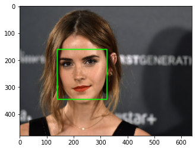
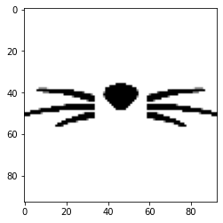
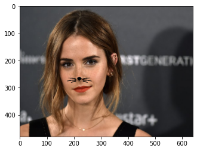
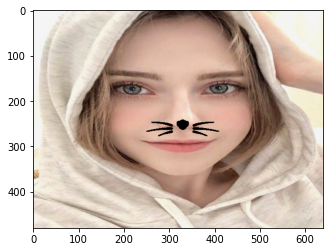
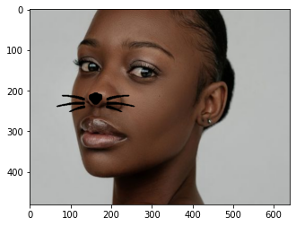
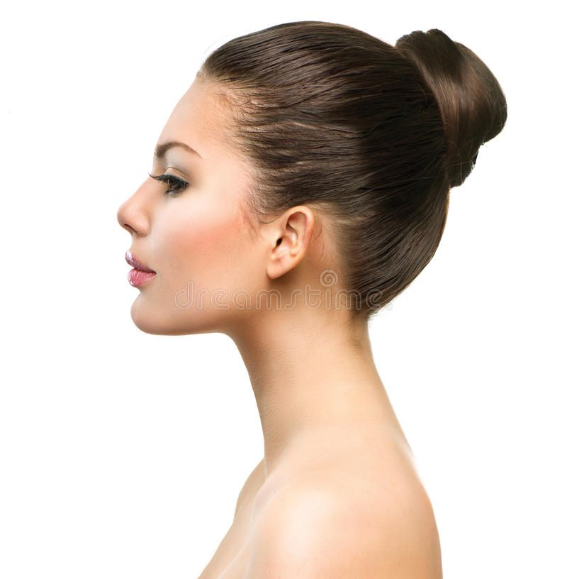

### 라이브러리 호출


```python
import cv2
import matplotlib.pyplot as plt
import numpy as np
import os
```

### 사진 불러오기


```python
my_image_path = os.getenv('HOME')+'/aiffel/Exploration/3. 고양이 수염 스티커/emmawatson.jpg'
img_bgr = cv2.imread(my_image_path)    #- OpenCV로 이미지를 읽어서
img_bgr = cv2.resize(img_bgr,(640, 480))    # 편의를 위해 Resize (16:9이면 640x360, 4:3이면 640x480)
img_show = img_bgr.copy()      #- 출력용 이미지 별도 보관

# opencv는 BGR(파랑, 녹색, 빨강)을 사용하므로 색깔 보정처리를 해주자
img_rgb = cv2.cvtColor(img_bgr, cv2.COLOR_BGR2RGB)
plt.imshow(img_rgb)
plt.show()
```


    

    


### Face detection (Bounding box)


```python
import dlib
detector_hog = dlib.get_frontal_face_detector() # dlib의 face detector는 HOG feature를 사용해서 SVM sliding window로 얼굴을 찾는다
                                                # # HOG detector 선언 (HOG : 밝기가 변하는 방향인 gradient를 feature로 사용한다)
img_rgb = cv2.cvtColor(img_bgr, cv2.COLOR_BGR2RGB) # dlib은 rgb 이미지를 입력으로 받는다!
dlib_rects = detector_hog(img_rgb, 1)   # - (image, num of img pyramid), 이미지를 upsampling 방법을 통해 크기를 키우는 것을 이미지 피라미드라고 한다.

print(dlib_rects)   # 찾은 얼굴영역 좌표

for dlib_rect in dlib_rects:
    l = dlib_rect.left()
    t = dlib_rect.top()
    r = dlib_rect.right()
    b = dlib_rect.bottom()
    w = dlib_rect.width()
    h = dlib_rect.height()

    cv2.rectangle(img_show, (l,t), (r,b), (0,255,0), 2, lineType=cv2.LINE_AA) # cv2.rectangle(img, start, end, color, thickness)

# 찾은 얼굴을 화면에 출력하자
img_show_rgb =  cv2.cvtColor(img_show, cv2.COLOR_BGR2RGB)
plt.imshow(img_show_rgb)
plt.show()
```

    rectangles[[(139, 160) (324, 345)]]


    

    


### Face Landmark (이목구비)


```python
# 랜드마크 모델 불러오기
model_path = os.getenv('HOME')+'/aiffel/camera_sticker/models/shape_predictor_68_face_landmarks.dat'
landmark_predictor = dlib.shape_predictor(model_path)

# 68개의 랜드마크 개별 위치 리스트 저장
list_landmarks = []
for dlib_rect in dlib_rects:
    points = landmark_predictor(img_rgb, dlib_rect)
    list_points = list(map(lambda p: (p.x, p.y), points.parts()))
    list_landmarks.append(list_points)

print(len(list_landmarks[0]))
```

    68


```python
# 사진에 랜드마크를 찍어보자

for landmark in list_landmarks:
    for idx, point in enumerate(landmark):
        cv2.circle(img_show, point, 2, (0, 255, 255), -1) # yellow

img_show_rgb = cv2.cvtColor(img_show, cv2.COLOR_BGR2RGB)
plt.imshow(img_show_rgb)
plt.show()
```


    

    


### 스티커 붙이기


```python
# 코끝 바로 이전 콧대 포인트인 30번과 코끝인 33번 포인트의 중점에 붙이면 되겠다

for dlib_rect, landmark in zip(dlib_rects, list_landmarks):
    x = (landmark[33][0] + landmark[30][0]) // 2
    y = (landmark[33][1] + landmark[30][1]) // 2
    w = dlib_rect.width() // 2
    h = dlib_rect.height() // 2
    print ('(x,y) : (%d,%d)'%(x,y))
    print ('(w,h) : (%d,%d)'%(w,h))
    
sticker_path = os.getenv('HOME')+'/aiffel/Exploration/3. 고양이 수염 스티커/cat-whiskers.png' # 스티커를 불러오고
img_sticker = cv2.imread(sticker_path)
img_sticker = cv2.resize(img_sticker, (w,h)) # 스티커의 width, height를 bounding box 각각의 절반으로 설정해주자
print (img_sticker.shape)

plt.imshow(img_sticker)
plt.show()
```

    (x,y) : (220,271)
    (w,h) : (93,93)
    (93, 93, 3)


    

    


```python
# 이미지 시작점을 정하자 (이미지 시작점은 top-left 좌표이다)

refined_x = x - w // 2
refined_y = y - h // 2
print ('(x,y) : (%d,%d)'%(refined_x, refined_y))
```

    (x,y) : (174,225)


```python
# 스티커 적용

sticker_area = img_show[refined_y:refined_y + h, refined_x:refined_x + w]
img_show[refined_y:refined_y + h, refined_x:refined_x + w] = \
    np.where(img_sticker==0,img_sticker,sticker_area).astype(np.uint8)

# np.where(img_sticker == 0, img_sticker, sticker_area)로 설정 -> 스티커의 흰바탕을 사라지게

plt.imshow(cv2.cvtColor(img_show, cv2.COLOR_BGR2RGB))
plt.show()
```


    

    


### 최종 결과


```python
sticker_area = img_bgr[refined_y:refined_y + h, refined_x:refined_x + w]
img_bgr[refined_y:refined_y + h, refined_x:refined_x + w] = \
    np.where(img_sticker==0,img_sticker,sticker_area).astype(np.uint8)
plt.imshow(cv2.cvtColor(img_bgr, cv2.COLOR_BGR2RGB))
plt.show()
```


    

    


### 스티커 뒤로 원본 이미지가 같이 보이도록 만들어보자


```python
# 1. 합성에 사용할 사진
img1 = cv2.imread(my_image_path)
img2 = cv2.imread(sticker_path)
img2.shape

# 2. NumPy 배열에 수식을 직접 연산해서 알파 블렌딩 적용
alpha = 0.5
blended = img1 * alpha + img2 * (1-alpha)
blended = blended.astype(np.uint8) # 소수점 발생을 제거하기 위함
cv2.imshow('img1 * alpha + img2 * (1-alpha)', blended)

# 3. addWeighted() 함수로 알파 블렌딩 적용
dst = cv2.addWeighted(img1, alpha, img2, (1-alpha), 0) 
cv2.imshow('cv2.addWeighted', dst)


# img1과 img2의 shape이 달라서 img1을 img2에 맞게 resize해준 후 해당 코드를 실행하니 kernel이 죽는 현상이 발생한다.
# 왜 그럴까..
```

### 다른 이미지를 테스트해보자


```python
from IPython.display import Image
Image(filename='1.png')
```


    

    


```python
Image(filename='2.png')
```


    

    


```python
Image(filename='facefromtheside.jpg')
# 측면 사진은 bbox조차 생성이 안된다.
```


    

    


### 회고

#### 1. 이미지 시작점을 정할 때, refined_x = x - w // 2    이런 식으로 subtract한다
- left top으로 갈수록 value가 작아지기 때문이다.
- 왼쪽 위로 올라가야하니까 + 아닌가?라고 생각했었는데 틀렸다!

#### 2. 이미지랑 스티커가 겹쳐보일 수 있도록 시도
- 결론적으론 실패했다.
- 두 이미지의 사이즈가 다르길래 resize를 한 후 코드를 돌려보니 자꾸 커널이 die하는 현상이 나타난다.
- 다른 분들은 어떻게 구현하셨는지 확인해봐야겠다.

### 문제점

#### 1. 얼굴 각도에 따라 스티커가 어떻게 변해야할까요?
-  얼굴 좌표를 두 개 고른 후 (예를들어 왼쪽 광대와 오른쪽 광대) 기울기를 구하고 그에 따라 스티커를 rotate시켜준다.

#### 2. 멀리서 촬영하면 왜 안될까요? 옆으로 누워서 촬영하면 왜 안될까요?
- 옆모습은 대부분 인식이 안되었다.

#### 3. 실행 속도가 중요할까요?
- 중요하다. 엔터테인먼트 용도이므로 얼굴에 맞춰진 스티커가 화면에 빠르게 나오지 않는다면 참을성 없는 대부분의 소비자는 답답함을 느낄 것이다.

#### 4. 스티커앱을 만들 때 정확도가 얼마나 중요할까요?
- 중요하다. 수염 스티커가 내 눈에 표시된다면.. 누가 쓸까?
