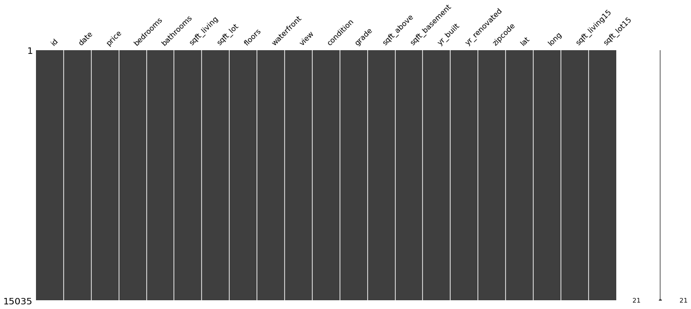
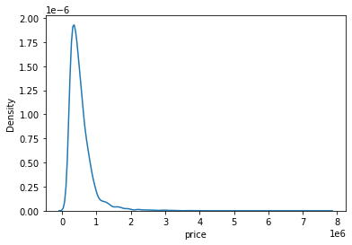
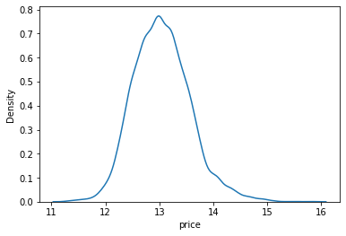
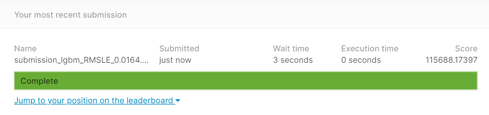

```python
import os
from os.path import join
import pandas as pd

data_dir = os.getenv('HOME')+'/aiffel/Exploration/6. 캐글 경진대회/kaggle_kakr_housing/data'

train_data_path = join(data_dir, 'train.csv')
sub_data_path = join(data_dir, 'test.csv') 

train = pd.read_csv(train_data_path)
sub = pd.read_csv(sub_data_path)
```

## 1. 데이터를 살펴보자


```python
print('train data dim : {}'.format(train.shape))
print('sub data dim : {}'.format(sub.shape))
train.head()
```

    train data dim : (15035, 21)
    sub data dim : (6468, 20)


<div>
<style scoped>
    .dataframe tbody tr th:only-of-type {
        vertical-align: middle;
    }

    .dataframe tbody tr th {
        vertical-align: top;
    }

    .dataframe thead th {
        text-align: right;
    }
</style>
<table border="1" class="dataframe">
  <thead>
    <tr style="text-align: right;">
      <th></th>
      <th>id</th>
      <th>date</th>
      <th>price</th>
      <th>bedrooms</th>
      <th>bathrooms</th>
      <th>sqft_living</th>
      <th>sqft_lot</th>
      <th>floors</th>
      <th>waterfront</th>
      <th>view</th>
      <th>...</th>
      <th>grade</th>
      <th>sqft_above</th>
      <th>sqft_basement</th>
      <th>yr_built</th>
      <th>yr_renovated</th>
      <th>zipcode</th>
      <th>lat</th>
      <th>long</th>
      <th>sqft_living15</th>
      <th>sqft_lot15</th>
    </tr>
  </thead>
  <tbody>
    <tr>
      <th>0</th>
      <td>0</td>
      <td>20141013T000000</td>
      <td>221900.0</td>
      <td>3</td>
      <td>1.00</td>
      <td>1180</td>
      <td>5650</td>
      <td>1.0</td>
      <td>0</td>
      <td>0</td>
      <td>...</td>
      <td>7</td>
      <td>1180</td>
      <td>0</td>
      <td>1955</td>
      <td>0</td>
      <td>98178</td>
      <td>47.5112</td>
      <td>-122.257</td>
      <td>1340</td>
      <td>5650</td>
    </tr>
    <tr>
      <th>1</th>
      <td>1</td>
      <td>20150225T000000</td>
      <td>180000.0</td>
      <td>2</td>
      <td>1.00</td>
      <td>770</td>
      <td>10000</td>
      <td>1.0</td>
      <td>0</td>
      <td>0</td>
      <td>...</td>
      <td>6</td>
      <td>770</td>
      <td>0</td>
      <td>1933</td>
      <td>0</td>
      <td>98028</td>
      <td>47.7379</td>
      <td>-122.233</td>
      <td>2720</td>
      <td>8062</td>
    </tr>
    <tr>
      <th>2</th>
      <td>2</td>
      <td>20150218T000000</td>
      <td>510000.0</td>
      <td>3</td>
      <td>2.00</td>
      <td>1680</td>
      <td>8080</td>
      <td>1.0</td>
      <td>0</td>
      <td>0</td>
      <td>...</td>
      <td>8</td>
      <td>1680</td>
      <td>0</td>
      <td>1987</td>
      <td>0</td>
      <td>98074</td>
      <td>47.6168</td>
      <td>-122.045</td>
      <td>1800</td>
      <td>7503</td>
    </tr>
    <tr>
      <th>3</th>
      <td>3</td>
      <td>20140627T000000</td>
      <td>257500.0</td>
      <td>3</td>
      <td>2.25</td>
      <td>1715</td>
      <td>6819</td>
      <td>2.0</td>
      <td>0</td>
      <td>0</td>
      <td>...</td>
      <td>7</td>
      <td>1715</td>
      <td>0</td>
      <td>1995</td>
      <td>0</td>
      <td>98003</td>
      <td>47.3097</td>
      <td>-122.327</td>
      <td>2238</td>
      <td>6819</td>
    </tr>
    <tr>
      <th>4</th>
      <td>4</td>
      <td>20150115T000000</td>
      <td>291850.0</td>
      <td>3</td>
      <td>1.50</td>
      <td>1060</td>
      <td>9711</td>
      <td>1.0</td>
      <td>0</td>
      <td>0</td>
      <td>...</td>
      <td>7</td>
      <td>1060</td>
      <td>0</td>
      <td>1963</td>
      <td>0</td>
      <td>98198</td>
      <td>47.4095</td>
      <td>-122.315</td>
      <td>1650</td>
      <td>9711</td>
    </tr>
  </tbody>
</table>
<p>5 rows × 21 columns</p>
</div>


1. ID : 집을 구분하는 번호
2. date : 집을 구매한 날짜
3. price : 타겟 변수인 집의 가격
- 집을 구매한 시점의 가격. 이 말은 현재의 가격을 반영하는게 아니라는 말과 같다. 집을 산 이후 리모델링을 통해 집을 고쳤어도 집의 가격에는 영향을 주지 못한다.
4. bedrooms : 침실의 수
5. bathrooms : 침실당 화장실 개수
6. sqft_living : 주거 공간의 평방 피트
7. sqft_lot : 부지의 평방 피트
8. floors : 집의 층 수
9. waterfront : 집의 전방에 강이 흐르는지 유무 (a.k.a. 리버뷰)
10. view : 집이 얼마나 좋아 보이는지의 정도
11. condition : 집의 전반적인 상태
12. grade : King County grading 시스템 기준으로 매긴 집의 등급
13. sqft_above : 지하실을 제외한 평방 피트
14. sqft_basement : 지하실의 평방 피트
15. yr_built : 집을 지은 년도
16. yr_renovated : 집을 재건축한 년도
- 0은 재건축을 하지 않았다는 의미
17. zipcode : 우편번호
18. lat : 위도
19. long : 경도
20. sqft_living15 : 2015년 기준 주거 공간의 평방 피트(집을 재건축했다면, 변화가 있을 수 있음)
21. sqft_lot15 : 2015년 기준 부지의 평방 피트(집을 재건축했다면, 변화가 있을 수 있음)

## 2. 데이터 전처리

- 중복 데이터는 없다
- 결측치도 없다
- date, price, id 전처리

#### 중복되는 train 데이터 출력


```python
train[train.duplicated()]   
```


<div>
<style scoped>
    .dataframe tbody tr th:only-of-type {
        vertical-align: middle;
    }

    .dataframe tbody tr th {
        vertical-align: top;
    }

    .dataframe thead th {
        text-align: right;
    }
</style>
<table border="1" class="dataframe">
  <thead>
    <tr style="text-align: right;">
      <th></th>
      <th>id</th>
      <th>date</th>
      <th>price</th>
      <th>bedrooms</th>
      <th>bathrooms</th>
      <th>sqft_living</th>
      <th>sqft_lot</th>
      <th>floors</th>
      <th>waterfront</th>
      <th>view</th>
      <th>...</th>
      <th>grade</th>
      <th>sqft_above</th>
      <th>sqft_basement</th>
      <th>yr_built</th>
      <th>yr_renovated</th>
      <th>zipcode</th>
      <th>lat</th>
      <th>long</th>
      <th>sqft_living15</th>
      <th>sqft_lot15</th>
    </tr>
  </thead>
  <tbody>
  </tbody>
</table>
<p>0 rows × 21 columns</p>
</div>


#### 중복되는 sub 데이터 출력


```python
sub[sub.duplicated()]
```


<div>
<style scoped>
    .dataframe tbody tr th:only-of-type {
        vertical-align: middle;
    }

    .dataframe tbody tr th {
        vertical-align: top;
    }

    .dataframe thead th {
        text-align: right;
    }
</style>
<table border="1" class="dataframe">
  <thead>
    <tr style="text-align: right;">
      <th></th>
      <th>id</th>
      <th>date</th>
      <th>bedrooms</th>
      <th>bathrooms</th>
      <th>sqft_living</th>
      <th>sqft_lot</th>
      <th>floors</th>
      <th>waterfront</th>
      <th>view</th>
      <th>condition</th>
      <th>grade</th>
      <th>sqft_above</th>
      <th>sqft_basement</th>
      <th>yr_built</th>
      <th>yr_renovated</th>
      <th>zipcode</th>
      <th>lat</th>
      <th>long</th>
      <th>sqft_living15</th>
      <th>sqft_lot15</th>
    </tr>
  </thead>
  <tbody>
  </tbody>
</table>
</div>


#### train 결측치 출력


```python
import missingno as msno

# train 결측치 -> 결측치가 없다면 매트릭스 전체가 까맣게 표시
msno.matrix(train)
```


    <AxesSubplot:>


    

    


```python
# 결측치가 없는 것 같지만 확실히 하기 위해
for c in train.columns:
    print('{} : {}'.format(c, len(train.loc[pd.isnull(train[c]), c].values)))
```

    id : 0
    date : 0
    price : 0
    bedrooms : 0
    bathrooms : 0
    sqft_living : 0
    sqft_lot : 0
    floors : 0
    waterfront : 0
    view : 0
    condition : 0
    grade : 0
    sqft_above : 0
    sqft_basement : 0
    yr_built : 0
    yr_renovated : 0
    zipcode : 0
    lat : 0
    long : 0
    sqft_living15 : 0
    sqft_lot15 : 0


#### sub 결측치 출력


```python
for c in sub.columns:
    print('{} : {}'.format(c, len(sub.loc[pd.isnull(sub[c]), c].values)))
```

    id : 0
    date : 0
    bedrooms : 0
    bathrooms : 0
    sqft_living : 0
    sqft_lot : 0
    floors : 0
    waterfront : 0
    view : 0
    condition : 0
    grade : 0
    sqft_above : 0
    sqft_basement : 0
    yr_built : 0
    yr_renovated : 0
    zipcode : 0
    lat : 0
    long : 0
    sqft_living15 : 0
    sqft_lot15 : 0


#### date, price, id 전처리


```python
# train 데이터의 date, price, id 전처리

# date를 6자리 정수형 int 데이터로 수정
train['date'] = train['date'].apply(lambda i: i[:6]).astype(int)

# train 데이터의 price를 y 변수에 저장하고, train에서 삭제하자
y = train['price']
del train['price']

# id 칼럼을 삭제하자
del train['id']
```


```python
# sub 데이터의 date, id 전처리

# sub에는 우리가 맞추어야 할 타겟 데이터인 price가 없다.
# 그러므로 처리 안해줘도 된다.

# date를 6자리 정수형 int 데이터로 수정
sub['date'] = sub['date'].apply(lambda i: i[:6]).astype(int)

# id 칼럼을 삭제하자
del sub['id']
```

## 3. 데이터 분포 확인

#### price 데이터 분포 확인


```python
import seaborn as sns
import matplotlib.pyplot as plt

sns.kdeplot(y)
plt.show()

# 왼쪽으로 크게 치우쳐 있는 형태 -> np.log1p() 변환을 해주고
# 나중에 모델이 값을 예측한 후에 다시 np.exp1m()을 활용해서 되돌리자.
# np.exp1m()은 np.log1p()과는 반대로 각 원소 x마다 exp(x)-1의 값을 반환
```


    

    


```python
import numpy as np

y = np.log1p(y)
sns.kdeplot(y)
plt.show()

# 비교적 완만한 정규분포의 형태로 잘 변환되었다.
```


    

    


## 4. 편의를 위해 함수를 만들자
- 반복적인 작업들을 함수로 구현하자


```python
# 데이터셋을 훈련 데이터셋과 검증 데이터셋으로 나누기 위한 train_test_split 함수
from sklearn.model_selection import train_test_split

# RMSE 점수를 계산하기 위한 mean_squared_error
from sklearn.metrics import mean_squared_error

# RMSE 함수
def rmse(y_test, y_pred):
    return np.sqrt(mean_squared_error(np.expm1(y_test), np.expm1(y_pred)))

# y_test나 y_pred는 위에서 np.log1p()로 변환이 된 값이기 때문에
# 원래 데이터의 단위에 맞게 되돌리기 위해 np.expm1()을 추가해야 한다.
```


```python
# 네 가지 모델을 가져오자

from xgboost import XGBRegressor
from lightgbm import LGBMRegressor
from sklearn.ensemble import GradientBoostingRegressor, RandomForestRegressor
```


```python
random_state=2021
# random_state는 모델초기화나 데이터셋 구성에 사용되는 랜덤 시드값
# 이를 고정하면 모델 & 데이터셋이 동일한 경우 학습결과도 항상 동일하게 재현된다.

# 아래와 같이 모델 인스턴스를 생성한 후 models라는 리스트에 넣어준다.
gboost = GradientBoostingRegressor(random_state=random_state)
xgboost = XGBRegressor(random_state=random_state)
lightgbm = LGBMRegressor(random_state=random_state)
rdforest = RandomForestRegressor(random_state=random_state)

models = [gboost, xgboost, lightgbm, rdforest]
```


```python
# 각 모델에 대해 RMSE값을 구하는 함수

def get_scores(models, train, y):
    df = {}
    
    for model in models:
        # 각 모델의 이름은 다음과 같이 클래스의 name 속성에 접근해서 얻을 수 있다
        model_name = model.__class__.__name__
        
        # train, test 데이터셋 분리 - 여기에도 random_state를 고정
        X_train, X_test, y_train, y_test =train_test_split(train, y,
                                                           random_state=random_state,
                                                           test_size=0.2)
        
        # 각 모델 (gboost, xgboost, lightgbm, rdforest) 학습
        model.fit(X_train, y_train)
        
        # 예측
        y_pred = model.predict(X_test)
        
        # 예측 결과의 rmse점수를 구한다
        df[model_name] = rmse(y_test, y_pred)
        
        # data frame에 저장
        score_df = pd.DataFrame(df, index=['RMSE']).T.sort_values('RMSE',
                                                                  ascending=False)    
            
    return score_df
```


```python
get_scores(models, train, y)
# XGBRegressor가 126848.451359으로 성능이 가장 좋은 것 같다
```


<div>
<style scoped>
    .dataframe tbody tr th:only-of-type {
        vertical-align: middle;
    }

    .dataframe tbody tr th {
        vertical-align: top;
    }

    .dataframe thead th {
        text-align: right;
    }
</style>
<table border="1" class="dataframe">
  <thead>
    <tr style="text-align: right;">
      <th></th>
      <th>RMSE</th>
    </tr>
  </thead>
  <tbody>
    <tr>
      <th>GradientBoostingRegressor</th>
      <td>137616.546062</td>
    </tr>
    <tr>
      <th>RandomForestRegressor</th>
      <td>136497.215502</td>
    </tr>
    <tr>
      <th>LGBMRegressor</th>
      <td>128291.753330</td>
    </tr>
    <tr>
      <th>XGBRegressor</th>
      <td>126848.451359</td>
    </tr>
  </tbody>
</table>
</div>


## 5. 하이퍼 파라미터 튜닝 - GridSearchCV

- GridSearchCV (그리드 탐색) : 사람이 먼저 탐색할 하이퍼 파라미터의 값들을 정해두고, 그 값들로 만들어질 수 있는 모든 조합을 탐색. 특정 값에 대한 하이퍼 파라미터 조합을 모두 탐색하고자 할 때 유리하다.

#### GridSearchCV에 입력되는 인자

- param_grid : 탐색할 파라미터의 종류 (딕셔너리로 입력)
- scoring : 모델의 성능을 평가할 지표
- cv : cross validation을 수행하기 위해 train 데이터셋을 나누는 조각의 개수
- verbose : 그리드 탐색을 진행하면서 진행 과정을 출력해서 보여줄 메세지의 양 (숫자가 클수록 더 많은 메세지를 출력합니다.)
- n_jobs : 그리드 탐색을 진행하면서 사용할 CPU의 개수


```python
from sklearn.model_selection import GridSearchCV

# 그리드 탐색을 수행하고 결과를 확인하는 함수

def my_GridSearch(model, train, y, param_grid, verbose=2, n_jobs=5):
    # GridSearchCV 모델로 초기화
    grid_model = GridSearchCV(model, param_grid=param_grid, scoring='neg_mean_squared_error', \
                              cv=5, verbose=verbose, n_jobs=n_jobs)
    
    # 모델 fitting
    grid_model.fit(train, y)

    # 다음과 같이 GridSearchCV를 이용해서 grid_model 모델을 초기화하고,
    # train과 y 데이터로 모델을 간단히 학습시키면
    # param_grid 내의 모든 하이퍼 파라미터의 조합에 대해 실험이 완료된다.
    
    # 이제 결과를 보자.
    # 관심 있는 정보는 어떤 파라미터 조합일 때 점수가 어떻게 나오게 되는지에 관한 것
    # 파라미터 조합은 위 딕셔너리 중 params
    # 각각에 대한 테스트 점수는 mean_test_score
    params = grid_model.cv_results_['params']
    score = grid_model.cv_results_['mean_test_score']
    
    # 이 둘을 가지고 데이터 프레임을 만들고 최적의 하이퍼 파라미터의 조합을 찾아보자
    results = pd.DataFrame(params)
    results['score'] = score
    
    # GridSearchCV로 grid_model 모델을 초기화할 때
    # scoring 인자에 MSE에 음수를 취한 값인 neg_mean_squared_error를 입력했다.
    
    # 하지만 그리드 탐색을 하면서는 np.expm1()으로 변환하는 과정이 없었기 때문에
    # log 변환되어 있는 price 데이터에서 손실함수값을 계산했다.
    
    # rmsLe 값 계산 후 낮은 순서대로 정렬
    results['RMSLE'] = np.sqrt(-1 * results['score'])
    results = results.sort_values('RMSLE')

    return results
```

## 6. 제출


```python
# 먼저 위에서 만들어놓은 my_GridSearch() 함수로 간단한 그리드 탐색을 해보자

# param_grid에 탐색할 하이퍼 파라미터를 넣어서 준비
param_grid = {
    'n_estimators': [50, 100],
    'max_depth': [1, 10],
    'learning_rate' : [0.05,0.1]
}

# 모델은 LightGBM(lgbm)
model = LGBMRegressor(random_state=random_state)
my_GridSearch(model, train, y, param_grid, verbose=2, n_jobs=5)
```

    Fitting 5 folds for each of 8 candidates, totalling 40 fits


    [Parallel(n_jobs=5)]: Using backend LokyBackend with 5 concurrent workers.
    [Parallel(n_jobs=5)]: Done  31 tasks      | elapsed:    2.3s


    [LightGBM] [Warning] Accuracy may be bad since you didn't explicitly set num_leaves OR 2^max_depth > num_leaves. (num_leaves=31).


    [Parallel(n_jobs=5)]: Done  40 out of  40 | elapsed:    2.9s finished


<div>
<style scoped>
    .dataframe tbody tr th:only-of-type {
        vertical-align: middle;
    }

    .dataframe tbody tr th {
        vertical-align: top;
    }

    .dataframe thead th {
        text-align: right;
    }
</style>
<table border="1" class="dataframe">
  <thead>
    <tr style="text-align: right;">
      <th></th>
      <th>learning_rate</th>
      <th>max_depth</th>
      <th>n_estimators</th>
      <th>score</th>
      <th>RMSLE</th>
    </tr>
  </thead>
  <tbody>
    <tr>
      <th>7</th>
      <td>0.10</td>
      <td>10</td>
      <td>100</td>
      <td>-0.027027</td>
      <td>0.164399</td>
    </tr>
    <tr>
      <th>6</th>
      <td>0.10</td>
      <td>10</td>
      <td>50</td>
      <td>-0.029177</td>
      <td>0.170814</td>
    </tr>
    <tr>
      <th>3</th>
      <td>0.05</td>
      <td>10</td>
      <td>100</td>
      <td>-0.029227</td>
      <td>0.170960</td>
    </tr>
    <tr>
      <th>2</th>
      <td>0.05</td>
      <td>10</td>
      <td>50</td>
      <td>-0.037337</td>
      <td>0.193227</td>
    </tr>
    <tr>
      <th>5</th>
      <td>0.10</td>
      <td>1</td>
      <td>100</td>
      <td>-0.055020</td>
      <td>0.234564</td>
    </tr>
    <tr>
      <th>4</th>
      <td>0.10</td>
      <td>1</td>
      <td>50</td>
      <td>-0.073394</td>
      <td>0.270914</td>
    </tr>
    <tr>
      <th>1</th>
      <td>0.05</td>
      <td>1</td>
      <td>100</td>
      <td>-0.074104</td>
      <td>0.272221</td>
    </tr>
    <tr>
      <th>0</th>
      <td>0.05</td>
      <td>1</td>
      <td>50</td>
      <td>-0.104556</td>
      <td>0.323351</td>
    </tr>
  </tbody>
</table>
</div>


```python
# 가장 좋은 조합은 max_depth=10, n_estimators=100, learning_rate = 0.10
# 해당 모델로 학습을 해서 예측값인 submission.csv 파일을 만들어서 제출해보자.

model = LGBMRegressor(max_depth=10, n_estimators=100, learning_rate=0.10, random_state=random_state)
```


```python
# 모델을 학습시킨 후 예측 결과를 저장하는 함수

def save_submission(model, train, y, test, model_name, rmsle=None):
    model.fit(train, y)
    prediction = model.predict(test)
    
    # 예측 결과에 np.expm1()을 씌워서 다시 원래 스케일로 되돌리자
    prediction = np.expm1(prediction)
    
    data_dir = os.getenv('HOME')+'/aiffel/Exploration/6. 캐글 경진대회/kaggle_kakr_housing/data'
    submission_path = join(data_dir, 'sample_submission.csv')
    submission = pd.read_csv(submission_path)
    
    # 데이터프레임에 우리의 모델이 예측한 값을 덮어씌우자.
    submission['price'] = prediction
    
    # 파일 이름에 모델의 종류와 위에서 확인했던 RMSLE 값을 넣어주자
    submission_csv_path = '{}/submission_{}_RMSLE_{}.csv'.format(data_dir, model_name, rmsle)
    submission.to_csv(submission_csv_path, index=False)
    print('{} saved!'.format(submission_csv_path))
```


```python
save_submission(model, train, y, sub, 'lgbm', rmsle='0.0164')
```

    /aiffel/aiffel/Exploration/6. 캐글 경진대회/kaggle_kakr_housing/data/submission_lgbm_RMSLE_0.0164.csv saved!


## 7. Score


```python
from IPython.display import Image
Image("score.png")
```


    

    


## 8. 회고

1. 우선 내용 자체를 이해하는데 애를 먹었다. 하이퍼 파라미터 조정이나 feature engineering 등은 시도하지 못했다. 그래도 실제 데이터를 이해하고 뚝딱뚝딱 다루어 봤다는 것에 의의를 두려고 한다.
2. sklearn.model_selection의 train_test_split를 이용하여 train 데이터를 train + test(validation set)으로 나누는 과정이 있는데, 이 test가 validation set인지 sub인지 헷갈렸었다. 그래서 처음으로 돌아가 최종 test에 사용되는 데이터를 sub으로 표기하였다.

2. AgeragingBlending()을 구현해보려고 했는데 부족한 코딩 실력으로 그러지 못했다.
3. 제출시간이 다 되어서야 공개된 제출본을 찾아봤다. 조금 더 일찍 알아볼걸. 상관관계로 spearman을 사용한다거나 각각의 변수와 price를 plotting해서 상관관계를 파악하는 방법이 있다는 것을 이제야 알았다. 하지만 계속 이것만을 붙잡을 수 없어서 아쉬운 상태로 제출한다.
4. 점점 아이펠 과정을 따라가기가 쉽지 않은 것 같다. 공부량이 무척 많다. 정신 바짝 차리자.
