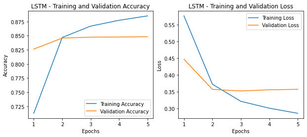
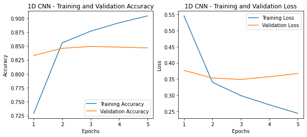
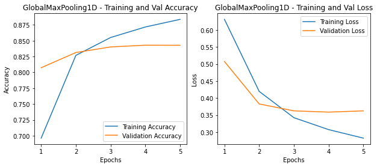
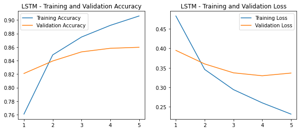

## 네이버 영화리뷰 감성분석
- 데이터셋 : 네이버 영화의 댓글로 구성된 Naver sentiment movie corpus https://github.com/e9t/nsmc

## 1. 데이터 준비와 확인


```python
import pandas as pd
import urllib.request
%matplotlib inline
import matplotlib.pyplot as plt
import re
from konlpy.tag import Okt
from tensorflow import keras
from tensorflow.keras.preprocessing.text import Tokenizer
import numpy as np
from tensorflow.keras.preprocessing.sequence import pad_sequences
from collections import Counter

# 데이터를 읽어봅시다. 
train_data = pd.read_table('~/aiffel/Exploration/7. 영화 리뷰 텍스트 감성분석/sentiment_classification/data/ratings_train.txt')
test_data = pd.read_table('~/aiffel/Exploration/7. 영화 리뷰 텍스트 감성분석/sentiment_classification/data/ratings_test.txt')

train_data.head() # 0 ~ 149999, 150,000개
# test_data.head() # 0 ~ 49999, 50,000개
# 총 20만개

# label: The sentiment class of the review. (0: negative, 1: positive)
```


<div>
<style scoped>
    .dataframe tbody tr th:only-of-type {
        vertical-align: middle;
    }

    .dataframe tbody tr th {
        vertical-align: top;
    }

    .dataframe thead th {
        text-align: right;
    }
</style>
<table border="1" class="dataframe">
  <thead>
    <tr style="text-align: right;">
      <th></th>
      <th>id</th>
      <th>document</th>
      <th>label</th>
    </tr>
  </thead>
  <tbody>
    <tr>
      <th>0</th>
      <td>9976970</td>
      <td>아 더빙.. 진짜 짜증나네요 목소리</td>
      <td>0</td>
    </tr>
    <tr>
      <th>1</th>
      <td>3819312</td>
      <td>흠...포스터보고 초딩영화줄....오버연기조차 가볍지 않구나</td>
      <td>1</td>
    </tr>
    <tr>
      <th>2</th>
      <td>10265843</td>
      <td>너무재밓었다그래서보는것을추천한다</td>
      <td>0</td>
    </tr>
    <tr>
      <th>3</th>
      <td>9045019</td>
      <td>교도소 이야기구먼 ..솔직히 재미는 없다..평점 조정</td>
      <td>0</td>
    </tr>
    <tr>
      <th>4</th>
      <td>6483659</td>
      <td>사이몬페그의 익살스런 연기가 돋보였던 영화!스파이더맨에서 늙어보이기만 했던 커스틴 ...</td>
      <td>1</td>
    </tr>
  </tbody>
</table>
</div>


## 2. 데이터로더 구성


```python
from konlpy.tag import Mecab
tokenizer = Mecab()
stopwords = ['의','가','이','은','들','는','좀','잘','걍','과','도','를','으로','자','에','와','한','하다']

def load_data(train_data, test_data, num_words=10000):
    train_data.drop_duplicates(subset=['document'], inplace=True)
    train_data = train_data.dropna(how = 'any') 
    test_data.drop_duplicates(subset=['document'], inplace=True)
    test_data = test_data.dropna(how = 'any') 
    # 데이터의 중복 제거
    # NaN 결측치 제거
    
    X_train = []
    for sentence in train_data['document']:
        temp_X = tokenizer.morphs(sentence) # 한국어 토크나이저로 토큰화
        temp_X = [word for word in temp_X if not word in stopwords] 
        # 불용어(Stopwords) 제거
        X_train.append(temp_X)

    X_test = []
    for sentence in test_data['document']:
        temp_X = tokenizer.morphs(sentence) # 토큰화
        temp_X = [word for word in temp_X if not word in stopwords] # 불용어 제거
        X_test.append(temp_X)
    
    words = np.concatenate(X_train).tolist()
    counter = Counter(words)
    counter = counter.most_common(10000-4)
    vocab = ['', '', '', ''] + [key for key, _ in counter]
    word_to_index = {word:index for index, word in enumerate(vocab)}
    # 사전word_to_index 구성
        
    def wordlist_to_indexlist(wordlist):
        return [word_to_index[word] if word in word_to_index else word_to_index[''] for word in wordlist]
        
    X_train = list(map(wordlist_to_indexlist, X_train))
    X_test = list(map(wordlist_to_indexlist, X_test))
    # 텍스트 스트링을 사전 인덱스 스트링으로 변환
    return X_train, np.array(list(train_data['label'])), X_test, np.array(list(test_data['label'])), word_to_index
    
X_train, y_train, X_test, y_test, word_to_index = load_data(train_data, test_data)
# X_train, y_train, X_test, y_test, word_to_index 리턴
```


```python
# 실제 예시 확인

print(X_train[0])  # 1번째 리뷰데이터
print('라벨: ', y_train[0])  # 1번째 리뷰데이터의 라벨
# label: The sentiment class of the review. (0: negative, 1: positive)

print('1번째 리뷰 문장 길이: ', len(X_train[0]))
print('2번째 리뷰 문장 길이: ', len(X_train[1]))
```

    [32, 74, 919, 4, 4, 39, 228, 20, 33, 748]
    라벨:  0
    1번째 리뷰 문장 길이:  10
    2번째 리뷰 문장 길이:  17


```python
# 위에서
# word_to_index = {word:index for index, word in enumerate(vocab)}라고 정의함

index_to_word = {index:word for word, index in word_to_index.items()}
print(index_to_word[5]) # 영화
print(word_to_index['영화']) # 5
print(index_to_word[28]) # 정말
print(word_to_index['정말']) # 28
```

    영화
    5
    정말
    28


```python
word_to_index["<PAD>"]=0   # 패딩용 단어
word_to_index["<BOS>"]=1   # 문장의 시작지점
word_to_index["<UNK>"]=2   # 사전에 없는 단어
word_to_index["<UNUSED>"]=3

index_to_word[0] = "<PAD>"
index_to_word[1] = "<BOS>"
index_to_word[2] = "<UNK>"
index_to_word[3] = "<UNUSED>"
```


```python
# 문장 1개를 활용할 딕셔너리와 함께 주면, 단어 인덱스 리스트 벡터로 변환해 주는 함수

# 단, 모든 문장은 <BOS>로 시작하는 것으로 합니다. 
def get_encoded_sentence(sentence, word_to_index):
    return [word_to_index['<BOS>']]+[word_to_index[word] 
                                     if word in word_to_index else word_to_index['<UNK>']
                                     for word in sentence.split()]

# 여러 개의 문장 리스트를 한꺼번에 단어 인덱스 리스트 벡터로 encode해 주는 함수 
def get_encoded_sentences(sentences, word_to_index):
    return [get_encoded_sentence(sentence, word_to_index) for sentence in sentences]

# 숫자 벡터로 encode된 문장을 원래대로 decode하는 함수 
def get_decoded_sentence(encoded_sentence, index_to_word):
    return ' '.join(index_to_word[index] if index in index_to_word else '<UNK>' for index in encoded_sentence[1:])  #[1:]를 통해 <BOS>를 제외

# 여러 개의 숫자 벡터로 encode된 문장을 한꺼번에 원래대로 decode하는 함수
def get_decoded_sentences(encoded_sentences, index_to_word):
    return [get_decoded_sentence(encoded_sentence, index_to_word) for encoded_sentence in encoded_sentences]
```

## 3. 데이터 분석 및 가공
- pad_sequences를 통해 데이터셋 상의 문장의 길이를 통일하자

#### 데이터셋 내 문장 길이 분포 확인 & 적절한 최대 문장 길이 지정


```python
total_data_text = list(X_train) + list(X_test)
# 텍스트데이터 문장길이의 리스트를 생성한 후
num_tokens = [len(tokens) for tokens in total_data_text]
num_tokens = np.array(num_tokens)
# 문장길이의 평균값, 최대값, 표준편차를 계산해 본다. 
print('문장길이 평균 : ', np.mean(num_tokens))
print('문장길이 최대 : ', np.max(num_tokens))
print('문장길이 표준편차 : ', np.std(num_tokens))

#  최대 길이를 (평균 + 2*표준편차)로
max_tokens = np.mean(num_tokens) + 2 * np.std(num_tokens)
maxlen = int(max_tokens)
print('pad_sequences maxlen : ', maxlen)
print('전체 문장의 {}%가 maxlen 설정값 이내에 포함됩니다. '.format(np.sum(num_tokens < max_tokens) / len(num_tokens)))
```

    문장길이 평균 :  15.96940191154864
    문장길이 최대 :  116
    문장길이 표준편차 :  12.843571191092
    pad_sequences maxlen :  41
    전체 문장의 0.9342988343341575%가 maxlen 설정값 이내에 포함됩니다. 


#### keras.preprocessing.sequence.pad_sequences 을 활용한 패딩 추가


```python
X_train = keras.preprocessing.sequence.pad_sequences(X_train,
                                                        value=word_to_index["<PAD>"],
                                                        padding='pre',
                                                        maxlen=maxlen)

X_test = keras.preprocessing.sequence.pad_sequences(X_test,
                                                       value=word_to_index["<PAD>"],
                                                       padding='pre',
                                                       maxlen=maxlen)

print(X_train.shape)
```

    (146182, 41)


#### validation set 분리


```python
# 150,000개의 train 중 validation set 60000건 분리
X_val = X_train[:60000]   
y_val = y_train[:60000]

# validation set을 제외한 나머지 86182건
partial_X_train = X_train[60000:]  
partial_y_train = y_train[60000:]

print(partial_X_train.shape)
print(partial_y_train.shape)
```

    (86182, 41)
    (86182,)


## 4. 모델구성

### 4 - 1) LSTM


```python
vocab_size = 10000    # 어휘 사전의 크기 (10,000개의 단어)
word_vector_dim = 16  # 워드 벡터의 차원 수 (변경 가능한 하이퍼파라미터)

# model 설계
model = keras.Sequential()
model.add(keras.layers.Embedding(vocab_size, word_vector_dim, input_shape=(None,)))
model.add(keras.layers.LSTM(8))   
# 가장 널리 쓰이는 RNN인 LSTM 레이어
# LSTM state 벡터의 차원수는 8 (변경 가능)
model.add(keras.layers.Dense(8, activation='relu'))
model.add(keras.layers.Dense(1, activation='sigmoid'))  
# 최종 출력은 긍정/부정을 나타내는 1dim

model.summary()
```

    Model: "sequential"
    _________________________________________________________________
    Layer (type)                 Output Shape              Param #   
    =================================================================
    embedding (Embedding)        (None, None, 16)          160000    
    _________________________________________________________________
    lstm (LSTM)                  (None, 8)                 800       
    _________________________________________________________________
    dense (Dense)                (None, 8)                 72        
    _________________________________________________________________
    dense_1 (Dense)              (None, 1)                 9         
    =================================================================
    Total params: 160,881
    Trainable params: 160,881
    Non-trainable params: 0
    _________________________________________________________________


```python
# model 학습을 시작해 봅시다.

model.compile(optimizer='adam',
              loss='binary_crossentropy',
              metrics=['accuracy'])
              
epochs=5 

history = model.fit(partial_X_train,
                    partial_y_train,
                    epochs=epochs,
                    batch_size=512,
                    validation_data=(X_val, y_val),
                    verbose=1)
```

    Epoch 1/5
    169/169 [==============================] - 6s 17ms/step - loss: 0.6453 - accuracy: 0.6183 - val_loss: 0.4468 - val_accuracy: 0.8262
    Epoch 2/5
    169/169 [==============================] - 2s 12ms/step - loss: 0.3942 - accuracy: 0.8417 - val_loss: 0.3570 - val_accuracy: 0.8458
    Epoch 3/5
    169/169 [==============================] - 2s 12ms/step - loss: 0.3185 - accuracy: 0.8693 - val_loss: 0.3524 - val_accuracy: 0.8474
    Epoch 4/5
    169/169 [==============================] - 2s 12ms/step - loss: 0.2955 - accuracy: 0.8813 - val_loss: 0.3558 - val_accuracy: 0.8476
    Epoch 5/5
    169/169 [==============================] - 2s 12ms/step - loss: 0.2805 - accuracy: 0.8877 - val_loss: 0.3572 - val_accuracy: 0.8482


```python
# 학습이 끝난 모델을 테스트셋으로 평가

results = model.evaluate(X_test,  y_test, verbose=2)

print(results)
```

    1537/1537 - 5s - loss: 0.3653 - accuracy: 0.8424
    [0.36531996726989746, 0.842443585395813]


```python
# Loss, Accuracy 그래프 시각화

import matplotlib.pyplot as plt

history_dict = history.history
acc = history_dict['accuracy']
val_acc = history_dict['val_accuracy']
loss = history_dict['loss']
val_loss = history_dict['val_loss']

epochs = range(1, len(acc) + 1)

# Accuracy 그래프
plt.figure(figsize=(10, 4))
plt.subplot(1, 2, 1)
plt.plot(epochs, acc, label='Training Accuracy')
plt.plot(epochs, val_acc, label='Validation Accuracy')
plt.legend(loc='lower right')
plt.title('LSTM - Training and Validation Accuracy')
plt.xlabel('Epochs')
plt.ylabel('Accuracy')

# Loss 그래프
plt.subplot(1, 2, 2)
plt.plot(epochs, loss, label='Training Loss')
plt.plot(epochs, val_loss, label='Validation Loss')
plt.legend(loc='upper right')
plt.title('LSTM - Training and Validation Loss')
plt.xlabel('Epochs')
plt.ylabel('Loss')
plt.show()
```


    

    


### 4 - 2) 1D CNN


```python
vocab_size = 10000  # 어휘 사전의 크기입니다(10,000개의 단어)
word_vector_dim = 16   # 단어 하나를 표현하는 임베딩 벡터의 차원 수입니다. 

model = keras.Sequential()
model.add(keras.layers.Embedding(vocab_size, word_vector_dim, input_shape=(None,)))
model.add(keras.layers.Conv1D(16, 7, activation='relu'))
model.add(keras.layers.MaxPooling1D(5))
model.add(keras.layers.Conv1D(16, 7, activation='relu'))
model.add(keras.layers.GlobalMaxPooling1D())
model.add(keras.layers.Dense(8, activation='relu'))
model.add(keras.layers.Dense(1, activation='sigmoid'))  # 최종 출력은 긍정/부정을 나타내는 1dim 입니다.

model.summary()
```

    Model: "sequential_1"
    _________________________________________________________________
    Layer (type)                 Output Shape              Param #   
    =================================================================
    embedding_1 (Embedding)      (None, None, 16)          160000    
    _________________________________________________________________
    conv1d (Conv1D)              (None, None, 16)          1808      
    _________________________________________________________________
    max_pooling1d (MaxPooling1D) (None, None, 16)          0         
    _________________________________________________________________
    conv1d_1 (Conv1D)            (None, None, 16)          1808      
    _________________________________________________________________
    global_max_pooling1d (Global (None, 16)                0         
    _________________________________________________________________
    dense_2 (Dense)              (None, 8)                 136       
    _________________________________________________________________
    dense_3 (Dense)              (None, 1)                 9         
    =================================================================
    Total params: 163,761
    Trainable params: 163,761
    Non-trainable params: 0
    _________________________________________________________________


```python
# model 학습을 시작해 봅시다.

model.compile(optimizer='adam',
              loss='binary_crossentropy',
              metrics=['accuracy'])
              
epochs=5

history = model.fit(partial_X_train,
                    partial_y_train,
                    epochs=epochs,
                    batch_size=512,
                    validation_data=(X_val, y_val),
                    verbose=1)
```

    Epoch 1/5
    169/169 [==============================] - 7s 24ms/step - loss: 0.6425 - accuracy: 0.6296 - val_loss: 0.3770 - val_accuracy: 0.8328
    Epoch 2/5
    169/169 [==============================] - 2s 9ms/step - loss: 0.3446 - accuracy: 0.8548 - val_loss: 0.3531 - val_accuracy: 0.8459
    Epoch 3/5
    169/169 [==============================] - 1s 9ms/step - loss: 0.2933 - accuracy: 0.8806 - val_loss: 0.3490 - val_accuracy: 0.8491
    Epoch 4/5
    169/169 [==============================] - 2s 9ms/step - loss: 0.2657 - accuracy: 0.8952 - val_loss: 0.3573 - val_accuracy: 0.8480
    Epoch 5/5
    169/169 [==============================] - 2s 9ms/step - loss: 0.2369 - accuracy: 0.9084 - val_loss: 0.3672 - val_accuracy: 0.8466


```python
# 학습이 끝난 모델을 테스트셋으로 평가

results = model.evaluate(X_test,  y_test, verbose=2)

print(results)
```

    1537/1537 - 4s - loss: 0.3790 - accuracy: 0.8416
    [0.37896889448165894, 0.8416298627853394]


```python
# Loss, Accuracy 그래프 시각화

import matplotlib.pyplot as plt

history_dict = history.history
acc = history_dict['accuracy']
val_acc = history_dict['val_accuracy']
loss = history_dict['loss']
val_loss = history_dict['val_loss']

epochs = range(1, len(acc) + 1)

# Accuracy 그래프
plt.figure(figsize=(10, 4))
plt.subplot(1, 2, 1)
plt.plot(epochs, acc, label='Training Accuracy')
plt.plot(epochs, val_acc, label='Validation Accuracy')
plt.legend(loc='lower right')
plt.title('1D CNN - Training and Validation Accuracy')
plt.xlabel('Epochs')
plt.ylabel('Accuracy')

# Loss 그래프
plt.subplot(1, 2, 2)
plt.plot(epochs, loss, label='Training Loss')
plt.plot(epochs, val_loss, label='Validation Loss')
plt.legend(loc='upper right')
plt.title('1D CNN - Training and Validation Loss')
plt.xlabel('Epochs')
plt.ylabel('Loss')
plt.show()
```


    

    


### 4 - 3) GlobalMaxPooling1D


```python
vocab_size = 10000  # 어휘 사전의 크기입니다(10,000개의 단어)
word_vector_dim = 16   # 단어 하나를 표현하는 임베딩 벡터의 차원 수입니다. 

model = keras.Sequential()
model.add(keras.layers.Embedding(vocab_size, word_vector_dim, input_shape=(None,)))
model.add(keras.layers.GlobalMaxPooling1D())
model.add(keras.layers.Dense(8, activation='relu'))
model.add(keras.layers.Dense(1, activation='sigmoid'))  # 최종 출력은 긍정/부정을 나타내는 1dim 입니다.

model.summary()
```

    Model: "sequential_3"
    _________________________________________________________________
    Layer (type)                 Output Shape              Param #   
    =================================================================
    embedding_3 (Embedding)      (None, None, 16)          160000    
    _________________________________________________________________
    global_max_pooling1d_2 (Glob (None, 16)                0         
    _________________________________________________________________
    dense_6 (Dense)              (None, 8)                 136       
    _________________________________________________________________
    dense_7 (Dense)              (None, 1)                 9         
    =================================================================
    Total params: 160,145
    Trainable params: 160,145
    Non-trainable params: 0
    _________________________________________________________________


```python
# model 학습을 시작해 봅시다.

model.compile(optimizer='adam',
              loss='binary_crossentropy',
              metrics=['accuracy'])
              
epochs=5

history = model.fit(partial_X_train,
                    partial_y_train,
                    epochs=epochs,
                    batch_size=512,
                    validation_data=(X_val, y_val),
                    verbose=1)
```

    Epoch 1/5
    169/169 [==============================] - 2s 6ms/step - loss: 0.6727 - accuracy: 0.5991 - val_loss: 0.5072 - val_accuracy: 0.8073
    Epoch 2/5
    169/169 [==============================] - 1s 6ms/step - loss: 0.4525 - accuracy: 0.8219 - val_loss: 0.3828 - val_accuracy: 0.8313
    Epoch 3/5
    169/169 [==============================] - 1s 5ms/step - loss: 0.3480 - accuracy: 0.8538 - val_loss: 0.3625 - val_accuracy: 0.8401
    Epoch 4/5
    169/169 [==============================] - 1s 5ms/step - loss: 0.3059 - accuracy: 0.8733 - val_loss: 0.3588 - val_accuracy: 0.8429
    Epoch 5/5
    169/169 [==============================] - 1s 5ms/step - loss: 0.2805 - accuracy: 0.8856 - val_loss: 0.3625 - val_accuracy: 0.8427


```python
results = model.evaluate(X_test,  y_test, verbose=2)

print(results)
```

    1537/1537 - 2s - loss: 0.3689 - accuracy: 0.8400
    [0.3688512444496155, 0.8400024175643921]


```python
# Loss, Accuracy 그래프 시각화

import matplotlib.pyplot as plt

history_dict = history.history
acc = history_dict['accuracy']
val_acc = history_dict['val_accuracy']
loss = history_dict['loss']
val_loss = history_dict['val_loss']

epochs = range(1, len(acc) + 1)

# Accuracy 그래프
plt.figure(figsize=(10, 4))
plt.subplot(1, 2, 1)
plt.plot(epochs, acc, label='Training Accuracy')
plt.plot(epochs, val_acc, label='Validation Accuracy')
plt.legend(loc='lower right')
plt.title('GlobalMaxPooling1D - Training and Val Accuracy')
plt.xlabel('Epochs')
plt.ylabel('Accuracy')

# Loss 그래프
plt.subplot(1, 2, 2)
plt.plot(epochs, loss, label='Training Loss')
plt.plot(epochs, val_loss, label='Validation Loss')
plt.legend(loc='upper right')
plt.title('GlobalMaxPooling1D - Training and Val Loss')
plt.xlabel('Epochs')
plt.ylabel('Loss')
plt.show()
```


    

    


## 5. 학습된 Embedding 레이어 분석

워드 임베딩 (word embedding) : 단어의 특성을 저차원 벡터값으로 표현

이전 스텝에서 워드 임베딩을 사용했다. 사용했던 model의 첫 번째 레이어는 바로 Embedding 레이어였다. 이 레이어는 우리가 가진 사전의 단어 개수 X 워드 벡터 사이즈만큼의 크기를 가진 학습 파라미터이다.

만약 감성분류 모델이 학습이 잘 되었다면, Embedding 레이어에 학습된 우리의 워드 벡터들도 의미 공간상에 유의미한 형태로 학습되었을 것이다. 한번 확인해보자

- gensim 패키지 사용


```python
import os
import gensim

embedding_layer = model.layers[0]
weights = embedding_layer.get_weights()[0]
print(weights.shape)    # shape: (vocab_size, embedding_dim)
```

    (10000, 16)


```python
# 학습한 Embedding 파라미터를 파일에 써서 저장
word2vec_file_path = os.getenv('HOME')+'/aiffel/Exploration/7. 영화 리뷰 텍스트 감성분석/sentiment_classification/data/eword2vec.txt'
f = open(word2vec_file_path, 'w')
f.write('{} {}\n'.format(vocab_size-4, word_vector_dim))
# 몇개의 벡터를 얼마 사이즈로 기재할지 타이틀을 씁니다.
```


    8


```python
# 단어 개수(에서 특수문자 4개는 제외하고)만큼의 워드 벡터를 파일에 기록합니다. 
vectors = model.get_weights()[0]
for i in range(4,vocab_size):
    f.write('{} {}\n'.format(index_to_word[i], ' '.join(map(str, list(vectors[i, :])))))
f.close()
```


```python
# 위에 남긴 임베딩 파라미터를 읽어서 word vector로 활용
from gensim.models.keyedvectors import Word2VecKeyedVectors
word_vectors = Word2VecKeyedVectors.load_word2vec_format(word2vec_file_path, binary=False)
vector = word_vectors['재미']
vector
```


    array([-0.08788301, -0.04039741, -0.0665003 , -0.07706136, -0.08469366,
           -0.03709532, -0.07722191, -0.0831412 , -0.02137107, -0.05515445,
            0.16162166, -0.0570158 , -0.10751726, -0.10196941,  0.10864699,
           -0.08768933], dtype=float32)


```python
# 워드 벡터가 의미벡터 공간상에 유의미하게 학습되었는지 확인하는 방법
word_vectors.similar_by_word("드라마")

# 감성분류 태스크만으로는 워드 벡터가 유의미하게 학습되지 않은 듯 하다.
```


    [('마스터', 0.9367865324020386),
     ('올해', 0.9351036548614502),
     ('펑', 0.9343496561050415),
     ('진짜', 0.9339179992675781),
     ('하루', 0.9326386451721191),
     ('남', 0.927268385887146),
     ('중', 0.9254928827285767),
     ('시작', 0.9246596693992615),
     ('예전', 0.9245948791503906),
     ('완전', 0.9236627817153931)]


## 6. 한국어 Word2Vec 임베딩 활용하여 성능개선

https://github.com/Kyubyong/wordvectors


```python
from gensim.models import KeyedVectors
import gensim
word2vec_path = os.getenv('HOME')+'/aiffel/Exploration/7. 영화 리뷰 텍스트 감성분석/sentiment_classification/data/ko.bin'
word2vec = gensim.models.Word2Vec.load(word2vec_path)

vector = word2vec['재미']
vector     
vector.shape  # 200dim의 워드 벡터
```

    /opt/conda/lib/python3.7/site-packages/ipykernel_launcher.py:6: DeprecationWarning: Call to deprecated `__getitem__` (Method will be removed in 4.0.0, use self.wv.__getitem__() instead).
      


    (200,)


```python
word2vec.similar_by_word("드라마")

# 한국어 Word2Vec 임베딩을 활용하니 성능이 훨씬 좋아졌다
```

    /opt/conda/lib/python3.7/site-packages/ipykernel_launcher.py:1: DeprecationWarning: Call to deprecated `similar_by_word` (Method will be removed in 4.0.0, use self.wv.similar_by_word() instead).
      """Entry point for launching an IPython kernel.


    [('시트콤', 0.7900328040122986),
     ('다큐멘터리', 0.7406781315803528),
     ('코미디', 0.7356231212615967),
     ('영화', 0.705294132232666),
     ('애니메이션', 0.7042028307914734),
     ('연속극', 0.703859806060791),
     ('시대극', 0.6732944250106812),
     ('사극', 0.6699728965759277),
     ('뮤지컬', 0.6643739938735962),
     ('방영', 0.6516807675361633)]


```python
vocab_size = 10000    # 어휘 사전의 크기 (10,000개의 단어)
word_vector_dim = 200  # 워드 벡터의 차원수 (변경가능한 하이퍼파라미터)

embedding_matrix = np.random.rand(vocab_size, word_vector_dim)

# embedding_matrix에 Word2Vec 워드 벡터를 단어 하나씩마다 차례차례 카피한다.
for i in range(4,vocab_size):
    if index_to_word[i] in word2vec:
        embedding_matrix[i] = word2vec[index_to_word[i]]
```

    /opt/conda/lib/python3.7/site-packages/ipykernel_launcher.py:8: DeprecationWarning: Call to deprecated `__contains__` (Method will be removed in 4.0.0, use self.wv.__contains__() instead).
      
    /opt/conda/lib/python3.7/site-packages/ipykernel_launcher.py:9: DeprecationWarning: Call to deprecated `__getitem__` (Method will be removed in 4.0.0, use self.wv.__getitem__() instead).
      if __name__ == '__main__':


```python
from tensorflow.keras.initializers import Constant

# 모델 구성
model = keras.Sequential()
model.add(keras.layers.Embedding(vocab_size, 
                                 word_vector_dim, 
                                 embeddings_initializer=Constant(embedding_matrix),  # 카피한 임베딩을 여기서 활용
                                 input_length=maxlen, 
                                 trainable=True))   # trainable을 True로 주면 Fine-tuning
model.add(keras.layers.LSTM(128))
model.add(keras.layers.Dense(1, activation='sigmoid'))

model.summary()
```

    Model: "sequential_4"
    _________________________________________________________________
    Layer (type)                 Output Shape              Param #   
    =================================================================
    embedding_4 (Embedding)      (None, 41, 200)           2000000   
    _________________________________________________________________
    lstm_1 (LSTM)                (None, 128)               168448    
    _________________________________________________________________
    dense_8 (Dense)              (None, 1)                 129       
    =================================================================
    Total params: 2,168,577
    Trainable params: 2,168,577
    Non-trainable params: 0
    _________________________________________________________________


```python
# 학습의 진행
model.compile(optimizer='adam',
              loss='binary_crossentropy',
              metrics=['accuracy'])
              
epochs=5 

history = model.fit(partial_X_train,
                    partial_y_train,
                    epochs=epochs,
                    batch_size=512,
                    validation_data=(X_val, y_val),
                    verbose=1)
```

    Epoch 1/5
    169/169 [==============================] - 10s 49ms/step - loss: 0.5584 - accuracy: 0.6979 - val_loss: 0.3948 - val_accuracy: 0.8209
    Epoch 2/5
    169/169 [==============================] - 8s 46ms/step - loss: 0.3525 - accuracy: 0.8455 - val_loss: 0.3600 - val_accuracy: 0.8394
    Epoch 3/5
    169/169 [==============================] - 8s 46ms/step - loss: 0.2964 - accuracy: 0.8733 - val_loss: 0.3372 - val_accuracy: 0.8529
    Epoch 4/5
    169/169 [==============================] - 8s 46ms/step - loss: 0.2577 - accuracy: 0.8939 - val_loss: 0.3297 - val_accuracy: 0.8582
    Epoch 5/5
    169/169 [==============================] - 8s 46ms/step - loss: 0.2242 - accuracy: 0.9098 - val_loss: 0.3366 - val_accuracy: 0.8597


```python
# 테스트셋을 통한 모델 평가
results = model.evaluate(X_test,  y_test, verbose=2)

print(results)
```

    1537/1537 - 6s - loss: 0.3441 - accuracy: 0.8543
    [0.3441319167613983, 0.8543035387992859]


```python
# 시각화할 항목 세팅
history_dict = history.history
acc = history_dict['accuracy']
val_acc = history_dict['val_accuracy']
loss = history_dict['loss']
val_loss = history_dict['val_loss']

epochs = range(1, len(acc) + 1)

# Accuracy 그래프
plt.figure(figsize=(10, 4))
plt.subplot(1, 2, 1)
plt.plot(epochs, acc, label='Training Accuracy')
plt.plot(epochs, val_acc, label='Validation Accuracy')
plt.legend(loc='upper left')
plt.title('LSTM - Training and Validation Accuracy')
# Loss 그래프
plt.subplot(1, 2, 2)
plt.plot(epochs, loss, label='Training Loss')
plt.plot(epochs, val_loss, label='Validation Loss')
plt.legend(loc='upper right')
plt.title('LSTM - Training and Validation Loss')
plt.show()
```


    

    


## 회고

1. '한국어 Word2Vec 임베딩 활용하여 성능개선' 파트에서 ko.bin을 로드하는데 오류가 나왔다. 헤매다가 효정님의 agit글을 참고했다. gensim을 다운그레이드 해줘야 했고, 터미널에 pip install --upgrade gensim==3.8.3을 입력하니 해결됐다.

2. epoch가 5를 넘어가자 validation loss와 train loss와의 이격이 발생하기 시작했다. validation loss도 낮아져 epoch를 5로 설정했다.

3. LSTM, 1D CNN, GlobalMaxPooling1D 이렇게 3가지 모델을 사용했는데 큰 차이는 없었다.

4. 딕셔너리에 word_to_index["<PAD>"]=0 등을 추가하고 싶었는데 부족한 코딩 실력으로 깔끔하게 구현하지 못했다. 수작업으로 하나하나 추가해주었다.
    
5. 한국어 Word2Vec 임베딩을 활용하니 자체학습한 임베딩 대비 유사도 단어 체크에서 성능이 증가했다
