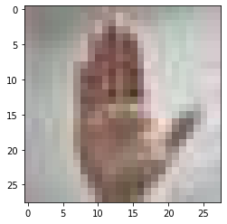
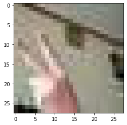

## 가위바위보 분류기


```python
from PIL import Image
import os, glob
import numpy as np
import matplotlib.pyplot as plt
import tensorflow as tf
from tensorflow import keras
```

### 이미지 크기 조절 함수 resize_images() 


```python
def resize_images(img_path):
    images=glob.glob(img_path + "/*.jpg")  
    print(len(images), " images to be resized.")

    target_size=(28,28) # 28x28 사이즈로 바꾸어 저장하자
    for img in images:
        old_img=Image.open(img)
        new_img=old_img.resize(target_size,Image.ANTIALIAS) 
        # ANTIALIAS(안티엘리어싱) : 사진을 high -> low resolution으로 나타낼때 깨진 패턴을 최소화 시켜주는 방법
        new_img.save(img, "JPEG") # save 꼭 해야한다!!
        
    print(len(images), " images resized.")
```

### 가위,바위,보 이미지 resize


```python
image_dir_path = os.getenv("HOME") + "/aiffel/rock_scissor_paper/scissor"
resize_images(image_dir_path)
```

    1427  images to be resized.
    1427  images resized.


```python
image_dir_path = os.getenv("HOME") + "/aiffel/rock_scissor_paper/rock"
resize_images(image_dir_path)
```

    1432  images to be resized.
    1432  images resized.


```python
image_dir_path = os.getenv("HOME") + "/aiffel/rock_scissor_paper/paper"
resize_images(image_dir_path)
```

    1427  images to be resized.
    1427  images resized.


### 데이터 읽어오는 함수 load_data()


```python
def load_data(img_path, number_of_data):
    img_size=28
    color=3
    #이미지 데이터와 라벨(가위 : 0, 바위 : 1, 보 : 2) 데이터를 담을 행렬(matrix) 영역을 생성
    imgs=np.zeros(number_of_data*img_size*img_size*color,dtype=np.int32).reshape(number_of_data,img_size,img_size,color)
    labels=np.zeros(number_of_data,dtype=np.int32)

    idx=0
    for file in glob.iglob(img_path+'/scissor/*.jpg'):
        img = np.array(Image.open(file),dtype=np.int32)
        imgs[idx,:,:,:]=img    # 데이터 영역에 이미지 행렬을 복사
        labels[idx]=0   # 가위 : 0
        idx=idx+1

    for file in glob.iglob(img_path+'/rock/*.jpg'):
        img = np.array(Image.open
                       (file),dtype=np.int32)
        imgs[idx,:,:,:]=img    # 데이터 영역에 이미지 행렬을 복사
        labels[idx]=1   # 바위 : 1
        idx=idx+1  
    
    for file in glob.iglob(img_path+'/paper/*.jpg'):
        img = np.array(Image.open(file),dtype=np.int32)
        imgs[idx,:,:,:]=img    # 데이터 영역에 이미지 행렬을 복사
        labels[idx]=2   # 보 : 2
        idx=idx+1
        
    print("이미지 개수는", idx,"입니다.")
    return imgs, labels
```

### train 데이터 불러오기


```python
image_dir_path = os.getenv("HOME") + "/aiffel/rock_scissor_paper"
(x_train, y_train)=load_data(image_dir_path, number_of_data=4286) # image 개수 유의!
x_train_norm = x_train/255.0   # 정규화 : 입력은 0~1 사이의 값으로 조정

print("x_train shape: {}".format(x_train.shape))
print("y_train shape: {}".format(y_train.shape))
```

    이미지 개수는 4286 입니다.
    x_train shape: (4286, 28, 28, 3)
    y_train shape: (4286,)


### 이미지를 확인해보자


```python
plt.imshow(x_train[4006])
print('라벨: ', y_train[4006])
```

    라벨:  2


    

    


### 딥러닝 네트워크 설계


```python
tf.random.set_seed(5181)  # seed()를 사용함으로써 동일한 결과를 얻자
model=keras.models.Sequential()
model.add(keras.layers.Conv2D(32, (3,3), activation='relu', input_shape=(28,28,3))) 
# 32 : 얼마나 다양한 이미지의 특징을 볼 것인가?
# (28,28,3) : 입력이미지의 형태

model.add(keras.layers.MaxPool2D(2,2))
model.add(keras.layers.Conv2D(64, (3,3), activation='relu'))
# 64 : 얼마나 다양한 이미지의 특징을 볼 것인가?

model.add(keras.layers.MaxPooling2D((2,2)))
model.add(keras.layers.Flatten())
model.add(keras.layers.Dense(64, activation='relu'))
# 64 : 분류기 알고리즘을 얼마나 복잡하게 할 것인가?

model.add(keras.layers.Dense(3, activation='softmax'))
# 3 : 최종 분류기의 class 수

print('Model에 추가된 Layer 개수: ', len(model.layers))
model.summary()
```

    Model에 추가된 Layer 개수:  7
    Model: "sequential"
    _________________________________________________________________
    Layer (type)                 Output Shape              Param #   
    =================================================================
    conv2d (Conv2D)              (None, 26, 26, 32)        896       
    _________________________________________________________________
    max_pooling2d (MaxPooling2D) (None, 13, 13, 32)        0         
    _________________________________________________________________
    conv2d_1 (Conv2D)            (None, 11, 11, 64)        18496     
    _________________________________________________________________
    max_pooling2d_1 (MaxPooling2 (None, 5, 5, 64)          0         
    _________________________________________________________________
    flatten (Flatten)            (None, 1600)              0         
    _________________________________________________________________
    dense (Dense)                (None, 64)                102464    
    _________________________________________________________________
    dense_1 (Dense)              (None, 3)                 195       
    =================================================================
    Total params: 122,051
    Trainable params: 122,051
    Non-trainable params: 0
    _________________________________________________________________


### x_train 데이터로 딥러닝 네트워크를 학습시키자


```python
model.compile(optimizer='adam',
             loss='sparse_categorical_crossentropy',
             metrics=['accuracy'])

model.fit(x_train_norm, y_train, epochs=10)
```

    Epoch 1/10
    134/134 [==============================] - 5s 17ms/step - loss: 1.0195 - accuracy: 0.4654
    Epoch 2/10
    134/134 [==============================] - 0s 3ms/step - loss: 0.4808 - accuracy: 0.8142
    Epoch 3/10
    134/134 [==============================] - 0s 3ms/step - loss: 0.2740 - accuracy: 0.9102
    Epoch 4/10
    134/134 [==============================] - 0s 3ms/step - loss: 0.1532 - accuracy: 0.9586
    Epoch 5/10
    134/134 [==============================] - 0s 3ms/step - loss: 0.0895 - accuracy: 0.9804
    Epoch 6/10
    134/134 [==============================] - 0s 3ms/step - loss: 0.0475 - accuracy: 0.9889
    Epoch 7/10
    134/134 [==============================] - 0s 3ms/step - loss: 0.0543 - accuracy: 0.9821
    Epoch 8/10
    134/134 [==============================] - 0s 3ms/step - loss: 0.0234 - accuracy: 0.9975
    Epoch 9/10
    134/134 [==============================] - 0s 3ms/step - loss: 0.0111 - accuracy: 0.9996
    Epoch 10/10
    134/134 [==============================] - 0s 3ms/step - loss: 0.0115 - accuracy: 0.9986


    <tensorflow.python.keras.callbacks.History at 0x7fc2dc1dc250>


### test 데이터로 모델을 테스트 하기 전에, 이미지를 리사이즈하자
### test 데이터 가위,바위,보 이미지 리사이즈


```python
image_dir_path_test = os.getenv("HOME") + "/aiffel/rock_scissor_paper_test/scissor"
resize_images(image_dir_path_test)
```

    100  images to be resized.
    100  images resized.


```python
image_dir_path_test = os.getenv("HOME") + "/aiffel/rock_scissor_paper_test/rock"
resize_images(image_dir_path_test)
```

    100  images to be resized.
    100  images resized.


```python
image_dir_path_test = os.getenv("HOME") + "/aiffel/rock_scissor_paper_test/paper"
resize_images(image_dir_path_test)
```

    100  images to be resized.
    100  images resized.


### test data 불러오기


```python
image_dir_path_test = os.getenv("HOME") + "/aiffel/rock_scissor_paper_test"
(x_test, y_test)=load_data(image_dir_path_test, number_of_data=300) # 가위바위보 이미지 개수 총합에 주의하자
x_test_norm = x_test/255.0   # 입력은 0~1 사이의 값으로 정규화

print("x_test shape: {}".format(x_test.shape))
print("y_test shape: {}".format(y_test.shape))
```

    이미지 개수는 300 입니다.
    x_test shape: (300, 28, 28, 3)
    y_test shape: (300,)


### 데이터 1개 출력해서 확인해보자


```python
plt.imshow(x_test[54])
print('\n라벨: ', y_test[54])
```

    
    라벨:  0


    

    


### test 데이터로 모델 성능을 테스트하자


```python
test_loss, test_accuracy = model.evaluate(x_test_norm,y_test, verbose=2)
print("test_loss: {} ".format(test_loss))
print("test_accuracy: {}".format(test_accuracy))
```

    10/10 - 1s - loss: 0.0897 - accuracy: 0.9667
    test_loss: 0.08968894183635712 
    test_accuracy: 0.9666666388511658

